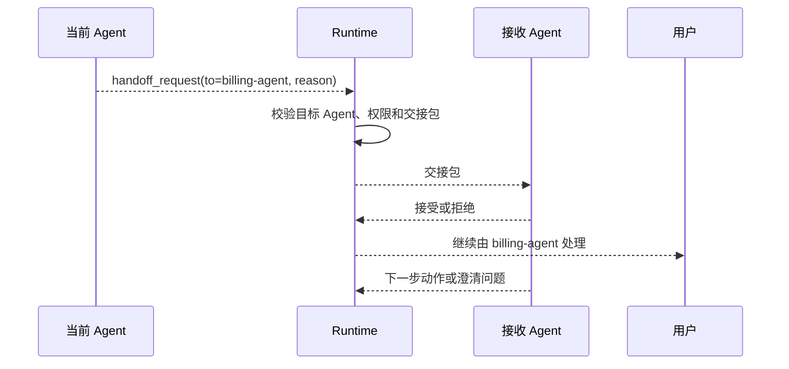

# Handoff与动态切换

## 1. Handoff 的问题背景

### 1.1 场景

客服 Agent 正在处理退款问题，用户突然询问发票；代码 Agent 在修复前端报错时发现根因在后端接口；研究 Agent 收集资料后需要写作 Agent 成文。这些场景都涉及 Handoff：当前 Agent 把任务控制权转交给另一个更合适的 Agent 或人工。

Handoff 关注的是“谁接着做”和“交接什么”。如果交接时只转发聊天历史，新 Agent 需要重新理解全部上下文；如果交接内容过少，又会丢失关键约束和证据。

### 1.2 与 Supervisor 的区别

| 机制 | 控制方式 | 适合场景 |
| --- | --- | --- |
| Supervisor-Worker | 上级持续分派和汇总 | 预先可拆分的任务 |
| Handoff | 当前处理者把控制权转给另一个处理者 | 领域切换、人工接管、动态路由 |
| Pipeline | 固定顺序流转 | 稳定流程 |

Handoff 更强调运行中的动态切换。它通常发生在模型发现当前能力不匹配、权限不足、用户意图变化或风险升高时。

## 2. 交接包设计

### 2.1 必要字段

```json
{
  "handoff_id": "hf_001",
  "from": "support-agent",
  "to": "billing-agent",
  "reason": "用户问题从退款进度切换到发票开具。",
  "user_goal": "开具 2026-A17 订单发票",
  "context_summary": "用户已确认订单号，退款问题暂时无需继续处理。",
  "evidence": [
    {"type": "order_id", "value": "2026-A17", "source": "user_message_3"}
  ],
  "constraints": ["不要重复询问订单号", "发票操作需要用户确认抬头"]
}
```

交接包要压缩上下文，同时保留证据和限制。接收方不应从零开始，也不应拿到全部无关历史。

### 2.2 流程



Runtime 需要支持接收方拒绝交接。例如目标 Agent 缺少权限、上下文不足或任务类型不匹配时，应返回错误并让当前 Agent 改用其他路径。

## 3. 动态路由实现

### 3.1 路由策略

| 策略 | 机制 | 适合场景 |
| --- | --- | --- |
| 规则路由 | 按关键词、业务线、权限判断 | 稳定客服入口 |
| 模型分类 | 让模型判断目标 Agent | 意图多样的入口 |
| 置信度路由 | 低置信度转人工或 Supervisor | 高风险业务 |
| 事件触发 | 工具错误、权限不足触发切换 | 执行中异常 |

路由策略可以组合。比如先用规则拦截高风险请求，再让模型在低风险类别中选择目标 Agent。

### 3.2 伪代码

```python
def route_or_handoff(state, agents):
    intent = classify_intent(state["latest_user_message"])
    candidate = agents.find_by_intent(intent)

    if candidate is None:
        return {"type": "ask_clarification"}

    if candidate.requires_human and not state.get("user_confirmed"):
        return {"type": "handoff", "to": "human", "reason": "高风险操作需要人工处理"}

    return {
        "type": "handoff",
        "to": candidate.name,
        "package": build_handoff_package(state, candidate),
    }
```

Handoff 的实现要把路由结果、交接包和接收状态写入 trace。这样才能评估误转率和恢复能力。

## 4. 风险与评估

### 4.1 常见问题

| 问题 | 表现 | 处理方式 |
| --- | --- | --- |
| 误转 | 用户问题被交给错误 Agent | 意图分类评测和接收方拒绝 |
| 上下文丢失 | 接收方重复提问 | 交接包包含目标、证据和限制 |
| 敏感扩散 | 无关历史传给下游 | 最小上下文和脱敏 |
| 循环转交 | 多个 Agent 互相踢回 | 最大转交次数和 Supervisor 兜底 |
| 人工接管断裂 | 人工看不到轨迹 | 提供摘要、证据和操作历史 |

Handoff 的质量可通过误转率、重复询问率、接收拒绝率、人工接管成功率和端到端完成率评估。

## 参考资料

- [OpenAI Agents SDK Handoffs](https://openai.github.io/openai-agents-python/handoffs/)
- [Google A2A Protocol](https://google-a2a.github.io/A2A/)
- [Anthropic: Building effective agents](https://www.anthropic.com/research/building-effective-agents)
- [LangGraph Multi-agent Systems](https://langchain-ai.github.io/langgraph/concepts/multi_agent/)
