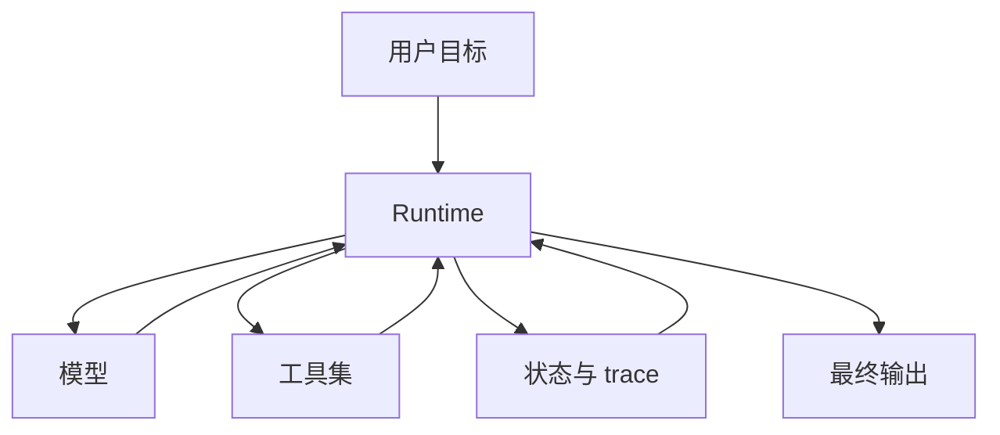
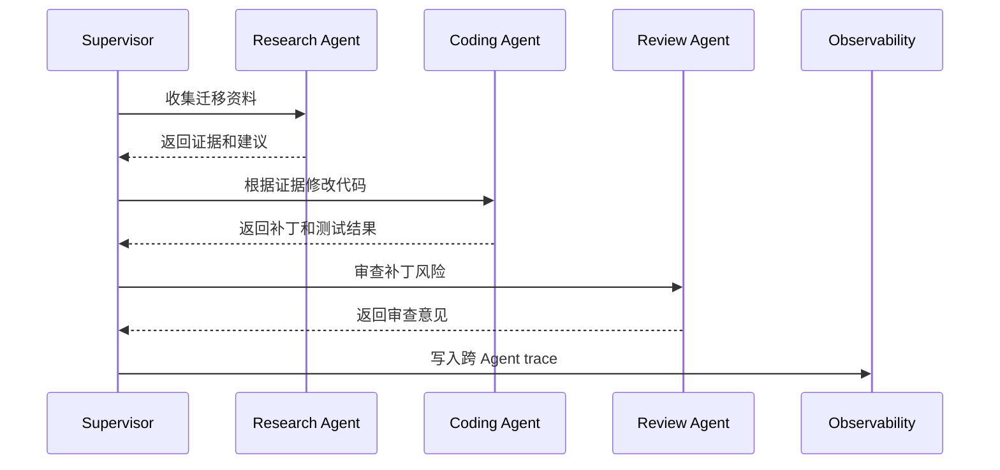

# Single-Agent与Multi-Agent

## 1. 从单 Agent 到多 Agent

### 1.1 背景

很多 Agent 系统从单 Agent 开始：一个模型、一个 Runtime、一组工具、一个状态对象。只要任务范围可控，这种结构更容易调试和评估。多 Agent 出现的原因通常是任务跨度变大：调研、编码、测试、审查、客服、审批分别需要不同上下文、工具和策略。

多 Agent 的核心价值来自职责、权限和上下文拆分。代码迁移任务里，迁移 Agent 负责修改，测试 Agent 负责运行验证，审查 Agent 负责风险检查。每个 Agent 的工具集更窄，失败也更容易归因。

### 1.2 选择边界

| 维度 | Single-Agent | Multi-Agent |
| --- | --- | --- |
| 结构 | 一个 Agent 直接推进任务 | 多个 Agent 分工协作 |
| 上下文 | 集中在一个状态里 | 按角色分离上下文 |
| 调试 | 轨迹较短 | 需要跨 Agent trace |
| 成本 | 较低 | 通信和模型调用更多 |
| 适用 | 小到中等复杂任务 | 多专业、多权限、长流程 |

优先从单 Agent 做起。只有当工具权限、上下文长度、专业职责或组织流程已经压不住时，再拆成多 Agent。

## 2. 单 Agent 的工程形态

### 2.1 结构



单 Agent 的优势是状态集中。所有工具结果、计划、错误和证据都在同一条轨迹中，评测和回放更直接。它适合本地笔记整理、单仓库代码修复、简单客服查询等任务。

### 2.2 失败边界

单 Agent 的主要风险是上下文和职责膨胀。工具越多，模型选择越难；任务越长，状态压缩越重要；权限越广，安全控制越复杂。此时可以先做阶段化工具暴露和计划控制，再考虑拆多 Agent。

## 3. 多 Agent 的通信结构

### 3.1 常见拓扑

| 拓扑 | 结构 | 适合场景 | 风险 |
| --- | --- | --- | --- |
| Supervisor-Worker | 上级分派，下级执行 | 企业流程、任务拆分 | Supervisor 成为瓶颈 |
| Peer Collaboration | 多 Agent 互相讨论 | 方案评审、头脑风暴 | 循环讨论和责任不清 |
| Handoff | 一个 Agent 转交给另一个 | 客服、领域切换 | 上下文丢失 |
| Pipeline | 固定顺序串联 | 抽取、审核、发布 | 某一步失败阻塞整体 |

多 Agent 系统首先要明确谁拥有最终决策权，谁能调用哪些工具，失败时由谁恢复。

### 3.2 通信与状态



跨 Agent trace 要保存任务 id、父子关系、消息、产物、工具调用摘要和失败原因。否则最终失败时，只能看到多个分散日志。

```json
{
  "trace_id": "tr_multi_001",
  "parent_task": "migrate-login-api",
  "children": [
    {"agent": "research-agent", "artifact": "migration_evidence"},
    {"agent": "coding-agent", "artifact": "patch"},
    {"agent": "review-agent", "artifact": "risk_report"}
  ]
}
```

这类结构让跨 Agent 产物可以被统一评估。Supervisor 最终汇总时，不需要重新解析各个 Agent 的自由文本。

## 4. 选型与评估

### 4.1 判断方法

| 问题 | 若答案为是 | 建议 |
| --- | --- | --- |
| 工具权限差异很大 | 写入、审批、查询分属不同边界 | 拆分角色 |
| 需要不同专业上下文 | 法务、代码、客服知识差异大 | 拆分 Agent 或 Skill |
| 任务链路很长 | 单条上下文难以承载 | Supervisor-Worker |
| 需要人工接管 | 专家或客服需要接续 | Handoff |
| 评测难以归因 | 单 Agent trace 太复杂 | 按职责拆分 |

多 Agent 的收益要通过评测证明。需要比较任务成功率、成本、延迟、工具误用率和失败归因清晰度。若多 Agent 只带来更多通信和更高成本，保持单 Agent 更合适。

## 参考资料

- [Anthropic: Building effective agents](https://www.anthropic.com/research/building-effective-agents)
- [OpenAI Agents SDK](https://openai.github.io/openai-agents-python/)
- [Google A2A Protocol](https://google-a2a.github.io/A2A/)
- [AutoGen](https://microsoft.github.io/autogen/)
