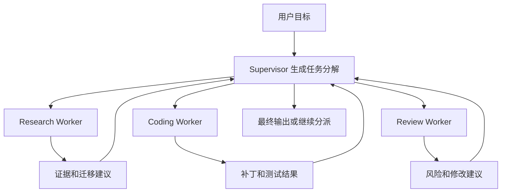
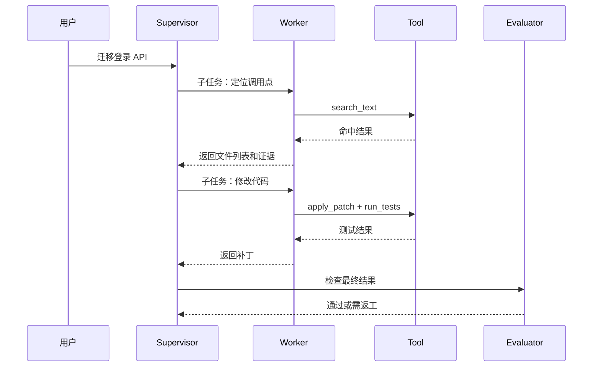

# Supervisor-Worker

## 1. 分派式协作的背景

### 1.1 场景

代码迁移任务常常包含多个阶段：理解旧 API、搜索调用点、修改代码、运行测试、审查风险、写迁移说明。让一个 Agent 全部完成，会导致上下文过长、工具过多和责任混杂。Supervisor-Worker 模式把全局控制权放在 Supervisor，具体步骤交给 Worker。

Supervisor 负责拆分任务、选择 Worker、汇总产物和判断是否继续。Worker 负责在自己的工具和上下文范围内完成子任务。这个结构常见于企业助手、代码 Agent、研究 Agent 和多角色客服系统。

### 1.2 角色边界

| 角色 | 职责 | 不应承担 |
| --- | --- | --- |
| Supervisor | 计划、分派、汇总、终止判断 | 直接执行所有底层工具 |
| Worker | 完成子任务并返回产物 | 私自扩大任务范围 |
| Runtime | 权限、状态、trace、预算 | 让模型自由转发敏感上下文 |
| Evaluator | 检查子任务和最终结果 | 替代业务验收 |

边界清楚后，系统才能按角色设置工具权限。例如 Review Worker 可以读 diff 和测试结果，但不允许写文件。

## 2. 运行机制

### 2.1 任务分派流程



Supervisor 不应只把用户原话转发给 Worker。它要生成明确子任务，包含输入、限制、预期产物和完成条件。

### 2.2 子任务对象

```json
{
  "task_id": "review-001",
  "worker": "review-agent",
  "goal": "审查登录模块补丁是否有回归风险。",
  "inputs": {
    "diff": "...",
    "test_result": "auth tests passed"
  },
  "allowed_tools": ["read_diff", "search_text"],
  "expected_output": {
    "risk_level": "low|medium|high",
    "findings": "array",
    "required_changes": "array"
  }
}
```

子任务对象是协作的核心数据结构。它既给 Worker 提供上下文，也给 Supervisor 和评估器提供校验依据。

### 2.3 时序



## 3. 失败恢复

### 3.1 常见失败

| 失败 | 表现 | 处理方式 |
| --- | --- | --- |
| 分派过宽 | Worker 不知道交付什么 | 子任务必须有 expected_output |
| 上下文不足 | Worker 反复请求信息 | Supervisor 提供必要证据和限制 |
| 产物不兼容 | 一个 Worker 输出无法被下游使用 | 定义统一 artifact 结构 |
| 责任混乱 | 多个 Worker 修改同一对象 | Supervisor 控制写入顺序 |
| 成本过高 | 多 Worker 并行调用模型 | 缓存结果、限制并发和重试 |

Supervisor 要保存每个子任务的输入和输出。最终失败时，才能定位是拆分错误、Worker 执行错误，还是评估器判断错误。

## 4. 评估方式

### 4.1 指标

| 指标 | 含义 |
| --- | --- |
| 子任务完成率 | Worker 是否按 expected_output 返回 |
| 返工率 | Supervisor 要求重做的比例 |
| 上下文泄露率 | Worker 是否收到无关敏感内容 |
| 产物复用率 | 下游是否能直接使用上游产物 |
| 端到端成功率 | 最终任务是否完成 |

Supervisor-Worker 的价值要落到端到端任务成功率和失败归因上。若只是把一个复杂 prompt 拆成多个复杂 prompt，系统复杂度会增加，可靠性未必提升。

## 参考资料

- [Anthropic: Building effective agents](https://www.anthropic.com/research/building-effective-agents)
- [OpenAI Agents SDK Handoffs](https://openai.github.io/openai-agents-python/handoffs/)
- [Google A2A Protocol](https://google-a2a.github.io/A2A/)
- [LangGraph Multi-agent Systems](https://langchain-ai.github.io/langgraph/concepts/multi_agent/)
