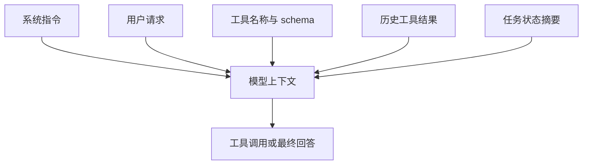
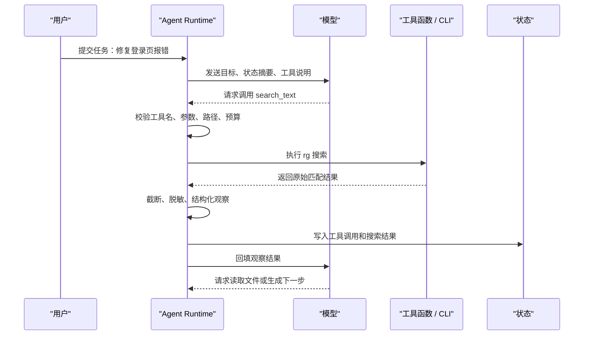
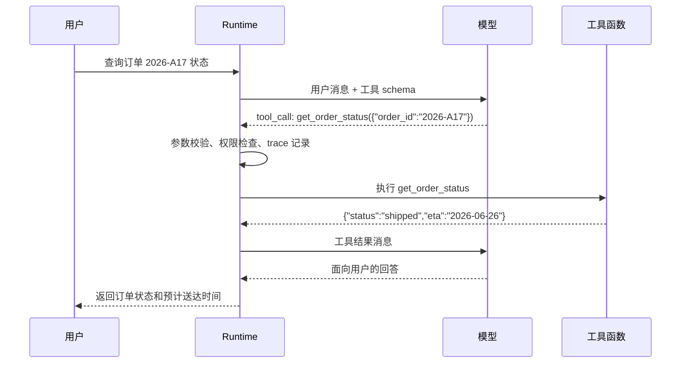
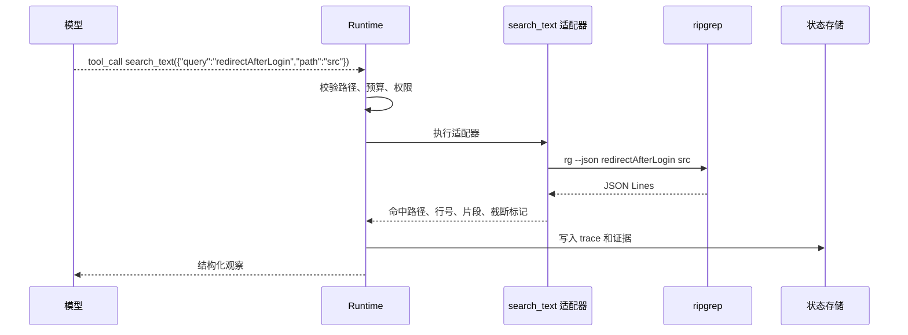
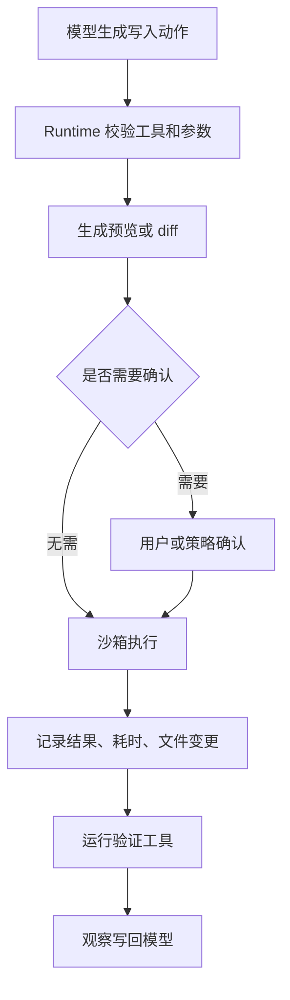
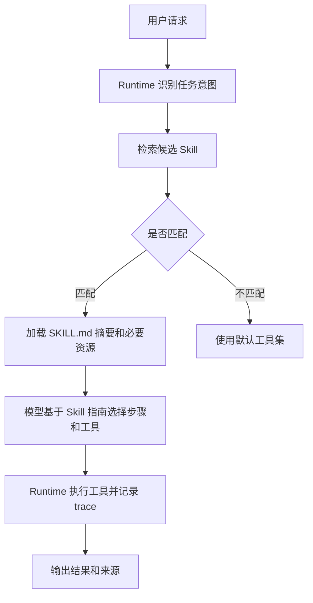

# 工具调用

## 1. 工具调用接口从哪里来

### 1.1 工具解决的问题

模型只能基于上下文生成输出，无法天然读取文件、搜索仓库、访问数据库、运行测试或调用业务系统。工具调用把这些外部能力包装成结构化接口，让模型提出候选动作，再由 Agent Runtime 校验、执行和回填观察结果。工具层把“回答问题”推进到“完成任务”，也把风险带入系统。

以编码 Agent 为例，用户说“修复登录页报错”时，模型需要先定位相关代码，再读取文件、修改补丁、运行测试。若没有工具，模型只能给出建议；有了工具，系统可以实际搜索仓库、生成补丁并验证结果。工具设计越清楚，模型越容易选择正确动作，Runtime 越容易控制权限和记录过程。

工具调用中有四个角色。模型负责选择工具并生成参数；Runtime 负责参数校验、权限检查、执行调度和日志记录；工具函数负责访问真实系统；状态管理负责保存观察结果。模型输出的 tool call 只是候选动作，执行权始终在 Runtime。

| 角色 | 主要职责 | 典型失败 |
| --- | --- | --- |
| 模型 | 选择工具、生成参数、根据观察继续推理 | 工具选错、参数不完整、重复调用 |
| Runtime | 校验 schema、检查权限、设置超时、标准化结果 | 放行越界路径、缺少结果截断、错误不可追踪 |
| 工具函数 | 调用 CLI、SDK、数据库、浏览器或业务 API | 输出不稳定、异常泄漏、返回内容过长 |
| 状态管理 | 记录已读材料、证据、错误、预算和 trace | 只保存聊天历史，长任务中丢失进展 |

### 1.2 工具调用接口的来源

**从文本生成到结构化调用**

大模型最初面向的是文本补全和对话生成。应用想让模型查订单、搜文件或调用数据库时，只能让模型输出一段自然语言，再由程序从文本里解析“要调用哪个函数”。这种做法很脆弱：字段名可能变化，参数可能缺失，模型也可能把解释文字和调用请求混在一起。

Function Calling 的出现，把模型输出约束为结构化调用意图。模型根据用户输入、上下文和工具说明，生成工具名与参数；Runtime 负责校验参数、执行函数、记录 trace，并把工具结果回填给模型。模型本身不直接执行代码，也不直接访问数据库。

**三个参与者**

| 参与者 | 职责 | 工程关注点 |
| --- | --- | --- |
| 模型 | 选择工具并生成参数 | 工具描述、字段语义、上下文证据 |
| Runtime | 校验、执行、回填、审计 | 权限、超时、重试、幂等、错误结构 |
| 工具函数 | 连接外部系统并返回结果 | 输入边界、输出截断、副作用控制 |

这三个角色分开后，系统才能把自然语言意图转成可控执行。提示词可以让模型更愿意调用工具，真正的安全边界仍由 Runtime 和工具实现决定。

### 1.3 schema、权限和结果结构

工具 schema 通常使用 JSON Schema 表达。它说明字段类型、必填项、枚举值、范围和嵌套结构。下面是适合编码 Agent 的 `search_text` schema。

```json
{
  "name": "search_text",
  "description": "Search text in allowed project files. Use fixed_string for exact words and regex only when pattern matching is required.",
  "parameters": {
    "type": "object",
    "properties": {
      "query": {"type": "string"},
      "path": {"type": "string"},
      "fixed_string": {"type": "boolean"},
      "case_sensitive": {"type": "boolean"},
      "max_results": {"type": "integer", "minimum": 1, "maximum": 100}
    },
    "required": ["query", "path"]
  }
}
```

这个 schema 有三个工程含义。`path` 让 Runtime 能限制搜索范围，避免模型扫描整个磁盘。`fixed_string` 鼓励优先使用字面量搜索，减少正则转义错误。`max_results` 控制结果规模，防止搜索输出挤占上下文。

工具结果也要结构化。成功结果要包含摘要、数据、来源和元信息；失败结果要包含错误类型、可重试性和用户可读说明。

```json
{
  "ok": true,
  "tool": "search_text",
  "summary": "Found 8 matches in 3 files.",
  "data": [
    {"path": "src/app.ts", "line": 42, "text": "createAgentRuntime(config)"}
  ],
  "metadata": {
    "elapsed_ms": 31,
    "truncated": false,
    "command": "rg --json --fixed-strings createAgentRuntime src"
  }
}
```

```json
{
  "ok": false,
  "tool": "read_file",
  "error_type": "PathOutsideWorkspace",
  "message": "The requested path is outside the allowed workspace.",
  "retryable": false
}
```

模型看到 `retryable: true` 时可以调整参数重试；看到权限拒绝时应停止或请求用户补充授权。把异常栈直接回填给模型，会让后续决策不稳定，也可能泄漏敏感路径或密钥。

### 1.4 与其他工具机制的关系

**对比**

| 机制 | 连接方式 | 适合场景 | 关注点 |
| --- | --- | --- | --- |
| Function Calling | 模型输出工具名和参数 | 应用内函数、API 调用 | schema、校验、回填 |
| MCP Tool | 通过协议发现和调用工具 | 跨应用、跨客户端复用 | 能力发现、传输、权限 |
| Skill | 封装说明、资源和执行步骤 | 复杂能力包、领域操作 | 触发条件、上下文加载 |
| Workflow Step | 代码固定调用 | 稳定业务流程 | 可测试性、确定性 |

Function Calling 是模型到 Runtime 的基础接口。MCP、Skill 和工作流可以建立在这个接口之上，也可以由 Runtime 映射成统一的工具注册表。

### 1.5 MCP 与本地工具的关系

本地工具可以直接注册在 Agent Runtime 中，也可以通过 MCP server 暴露。直接注册实现简单，适合单个应用内部使用。MCP 适合多个 Agent 或客户端复用同一工具能力，例如文件搜索、数据库查询、浏览器控制。MCP 还能把工具实现和 Agent Runtime 解耦，让工具团队独立维护 server。

迁移到 MCP 时，不需要改变工具设计原则。名称、描述、schema、权限、结果结构、错误模型和审计仍然适用。差异在于通信从函数调用变成协议消息，工具能力可以被更多 host 发现和使用。若工具本身设计粗糙，换成 MCP 也无法提高可靠性。

## 2. 模型如何生成工具调用

### 2.1 工具调用能力从哪里来

**背景**

模型会调用工具，并非因为它真的执行了函数。它学习到的是在给定上下文和工具说明时，生成符合格式的调用请求。这个能力通常来自预训练中的代码和 API 语料、指令微调中的工具调用样本、强化学习或偏好优化中的轨迹反馈，以及模型服务端对结构化输出的解码约束。

应用开发者能控制的部分主要是工具描述、schema、上下文状态、示例和 Runtime 反馈。模型底层训练不可见时，工程上只能通过这些输入信号影响工具选择质量。

**学习信号**

| 信号来源 | 影响 | 工程侧可控性 |
| --- | --- | --- |
| 代码/API 语料 | 理解函数名、参数和调用模式 | 不可控 |
| 指令微调样本 | 学会在用户意图下选择工具 | 间接可控，依赖模型供应商 |
| 轨迹反馈 | 学会哪些工具调用能完成任务 | 可通过评测和反馈优化 |
| schema 描述 | 影响参数生成和工具选择 | 高 |
| 工具结果 | 影响下一轮是否继续调用 | 高 |

所以工具调用质量并不只由模型决定。工具命名、描述、参数边界、错误结构和 trace 反馈都会影响最终表现。

### 2.2 工具选择的上下文机制

**模型看到的内容**



模型并不知道工具真实实现。它只能根据工具名、描述、参数 schema 和上下文里的任务状态判断下一步。工具描述要避免营销式措辞，应说明工具能做什么、不能做什么、参数来自哪里、失败时如何表现。

**描述质量示例**

| 写法 | 问题 | 更稳的写法 |
| --- | --- | --- |
| `search`：搜索内容 | 范围不明 | `search_notes`：在授权笔记目录中按关键词搜索 Markdown 文件 |
| `run`：运行命令 | 权限过宽 | `run_tests`：只运行项目测试命令，返回退出码和日志摘要 |
| `write`：写文件 | 副作用不明 | `apply_patch`：对工作区文件应用 diff，返回改动摘要 |

命名要贴近动作和对象。`search_notes` 比 `query` 更容易让模型理解工具范围；`read_file` 比 `open` 更容易生成正确路径参数。

### 2.3 Runtime 如何辅助模型学习

**结构化反馈**

工具失败时，Runtime 不应只返回报错字符串。字段级反馈可以让模型在下一轮修正参数。

```json
{
  "ok": false,
  "error_type": "validation_error",
  "fields": {
    "path": "path must stay under docs/AI"
  },
  "retryable": true
}
```

模型看到 `path` 字段错误后，可以改用允许目录；如果只看到一段异常栈，它可能重复生成同样的路径。

**评测驱动改进**

```python
def grade_tool_call(expected, actual):
    return {
        "tool_match": expected["name"] == actual["name"],
        "required_args": all(k in actual["args"] for k in expected["required_args"]),
        "no_extra_risky_args": not any(k in actual["args"] for k in expected["forbidden_args"]),
    }
```

工具调用评测可以独立于最终答案。即使最终回答看起来正确，错误工具、越权参数、重复调用和无效重试都应单独记录。长期看，工具调用日志能反过来改进工具描述、schema 和 few-shot 示例。

### 2.4 常见误区

**工程修正方式**

| 误区 | 表现 | 修正方式 |
| --- | --- | --- |
| 工具越多越好 | 模型在相似工具之间摇摆 | 合并重复工具，分阶段暴露 |
| 描述越长越好 | 上下文膨胀，重点被稀释 | 写清边界、参数和失败语义 |
| 靠提示词保证安全 | 模型仍可能生成越权参数 | Runtime 做强校验 |
| 只看最终答案 | 过程里可能有危险调用 | 评测工具选择、参数和副作用 |

工具调用能力是模型能力和工程约束共同形成的结果。把工具设计成稳定、窄边界、可观察的接口，比单纯增加提示词更可靠。

## 3. Runtime 如何执行与回填结果

### 3.1 一次工具调用的完整链路

下面的时序图展示一个编码 Agent 调用 `search_text` 的完整过程。模型只提出搜索请求，Runtime 决定该请求能否执行，并把 `rg` 的原始输出整理成模型可读的观察。



这条链路里有两个关键点。第一，执行前校验必须发生在 Runtime 中，提示词无法替代路径、权限和预算检查。第二，工具结果要经过整理后再回填，模型需要有限、可引用、带来源的观察，整段终端输出会挤占上下文并增加误读风险。

### 3.2 调用流程与消息结构

**两轮模型调用**

典型流程包含两次模型调用。第一次让模型决定是否调用工具；Runtime 执行工具后，第二次让模型基于结果生成用户可读回答。



并行工具调用是在第一轮返回多个独立 tool call。Runtime 需要为每个调用分配 id，分别记录成功、失败、耗时和可重试信息，再把所有结果一起回填。

**工具 schema**

```json
{
  "name": "get_order_status",
  "description": "查询当前用户可访问订单的物流状态。",
  "parameters": {
    "type": "object",
    "properties": {
      "order_id": {
        "type": "string",
        "description": "订单编号，格式为年份加短横线加字母数字编号。"
      }
    },
    "required": ["order_id"],
    "additionalProperties": false
  }
}
```

schema 同时服务模型和 Runtime。对模型而言，字段名和描述影响参数生成；对 Runtime 而言，类型、必填项、枚举、长度、额外字段策略都是校验依据。schema 写得越模糊，模型越容易生成宽泛参数，Runtime 的拒绝率也会升高。

**回填消息**

工具结果不宜直接返回原始对象。它应包含可判定的状态、必要数据、错误类型和截断标记。

```json
{
  "tool_call_id": "call_01",
  "ok": false,
  "error_type": "permission_denied",
  "message": "当前用户无权查询该订单。",
  "retryable": false
}
```

模型看到 `retryable: false` 后，应停止换参数重试，转向解释权限限制或请求用户登录。错误结构决定模型后续策略，因此工具失败也要返回结构化结果。

### 3.3 Runtime 的执行细节

**校验和执行**

```python
def handle_tool_call(call, registry, user):
    tool = registry.get(call["name"])
    if tool is None:
        return {"ok": False, "error_type": "unknown_tool", "retryable": False}

    args = tool.schema.validate(call["args"])
    if not tool.policy.allowed(user=user, args=args):
        return {"ok": False, "error_type": "permission_denied", "retryable": False}

    try:
        result = tool.run(**args, timeout=tool.timeout_seconds)
        return {"ok": True, "data": tool.shape_output(result)}
    except TimeoutError:
        return {"ok": False, "error_type": "timeout", "retryable": True}
```

这段伪代码把模型输出当作候选请求处理。真正执行前必须经过工具注册表、schema 校验、权限策略和超时控制。对写入类工具，还要加入幂等键、确认步骤和回滚记录。

**失败类型**

| 错误类型 | 常见原因 | Runtime 返回策略 |
| --- | --- | --- |
| `validation_error` | 参数缺失、类型错误、枚举不匹配 | 给出字段级错误，可让模型修正 |
| `permission_denied` | 用户无权访问资源 | 停止重试，说明限制 |
| `not_found` | 资源不存在 | 可请求用户确认编号 |
| `timeout` | 工具响应过慢 | 标记可重试并限制次数 |
| `side_effect_blocked` | 写操作缺少确认 | 请求用户确认或人工接管 |

错误分类越稳定，模型越容易采取正确后续动作，评测也能按失败类型归因。

### 3.4 Runtime 的工具封装边界

**背景**

模型生成的工具调用只是候选动作。真正执行文件搜索、读取、写入、命令运行和网络请求时，必须经过 Runtime。Runtime 负责把模型的自然语言意图转成受控系统操作，同时记录每一次动作的输入、输出、耗时、错误和权限判断。

以 `rg` 搜索为例，ripgrep 本身负责递归遍历目录、遵守 ignore 规则、使用 Rust regex 引擎匹配文本、在适合场景下做字面量优化和并行目录遍历，还支持 `--json` 输出。Agent Runtime 要做的事情不同：限制搜索路径、设置超时、控制结果数量、解析 JSON 行、截断片段、把结果整理成模型可消费的观察。

**工具封装边界**

| 层次 | 职责 | 示例 |
| --- | --- | --- |
| 底层工具 | 执行具体能力 | `rg --json`、数据库查询、HTTP API |
| 工具适配器 | 参数校验、命令构造、输出解析 | `search_text(query, path)` |
| Runtime | 权限、预算、trace、错误回填 | 最大轮次、沙箱、审计 |
| 模型 | 选择工具和参数 | 生成 `search_text` 调用 |

这层封装让底层工具的复杂能力变成稳定接口。模型无需知道 `rg` 的所有参数，只需要选择受控的 `search_text` 工具。

### 3.5 评估工具封装质量

**指标**

| 指标 | 含义 | 观测方式 |
| --- | --- | --- |
| 调用成功率 | 参数校验通过并正常返回的比例 | tool span |
| 误用率 | 选择了无关工具或越权参数 | trace 评分 |
| 结果有效率 | 工具结果推动了下一步 | 轨迹评估 |
| 截断损失 | 截断导致模型漏掉关键信息 | 失败回放 |
| 成本延迟 | 单次调用耗时和资源消耗 | metrics |

工具封装的好坏最终体现在轨迹上。一次工具调用返回了很多内容，但没有帮助模型前进，对 Agent 来说仍然是低质量工具。

## 4. 只读、写入与执行类工具的底层实现

### 4.1 `find_files`：基于文件树和元数据定位

`find_files` 回答“文件可能在哪里”。底层可以使用操作系统文件 API，也可以封装 Unix `find`。经典 `find` 从一个或多个起始路径出发，递归访问目录，并对每个文件应用名称、类型、大小、修改时间、权限、所有者等条件。它擅长定位文件路径，例如“找出所有 `.md` 文件”“找出最近修改的图片”“找出某目录下名为 config 的文件”。

在 Agent 中，不宜把原始 `find` 命令字符串交给模型。`find` 支持复杂表达式和 `-exec`，开放过多会带来执行风险。更稳妥的方式是封装成 `find_files`：

```json
{
  "name": "find_files",
  "parameters": {
    "type": "object",
    "properties": {
      "root": {"type": "string"},
      "name_pattern": {"type": "string"},
      "file_type": {"type": "string", "enum": ["file", "directory", "any"]},
      "max_results": {"type": "integer", "minimum": 1, "maximum": 200}
    },
    "required": ["root"]
  }
}
```

执行器收到参数后，先把 `root` 解析成绝对路径，确认它位于允许工作区内，再遍历目录。返回结果只包含路径、类型、大小和修改时间。默认不跟随符号链接，或在跟随前检查链接目标，避免通过工作区内链接访问外部目录。

### 4.2 `search_text`：ripgrep 的工作方式

`search_text` 回答“某段文字在哪里出现”。编码 Agent 通常会把它封装在 `rg` 之上。`rg` 是 ripgrep 的命令行程序，使用 Rust 编写，设计目标是高速文本搜索。它默认遵守 `.gitignore`，也会处理 `.ignore`、`.rgignore` 等忽略规则，并跳过很多无关文件。对代码库来说，这通常比遍历整个目录更接近开发者预期。

ripgrep 的性能来自多层设计。目录遍历阶段会读取忽略规则并并行处理路径；搜索阶段会对文件做分块读取或内存映射，按文件类型和编码处理文本；匹配阶段使用 Rust regex 引擎，并结合字面量提取优化常见查询。Rust regex 引擎在设计上避免回溯型正则常见的指数级爆炸，复杂模式也仍要由 Runtime 设置超时和结果上限。

Agent 使用 `rg` 时，应优先选择固定字符串搜索。比如查找 `createAgentRuntime`，`--fixed-strings` 比正则更稳定。只有用户明确要求模式匹配，或普通搜索无法覆盖变体时，再允许正则。返回给模型的结果应包含文件、行号、匹配文本和少量上下文行，不应把成千上万条匹配全部放进上下文。

`rg --json` 对 Agent 尤其有用。普通文本输出适合人读，JSON 输出更适合 Runtime 解析。`--json` 会输出 `begin`、`match`、`context`、`end`、`summary` 等事件，Runtime 可以只提取 `match` 事件中的路径、行号和匹配文本，再按 `max_results` 截断。

### 4.3 Agent 如何封装 `rg`

下面是一个教学版 `search_text`。它用 `subprocess.run` 调用 `rg --json`，限制路径、超时和最大结果数，并把原始 JSON 行转成结构化观察。

```python
import json
import subprocess
from pathlib import Path


WORKSPACE = Path("/repo").resolve()


def search_text(query, path=".", max_results=20, timeout=5):
    # 路径校验：只允许搜索工作区内部
    root = (WORKSPACE / path).resolve()
    if not str(root).startswith(str(WORKSPACE)):
        return {"ok": False, "error_type": "PathOutsideWorkspace", "retryable": False}

    cmd = [
        "rg",
        "--json",
        "--line-number",
        "--fixed-strings",
        query,
        str(root),
    ]

    try:
        # 命令执行：限制耗时，避免搜索长时间占用进程
        proc = subprocess.run(
            cmd,
            text=True,
            capture_output=True,
            timeout=timeout,
            check=False,
        )
    except subprocess.TimeoutExpired:
        return {"ok": False, "error_type": "Timeout", "retryable": True}

    matches = []
    for line in proc.stdout.splitlines():
        event = json.loads(line)
        if event.get("type") != "match":
            continue

        data = event["data"]
        matches.append({
            "path": data["path"]["text"],
            "line": data["line_number"],
            "text": data["lines"]["text"].rstrip(),
        })

        # 结果截断：只返回模型当前需要的数量
        if len(matches) >= max_results:
            break

    return {
        "ok": proc.returncode in (0, 1),
        "summary": f"Found {len(matches)} matches.",
        "data": matches,
        "metadata": {"truncated": len(matches) >= max_results},
    }
```

这段代码省略了生产环境中的脱敏、忽略规则配置和 stderr 解析，但展示了核心边界：模型给出查询词，Runtime 校验路径并设置超时，工具函数调用 `rg`，最终只把有限结果返回给模型。

### 4.4 只读工具的实现

**`rg` 到 `search_text`**



`rg` 的速度来自多方面：默认递归搜索、自动读取 `.gitignore` 等忽略文件、使用 Rust regex 库、对简单查询做字面量加速、并行遍历目录、在部分场景使用内存映射或缓冲读取。Runtime 不应把这些细节直接暴露给模型，而应把它封装成窄接口。

**Python 示例**

```python
import json
import subprocess
from pathlib import Path


ROOT = Path("/workspace/project").resolve()


def search_text(query, path=".", limit=20):
    # 路径校验：模型给出的 path 只能落在工作区内。
    target = (ROOT / path).resolve()
    if ROOT not in target.parents and target != ROOT:
        return {"ok": False, "error_type": "path_denied", "retryable": False}

    cmd = ["rg", "--json", "--max-count", "20", query, str(target)]

    try:
        # 命令执行：设置超时，避免搜索拖住 Agent 循环。
        proc = subprocess.run(cmd, capture_output=True, text=True, timeout=3)
    except subprocess.TimeoutExpired:
        return {"ok": False, "error_type": "timeout", "retryable": True}

    items = []
    for line in proc.stdout.splitlines():
        event = json.loads(line)
        if event.get("type") != "match":
            continue
        data = event["data"]
        items.append({
            "path": data["path"]["text"],
            "line": data["line_number"],
            "text": data["lines"]["text"].strip()[:240],
        })
        # 结果截断：只给模型足够判断下一步的信息。
        if len(items) >= limit:
            break

    return {
        "ok": proc.returncode in (0, 1),
        "items": items,
        "truncated": len(items) >= limit,
        "error_type": None if proc.returncode in (0, 1) else "rg_error",
    }
```

这个示例把 `rg` 包成了 Agent 工具：路径校验、超时、结果截断和错误返回都在适配器里完成。真实系统还要记录 trace id、命令版本、工作目录、调用耗时和用户权限。

### 4.5 `read_file`：控制上下文大小

搜索结果只能告诉 Agent “相关内容在哪里”，理解代码还需要读取文件。`read_file` 应支持读取指定路径和行范围，避免一次读取整个大型文件。常见参数包括 `path`、`start_line`、`line_count`。执行器要限制 `line_count` 最大值，并在结果中返回实际行号。

读取文件时也要处理编码、二进制文件和过大文件。遇到非文本文件时，应返回明确错误；若文件过大，应要求模型先用搜索定位片段；若路径越界，应拒绝。对 Markdown、代码和配置文件，可以返回带行号的片段，方便模型在最终回答或补丁中引用。

### 4.6 `apply_patch` 与写入工具

写入工具风险高于只读工具。`apply_patch` 的输入应是结构化补丁，Runtime 需要检查补丁只修改允许文件，且不会覆盖用户未授权路径。应用前应展示变更摘要：新增、删除、修改哪些文件。应用后要记录实际 diff，并允许后续运行测试验证。

写入工具应尽量避免让模型直接生成 shell 命令。比如“把字符串替换为另一个字符串”可以封装成补丁；“创建文件”可以封装成 `write_file` 并限制路径；“删除文件”应单独作为高风险工具并要求确认。工具越语义化，Runtime 越容易做权限和审计。

写入工具还要保护用户未提交变更。Agent 修改文件前应知道目标文件是否已有用户改动。若文件已有改动，Runtime 应在状态中标记风险，并要求补丁只作用于明确上下文。对代码仓库来说，工具结果中可以包含 `working_tree_dirty`、`touched_files` 和 `conflicts` 字段。

### 4.7 `run_tests` 与验证结果

测试工具把外部验证结果带回 Agent。`run_tests` 可以接收测试目标、命令类型和超时，避免开放任意命令字符串。执行器运行测试后，要返回退出码、耗时、标准输出摘要、标准错误摘要和失败测试名称。模型根据这些信息决定是否继续修复。

测试结果为空也要有语义。退出码为 0 表示验证通过；退出码非 0 表示失败；超时表示测试没有完成；命令不存在表示环境问题。模型不能只看输出文本判断成功。结构化测试结果能让 Agent 更准确地处理失败。

### 4.8 受控命令执行与沙箱

命令执行工具应运行在沙箱中。沙箱可以是容器、临时目录、受限用户或远端执行环境。它限制可写路径、网络访问、环境变量、CPU、内存和执行时间。沙箱无法覆盖所有安全问题，但能在模型或工具出错时限制影响范围。

工具权限可以分为四级。第一是安全只读，例如列目录、搜索文本、读取公开文档。第二是敏感只读，例如读取私有代码、查询用户数据。第三是低风险写入，例如写临时文件、生成补丁、创建草稿。第四是高风险写入，例如删除文件、发送消息、修改生产配置、部署服务。不同级别对应不同确认和审计策略。

| 权限级别 | 工具例子 | 默认策略 |
| --- | --- | --- |
| 安全只读 | `find_files`、`search_text`、公开文档读取 | 自动执行，记录 trace |
| 敏感只读 | 私有代码读取、用户数据查询 | 需要身份和最小范围 |
| 低风险写入 | 生成草稿、应用补丁、写临时文件 | 展示变更摘要 |
| 高风险写入 | 删除文件、发消息、部署服务 | 人工确认并保留审计事件 |

### 4.9 网络和浏览器工具

联网搜索、HTTP 请求和浏览器自动化能扩展 Agent 能力，但风险也更高。网络工具可能访问不可信网页，网页内容可能包含提示注入；HTTP 工具可能触达内网地址或泄漏参数；浏览器工具可能使用用户登录态。Runtime 应限制协议、域名、请求方法、响应大小和下载类型，并把网页内容当作不可信资料回填。

浏览器工具的结果应以观察形式返回，例如页面标题、当前 URL、关键文本、截图路径或 DOM 摘要。网页文本不能覆盖系统指令。若需要提交表单、发送消息、购买或修改权限，必须有明确用户授权。工具层要区分“读取页面”和“产生外部副作用”，这两类动作的风险完全不同。

### 4.10 写入与执行类工具

**风险分层**

| 工具类型 | 示例 | 风险 | Runtime 控制 |
| --- | --- | --- | --- |
| 只读 | 搜索、读取文件 | 信息泄露 | 路径范围、脱敏、截断 |
| 可逆写入 | 应用 patch、写草稿 | 修改错误 | diff 展示、版本控制、回滚 |
| 命令执行 | 运行测试、构建 | 资源消耗、命令注入 | 命令白名单、沙箱、超时 |
| 外部副作用 | 发邮件、下单、改权限 | 业务事故 | 人工确认、幂等键、审计 |

写入类工具需要把“模型建议修改”和“系统执行修改”分开。`apply_patch` 这类工具适合接收 diff，因为 diff 可审查、可回滚，也容易在 trace 中记录。

**执行流程**



测试工具也要受控。允许模型传任意 shell 命令风险很高，工程上通常提供 `run_tests(scope)`、`run_lint(scope)` 这类窄接口，由 Runtime 映射到固定命令。

## 5. Skill 与工具治理

### 5.1 Skill 要解决的工程问题

**背景**

工具函数通常很窄：搜索文件、读取资源、调用 API、运行测试。复杂任务还需要背景知识、操作步骤、注意事项、示例输入、领域资源和失败处理策略。把这些全部塞进系统提示词，会让上下文膨胀，也会让无关任务加载无关信息。

Skill 机制把某类能力封装成可按需加载的资源包。Anthropic 的 Agent Skills 把说明文件、脚本和资源组织在一起；很多企业内部 Agent 也会把“报表分析”“客服退款”“代码发布”做成可触发能力包。Skill 的核心是按任务需要加载合适能力，而非一开始把所有知识塞进模型上下文。

**Skill 与 Tool 的差异**

| 维度 | Tool | Skill |
| --- | --- | --- |
| 基本形态 | 可调用函数或外部接口 | 能力说明、资源、脚本和工具组合 |
| 触发方式 | 模型选择 tool call | Runtime 或模型根据任务匹配 |
| 上下文内容 | 名称、描述、schema | 操作步骤、示例、限制、相关文件 |
| 适合场景 | 单一动作 | 领域流程或复合能力 |

Tool 是执行接口，Skill 是能力包。一个 Skill 可以包含多个工具，也可以只提供操作方法和参考资源。

### 5.2 Skill 的组成

**最小结构**

```text
refund-skill/
  SKILL.md
  scripts/
    validate_refund.py
  references/
    refund-policy.md
```

`SKILL.md` 一般说明触发条件、可用工具、操作步骤、风险边界和输出格式。脚本目录放可复用的校验或转换逻辑，参考资料目录放领域政策或样例。Runtime 发现 Skill 后，只在相关任务中读取说明，避免污染无关上下文。

**调用流程**



Skill 的加载应有预算。说明太长时，先加载触发条件和关键步骤；只有任务进入某个阶段时，再读取具体参考资料或脚本说明。

### 5.3 实现一个最小 Skill Runtime

**Skill 元数据**

```json
{
  "name": "code-migration",
  "description": "处理 TypeScript 项目的 API 迁移任务。",
  "triggers": ["迁移", "升级 API", "替换旧接口"],
  "allowed_tools": ["search_text", "read_file", "apply_patch", "run_tests"],
  "entry": "SKILL.md"
}
```

触发词只是起点。更稳的实现会结合用户目标、当前目录、文件类型、历史任务和模型分类结果。Runtime 可以先召回多个 Skill，再让模型选择最相关的一个或几个。

**伪代码**

```python
def select_skills(goal, skills, limit=2):
    matched = []
    for skill in skills:
        score = sum(1 for t in skill["triggers"] if t in goal)
        if score > 0:
            matched.append((score, skill))
    return [s for _, s in sorted(matched, reverse=True)[:limit]]


def build_context(goal, selected_skills):
    context = {"goal": goal, "skills": []}
    for skill in selected_skills:
        # 只加载入口摘要，详细资料按阶段再读取。
        context["skills"].append({
            "name": skill["name"],
            "guide": read_summary(skill["entry"]),
            "allowed_tools": skill["allowed_tools"],
        })
    return context
```

这个最小实现体现两件事：Skill 选择要受限，加载内容要分层。否则 Skill 会退化成一个不断增长的系统提示词。

### 5.4 调试工具调用

调试时不要只看最终回答，要逐步检查链路。第一步看模型是否选择了正确工具；第二步看参数是否符合预期；第三步看 Runtime 是否正确校验和授权；第四步看工具原始结果；第五步看清洗后的观察结果；第六步看模型如何使用观察结果。很多问题看起来像模型推理错误，实际来自工具描述模糊或结果格式不清。

搜索工具调试要记录查询文本、是否固定字符串、搜索路径、忽略规则、结果数量和截断状态。文件读取工具要记录路径、行号、编码和截断状态。测试工具要记录命令、工作目录、退出码和耗时。写入工具要记录变更 diff 和确认信息。这些记录共同构成 Agent 的 trace。

### 5.5 工具目录治理

工具数量增加后，需要建立工具目录。每个工具应有负责人、版本、schema、权限级别、依赖系统、限流规则、测试用例和弃用计划。相似工具要合并或明确边界，避免模型在 `search`、`grep`、`lookup`、`find` 之间反复试错。工具描述变化也要评审，因为它会影响模型选择。

工具是否有价值应通过数据判断：调用次数、成功率、失败类型、平均耗时、对任务成功率的贡献、是否经常被误用。长期无人使用或失败率很高的工具应下线或重写。Agent 工具治理越成熟，模型需要承担的不确定性越少，系统整体越稳定。

### 5.6 提示注入与结果隔离

工具输出只是数据，不能提升成系统规则。网页、文档、代码注释和用户上传文件都可能写入“忽略之前指令”这类文本。Runtime 回填工具结果时应标记来源和可信级别，并把外部文本放在数据区域中。模型可以引用这些内容作为证据，不能把它们当作新的控制指令。

搜索结果尤其需要来源。每条匹配应包含路径、行号和截断状态。命令结果应包含退出码、耗时、stdout/stderr 摘要。API 结果应包含状态码、请求 id 和返回摘要。来源越清楚，最终回答越容易复核，错误也越容易定位。

### 5.7 工具评估指标

工具评估可以分为四类。第一是选择正确率，模型是否在合适阶段选择合适工具。第二是参数正确率，生成的路径、关键词、行号、测试目标是否有效。第三是执行成功率，工具是否经常超时、权限失败或返回格式错误。第四是任务贡献度，工具调用是否真正提升最终成功率。

评估时要保留完整轨迹。比如一个任务最终成功，但搜索工具调用了十次，其中八次是重复查询，说明工具描述或状态去重需要优化。另一个任务最终失败，但工具正确返回了权限不足，说明失败来自授权，工具实现本身可以保持。只有把工具轨迹纳入评估，才能知道该改模型提示、工具 schema、Runtime 策略还是底层实现。

### 5.8 治理与评估

**常见风险**

| 风险 | 表现 | 处理方式 |
| --- | --- | --- |
| 触发过宽 | 无关任务加载错误 Skill | 记录触发原因，做命中评测 |
| 内容过长 | 上下文被说明挤满 | 摘要加载、阶段加载、资源索引 |
| 能力重叠 | 多个 Skill 给出冲突步骤 | 维护优先级和适用边界 |
| 脚本失控 | Skill 内脚本执行外部副作用 | 沙箱、权限、命令白名单 |
| 版本漂移 | 说明与真实工具不一致 | Skill 版本与工具版本绑定 |

Skill 的质量要通过任务轨迹评估。只看“是否触发”不够，还要看触发后是否减少错误工具调用、是否提升任务成功率、是否增加成本。

## 参考资料

- [Anthropic Agent Skills](https://docs.anthropic.com/en/docs/agents-and-tools/agent-skills/overview)
- [Anthropic Docs: Tool use](https://docs.anthropic.com/en/docs/agents-and-tools/tool-use/implement-tool-use)
- [Anthropic Tool Use Overview](https://docs.anthropic.com/en/docs/agents-and-tools/tool-use/overview)
- [Anthropic Tool Use](https://docs.anthropic.com/en/docs/agents-and-tools/tool-use/overview)
- [Anthropic: Writing tools for agents](https://www.anthropic.com/engineering/writing-tools-for-agents)
- [JSON Schema](https://json-schema.org/)
- [Model Context Protocol: Introduction](https://modelcontextprotocol.io/docs/getting-started/intro)
- [Model Context Protocol](https://modelcontextprotocol.io/docs/getting-started/intro)
- [OpenAI Agents SDK: Tools](https://openai.github.io/openai-agents-python/tools/)
- [OpenAI Evals](https://github.com/openai/evals)
- [OpenAI Function Calling](https://platform.openai.com/docs/guides/function-calling)
- [OpenAI Tools Guide](https://platform.openai.com/docs/guides/tools)
- [ripgrep GitHub README](https://github.com/BurntSushi/ripgrep)
- [ripgrep Guide](https://github.com/BurntSushi/ripgrep/blob/master/GUIDE.md)
- [ripgrep README](https://github.com/BurntSushi/ripgrep)
- [Rust regex crate documentation](https://docs.rs/regex/latest/regex/)
- [Rust regex crate](https://docs.rs/regex/latest/regex/)
