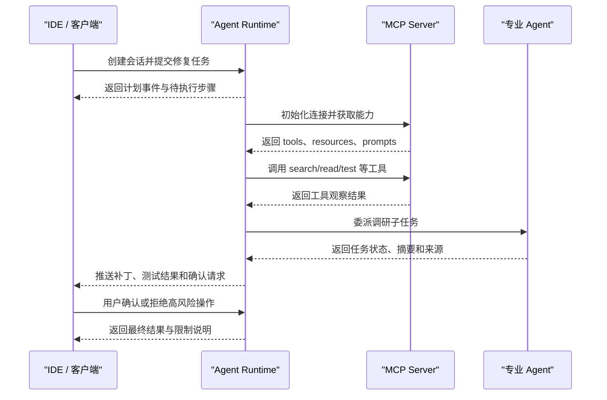
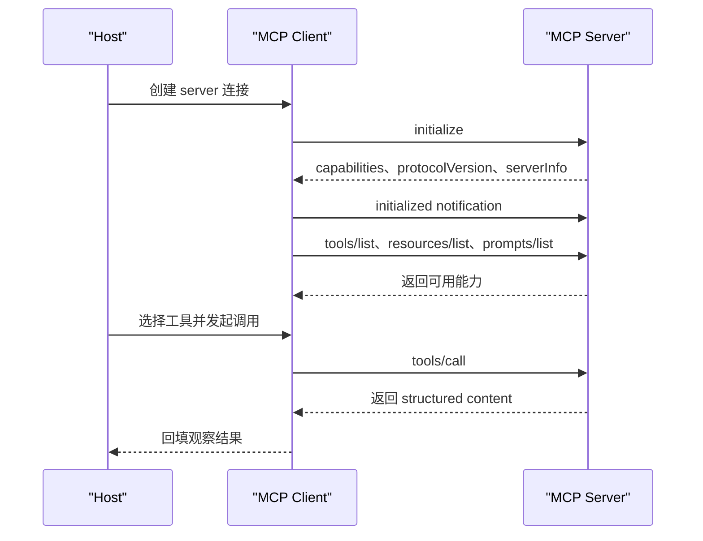
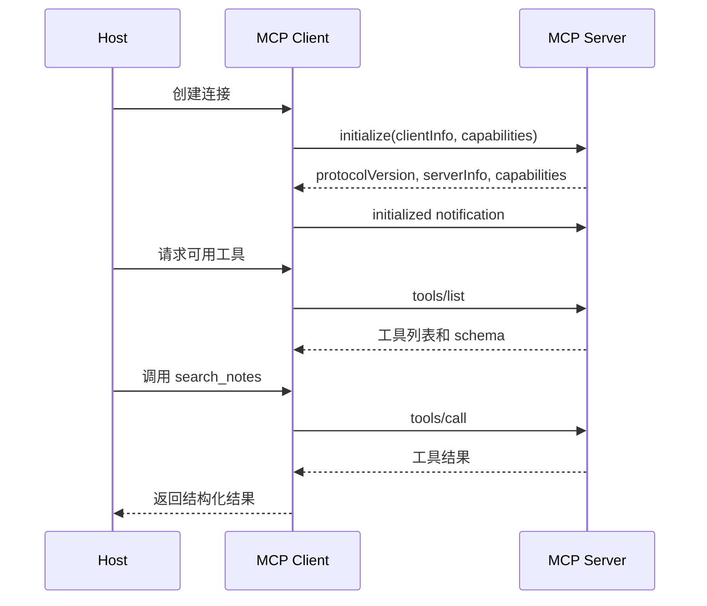
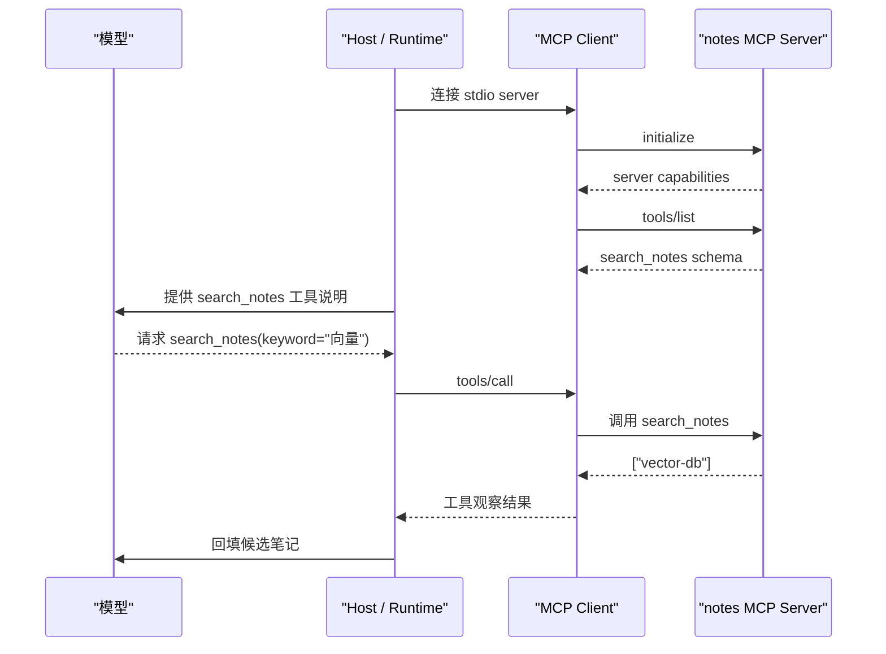
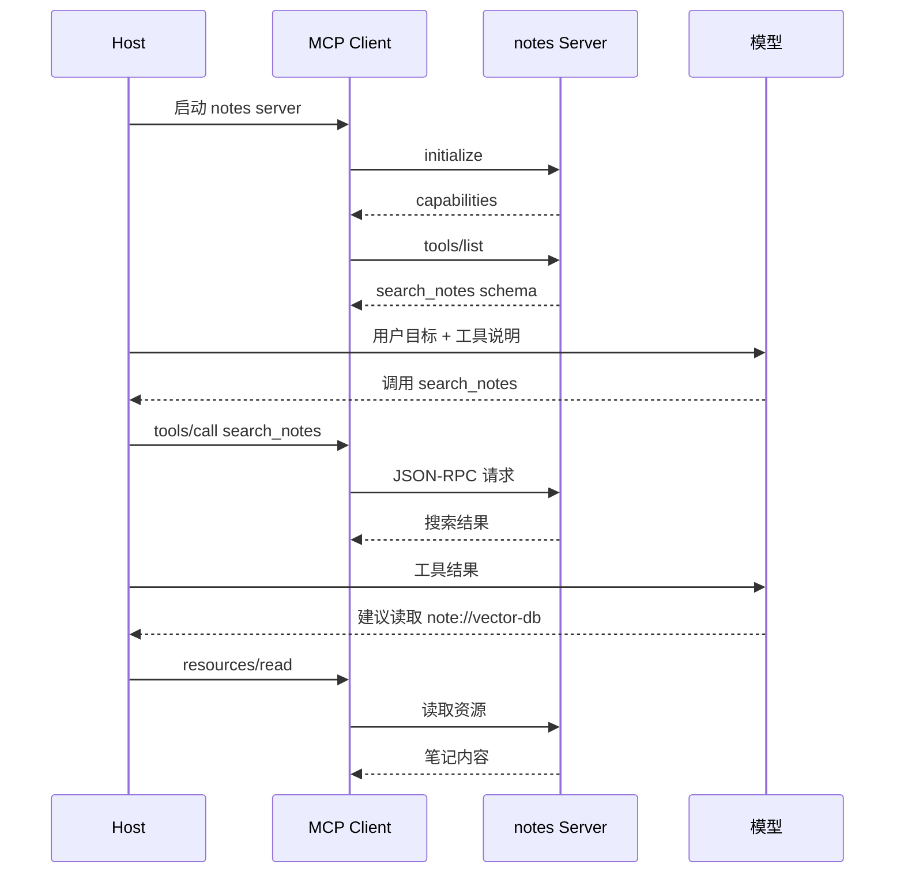
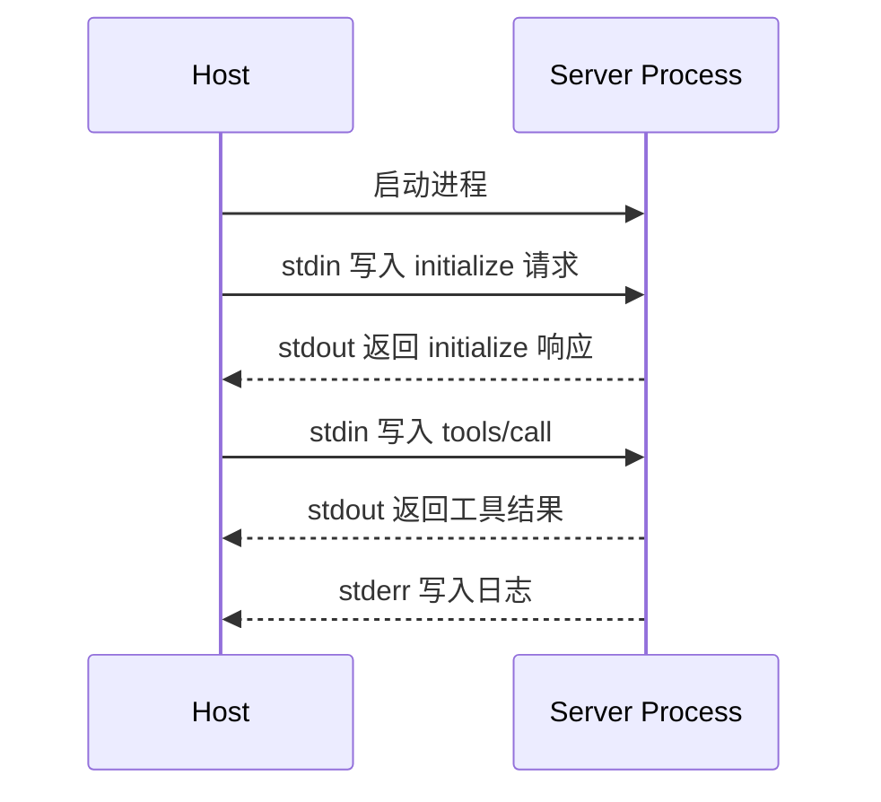
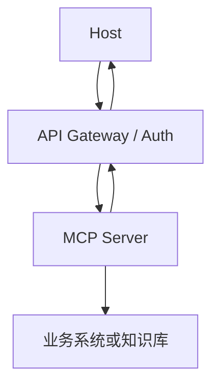
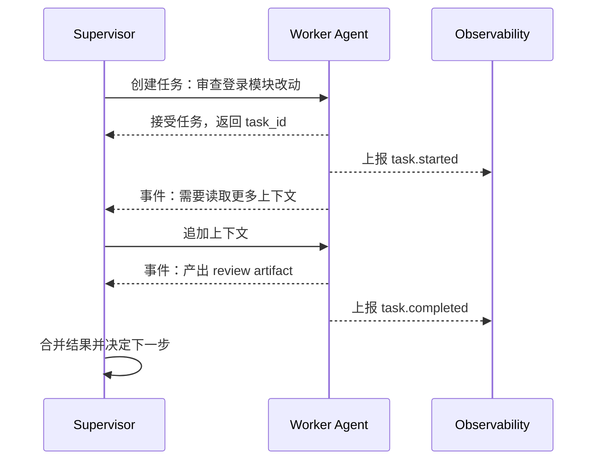

# 常见协议

## 1. Agent 系统中的通信边界

### 1.1 协议解决的问题

一个 Agent 原型可以把模型调用、工具函数、状态和界面写在同一个进程里。系统规模变大后，会出现多个客户端、多个工具服务、多个 Agent 服务和多个模型供应商。若每个边界都使用私有接口，维护成本会迅速上升，权限和审计也很难统一。

Agent 协议的价值在于稳定通信边界。它规定能力如何发现、消息如何表达、任务状态如何流转、错误如何返回、产物如何交付。协议不替 Runtime 做规划，也不替工具实现安全策略；它提供可复用的通信格式，让不同组件能以一致方式协作。

### 1.2 三类通信边界

理解 MCP、A2A、ACP 和 Agent Client Protocol 时，先看通信双方。第一层是客户端到 Agent Runtime，例如 IDE、网页或终端如何提交任务、展示工具事件、确认高风险操作。第二层是 Agent Runtime 到工具和上下文系统，例如文件、数据库、GitHub、浏览器、知识库。第三层是 Agent 到 Agent，例如一个企业助手把子任务委派给另一个专业 Agent。

| 边界 | 典型通信双方 | 代表协议 | 主要问题 |
| --- | --- | --- | --- |
| 客户端到 Agent | IDE、终端、Web UI 与 Agent Runtime | Agent Client Protocol | 会话、事件流、权限确认、文件变更展示 |
| Agent 到工具 | Agent Runtime 与外部数据源或工具服务 | MCP | 工具发现、资源读取、参数 schema、工具结果 |
| Agent 到 Agent | 一个 Agent 与另一个 Agent | A2A、ACP | 能力发现、任务委派、状态跟踪、产物交付 |

下面用编码 Agent 贯穿说明：用户在 IDE 中要求修复一个 bug；编码 Agent 通过客户端协议把进度展示给 IDE；通过 MCP 调用文件搜索、GitHub 和测试工具；需要生成调研摘要时，可以通过 A2A 或 ACP 把子任务交给研究 Agent。

### 1.3 一次完整交互链路



这条链路中，每个协议处理不同问题。客户端协议服务用户交互和可视化；MCP 服务工具和上下文接入；A2A/ACP 服务 Agent 间任务协作。分层后，系统更容易替换 UI、替换工具服务或替换下游 Agent。

### 1.4 Agent Client Protocol 与事件流

Agent Client Protocol 面向客户端和 Agent Runtime 的连接。它常见于 IDE、终端和桌面 Agent 场景。客户端需要的不只是聊天消息，还要展示 Agent 正在读哪些文件、准备运行哪些命令、生成了哪些补丁、测试是否通过、是否需要用户批准。这个协议层把 UI 与 Agent 后端解耦。

客户端协议的核心是事件流。用户提交任务后，Agent Runtime 可能连续发出计划事件、工具开始事件、工具完成事件、权限请求、文件变更、测试结果和最终回答。客户端可以根据事件类型展示不同 UI：工具事件显示进度，权限请求显示确认按钮，文件变更显示 diff，测试结果显示通过或失败。

事件应该包含稳定字段。比如工具开始事件包含 `tool_name`、`arguments_summary`、`risk_level`；工具完成事件包含 `ok`、`summary`、`elapsed_ms`、`truncated`；权限请求包含 `action`、`target`、`reason`、`impact`；文件变更包含 `path`、`diff`、`language`。这些字段让客户端可以做专业展示，也让用户知道 Agent 正在做什么。

## 2. MCP 的组成与能力发现

### 2.1 Host、Client、Server

MCP 的全称是 Model Context Protocol。它由 Anthropic 发起，目标是让模型应用以标准方式连接外部上下文和工具。MCP 的基本角色包括 host、client 和 server。

Host 是模型应用或 Agent Runtime，例如 IDE Agent、桌面助手、聊天应用。Client 嵌在 host 内部，负责与某个 MCP server 建立连接、发送协议消息、接收响应。Server 暴露具体能力，例如文件系统、数据库、浏览器、GitHub 或企业 API。

一个 host 可以同时连接多个 server。编码 Agent 可以连接文件系统 server、GitHub server、测试执行 server；企业助手可以连接知识库 server、订单 server、工单 server。模型看到的是 host 汇总后的工具和资源，真实调用通过 client 路由到对应 server。

### 2.2 Data Layer 与 Transport Layer

MCP 可以拆成两层理解。Data layer 定义协议对象和生命周期，例如初始化、能力协商、tools、resources、prompts、sampling、notifications、错误对象。Transport layer 负责消息如何传输，例如本地 stdio、Streamable HTTP。

MCP 使用 JSON-RPC 2.0 表达请求、响应和通知。带 `id` 的消息表示请求，需要对方返回响应；没有 `id` 的消息表示通知，不要求响应。这样既能表达 `tools/call` 这类请求响应，也能表达资源列表变化、进度更新等通知。

常见初始化流程如下：



### 2.3 从工具集成到协议边界

**背景**

早期 Agent 接入外部工具时，通常在应用代码里写死函数列表。一个客户端想接入文件系统、数据库、浏览器、企业知识库，就要为每种系统写一套适配逻辑。随着工具数量增加，集成成本、权限边界、上下文注入和能力发现都会变复杂。

Model Context Protocol（MCP）把工具、资源和提示能力放进统一协议。Host 负责承载用户应用和模型，Client 负责与某个 Server 建立连接，Server 暴露工具、资源和提示。这样 Agent 应用可以通过协议发现能力，再按 JSON-RPC 请求调用具体能力。

**三个角色**

| 角色 | 位置 | 职责 | 示例 |
| --- | --- | --- | --- |
| Host | 用户使用的 AI 应用 | 管理模型、用户会话、权限和多个 MCP client | IDE、桌面助手、聊天应用 |
| Client | Host 内部的协议客户端 | 与一个 server 建立一条连接并发送请求 | 文件系统 client、Git client |
| Server | 外部能力提供者 | 暴露 tools、resources、prompts | notes server、数据库 server |

Host 可以连接多个 Server，但每个 Client 通常对应一个 Server 连接。这个边界能让权限、生命周期和错误定位更清晰。

### 2.4 数据层与传输层

**MCP 能力模型**

MCP 的数据层基于 JSON-RPC 2.0 请求、响应和通知。Server 可以暴露三类常见能力：tools、resources、prompts。Tools 面向可执行动作；resources 面向可读取上下文；prompts 面向可复用提示模板。

| 能力 | 用途 | 典型操作 | Agent 场景 |
| --- | --- | --- | --- |
| Tools | 执行动作并返回结果 | `tools/list`、`tools/call` | 搜索笔记、查数据库、运行脚本 |
| Resources | 提供可读取内容 | `resources/list`、`resources/read` | 读取文件、配置、文档片段 |
| Prompts | 提供模板化提示 | `prompts/list`、`prompts/get` | 生成代码审查提示、总结模板 |
| Notifications | 推送状态变化 | progress、resource updated | 长任务进度、资源变更 |

这些能力通过初始化和能力协商暴露给 Host。Host 不应假设 Server 拥有某个能力，而应先读取 server capabilities，再决定是否调用。

**初始化时序**



初始化阶段决定协议版本和能力边界。之后 Host 才能安全地展示工具或让模型使用这些工具。

### 2.5 Tools、Resources、Prompts

MCP server 通常暴露三类能力。Tools 表示可执行动作，例如搜索文件、查询数据库、创建工单。Resources 表示可读取上下文，例如文件、文档、记录或查询结果。Prompts 表示可复用提示模板，帮助 host 生成稳定任务输入。

| 能力 | 适合表达 | 编码 Agent 例子 | 主要返回 |
| --- | --- | --- | --- |
| Tool | 有参数、有执行动作、可能失败 | `search_text`、`run_tests`、`create_issue` | 工具结果、错误、元信息 |
| Resource | 可按 URI 读取的上下文 | `file://src/app.ts`、`note://vector-db` | 文本、二进制、元数据 |
| Prompt | 可复用的提示模板 | “基于文件片段解释代码” | 消息模板和变量 |

Tools 适合让模型主动调用，Resources 适合让客户端或模型应用读取上下文，Prompts 适合复用任务结构。三者组合后，一个文件系统 server 可以暴露搜索工具、文件资源和解释代码的 prompt。

### 2.6 Tools、Resources、Prompts 的关系

**Tools**

Tool 是 Server 暴露的可执行能力，包含名称、描述和 input schema。模型通过 Host 看到工具说明后，生成 tool call；Host 再通过 MCP Client 调用 Server。

```json
{
  "name": "search_notes",
  "description": "按关键词搜索授权笔记。",
  "inputSchema": {
    "type": "object",
    "properties": {
      "keyword": {"type": "string"}
    },
    "required": ["keyword"]
  }
}
```

MCP tool schema 与 Function Calling schema 可以相互映射。差别在于 MCP 解决的是 Host 与外部 Server 的协议边界，Function Calling 解决的是模型与 Runtime 的结构化调用边界。

**Resources**

Resource 用 URI 表示可读取内容，例如 `note://vector-db`、`file:///project/README.md`。资源适合承载上下文，而非动作。Host 可以读取资源并放入模型上下文，也可以让用户选择资源后再触发 Agent。

**Prompts**

Prompt 是 Server 提供的可复用提示模板。它适合把领域任务的输入要求和输出格式封装起来，例如“根据笔记生成技术选型报告”。Prompt 不执行外部动作，通常与 tools 和 resources 配合使用。

### 2.7 协议设计的工程含义

**MCP 与本地工具封装对比**

| 维度 | 本地工具注册表 | MCP |
| --- | --- | --- |
| 集成范围 | 应用内部 | 跨应用、跨 Server |
| 能力发现 | 代码注册 | 协议 list 方法 |
| 传输 | 函数调用 | stdio、Streamable HTTP |
| 权限位置 | Runtime 内部 | Host 与 Server 分别控制 |
| 复用性 | 依赖应用实现 | Server 可被多个 Host 使用 |

MCP 的价值在于把能力提供方和 Agent Host 解耦。文件系统、数据库、业务系统都可以用 Server 方式暴露能力，Host 通过统一协议连接。

**风险与控制**

| 风险 | 表现 | 控制方式 |
| --- | --- | --- |
| 能力过宽 | Server 暴露危险写操作 | Host 做权限分级和用户确认 |
| 资源注入 | Resource 内容诱导模型越权 | 工具结果标注为不可信数据 |
| 版本不兼容 | 协议或 schema 变化 | 初始化阶段检查 protocolVersion |
| 传输泄露 | 敏感内容进入日志 | 脱敏、分级日志、最小权限 |
| 调试困难 | Host、Client、Server 责任混乱 | trace 记录 JSON-RPC 方法和 request id |

MCP 提供协议边界，安全治理仍需要 Host、Client 和 Server 共同实现。

## 3. 实现一个最小 MCP Server

### 3.1 文件笔记 server 的能力设计

一个最小 MCP server 可以从本地笔记场景开始。它暴露一个搜索 tool、一个按 URI 读取笔记的 resource，以及一个生成整理任务输入的 prompt。这个例子足够小，可以看清 MCP 的组成，又能和《基础概念》中的本地笔记 Agent 对应起来。

| 能力 | 名称 | 作用 |
| --- | --- | --- |
| Tool | `search_notes` | 按关键词搜索内存中的笔记 |
| Resource | `note://{name}` | 读取指定笔记内容 |
| Prompt | `summarize_note` | 生成整理某篇笔记的消息模板 |

真实系统里，server 会访问文件系统或数据库，并做路径、身份和权限检查。下面的教学示例只使用内存字典，重点展示 MCP server 的基本结构。

### 3.2 FastMCP 最小代码

```python
from mcp.server.fastmcp import FastMCP

mcp = FastMCP("notes")

notes = {
    "vector-db": "向量数据库用于存储 embedding，并支持相似度检索。",
    "rag": "RAG 通常先检索资料，再把片段交给模型生成回答。",
}


@mcp.tool()
def search_notes(keyword: str) -> list[str]:
    # Tool：模型可以主动调用，用于查找候选笔记
    return [name for name, text in notes.items() if keyword in text]


@mcp.resource("note://{name}")
def read_note(name: str) -> str:
    # Resource：host 可以按 URI 读取上下文
    return notes.get(name, "")


@mcp.prompt()
def summarize_note(name: str) -> str:
    # Prompt：复用整理笔记的任务模板
    return f"请整理 note://{name} 的核心概念，并列出依据。"


if __name__ == "__main__":
    mcp.run(transport="stdio")
```

这个 server 启动后，host 可以通过 MCP client 初始化连接，读取它声明的 tools、resources 和 prompts。模型若要查资料，host 可以让它看到 `search_notes` 的工具说明；模型选择工具并生成参数后，host 通过 `tools/call` 把调用发给 server。

### 3.3 Host 侧如何调用

Host 侧并不直接导入上面的函数。它通过 MCP client 与 server 通信，先发现能力，再把模型选择的动作转成协议调用。



这条链路说明 MCP 的边界：server 暴露能力，client 负责连接和消息，host 决定是否把能力交给模型以及如何处理结果。权限也要分层处理。Server 负责保护自己的数据源；host 负责确认用户是否有权使用某个 server 或某类工具；Runtime 负责把工具调用写入 trace。

### 3.4 最小实现到生产实现

最小 server 只能说明形态，生产实现还需要补齐四类能力。第一，身份认证和授权，尤其是 HTTP transport 和企业数据源。第二，输入校验和输出截断，避免模型生成过宽查询或读取过大资源。第三，错误模型，例如 `NotFound`、`PermissionDenied`、`Timeout`、`RateLimited`。第四，观测能力，包括调用耗时、参数摘要、结果数量、错误和 trace id。

MCP 让工具能力可复用，但可靠性仍来自实现。一个搜索 tool 若没有结果上限，换成 MCP 后仍会污染上下文；一个数据库 tool 若没有权限检查，使用标准协议后仍会泄漏数据。协议提供结构，工程质量来自 server 和 host 的共同约束。

### 3.5 从本地函数到 MCP Server

**场景**

假设我们有一批本地笔记，希望任何支持 MCP 的 Host 都能搜索和读取它们。直接把搜索函数写进某个 Agent 应用，只能服务这个应用；实现成 MCP Server 后，IDE、桌面助手或聊天应用都能通过协议发现 `search_notes` 工具和 `note://` 资源。

最小 MCP Server 需要暴露三类能力中的至少一种。本文用 Python SDK 风格实现一个 notes server：一个 tool 用于搜索笔记，一个 resource 用于读取指定笔记，一个 prompt 用于生成整理任务提示。

**运行边界**

| 边界 | 说明 |
| --- | --- |
| Server | 只管理笔记数据和能力定义 |
| Host | 决定是否把工具暴露给模型 |
| 模型 | 选择是否调用工具 |
| 用户权限 | 由 Host 和 Server 共同限制 |

最小实现可以运行在 stdio 上，Host 启动 Server 进程，通过标准输入输出交换 JSON-RPC 消息。

### 3.6 FastMCP 示例

**Server 代码**

```python
from mcp.server.fastmcp import FastMCP

mcp = FastMCP("notes")

notes = {
    "vector-db": "向量数据库用于存储 embedding，并支持相似度检索。",
    "rag": "RAG 通常先检索资料，再把片段交给模型生成回答。",
}


@mcp.tool()
def search_notes(keyword: str) -> list[dict]:
    """按关键词搜索授权笔记。"""
    return [
        {"id": note_id, "preview": text[:80]}
        for note_id, text in notes.items()
        if keyword in text
    ]


@mcp.resource("note://{note_id}")
def read_note(note_id: str) -> str:
    """读取一篇笔记资源。"""
    return notes.get(note_id, "")


@mcp.prompt()
def summarize_note(topic: str) -> str:
    """生成笔记整理提示。"""
    return f"请基于已读取笔记整理 {topic} 的核心概念、适用场景和限制。"


if __name__ == "__main__":
    # stdio 适合本地 Host 启动子进程并通信。
    mcp.run(transport="stdio")
```

这段代码没有引入真实文件系统，便于看清 MCP 能力定义。`@mcp.tool()` 生成可调用动作，`@mcp.resource()` 暴露可读取内容，`@mcp.prompt()` 提供可复用提示模板。

**Host 侧调用时序**



Host 侧要把 MCP 返回的工具列表映射成模型可理解的工具说明。模型生成调用后，Host 再走 MCP Client 调用 Server。

### 3.7 JSON-RPC 交互形态

**列出工具**

```json
{
  "jsonrpc": "2.0",
  "id": 2,
  "method": "tools/list",
  "params": {}
}
```

Server 返回工具名称、描述和输入 schema。Host 可以选择全部暴露给模型，也可以根据用户权限、任务阶段或安全策略过滤。

**调用工具**

```json
{
  "jsonrpc": "2.0",
  "id": 3,
  "method": "tools/call",
  "params": {
    "name": "search_notes",
    "arguments": {
      "keyword": "向量数据库"
    }
  }
}
```

工具返回结果后，Host 需要把结果转成模型上下文中的观察。若结果包含大量文本，Host 应截断或提供资源 URI，引导模型按需读取。

### 3.8 最小实现的工程补强

**需要补上的能力**

| 能力 | 最小示例状态 | 生产实现补强 |
| --- | --- | --- |
| 权限 | 内存数据公开 | 按用户、目录、资源类型过滤 |
| 错误 | 空字符串返回 | 返回错误类型和可重试信息 |
| 日志 | 未记录 | 记录 request id、方法、耗时 |
| 资源 | 简单 URI | 支持列表、分页、版本 |
| 传输 | stdio | 本地 stdio 或远程 Streamable HTTP |

最小示例帮助理解协议形态。生产系统还需要鉴权、审计、脱敏、超时、并发控制和 schema 版本管理。

## 4. stdio 与 Streamable HTTP

### 4.1 Transport：stdio 与 Streamable HTTP

stdio 适合本地工具。Host 启动 server 进程，通过标准输入输出交换 JSON-RPC 消息。它部署简单，适合文件系统、Git、本地 CLI 这类与宿主机器关系紧密的能力。桌面 Agent 和 IDE 插件常用这种方式连接本地 server。

Streamable HTTP 适合远程服务。Server 以 HTTP 服务形式运行，client 通过网络请求建立会话并收发消息。它更适合企业 API、共享知识库、远程浏览器和云端工具。远程传输需要额外考虑认证、租户隔离、限流和网络错误恢复。

选择 transport 时要看部署边界。若能力必须访问本地文件和本地命令，stdio 更直接；若能力需要被多个用户或多个 host 复用，HTTP 更容易运维和扩展。无论选择哪种 transport，工具 schema、权限、结果结构和审计仍由实现方控制。

### 4.2 传输层解决什么问题

**背景**

MCP 的数据层定义 JSON-RPC 方法和能力模型，传输层负责把这些消息送到 Server。传输选择会影响部署方式、权限边界、调试方式和网络安全。官方文档中常见传输包括 stdio 和 Streamable HTTP。

stdio 适合本地 Host 启动本地 Server 进程，例如 IDE 启动文件系统 Server。Streamable HTTP 适合远程服务或长连接场景，便于穿过服务网关、接入鉴权和支持流式响应。

**对比**

| 传输 | 连接形态 | 适合场景 | 风险点 |
| --- | --- | --- | --- |
| stdio | Host 启动子进程，通过标准输入输出通信 | 本地工具、开发机、IDE | 进程权限、日志污染 stdout |
| Streamable HTTP | HTTP 请求和流式响应 | 远程工具、云服务、企业系统 | 鉴权、网络暴露、代理配置 |
| 自定义传输 | 嵌入特定运行环境 | 内部平台 | 兼容性和调试成本 |

传输层不改变 tools/resources/prompts 的语义，但会改变安全和运维模型。

### 4.3 stdio 传输

**通信方式**

stdio 模式下，Host 启动 Server 子进程，JSON-RPC 消息通过 stdin/stdout 传递。Server 的普通日志不能写入 stdout，否则会污染协议流；日志应写 stderr 或单独文件。



stdio 的权限模型接近本地插件。Server 进程通常继承 Host 给予的环境变量、工作目录和文件系统权限，因此启动命令和工作目录要严格控制。

```json
{
  "jsonrpc": "2.0",
  "id": 1,
  "method": "initialize",
  "params": {
    "protocolVersion": "2025-06-18",
    "clientInfo": {"name": "local-host", "version": "1.0.0"}
  }
}
```

这类 JSON-RPC 消息在 stdio 中按行或按消息边界传输。Host 读取响应后，才能继续进行 `tools/list` 或 `resources/list`。

**常见问题**

| 问题 | 表现 | 处理方式 |
| --- | --- | --- |
| stdout 被日志污染 | Client 无法解析 JSON-RPC | 日志写 stderr |
| 进程僵死 | Host 等不到响应 | 设置超时和心跳 |
| 权限过大 | Server 可读过多本地文件 | 用启动参数限制根目录 |
| 版本漂移 | Client/Server 协议不一致 | 初始化时校验 protocolVersion |

### 4.4 Streamable HTTP

**运行方式**

Streamable HTTP 让 Host 通过 HTTP 与 Server 通信。它更适合远程部署，可以结合企业网关、OAuth、服务发现和审计系统。对于长任务，Server 可以通过流式响应或通知把进度返回给 Host。



远程传输必须把用户身份、授权范围和审计信息带到 Server 侧。Host 过滤工具列表只能减少暴露，Server 自身仍要做权限校验。

**部署关注点**

| 关注点 | 说明 |
| --- | --- |
| 鉴权 | 使用企业身份体系或 token，避免匿名访问 |
| 速率限制 | 按用户、工具和租户限制调用频率 |
| 内容脱敏 | 请求和响应日志不能直接保存敏感内容 |
| 版本管理 | Server 能力变化要兼容旧 Host |
| 可观测性 | 记录 request id、trace id、方法、耗时 |

### 4.5 传输选择方法

**选择依据**

| 场景 | 推荐传输 | 原因 |
| --- | --- | --- |
| 本地文件搜索 | stdio | 权限靠本地目录和进程控制 |
| IDE 插件工具 | stdio | 启停简单，贴近用户工作区 |
| 企业知识库 | Streamable HTTP | 需要远程鉴权、审计和共享 |
| 业务 API | Streamable HTTP | 需要网关、限流、监控 |
| 原型验证 | stdio | 部署成本低 |

先根据能力位置选择传输：能力在用户本机时优先 stdio；能力在远程业务系统时优先 HTTP。随后再补鉴权、日志和 trace。

## 5. A2A、ACP 与 Agent 间通信

### 5.1 A2A：Agent 之间的任务委派

A2A 通常指 Agent2Agent Protocol。Google 对 A2A 的介绍强调它用于让不同供应商、不同框架构建的 Agent 彼此协作。A2A 关注的是一个 Agent 如何发现另一个 Agent 的能力、向它发送任务、接收进度、处理长任务状态，并获取最终产物。

在编码 Agent 场景中，A2A 可以用于跨专业协作。主 Agent 负责修改代码，但需要一份“相关框架版本变更说明”。它可以把调研任务委派给 Research Agent。Research Agent 使用自己的搜索工具和资料库，运行一段时间后返回摘要、来源和限制。主 Agent 不需要知道 Research Agent 内部用了哪些工具，只需要理解任务状态和产物格式。

A2A 与 MCP 的差异在调用对象层级。调用 MCP tool 更像调用受控函数，输入参数后得到结果。调用 A2A Agent 更像委派一项任务，对方可能多轮执行、调用自己的工具、维护自己的状态，并持续返回进度。A2A 因此需要更强的任务生命周期表达，例如已接收、运行中、等待输入、失败、取消、完成。

### 5.2 ACP：另一类 Agent 间通信尝试

ACP 常指 Agent Communication Protocol。不同社区和项目对 ACP 的定义略有差异，目标通常是为 Agent 间消息、任务、能力和产物提供通用通信层。它和 A2A 面向的问题相近：多个自治 Agent 如何互相发现、交换任务、传递中间结果、交付最终产物。

ACP 的工程价值在于减少点对点私有集成。若每个 Agent 都只暴露一套自定义 HTTP API，调用方必须单独适配 URL、请求字段、状态查询、错误码和结果格式。ACP 试图把这些共性抽象成协议对象，让 Agent 能声明能力、接收任务、返回状态和发送消息。

使用 ACP 时要注意两点。第一，协议名称相同不代表实现兼容，必须看具体规范版本、SDK 和示例。第二，协议只能标准化通信方式，不能自动统一业务语义。比如“分析客户风险”这个任务，不同组织对风险指标、数据来源、合规要求和输出格式有不同定义。ACP 可以承载请求和产物，业务语义仍要通过 schema、说明文档和评估标准补齐。

### 5.3 Agent 间通信的边界

**背景**

当系统里只有一个 Agent，它可以直接使用工具和资源完成任务。复杂业务中常会出现多个 Agent：研究 Agent 收集资料，代码 Agent 修改仓库，审查 Agent 检查风险，客服 Agent 与用户沟通。此时系统需要描述能力、委派任务、传递状态、取消任务、恢复任务和记录审计。

Google 提出的 Agent2Agent（A2A）协议关注 Agent 与 Agent 或应用之间的任务通信。它与 MCP 的关注点不同：MCP 连接 Host 与工具/资源 Server，A2A 关注不同 Agent 或服务之间如何表达任务、能力和状态。

**MCP 与 A2A 对比**

| 维度 | MCP | A2A |
| --- | --- | --- |
| 主要对象 | 工具、资源、提示 | Agent 能力、任务、事件 |
| 调用方向 | Host 调用 Server 能力 | Agent 或应用委派任务 |
| 交互粒度 | tool call、resource read | task、message、artifact、status |
| 典型场景 | 接入文件、数据库、业务工具 | 跨 Agent 分工、远程助手协作 |

两者可以共存。一个 Supervisor 通过 A2A 把任务交给代码 Agent，代码 Agent 内部再通过 MCP 调用 Git、文件系统和测试工具。

### 5.4 通信模型

**能力描述**

Agent 间通信首先要知道对方能做什么。能力描述通常包含名称、说明、输入输出、支持的事件、认证方式和限制。它类似服务发现，但语义更贴近任务。

```json
{
  "name": "code-review-agent",
  "description": "审查代码变更并返回风险、测试建议和阻断问题。",
  "capabilities": ["review_diff", "suggest_tests"],
  "input_modes": ["text", "patch"],
  "output_modes": ["text", "json"],
  "auth": "bearer_token"
}
```

能力描述不要夸大范围。若审查 Agent 只能读 diff，描述里就不应暗示它能访问完整仓库。

**任务生命周期**



任务通信应支持事件流。长任务不能只等待最终响应，因为上层需要知道进度、阻塞原因、部分产出和取消状态。

### 5.5 长任务、取消与恢复

Agent 任务经常会持续多轮。代码迁移、调研报告、数据清洗和跨系统审批都可能运行较久。协议需要表达任务状态：已接收、运行中、等待用户、等待外部系统、部分完成、失败、取消、完成。A2A/ACP 尤其需要状态机，因为下游 Agent 可能异步执行。Agent Client Protocol 也需要事件流，让客户端能展示实时进度。

长任务还要支持取消和恢复。用户可能改变目标，客户端可能断线，下游工具可能超时。协议如果只定义最终结果，Runtime 很难处理这些情况。更成熟的设计会提供任务 id、事件序列号、检查点、取消请求和错误恢复建议。状态持久化属于实现层，但协议要提供可表达状态的消息结构。

### 5.6 状态、取消与恢复

**任务状态**

| 状态 | 含义 | 上层处理 |
| --- | --- | --- |
| submitted | 任务已提交 | 等待接收 |
| running | 正在执行 | 展示进度或继续等待 |
| input_required | 需要补充信息 | 向用户或上游 Agent 请求 |
| completed | 已完成 | 读取产物 |
| failed | 执行失败 | 查看错误和可恢复性 |
| canceled | 已取消 | 停止下游工具 |

状态机要明确。没有状态约定时，Supervisor 很难判断 Worker 是仍在运行、等待输入，还是已经失败。

**取消与恢复**

```python
def cancel_task(task_id, reason):
    task = task_store.get(task_id)
    task.status = "canceled"
    task.cancel_reason = reason
    task_store.save(task)
    event_bus.publish("task.canceled", {"task_id": task_id})


def resume_task(task_id, extra_input):
    task = task_store.get(task_id)
    if task.status != "input_required":
        return {"ok": False, "error_type": "not_resumable"}
    task.messages.append(extra_input)
    task.status = "running"
    task_store.save(task)
    return {"ok": True}
```

取消要能传播到下游工具，尤其是长时间运行的浏览器、测试或数据查询。恢复要依赖可持久化状态，不能只靠进程内上下文。

### 5.7 身份、权限与审计

协议互操作不能绕过权限。MCP server 可能连接企业数据库，A2A Agent 可能接收私有文档，客户端协议可能触发本地命令。每一次跨边界调用都要回答四个问题：调用方是谁；它代表哪个用户；本次操作需要什么权限；调用记录如何审计。

身份还要区分用户身份、Agent 身份、工具服务身份和下游 Agent 身份。用户让 Agent 查询数据库时，默认使用 Agent 服务器最高权限会扩大风险；更合理的是基于用户授权、服务策略或二者组合。跨 Agent 委派时，上游 Agent 应只传递必要上下文，并记录委派原因和数据范围。

审计链路应贯穿多个协议。一次最终回答可能经过客户端会话、MCP 工具、A2A 子任务和多次模型调用。日志要能串起 trace id、用户、Agent、工具、参数摘要、结果摘要、授权状态、错误和耗时。没有审计链路，问题发生后很难判断是模型决策、工具实现、协议适配还是下游 Agent 造成的。

### 5.8 治理与审计

**风险**

| 风险 | 表现 | 处理方式 |
| --- | --- | --- |
| 能力冒用 | 上游把任务交给无权限 Agent | 能力发现和认证绑定 |
| 上下文泄露 | 敏感资料传给下游 | 最小上下文、脱敏、租户隔离 |
| 责任不清 | 多 Agent 失败难归因 | 统一 task id、trace id、artifact |
| 循环委派 | Agent 之间反复转交 | 最大委派深度和超时 |
| 状态丢失 | 长任务中断后无法恢复 | 持久化任务状态和事件 |

Agent 间通信的重点是任务边界。只有把能力、状态、事件和产物表达清楚，多 Agent 系统才具备调试和治理基础。

## 参考资料

- [A2A GitHub](https://github.com/a2aproject/A2A)
- [A2A Protocol Documentation](https://google-a2a.github.io/A2A/)
- [Agent Client Protocol: Introduction](https://agentclientprotocol.com/get-started/introduction)
- [Agent Communication Protocol: Introduction](https://agentcommunicationprotocol.dev/introduction/welcome)
- [Anthropic: Building effective agents](https://www.anthropic.com/research/building-effective-agents)
- [Google A2A Project](https://github.com/google-a2a/A2A)
- [Google Developers Blog: A2A - a new era of agent interoperability](https://developers.googleblog.com/en/a2a-a-new-era-of-agent-interoperability/)
- [JSON-RPC 2.0 Specification](https://www.jsonrpc.org/specification)
- [MCP Architecture](https://modelcontextprotocol.io/docs/learn/architecture)
- [MCP Python SDK](https://github.com/modelcontextprotocol/python-sdk)
- [MCP Server Concepts](https://modelcontextprotocol.io/docs/learn/server-concepts)
- [MCP Server Quickstart](https://modelcontextprotocol.io/docs/develop/build-server)
- [MCP Specification](https://modelcontextprotocol.io/specification/)
- [MCP Transports](https://modelcontextprotocol.io/docs/learn/transports)
- [Microsoft: Agentic AI failure modes and effects analysis](https://www.microsoft.com/en-us/security/security-insider/intelligence-reports/agentic-ai-failure-modes-and-effects-analysis)
- [Model Context Protocol Introduction](https://modelcontextprotocol.io/docs/getting-started/intro)
- [Model Context Protocol: Architecture](https://modelcontextprotocol.io/docs/learn/architecture)
- [Model Context Protocol: Build a server](https://modelcontextprotocol.io/quickstart/server)
- [Model Context Protocol: Introduction](https://modelcontextprotocol.io/docs/getting-started/intro)
- [Model Context Protocol: Server concepts](https://modelcontextprotocol.io/docs/learn/server-concepts)
- [Model Context Protocol](https://modelcontextprotocol.io/docs/getting-started/intro)
- [OpenAI: Practices for governing agentic AI systems](https://openai.com/index/practices-for-governing-agentic-ai-systems/)
