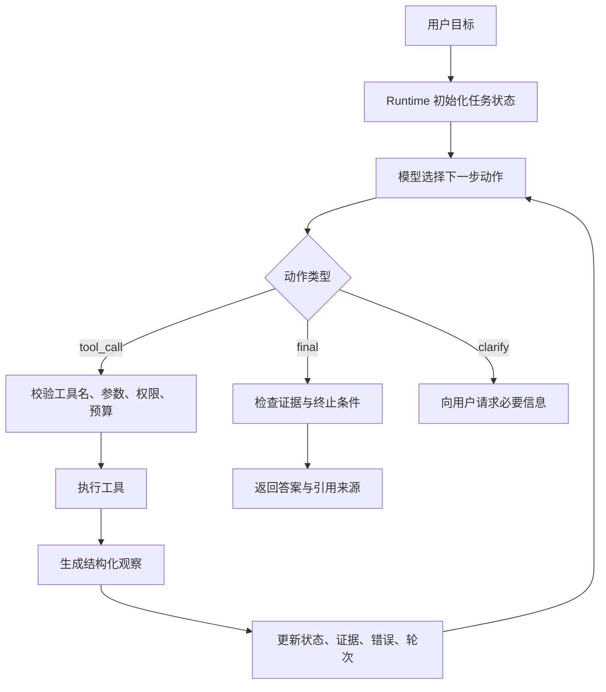
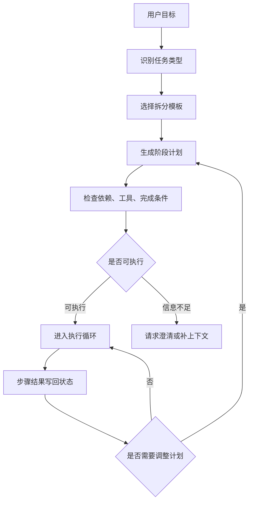
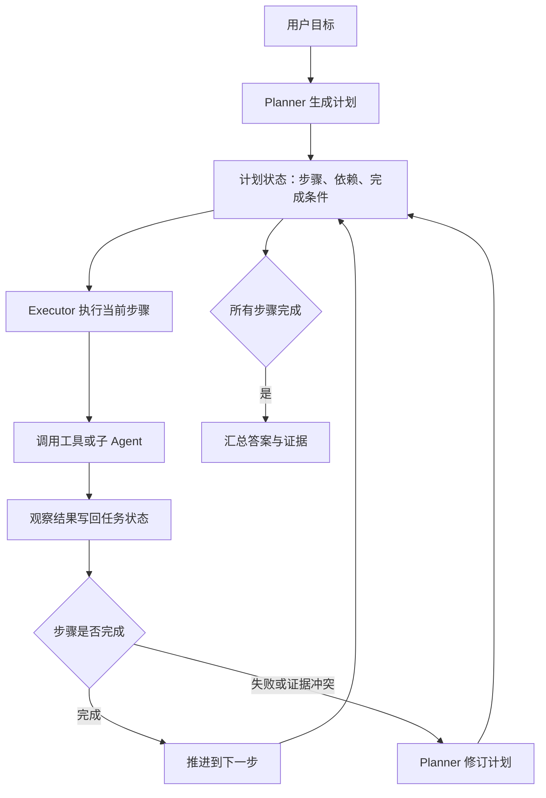
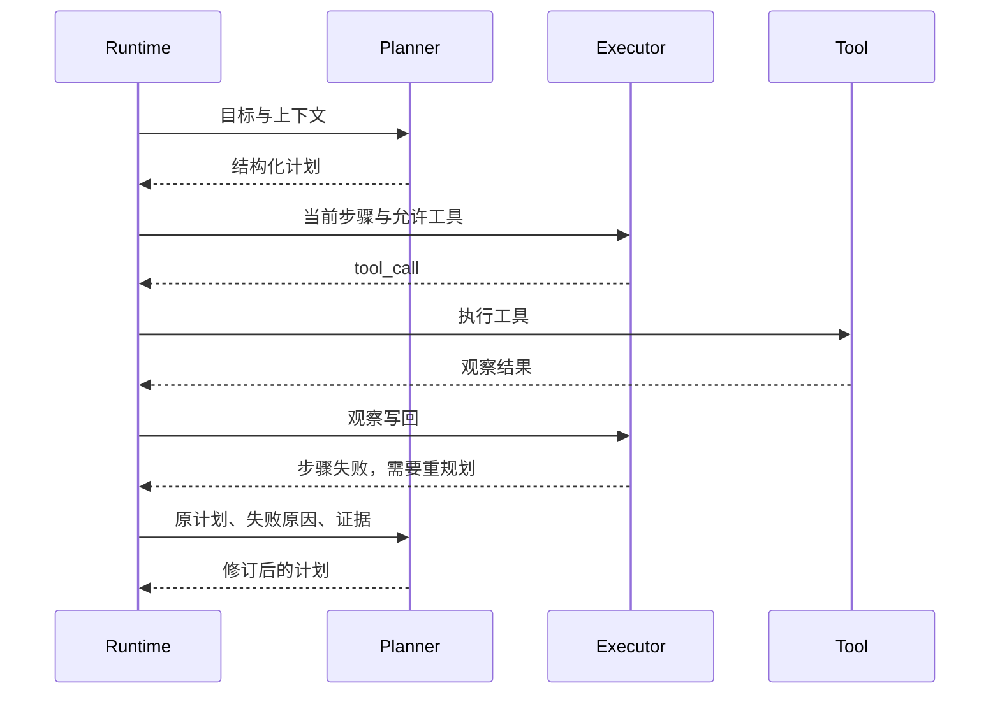
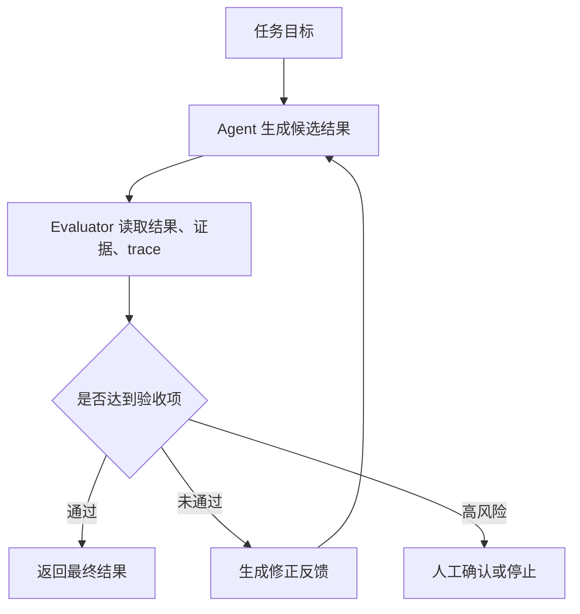
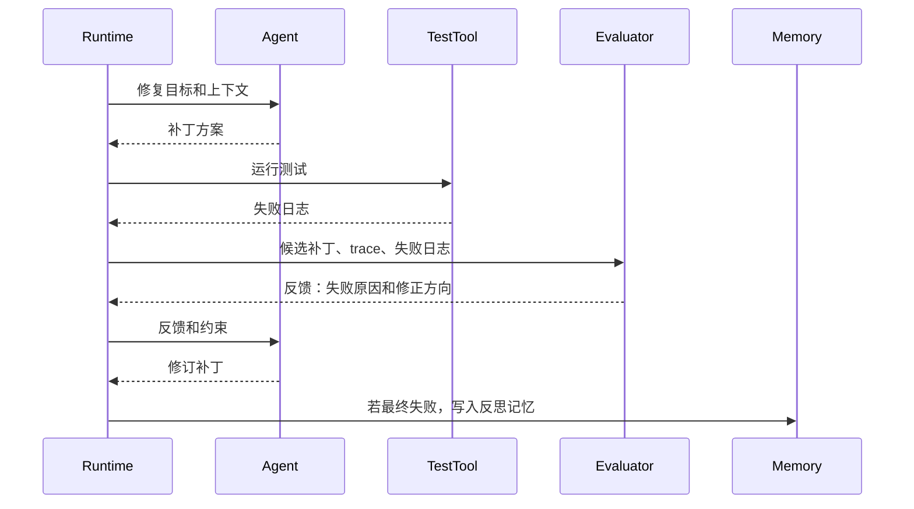
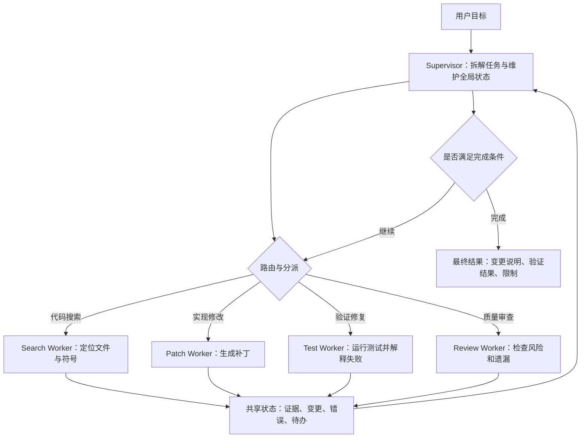
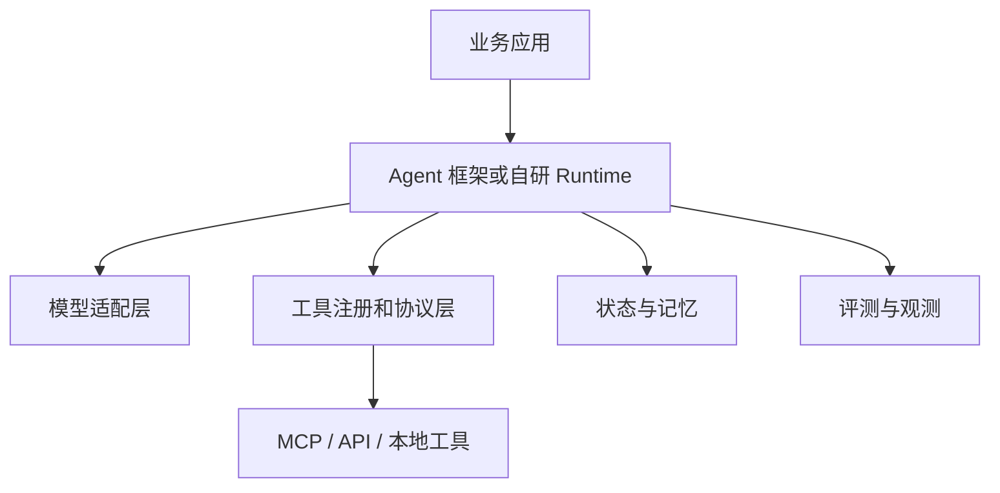

# 设计模式

## 1. 从任务形态选择模式

### 1.1 设计模式解决的问题

Agent 设计模式解决的是架构选型问题。同样是让模型调用工具，系统可以做成固定工作流、单 Agent 循环、入口路由、Supervisor-Worker、多 Agent 交接，也可以加入评估器不断优化结果。模式选择会影响工具权限、上下文组织、失败恢复、成本和可观测性。

设计前先判断任务形态。路径稳定、输入输出明确的任务，优先使用工作流。下一步高度依赖工具观察的任务，适合引入 Agent 循环。任务入口类型很多时，需要路由。任务可以拆给多个专业能力时，可以使用 Supervisor-Worker 或 Handoff。输出可以被测试、规则或审查标准验证时，可以加入 Evaluator-Optimizer。

本文用两个场景贯穿说明。场景一是代码迁移：需要搜索仓库、修改文件、运行测试、修复失败。场景二是企业助手：需要识别用户意图、查询知识库、调用业务系统、必要时移交人工或专业 Agent。这两个场景能覆盖主要模式的取舍。

### 1.2 模式选择矩阵

| 模式 | 适用任务 | 控制权 | 优点 | 主要风险 |
| --- | --- | --- | --- | --- |
| 固定工作流 | 步骤稳定、输入输出明确 | 代码 | 可预测、易测试 | 面对开放任务时分支膨胀 |
| 单 Agent | 路径动态、工具数量少 | 模型和 Runtime | 实现简单、上下文集中 | 工具过多后选择混乱 |
| Routing | 多类任务入口 | 路由器 | 降低单 Agent 负担 | 类别定义不清导致误分 |
| Supervisor-Worker | 可拆分复杂任务 | Supervisor | 职责清晰、可并行 | 状态同步和聚合复杂 |
| Handoff | 多个专业 Agent 顺序接力 | 当前 Agent | 用户体验自然 | 交接摘要质量决定成败 |
| Evaluator-Optimizer | 输出可验证 | 评估器和生成器 | 能逐步提高质量 | 容易无效迭代 |

这个矩阵只提供选型起点。真实系统常把多种模式组合起来。例如代码迁移可以由固定工作流管理阶段：分析、修改、测试、总结；在分析和修复阶段使用单 Agent；在大型仓库中再引入 worker 分工处理前端、后端和配置。企业助手可以先用 routing 判断任务类型，再把复杂任务 handoff 给专业 Agent。

### 1.3 从简单结构开始

Agent 架构最常见的问题是过早复杂化。一个任务若能用稳定工作流解决，直接上多 Agent 会增加状态同步、权限管理、上下文传递和调试成本。更稳妥的路径是先做可测试工作流，再在路径动态的节点引入单 Agent，最后根据职责和权限拆分多个 Agent。

这条路径也便于评估。每次引入新模式，都应比较任务成功率、平均工具调用次数、失败类型、人工接管率和成本。若复杂模式没有改善结果，就应回到更简单的结构。

### 1.4 固定工作流：可测试的基线

固定工作流把控制流写在代码里，模型只在局部节点执行任务。以企业助手的工单分类为例，流程可以固定为：清洗用户输入、分类、抽取字段、查询知识库、生成答复、规则校验、返回结果。每一步都有明确输入输出，失败时也容易定位。

工作流适合三类任务。第一类是业务规则明确的任务，例如表单抽取、合同条款检查、客服意图分类。第二类是有强格式要求的任务，例如生成 JSON、SQL、配置文件。第三类是需要可审计的流程，例如审批、发布、数据写入。代码控制路径能让团队明确知道每一步何时发生、失败如何处理、哪些节点需要人工确认。

代码迁移也可以先用工作流搭外层阶段：创建迁移计划、定位引用、生成补丁、运行测试、修复失败、输出总结。这个外层流程给任务提供边界，后续只在“定位引用”和“修复失败”这类动态节点引入 Agent。

## 2. ReAct 与单 Agent 循环

### 2.1 单 Agent：小范围动态决策

单 Agent 模式由一个 Agent 维护统一状态和工具集合。代码迁移的初版可以这样设计：Agent 看到目标和仓库状态，拥有 `search_text`、`read_file`、`apply_patch`、`run_tests` 四类工具。它先搜索相关符号，读取文件，生成补丁，运行测试，根据错误继续修复，最后总结变更。

单 Agent 的关键是让模型在 Runtime 管控下做小范围动态决策。工具数量应控制在当前任务所需范围内。搜索阶段只给只读工具，编辑阶段再给写入工具，发布阶段才给部署工具。状态中要记录已读文件、已改文件、测试结果和失败原因。这样模型每轮能看到任务进度，也能避免重复读取同一材料。

单 Agent 的失败信号很明显。若提示词越来越长，工具列表越来越多，模型频繁选错工具，或同一上下文中要处理法律、代码、客服和数据分析，职责已经过于拥挤。此时应拆分工具集合、拆分任务阶段，或引入路由和多 Agent 协作。

### 2.2 从推理文本到环境交互

**历史背景**

ReAct 来自论文 *Synergizing Reasoning and Acting in Language Models*。论文把 reasoning 与 acting 放在同一条轨迹中：模型先根据目标和历史观察决定下一步行动，外部环境返回观察结果，模型再继续修正后续动作。早期 Chain-of-Thought 主要提升模型在文本空间里的分步推理能力，ReAct 进一步把外部搜索、知识库、API、网页环境和任务状态接入循环，使模型能够边查、边做、边修正。

这个思想适合解释很多 Agent 产品的基础形态。用户要求“修复项目里的登录错误”时，系统不能只生成一段建议；它要搜索报错、读取文件、定位调用链、修改代码、运行测试，再根据测试结果继续调整。ReAct 提供的核心价值在于把一次回答拆成多轮“动作与观察”，让模型的下一步建立在真实环境反馈上。

**问题边界**

ReAct 解决的是路径依赖中间结果的任务。若输入已经包含所有信息，普通问答足够；若步骤完全固定，工作流更容易测试；若每一步都要根据搜索结果、测试结果或外部 API 返回继续选择，ReAct 循环就有空间。

| 任务形态 | 典型行为 | ReAct 的收益 | 主要风险 |
| --- | --- | --- | --- |
| 文档调研 | 搜索、读取、归纳、补查 | 根据证据缺口调整查询 | 循环搜索、证据过长 |
| 代码修复 | 搜索报错、读文件、改代码、跑测试 | 用测试观察驱动下一步 | 工具误用、修改范围扩大 |
| 网页操作 | 观察页面、点击、填写、校验结果 | 页面状态可持续反馈 | 页面变化导致动作失效 |
| 数据分析 | 查询数据、运行代码、解释结果 | 中间计算影响后续分析 | 结果未校验就下结论 |

重点在于控制权分配。模型提出候选动作，Runtime 执行校验、调用工具、写入状态、判断终止。模型不能直接拥有系统权限，工具调用必须经过 Runtime。

### 2.3 ReAct 循环的底层结构

**状态机视角**

工程实现中，ReAct 更像一个受限状态机。每一轮只允许模型输出一种结构化动作：调用工具、请求澄清、给出最终答案或停止。Runtime 把动作解析为可执行请求，执行后把观察结果压缩回状态。



这里的状态至少包含目标、可用工具、已执行动作、观察结果、证据、错误、预算、终止条件。状态不能只保存聊天记录，因为聊天记录很难判断“是否读过这个文件”“这个搜索词是否已经失败”“证据是否足够覆盖结论”。

**结构化动作**

论文和很多教程会用 `Thought -> Action -> Observation` 展示轨迹。生产系统通常不把内部推理逐字暴露给用户，也不依赖自由文本解析动作。更稳妥的做法是让模型返回 JSON 或 Function Calling 结构。

```json
{
  "type": "tool_call",
  "name": "search_text",
  "args": {
    "query": "login redirect error",
    "path": "src"
  },
  "intent": "定位登录跳转错误的实现位置"
}
```

Runtime 对这个动作做四层处理：确认工具存在，按 schema 校验参数，检查路径与权限，记录这次调用的 trace id。工具返回后，Runtime 生成面向下一轮模型的观察，而非把原始输出全部塞回上下文。

```json
{
  "ok": true,
  "tool": "search_text",
  "items": [
    {"path": "src/auth/router.ts", "line": 42, "snippet": "redirectAfterLogin"}
  ],
  "truncated": false,
  "elapsed_ms": 31
}
```

**最小代码示例**

下面的 Python 示例用内存数据模拟代码修复 Agent。它省略真实模型 SDK，把重点放在循环、工具执行、状态更新和停止条件。

```python
files = {
    "src/auth/router.ts": "function redirectAfterLogin(next) { return next || '/home' }",
    "tests/auth.test.ts": "expect(redirectAfterLogin('/dashboard')).toBe('/dashboard')",
}


def search_text(query):
    # 工具：返回命中的文件和片段，避免把完整文件塞入上下文。
    return [
        {"path": path, "snippet": text}
        for path, text in files.items()
        if query in text
    ]


def read_file(path):
    # 工具：真实系统还要校验路径是否在工作区内。
    return files.get(path, "")


def fake_model(state):
    if not state["matches"]:
        return {"type": "tool_call", "name": "search_text", "args": {"query": "redirectAfterLogin"}}
    if not state["read"]:
        return {"type": "tool_call", "name": "read_file", "args": {"path": state["matches"][0]["path"]}}
    return {"type": "final", "answer": "登录跳转逻辑位于 src/auth/router.ts，需要结合测试继续确认。"}


def run_react(goal, max_steps=4):
    state = {"goal": goal, "matches": [], "read": {}, "steps": []}
    tools = {"search_text": search_text, "read_file": read_file}

    for _ in range(max_steps):
        action = fake_model(state)
        if action["type"] == "final":
            return {"answer": action["answer"], "trace": state["steps"]}

        tool = tools[action["name"]]
        observation = tool(**action["args"])
        state["steps"].append({"action": action, "observation": observation})

        if action["name"] == "search_text":
            state["matches"] = observation
        if action["name"] == "read_file":
            state["read"][action["args"]["path"]] = observation

    return {"answer": "达到最大轮次，任务停止。", "trace": state["steps"]}
```

这段代码刻意保留了三个关键点：动作由模型选择，执行由 Runtime 完成，终止由 Runtime 控制。真实系统会继续加入 schema 校验、沙箱、工具超时、错误分类、证据评分和人工确认。

### 2.4 工程落地中的边界

**失败模式**

| 失败类型 | 表现 | 处理方式 |
| --- | --- | --- |
| 循环搜索 | 多轮更换关键词却没有新增证据 | 记录已搜索查询，连续无增量后停止 |
| 工具跳跃 | 还没有读文件就尝试修改 | 分阶段暴露工具，先读后写 |
| 观察污染 | 工具返回内容包含诱导模型越权的文本 | 把工具输出标记为不可信数据，只提取结构字段 |
| 证据不足 | 早早给出结论 | Runtime 检查引用来源和覆盖范围 |
| 成本失控 | 小任务调用过多模型和工具 | 设置轮次、token、工具调用预算 |

ReAct 的可控性来自状态和工具治理。提示词可以影响模型策略，但不能替代路径限制、权限校验、预算控制和 trace 审计。

**与其他范式的关系**

| 范式 | 核心结构 | 适用场景 | 与 ReAct 的关系 |
| --- | --- | --- | --- |
| Plan-and-Execute | 先生成计划，再逐步执行 | 长任务、步骤较多 | 可把每个执行步骤内部做成 ReAct |
| Reflection | 执行后评估与修正 | 输出质量要求高 | 可在 ReAct 结束或阶段结束后加入反思 |
| Supervisor-Worker | 上级分派、下级执行 | 多能力团队协作 | Worker 内部常使用 ReAct |
| Workflow | 固定路径执行 | 稳定业务流程 | 可把少量不确定节点交给 ReAct |

在工程选型里，ReAct 适合作为最小可运行 Agent 的第一种结构。任务跨度扩大后，再引入计划、反思、协作和评估机制。

### 2.5 代码迁移中的组合方式

假设目标是把项目中的旧请求库替换成新请求库。外层工作流可以固定阶段：创建迁移计划、定位引用、生成补丁、运行测试、修复失败、输出总结。定位引用和修复失败这两个阶段路径不稳定，适合交给单 Agent。

定位阶段只开放 `search_text`、`find_files` 和 `read_file`。Agent 先搜索旧 API 名称、配置项和测试引用，再把候选文件写入状态。修改阶段再开放 `apply_patch`。验证阶段开放 `run_tests`，并把失败测试名称、退出码和错误摘要回填给模型。

这个组合能避免一开始把全部权限交给模型。Runtime 按阶段暴露工具，模型按观察结果选择下一步。若仓库规模较小，单 Agent 足够；若模块很多、文件冲突频繁，再考虑 Supervisor-Worker。

## 3. 计划、拆分与执行

### 3.1 长任务中的计划问题

**背景**

ReAct 让模型根据每一轮观察选择下一步动作，但它在长任务里容易出现局部最优。代码迁移、复杂调研、复杂数据分析这类任务往往跨越十几步甚至几十步。如果模型每轮只看下一步，可能反复搜索同类资料，遗漏阶段目标，也可能在没有完成前置准备时进入写作或修改阶段。

Plan-and-Execute 把任务拆成两个层次：Planner 先生成可执行计划，Executor 按步骤执行并把结果写回状态。计划可以被修订，但系统始终有一个全局路线。LangChain 早期的 Plan-and-Execute Agent、Anthropic 对 workflow 与 agent 的区分、以及许多代码 Agent 的任务列表机制，都体现了这种分层思想。

**适用边界**

| 任务特征 | 使用计划的收益 | 潜在代价 |
| --- | --- | --- |
| 多阶段依赖 | 明确先后顺序，降低遗漏 | 初始计划可能过粗 |
| 多文件修改 | 控制修改范围和验证顺序 | 计划维护需要额外状态 |
| 调研写作 | 先定主题结构，再收集证据 | 新证据可能推翻原结构 |
| 企业流程 | 便于审计每个阶段 | 动态异常需要重规划 |

计划适合处理“任务太长导致局部动作失焦”的问题。若任务只有两三步，直接 ReAct 循环更轻；若流程完全固定，普通工作流更稳定。

### 3.2 任务如何从目标变成步骤

**背景**

Agent 面对的用户目标经常是开放的：“整理这批材料”“修复这个 bug”“分析这次指标波动”。这些目标无法直接映射到一个工具调用。系统需要先把目标拆成可执行步骤，再逐步取得证据和产出物。经典规划问题强调状态、动作、目标和代价；LLM Agent 的规划继承了这个视角，只是动作空间变成工具调用、文件读写、模型生成和人工确认。

任务拆分的价值在于降低每一步的不确定性。一个好的拆分结果应当让 Runtime 知道当前阶段需要哪些输入、允许哪些工具、完成后产出什么、失败时如何回退。

**拆分粒度**

| 粒度 | 示例 | 优点 | 风险 |
| --- | --- | --- | --- |
| 目标级 | 修复登录问题 | 简洁 | 无法直接执行 |
| 阶段级 | 定位、修改、测试、总结 | 便于跟踪 | 阶段内部仍需动作选择 |
| 动作级 | 搜索关键字、读取文件、运行测试 | 可执行 | 计划过长，维护成本高 |
| 工具级 | 调用 `search_text` | 易校验 | 过早绑定实现细节 |

实际系统通常采用阶段级计划，再让每个阶段内部通过 ReAct 执行动作。这样既能保持全局方向，又能应对观察结果带来的变化。

### 3.3 规划数据结构

**从自然语言到结构化计划**

```json
{
  "goal": "整理向量数据库选型笔记",
  "steps": [
    {
      "id": "collect",
      "description": "搜索并读取与向量数据库、pgvector、HNSW 相关的笔记",
      "inputs": ["notes_root"],
      "outputs": ["evidence_notes"],
      "allowed_tools": ["search_notes", "read_note"],
      "done_when": "至少读取三条相关笔记，并记录来源"
    },
    {
      "id": "compare",
      "description": "按成本、运维、召回、延迟整理对比表",
      "inputs": ["evidence_notes"],
      "outputs": ["comparison_table"],
      "allowed_tools": ["read_note"],
      "done_when": "每个结论都有来源"
    }
  ]
}
```

结构化计划能被 Runtime 使用。`inputs` 和 `outputs` 让系统知道步骤之间的依赖；`allowed_tools` 限制执行面；`done_when` 提供完成判断。自然语言计划若没有这些字段，只能作为提示，难以进入工程控制。

**规划流程图**



拆分模板可以来自工程经验，例如代码修复常见模板是“复现失败 -> 定位 -> 修改 -> 验证 -> 总结”；调研写作常见模板是“收集资料 -> 建立结构 -> 补证据 -> 成文 -> 校验引用”。

### 3.4 Planner 与 Executor 的运行机制

**双层状态**

Plan-and-Execute 的状态一般分为任务状态和计划状态。任务状态记录目标、上下文、工具结果、证据和错误；计划状态记录步骤、依赖、当前进度、完成条件和重规划原因。



Planner 不应输出空泛目标，例如“分析代码”“修复问题”。更好的计划要包含产出物和完成判断，例如“读取认证路由文件，确认跳转参数来源”“修改 redirectAfterLogin 的默认逻辑，并运行 auth 测试”。

**计划结构**

计划可以用 JSON 表示，便于 Runtime 跟踪和校验。

```json
{
  "goal": "修复登录后跳转错误",
  "steps": [
    {
      "id": "s1",
      "task": "定位登录跳转相关代码",
      "allowed_tools": ["search_text", "read_file"],
      "done_when": "找到负责 redirect 的函数和测试文件"
    },
    {
      "id": "s2",
      "task": "修改跳转逻辑并补充测试",
      "allowed_tools": ["read_file", "apply_patch"],
      "done_when": "代码改动只影响认证路由和对应测试"
    },
    {
      "id": "s3",
      "task": "运行认证测试并整理结果",
      "allowed_tools": ["run_tests"],
      "done_when": "测试通过或失败原因被定位"
    }
  ]
}
```

这里的 `allowed_tools` 可以降低工具误用概率。执行搜索阶段时，Runtime 不暴露写入工具；进入修改阶段后，才允许 `apply_patch`。计划既影响模型上下文，也影响工具权限。

**执行循环伪代码**

```python
def execute_plan(goal, planner, executor, tools, max_replans=2):
    state = {"goal": goal, "evidence": [], "errors": [], "step_results": {}}
    plan = planner.create(goal)
    replan_count = 0

    while not plan.done():
        step = plan.current_step()
        action = executor.decide(step=step, state=state, tools=step["allowed_tools"])

        # Runtime 只允许当前步骤声明过的工具。
        if action["tool"] not in step["allowed_tools"]:
            state["errors"].append({"type": "tool_not_allowed", "step": step["id"]})
            continue

        result = tools.run(action["tool"], action["args"])
        state["step_results"].setdefault(step["id"], []).append(result)

        if executor.step_done(step, state):
            plan.mark_done(step["id"])
        elif executor.need_replan(step, state) and replan_count < max_replans:
            plan = planner.revise(plan, state)
            replan_count += 1
        elif executor.need_replan(step, state):
            return {"ok": False, "reason": "replan budget exhausted", "state": state}

    return {"ok": True, "answer": executor.finalize(plan, state), "state": state}
```

这段伪代码的关键在于把计划做成 Runtime 可读取的执行结构。它决定当前步骤、可用工具、完成判断和重规划预算。

### 3.5 规划算法与模型能力

**常见方法对比**

| 方法 | 机制 | 适合场景 | 局限 |
| --- | --- | --- | --- |
| Prompt 直接拆分 | 让模型输出步骤 | 原型、低风险任务 | 稳定性依赖提示词 |
| 模板化规划 | 按任务类型套用阶段模板 | 业务流程明确 | 覆盖不了长尾情况 |
| 搜索式规划 | 生成多条候选路径并评分 | 高价值复杂任务 | 成本高，评估器要求高 |
| 人工确认计划 | 执行前让用户审阅关键步骤 | 有写入、副作用或合规风险 | 交互成本增加 |

Tree of Thoughts 和 Graph of Thoughts 等研究提供了多路径搜索和评估思路，但生产系统常从更轻的结构化计划开始。先保证计划可执行、可校验、可恢复，再考虑复杂搜索。

**最小规划器伪代码**

```python
def plan_for_task(goal, task_type):
    templates = {
        "code_fix": ["reproduce", "locate", "patch", "test", "summarize"],
        "research": ["collect", "compare", "draft", "verify"],
    }
    stages = templates.get(task_type, ["collect", "execute", "verify"])

    return [
        {
            "id": stage,
            "allowed_tools": tools_for_stage(stage),
            "done_when": done_condition(stage),
        }
        for stage in stages
    ]


def validate_plan(plan):
    # 校验每个阶段都有工具范围和完成条件。
    for step in plan:
        if not step["allowed_tools"] or not step["done_when"]:
            return False
    return True
```

这个示例强调工程里的起点：先把任务类型和阶段模板稳定下来，再让模型填充具体查询词、文件路径或步骤说明。

### 3.6 重规划与验证

**重规划触发**

重规划不应频繁发生，否则系统会变成没有方向的循环。常见触发条件包括：核心文件不存在，测试结果与假设冲突，外部系统权限不足，用户补充了新约束，当前步骤连续失败。



重规划必须带上失败原因和证据。若只让模型“重新计划”，它可能重复原路径。Runtime 应记录计划版本，最终回答里保留关键计划变更，方便复盘。

**与 ReAct 的取舍**

| 维度 | ReAct | Plan-and-Execute |
| --- | --- | --- |
| 控制粒度 | 每轮一个动作 | 先阶段计划，再执行动作 |
| 上下文压力 | 长任务中轨迹增长快 | 计划摘要可压缩上下文 |
| 灵活性 | 每步都可根据观察调整 | 调整通过重规划发生 |
| 测试难度 | 重点测工具调用轨迹 | 还要测计划质量和步骤完成 |
| 适合任务 | 信息查找、调试、网页操作 | 迁移、调研、跨系统流程 |

实践中两者经常组合使用。Planner 负责全局阶段，Executor 在单个步骤内使用 ReAct。这样既保留全局结构，又能利用环境反馈。

### 3.7 工程落地要点

**计划质量控制**

| 问题 | 表现 | 控制方式 |
| --- | --- | --- |
| 计划过粗 | 每步仍然像一个大任务 | 要求每步有产出物和完成条件 |
| 计划过细 | 调用成本和上下文膨胀 | 合并纯机械步骤，保留关键分支 |
| 步骤依赖不清 | 后续步骤使用不存在的结果 | 在计划结构里记录输入和依赖 |
| 重规划失控 | 每次失败都推翻全部计划 | 限制重规划次数和影响范围 |
| 验收模糊 | Executor 自称完成 | Runtime 结合工具结果校验 |

计划越长，越需要状态压缩。可以只把当前步骤、已完成摘要、关键证据和失败原因交给模型，完整 trace 留在外部存储。

### 3.8 失败与治理

**规划常见问题**

| 问题 | 表现 | 处理方式 |
| --- | --- | --- |
| 目标误解 | 计划偏离用户真实意图 | 在计划前做意图确认或约束抽取 |
| 依赖缺失 | 后续步骤需要不存在的产物 | 计划校验时检查输入输出链 |
| 过度拆分 | 小任务被拆成十几步 | 设置最大阶段数，合并机械步骤 |
| 无法验收 | 步骤完成条件无法判断 | 每步绑定可观察产物 |
| 重规划频繁 | 执行轨迹反复推翻计划 | 记录重规划原因和次数 |

规划的工程价值来自可执行性。只要计划能限制工具、驱动状态、支持校验和复盘，它就能成为 Agent Runtime 的控制骨架。

## 4. Reflection 与 Reflexion 的评估修正

### 4.1 Evaluator-Optimizer：可验证输出的迭代

Evaluator-Optimizer 模式由生成器和评估器组成。生成器产出代码、报告、SQL 或配置，评估器使用测试、规则、静态分析或另一个模型给出反馈，生成器再修正。代码迁移天然适合这个模式：生成补丁后运行测试，失败输出作为反馈；测试通过后，再运行 lint 或 review 规则。

这个模式有效的前提是评价标准具体。好的标准包括“构建通过”“所有引用来自给定文件”“JSON schema 校验通过”“没有修改无关文件”。模糊标准会导致模型反复润色，却难以收敛。迭代次数必须有上限，连续多轮没有新增改进时应停止并说明限制。

评估器可以是模型，也可以是程序。能用程序验证的部分优先用程序，例如单元测试、类型检查、JSON schema、链接检查。模型评估适合语义质量、遗漏风险和可读性审查。两者结合时，程序结果优先级更高。

### 4.2 从一次生成到自我修正

**背景**

Reflection 泛指模型在生成结果后进行评估、发现问题并修正输出的机制。Reflexion 则来自论文 *Reflexion: Language Agents with Verbal Reinforcement Learning*，它让 Agent 在失败后生成语言形式的反思记忆，并在后续尝试中使用这些记忆改进行为。两者常被混用，但工程实现时需要区分：Reflection 更像一个评估修正环节，Reflexion 更强调失败经验沉淀和下次调用。

这类机制出现的原因很直接：Agent 常常能完成大部分步骤，却在最后答案、工具参数、测试修复或证据归纳上出现细小错误。只靠一次模型调用，错误会直接暴露给用户；加一层评估与修正，可以把部分问题挡在发布前。

**问题边界**

| 场景 | 适合的反思方式 | 风险 |
| --- | --- | --- |
| 文档写作 | 检查证据覆盖、结构、遗漏 | 反思模型可能空泛批评 |
| 代码修复 | 根据测试失败生成下一步修正 | 可能扩大修改范围 |
| 工具调用 | 检查参数和工具选择是否合理 | 评估需要完整 trace |
| 长期学习 | 保存失败经验供下次任务检索 | 错误经验可能污染记忆 |

Reflection 不会自动提升事实正确性。它必须依赖可检查的证据、测试、规则或外部反馈。没有观察结果的自我评价，容易变成语气更自信的二次生成。

### 4.3 运行机制

**Evaluator-Optimizer 循环**

Anthropic 把 evaluator-optimizer 归入常见工作流：一个模型生成答案，另一个评估器给出反馈，生成器据此修改。Agent 场景中，评估器可以是代码测试、规则评分器、LLM Judge 或人工审核。



关键点在于反馈要可执行。比如“内容不够好”没有帮助；“第 3 段提到 pgvector 成本低，但没有引用来源，请回到笔记或资料中补证据”可以直接驱动下一轮行动。

**Reflexion 的记忆写入**

Reflexion 的特殊之处在于把失败经验写成语言记忆。下一次类似任务开始时，Agent 检索这些经验，改变初始策略。它不更新模型参数，因此实现成本低，但记忆质量决定效果。

```python
def reflect_after_trial(task, trace, outcome):
    if outcome["passed"]:
        return None

    # 反思内容必须绑定失败证据，避免保存空泛经验。
    return {
        "task_type": task["type"],
        "failure": outcome["reason"],
        "lesson": "先运行最小测试定位失败，再扩大修改范围。",
        "evidence": trace[-3:],
        "expires_after_days": 30,
    }


def start_next_trial(task, memory_store):
    memories = memory_store.search(namespace=task["type"], query=task["goal"], limit=3)
    return {
        "goal": task["goal"],
        "reflections": [m["lesson"] for m in memories],
    }
```

这段代码强调两点：反思记忆只在失败后写入，并且要携带证据。没有证据的经验容易沉淀成噪声，后续任务会被错误建议误导。

### 4.4 与 ReAct、计划的组合

**三种嵌入位置**

| 嵌入位置 | 机制 | 适合场景 |
| --- | --- | --- |
| 每轮动作后 | 检查工具选择、参数、观察结果 | 高风险工具调用 |
| 阶段完成后 | 检查计划步骤是否满足完成条件 | Plan-and-Execute |
| 最终输出前 | 检查答案、证据、格式、风险 | 写作、客服、代码修复 |

在代码 Agent 中，Reflection 通常跟测试结果绑定。模型修改代码后运行测试，失败日志就是评估依据；模型再根据失败日志提出补丁。这里的反思来自外部反馈，而非纯文本自评。

**时序示例**



评估反馈不要覆盖原始证据。最终调试时需要看到模型候选补丁、测试失败日志、评估器反馈和后续修订之间的关系。

### 4.5 工程风险

**常见失败**

| 失败类型 | 表现 | 处理方式 |
| --- | --- | --- |
| 自我肯定 | 评估器重复生成器观点 | 使用测试、规则、证据字段约束评估 |
| 反馈空泛 | 只说“需要改进” | 要求反馈绑定段落、文件、工具结果 |
| 无限修正 | 多轮修改仍不达标 | 设置修正预算和人工接管条件 |
| 记忆污染 | 保存了错误经验 | 写入前检查证据，定期过期和降权 |
| 成本升高 | 每次任务多次模型调用 | 只在高风险阶段启用评估 |

Reflection 的效果来自可验证反馈。若任务没有测试、规则、证据或人工样本，优先补评估依据，再考虑反思循环。

### 4.6 判断一个模式是否有效

模式选择最终要靠数据验证。单 Agent 引入后，应比较任务成功率、平均轮次、工具调用数和人工接管率。多 Agent 引入后，应额外比较重复工作、冲突次数、交接失败和总成本。Evaluator 引入后，应比较质量提升和迭代成本。

若一个模式让成本上升明显，成功率没有提升，就应回退到更简单结构。一个小而稳定的单 Agent，通常比缺少治理的多 Agent 系统更适合生产环境。复杂模式的价值来自明确分工和可验证收益，而非角色数量本身。

## 5. 多 Agent 协作与框架选型

### 5.1 Routing：把入口任务分流

Routing 模式用于多类任务入口。企业助手经常同时面对“查知识库”“查订单”“修改资料”“报故障”“闲聊”几类请求。入口 Agent 或分类模型先判断任务类型，再把请求交给对应处理链。路由可以使用规则、轻量模型或大模型。稳定业务场景里，规则和模型混合更可靠：明确关键词和权限先走规则，模糊请求再交给模型判断。

路由设计的重点是类别要可执行。类别名称要对应后续能力，例如 `knowledge_qa`、`billing_query`、`ticket_create`、`human_escalation`。每个类别都要定义输入、工具、权限和失败兜底。低置信度路由可以请求澄清，或进入工具更少的通用处理链。

对代码助手来说，Routing 也有价值。用户请求可能是解释代码、修复 bug、添加功能、写测试、检查性能或整理文档。不同任务需要不同工具和上下文。解释代码通常只读，修复 bug 需要编辑和测试，性能分析可能需要运行基准。入口路由能减少模型看到的工具数量，也能降低误操作风险。

### 5.2 Supervisor-Worker：复杂任务拆分

当任务可以拆成多个相对独立的子任务时，可以使用 Supervisor-Worker。Supervisor 负责理解目标、拆分任务、分派 worker、收集产物、处理冲突和输出最终结果。Worker 只负责具体领域，例如资料检索、代码修改、测试修复、安全审查。



Supervisor-Worker 的收益来自职责和权限分离。Search Worker 只读仓库，Patch Worker 能写文件但不能部署，Test Worker 能运行受控测试，Review Worker 读取补丁和日志。权限分离能减少高风险工具暴露面。Worker 输出也要结构化，至少包含任务 id、输入摘要、执行步骤、证据、产物、失败和建议。

这个模式的主要成本是状态同步。多个 worker 可能读取同一文件、重复搜索、给出冲突建议，甚至同时修改相邻代码。共享状态必须记录文件锁、已完成任务、冲突点和产物位置。Supervisor 还要判断是否继续分派，避免多 Agent 系统在反复讨论中消耗预算。

### 5.3 Handoff：面向用户的专业接力

Handoff 表示当前 Agent 把控制权交给另一个 Agent。企业助手中常见：入口 Agent 判断用户在问账单问题，于是交给 Billing Agent；Billing Agent 发现需要技术排查，再交给 Support Agent；Support Agent 完成诊断后交回入口 Agent 生成用户可读答复。

Handoff 的关键产物是交接摘要。摘要要包含用户原始目标、身份和权限状态、已完成动作、关键证据、未解决问题、下一步建议。摘要过短会丢信息，过长会把无关历史带给下游 Agent。工程上可以把摘要分成固定字段，降低自由文本带来的遗漏。

Handoff 与 Supervisor-Worker 的差异在控制方式。Supervisor-Worker 中 supervisor 始终管理全局任务；handoff 中当前 Agent 会把后续对话交给另一个 Agent。面向用户的多专业助手适合 handoff，因为体验接近真实服务转接；后台复杂任务适合 Supervisor-Worker，因为集中控制更容易做审计和预算管理。

### 5.4 企业助手中的组合方式

企业助手的入口通常是 Routing。用户可能询问制度、查询订单、申请权限、反馈故障或要求生成报告。入口 Agent 先做意图识别和权限检查。知识类问题进入 RAG 工作流；订单类问题进入业务 API 工具链；故障类问题进入工单或技术支持 Agent；高风险操作进入人工确认。

如果用户的问题从一个领域转到另一个领域，可以使用 Handoff。例如用户先问“这笔费用扣款原因”，Billing Agent 查询账单后发现疑似系统故障，再移交 Support Agent。交接摘要必须包含账单号、已查询记录、异常现象、用户权限和待处理问题。Support Agent 不需要看到完整聊天历史，只需要完成排查所需信息。

### 5.5 模式组合的状态设计

多模式组合时，状态要分层。全局状态由工作流或 Supervisor 管理，记录用户目标、阶段、预算、权限和最终产物。局部 Agent 状态记录本阶段工具轨迹和中间证据。Worker 状态记录子任务输入、输出、失败和建议。评估器状态记录检查项、通过项和失败项。

分层状态能避免所有消息堆在一个上下文里。代码迁移中，全局状态只需要知道模块迁移进度和最终验证结果；Patch Worker 的局部状态可以包含具体文件 diff；Test Worker 的局部状态可以包含失败测试日志。Supervisor 汇总结构化结果，而无需读取每个 worker 的完整对话。

状态还要支持暂停和恢复。长任务可能持续数分钟甚至数小时，用户可能中途修改目标。Runtime 应保存阶段、工具结果、失败原因和已生成产物。恢复时，Agent 读取压缩后的状态，无需重放全部历史消息。

### 5.6 框架落地方式

框架选择应服务架构设计。OpenAI Agents SDK 适合需要工具、handoff、guardrail 和 tracing 的应用。LangGraph 适合需要图结构、持久状态、人机协作和复杂编排的系统。CrewAI 适合角色分工明确的内容生产、研究和运营任务。AutoGen AgentChat 适合对话式多 Agent 协作和研究原型。

选择框架前，应先画出自己的控制流：任务如何进入、工具在哪里调用、状态如何保存、失败如何恢复、哪些动作需要确认。工具 schema、状态模型和评估集最好保持框架无关，未来迁移时成本更低。框架可以加速开发，长期稳定性来自清晰边界和可验证指标。

### 5.7 实施顺序

实际项目可以按以下顺序推进。第一阶段，用固定工作流和少量只读工具跑通最常见任务。第二阶段，在路径动态的节点引入单 Agent，并设置严格工具和预算。第三阶段，为任务建立 trace 和评估集。第四阶段，当单 Agent 指令拥挤或权限边界不清时，再拆分专业 Agent。第五阶段，引入多 Agent 后先关闭并行，让系统按顺序运行，确认状态和产物正确后再开启并行。

这个顺序看起来保守，但能减少调试成本。Agent 架构真正困难的地方在于让每个角色的输入、输出、权限和失败都可控。模式越复杂，越要用小步演进保持可理解性。

### 5.8 先看系统需求

**背景**

Agent 框架很多，名称也容易让人分心。实际选型应从系统需求出发：任务是固定流程还是动态决策，是否需要多 Agent，是否需要持久状态，是否要接入 MCP，是否要评测和可观测，是否能接受框架对运行时的约束。

框架的价值在于减少重复建设，但它也会带来抽象成本。原型阶段可以用轻量 Runtime；任务复杂后，再引入状态图、多 Agent、工具协议和评测平台。

**选型维度**

| 维度 | 需要回答的问题 |
| --- | --- |
| 状态 | 是否需要 checkpoint、恢复、长期任务 |
| 工具 | 是否要 Function Calling、MCP、自定义工具 |
| 流程 | 固定工作流、ReAct、计划、图结构哪种为主 |
| 协作 | 是否需要多 Agent 和 handoff |
| 观测 | 是否能记录 trace、span、成本和错误 |
| 评测 | 是否能接入自动化 eval 和 replay |
| 部署 | 是否支持现有语言、云环境和权限体系 |

如果这些问题没有答案，直接比较框架功能会导致选择偏差。

### 5.9 常见框架对比

**工程视角**

| 框架/平台 | 侧重点 | 适合场景 | 注意点 |
| --- | --- | --- | --- |
| OpenAI Agents SDK | Agent、tool、handoff、guardrail、trace | 使用 OpenAI 生态快速搭建 Agent | 与 OpenAI 模型和 SDK 集成较深 |
| LangGraph | 状态图、checkpoint、可恢复执行 | 复杂流程、长期状态、多节点图 | 需要设计图和状态结构 |
| AutoGen | 多 Agent 对话和协作 | 研究原型、多角色协作 | 生产治理要额外补齐 |
| CrewAI | 角色和任务编排 | 团队式任务分派 | 适合角色抽象清晰的场景 |
| 自研 Runtime | 完全贴合业务 | 强权限、强审计、特殊工具 | 建设成本高 |

这张表只提供工程取舍。实际选型还要结合团队语言栈、模型供应商、部署环境、合规要求和现有观测系统。

**架构位置**



框架位于业务应用和底层模型、工具、状态之间。选型时要看它是否能接入你的工具系统和观测系统，而不只是看示例代码是否简洁。

### 5.10 选型流程

**分阶段路线**

| 阶段 | 推荐方式 | 目标 |
| --- | --- | --- |
| 原型 | 手写 Runtime 或 SDK 示例 | 跑通目标、工具和状态 |
| 小规模试点 | 引入框架的状态和工具能力 | 形成可复现 trace |
| 生产灰度 | 接入权限、评测、观测和回放 | 控制风险 |
| 平台化 | 框架能力与内部网关、MCP、AgentOps 集成 | 多团队复用 |

不要在原型阶段一次性引入所有平台能力。先用最小 Runtime 验证任务价值，再围绕真实失败补框架能力。

**评估脚本**

```python
def score_framework(framework):
    weights = {
        "state": 0.2,
        "tooling": 0.2,
        "observability": 0.2,
        "eval": 0.15,
        "deployment": 0.15,
        "team_fit": 0.1,
    }
    return sum(framework[k] * w for k, w in weights.items())
```

这个评分只适合内部讨论。最终要用同一组真实任务跑 POC，比较成功率、成本、延迟、trace 完整度和开发复杂度。

### 5.11 风险

**常见问题**

| 问题 | 表现 | 处理方式 |
| --- | --- | --- |
| 被示例误导 | demo 很快，生产缺权限和评测 | 用真实任务 POC |
| 过度抽象 | 简单流程被图结构复杂化 | 从最小链路开始 |
| 锁定供应商 | 模型和工具难切换 | 抽象模型适配层 |
| trace 缺失 | 失败无法复盘 | 选型时检查观测能力 |
| 状态不可恢复 | 长任务中断丢失上下文 | 要求 checkpoint |

框架选型会随着系统阶段调整。可以先把业务接口、工具 schema、状态模型和评测数据集设计好，再根据阶段选择框架或自研实现。

## 参考资料

- [Anthropic: Building effective agents](https://www.anthropic.com/engineering/building-effective-agents)
- [Anthropic: Building effective agents](https://www.anthropic.com/research/building-effective-agents)
- [AutoGen](https://microsoft.github.io/autogen/)
- [CrewAI Documentation](https://docs.crewai.com/)
- [Google Research: ReAct](https://research.google/blog/react-synergizing-reasoning-and-acting-in-language-models/)
- [Graph of Thoughts](https://arxiv.org/abs/2308.09687)
- [LangChain Docs: Agents](https://docs.langchain.com/oss/python/langchain/agents)
- [LangChain: Plan-and-execute agents](https://blog.langchain.com/plan-and-execute-agents/)
- [LangGraph Concepts](https://langchain-ai.github.io/langgraph/concepts/)
- [LangGraph Documentation](https://langchain-ai.github.io/langgraph/)
- [LangGraph Persistence](https://docs.langchain.com/oss/python/langgraph/persistence)
- [Microsoft AutoGen AgentChat User Guide](https://microsoft.github.io/autogen/stable/user-guide/agentchat-user-guide/index.html)
- [OpenAI Agents SDK: Agents](https://openai.github.io/openai-agents-python/agents/)
- [OpenAI Agents SDK: Handoffs](https://openai.github.io/openai-agents-python/handoffs/)
- [OpenAI Agents SDK](https://openai.github.io/openai-agents-python/)
- [OpenAI Function Calling](https://platform.openai.com/docs/guides/function-calling)
- [OpenAI: A practical guide to building agents](https://openai.com/business/guides-and-resources/a-practical-guide-to-building-ai-agents/)
- [OpenAI: Evaluate agent workflows](https://developers.openai.com/api/docs/guides/agent-evals)
- [ReAct: Synergizing Reasoning and Acting in Language Models](https://arxiv.org/abs/2210.03629)
- [Reflexion: Language Agents with Verbal Reinforcement Learning](https://arxiv.org/abs/2303.11366)
- [Self-Refine: Iterative Refinement with Self-Feedback](https://arxiv.org/abs/2303.17651)
- [Tree of Thoughts](https://arxiv.org/abs/2305.10601)
