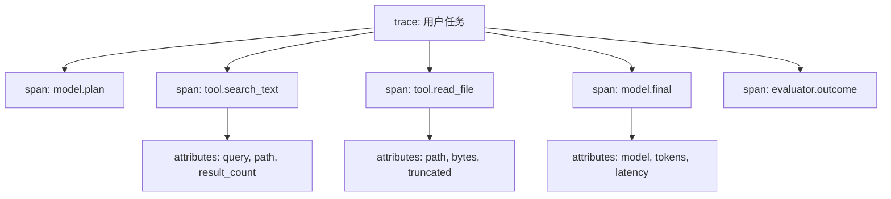
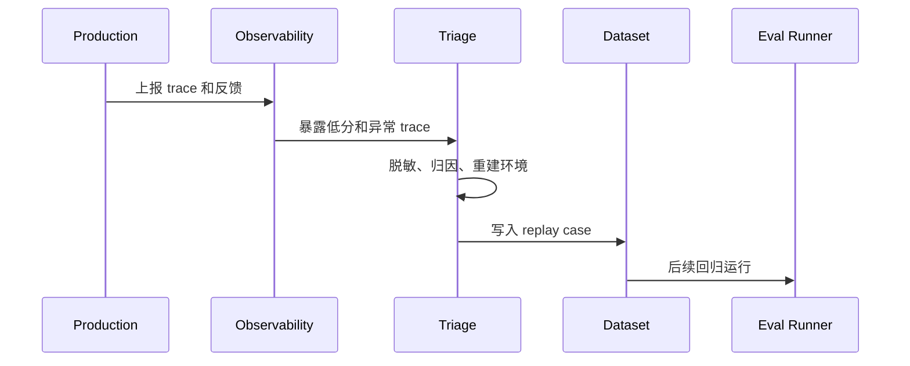

# Agent可观测性

## 1. 可观测性是评估数据来源

### 1.1 背景

Agent 失败后，如果只能看到最终回答，就很难定位问题。它可能是模型理解错误、工具参数错误、检索漏召回、权限拒绝、状态污染、记忆冲突、成本超预算或外部系统超时。可观测性要把这些行为记录成 trace 和 span，支撑调试、评测、告警和线上回流。

OpenTelemetry GenAI 语义约定提供了模型调用、提示、响应、token、系统、操作等通用属性。Agent 系统可以在此基础上扩展 tool call、retrieval、memory、policy、handoff 和 evaluator span。

### 1.2 可观测对象

| 对象 | 记录内容 |
| --- | --- |
| Session | 用户、应用、入口、任务目标 |
| Model Call | 模型、输入输出 token、延迟、错误 |
| Tool Call | 工具名、参数摘要、结果、耗时 |
| Retrieval | query、命中文档、分数、引用 |
| Memory | 检索记忆、写入记忆、冲突 |
| Policy | 权限判断、安全拦截 |
| Handoff | 转交原因、接收方、状态 |
| Evaluator | 分数、失败类型、rubric 版本 |

这些对象要通过同一个 trace id 串起来。否则模型日志、工具日志和评测结果会分散在不同系统中。

## 2. Trace 结构

### 2.1 Span 树



Trace 要能回答四个问题：Agent 看到了什么，做了什么，外部系统返回什么，结果如何被评价。每个 span 都应包含开始时间、结束时间、状态和关键属性。

### 2.2 Span 示例

```json
{
  "trace_id": "tr_001",
  "span_id": "sp_tool_002",
  "name": "tool.search_text",
  "attributes": {
    "agent.tool.name": "search_text",
    "agent.tool.args.query": "redirectAfterLogin",
    "agent.tool.result_count": 3,
    "agent.tool.truncated": false,
    "gen_ai.operation.name": "tool_call"
  },
  "duration_ms": 42,
  "status": "ok"
}
```

敏感参数不能明文记录。可以记录摘要、哈希、字段类型和长度，并把原始内容放在受控存储中。

## 3. 仪表盘与告警

### 3.1 核心视图

| 视图 | 关注点 |
| --- | --- |
| 质量趋势 | 成功率、评分、失败类型 |
| 工具健康 | 错误率、延迟、重试、超时 |
| 成本延迟 | token、模型调用次数、P95/P99 |
| 检索质量 | 命中率、引用覆盖、空召回 |
| 安全策略 | 拦截、越权尝试、注入样本 |
| Trace 完整率 | span 缺失和日志关联失败 |

仪表盘要能 drill down 到单条 trace。趋势图只能提示异常，根因仍要回到具体轨迹。

### 3.2 告警示例

```json
{
  "alert": "tool_error_rate_high",
  "condition": "tool.search_text.error_rate > 0.05 for 10m",
  "labels": {
    "tool": "search_text",
    "env": "prod"
  },
  "action": "route_to_agent_runtime_owner"
}
```

告警规则要避免过多噪声。优先覆盖安全违规、工具大面积失败、成本异常、延迟异常和 trace 缺失。

## 4. 线上回流

### 4.1 从 trace 到 eval



可观测性和评估要形成闭环。线上失败被捕获后，经过脱敏和环境重建，进入 Replay Suite，成为以后发布前必须跑的样本。

## 参考资料

- [OpenTelemetry GenAI Semantic Conventions](https://opentelemetry.io/docs/specs/semconv/registry/attributes/gen-ai/)
- [LangSmith Observability](https://docs.smith.langchain.com/observability)
- [Arize Phoenix](https://docs.arize.com/phoenix)
- [Langfuse](https://langfuse.com/docs)
