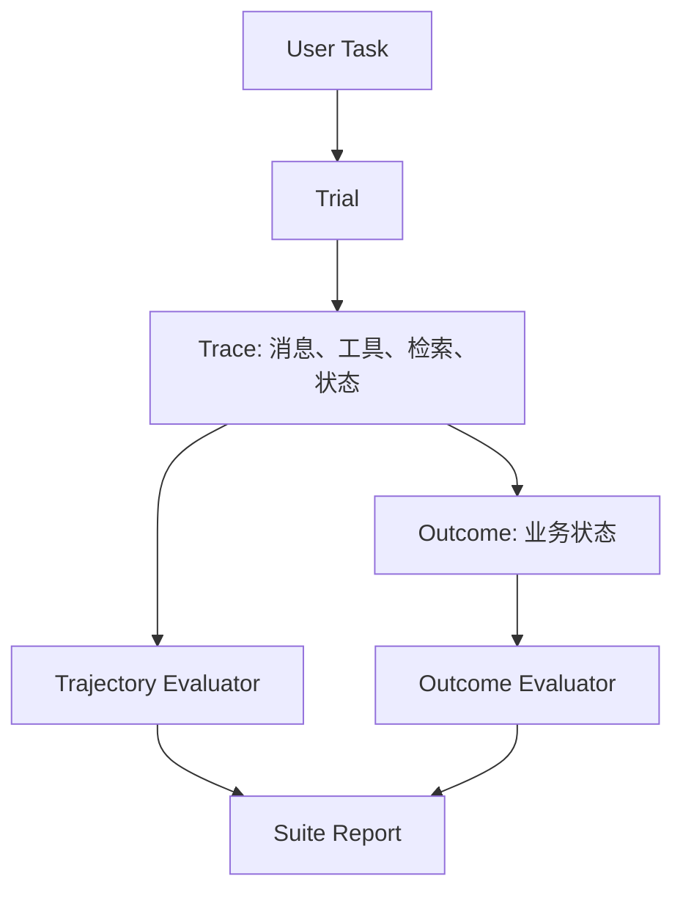
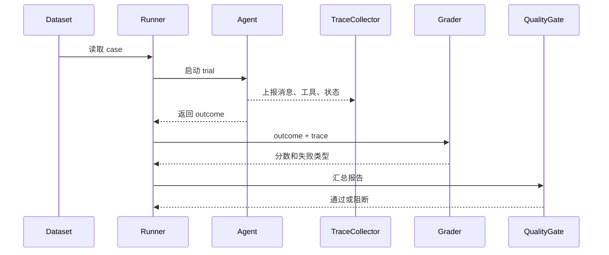

# Agent评估总览

## 1. 从模型评测到应用评测

### 1.1 背景

传统 LLM 评测常围绕单轮输入和单轮输出展开，例如答案是否正确、文本是否符合格式。Agent 运行时会理解目标、维护状态、调用工具、读取或修改外部系统，并在多轮交互中完成任务。失败可能发生在最终回答，也可能发生在工具选择、参数、权限、检索、状态更新、成本、延迟或人工接管。

因此，Agent 评估要从“文本输出”扩展为“完整应用行为”。本地评测报告把核心对象整理为 Task、Trial、Trace、Outcome、Evaluator 和 Evaluation Suite，这套术语能覆盖离线评测、线上回放和发布门禁。

### 1.2 核心对象

| 概念 | 含义 | 评估用途 |
| --- | --- | --- |
| Task / Case | 一个具体业务任务或测试用例 | 定义输入、环境和成功条件 |
| Trial | Agent 对某个任务的一次尝试 | 处理非确定性和 pass@k |
| Trace / Trajectory | 一次尝试的完整轨迹 | 分析工具、检索、状态和错误 |
| Outcome | 任务结束后的业务结果 | 判断目标是否完成 |
| Evaluator | 评分逻辑 | 代码、规则、LLM Judge、人工 |
| Evaluation Suite | 一组相关任务 | 回归、能力、安全和回放 |

这些对象让评估从最终答案扩展到过程和状态。代码 Agent 最终回答“已修复”没有意义，必须看测试是否通过、补丁是否正确、是否引入回归。

## 2. 评估对象的层次

### 2.1 四层评估



Outcome 评估回答“任务最后有没有成功”，Trajectory 评估回答“过程是否合规且高效”。一个 Agent 可能最终成功，但过程中调用了无关工具、泄露了上下文或成本过高，这些都应进入评估。

### 2.2 指标分层

| 层次 | 指标示例 | 数据来源 |
| --- | --- | --- |
| 业务完成 | 成功率、关键状态正确率 | 环境状态、测试结果 |
| 工具行为 | 工具选择准确率、参数合法率 | tool span |
| 检索证据 | 召回率、引用覆盖、来源可信 | retrieval span |
| 策略合规 | 权限、隐私、安全规则 | policy span |
| 成本性能 | token、调用次数、P95 延迟 | metrics |
| 可恢复性 | 重试成功率、人工接管率 | trace |

多层指标有助于定位失败。只看总成功率，无法知道问题来自模型、工具、检索还是业务环境。

## 3. 非确定性与多次尝试

### 3.1 pass@k 与 pass^k

Agent 具有非确定性。同一个任务在不同采样、不同工具延迟或不同上下文压缩下，可能成功也可能失败。评估时可以运行多次 Trial。

| 指标 | 含义 | 使用场景 |
| --- | --- | --- |
| pass@k | k 次尝试中至少一次成功 | 衡量探索能力 |
| pass^k | k 次尝试全部成功 | 衡量稳定性 |
| avg cost | 多次尝试平均成本 | 衡量单位经济性 |
| variance | 成功率和成本波动 | 衡量可预测性 |

生产门禁更关注稳定性。一个任务 pass@5 很高但 pass^5 很低，说明 Agent 偶尔能做成，但用户每次使用时可靠性不足。

### 3.2 运行结构

```json
{
  "case_id": "code_fix_001",
  "trials": [
    {"trial_id": "t1", "passed": true, "cost": 0.42},
    {"trial_id": "t2", "passed": false, "error_type": "test_failed"}
  ],
  "summary": {
    "pass_at_2": true,
    "pass_2": false
  }
}
```

记录 Trial 级结果可以支持模型版本对比、prompt 回归和工具变更分析。

## 4. 评估体系落地

### 4.1 Suite 分层

| Suite | 目标 | 运行时机 |
| --- | --- | --- |
| Smoke | 验证服务、工具和 trace 可用 | 每次提交 |
| Regression | 防止已掌握能力倒退 | PR、模型升级 |
| Capability | 衡量新能力爬坡 | nightly 或版本评审 |
| Safety | 检查越权、注入、隐私风险 | 发布前 |
| Replay | 复现线上失败 | 事故后和每周 |
| Load | 验证并发和长任务可靠性 | 发布前或容量规划 |

Capability 用例稳定后，可以迁移到 Regression。线上事故和高影响失败应进入 Replay 或 Safety。

### 4.2 最小评估循环



评估框架的产出不只是分数，还要给出失败类型和可复现 trace。这样开发者才能把失败转成修复任务。

## 参考资料

- [Anthropic: Demystifying evals for AI agents](https://www.anthropic.com/engineering/demystifying-evals-for-ai-agents)
- [OpenAI Evals](https://github.com/openai/evals)
- [LangSmith Evaluation](https://docs.smith.langchain.com/evaluation)
- [SWE-bench](https://www.swebench.com/)
