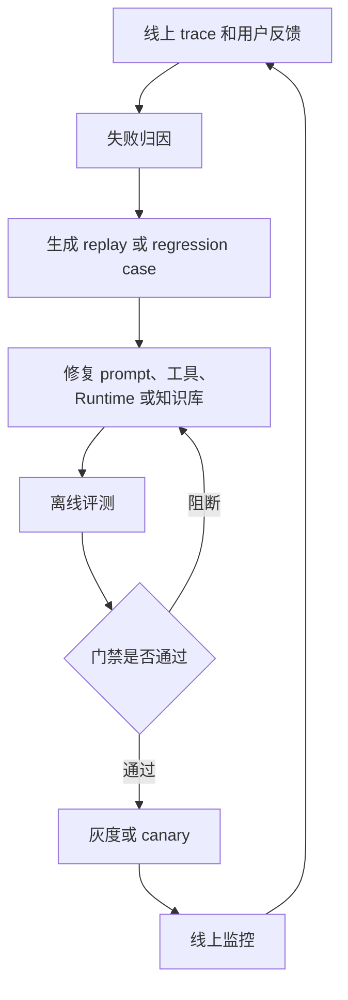
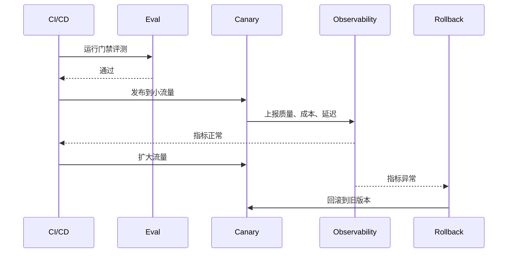

# 反馈闭环与发布门禁

## 1. 从线上反馈到可发布版本

### 1.1 背景

Agent 上线后，真实用户、真实工具和真实业务状态会暴露离线评测覆盖不到的问题。反馈闭环要把线上失败变成可复现用例，再通过修复、评测和灰度验证进入新版本。发布门禁则负责在变更进入生产前阻断高风险回归。

闭环的关键是把反馈转成工程对象：trace、失败类型、case、评分器、修复版本和发布结果。只有这样，团队才能持续积累能力。

### 1.2 闭环流程



每次线上事故都应留下可回放样本。否则同类问题可能在下次模型或 prompt 更新后再次出现。

## 2. 失败归因

### 2.1 归因维度

| 失败类型 | 例子 | 修复方向 |
| --- | --- | --- |
| 意图理解 | 用户要退款，Agent 查物流 | 意图分类和澄清 |
| 工具选择 | 应读取文件却直接写入 | 工具描述、阶段权限 |
| 参数错误 | 传错订单号或路径 | schema 和字段级反馈 |
| 检索失败 | 没召回关键文档 | 索引、query 改写、重排 |
| 策略违规 | 越权访问或隐私泄露 | policy 和权限 |
| 状态错误 | 旧记忆污染当前任务 | 记忆过滤和冲突处理 |
| 成本延迟 | 循环调用模型 | 预算和终止条件 |

归因要基于 trace。没有 trace 的反馈只能作为线索，不能直接变成可复现回归。

### 2.2 归因记录

```json
{
  "incident_id": "inc_20260624_01",
  "trace_id": "tr_001",
  "failure_type": "tool_argument_error",
  "impact": "P1",
  "root_cause": "模型把用户输入中的临时编号当成订单号。",
  "fix_plan": "增加订单号格式校验，并在 validation_error 时请求用户确认。",
  "target_suite": "regression"
}
```

归因记录应进入版本管理。后续门禁失败时，可以看到它对应哪次事故。

## 3. 发布门禁

### 3.1 分层门禁

| 门禁层 | 检查内容 | 阻断条件 |
| --- | --- | --- |
| Smoke | 服务、工具、trace 基础可用 | 核心链路失败 |
| Safety | 权限、隐私、注入、危险动作 | 任一高风险违规 |
| Regression | 已稳定能力 | 关键 case 失败 |
| Replay | 线上事故复现样本 | 事故样本未修复 |
| Cost/Latency | 成本和延迟 | 超过预算阈值 |
| Observability | trace 完整率 | 无法审计 |

门禁顺序很重要。安全和 trace 缺失应先阻断，因为它们会影响后续评估可信度。

### 3.2 Canary 与回滚



Canary 期间要比较新旧版本的成功率、人工接管率、成本和失败类型。只看请求错误率不足以判断 Agent 质量。

## 4. AgentOps 路线

### 4.1 成熟度阶段

| 阶段 | 能力 | 目标 |
| --- | --- | --- |
| 0-4 周 | 最小评测集、基础 trace、手工报告 | 找到高频失败 |
| 1-3 个月 | CI 门禁、线上 trace 回流、Replay Suite | 防止回归 |
| 3-6 个月 | 自动化评测平台、仪表盘、灰度 | 稳定发布 |
| 6-12 个月 | 多 Agent 评估、成本治理、自动归因 | 规模化运营 |

路线不需要一次完成。先让线上失败能被看见、能被复现、能被阻断，再逐步扩大覆盖。

## 参考资料

- [Anthropic: Demystifying evals for AI agents](https://www.anthropic.com/engineering/demystifying-evals-for-ai-agents)
- [LangSmith Evaluation](https://docs.smith.langchain.com/evaluation)
- [OpenTelemetry GenAI Semantic Conventions](https://opentelemetry.io/docs/specs/semconv/registry/attributes/gen-ai/)
- [AWS: Evaluating deep agents using LangSmith](https://aws.amazon.com/blogs/machine-learning/evaluating-deep-agents-using-langsmith-on-aws/)
