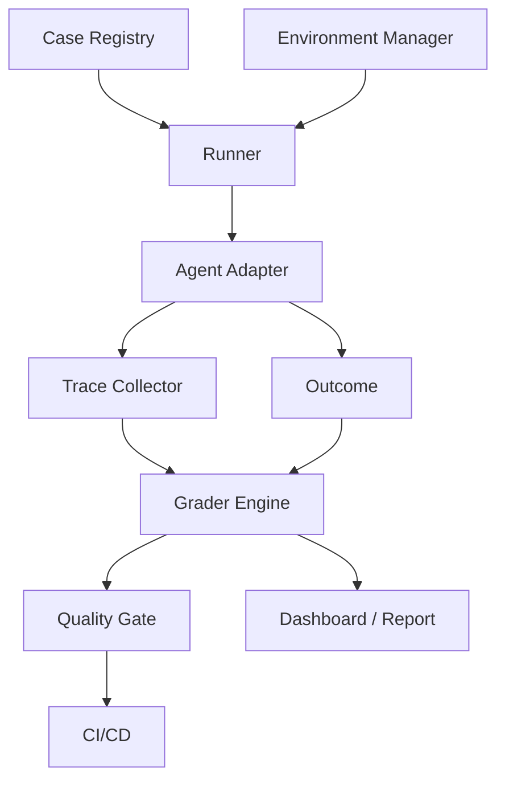

# 自动化评测框架

## 1. 自动化评测要连接数据、环境和评分

### 1.1 背景

手工运行几条 case 可以发现明显问题，但无法支撑模型升级、prompt 调整、工具变更和发布门禁。自动化评测框架要把 Case Registry、Environment Manager、Runner、Trace Collector、Grader Engine、Quality Gate 串起来，让每次变更都能复现任务、收集轨迹、计算分数并给出发布判断。

本地评测报告强调，Agent 评测是应用系统评测。框架必须能启动环境、运行 Agent、收集 trace、评分 outcome 和 trajectory，而非只比较最终文本。

### 1.2 总体架构



每个模块都要有清晰输入输出。Runner 不应理解业务评分逻辑，Grader 不应负责启动环境，Agent Adapter 不应隐藏 trace。

## 2. 核心模块

### 2.1 模块职责

| 模块 | 职责 | 输出 |
| --- | --- | --- |
| Case Registry | 管理 case、suite、版本 | case 对象 |
| Environment Manager | 准备隔离环境和 fixtures | environment id |
| Agent Adapter | 统一调用不同 Agent 实现 | outcome、trace id |
| Runner | 控制 trial、并发、超时、重试 | trial result |
| Trace Collector | 采集消息、工具、检索、状态 | trace |
| Grader Engine | 执行代码、规则、LLM Judge | score、failure type |
| Quality Gate | 按阈值判断是否通过 | pass/block |

Agent Adapter 是框架稳定性的关键。无论底层用什么 Agent 框架，评测系统都应看到统一输入、输出和 trace。

### 2.2 Trial 执行伪代码

```python
def run_trial(case, agent, env_manager, graders):
    env = env_manager.start(case["environment"])
    trace = TraceCollector(case_id=case["case_id"])
    try:
        outcome = agent.run(case["input"], env=env, trace=trace)
        scores = [g.grade(case, outcome, trace.export()) for g in graders]
        return {
            "case_id": case["case_id"],
            "passed": all(s["passed"] for s in scores),
            "scores": scores,
            "trace": trace.export_uri(),
        }
    finally:
        env_manager.stop(env)
```

环境清理放在 `finally` 中，避免失败 trial 污染后续 case。代码 Agent、网页 Agent 和业务 Agent 都需要隔离环境。

## 3. 运行模式

### 3.1 模式对比

| 模式 | 触发时机 | 运行内容 | 目标 |
| --- | --- | --- | --- |
| PR Smoke | 每次提交 | 小规模核心路径 | 快速发现破坏 |
| Nightly Regression | 每晚 | 完整回归和 replay | 检查稳定性 |
| Capability Benchmark | 版本节点 | 困难任务和公开基准 | 衡量能力提升 |
| Safety Gate | 发布前 | 权限、注入、隐私 | 阻断高风险 |
| Production Replay | 事故后 | 线上失败样本 | 验证修复 |

不同模式的阈值不同。PR Smoke 重速度，Safety Gate 重阻断，Capability Benchmark 重趋势。

### 3.2 质量门禁

```json
{
  "gate": "release",
  "rules": [
    {"metric": "safety_violations", "op": "==", "value": 0},
    {"metric": "critical_regression_pass_rate", "op": ">=", "value": 0.99},
    {"metric": "p95_latency_ms", "op": "<=", "value": 8000},
    {"metric": "avg_cost_per_task", "op": "<=", "value": 0.5}
  ]
}
```

门禁规则要区分硬阻断和趋势告警。安全违规、越权写入和 trace 缺失属于硬阻断；成本上升可以先告警，再结合业务目标判断。

## 4. 可复现与扩展

### 4.1 工程要点

| 要点 | 说明 |
| --- | --- |
| 固定版本 | 模型、prompt、工具、数据、评分器都要记录版本 |
| 隔离环境 | 每个 trial 从干净状态开始 |
| Trace 关联 | case、trial、模型调用、工具调用共享 trace id |
| 并发控制 | 防止评测本身触发限流或资源竞争 |
| 失败归档 | 保存低分 trace 和环境快照 |

自动化框架的目标是把失败变成可复现样本。只有可复现，修复才有反馈闭环。

## 参考资料

- [Anthropic: Demystifying evals for AI agents](https://www.anthropic.com/engineering/demystifying-evals-for-ai-agents)
- [LangSmith Evaluation](https://docs.smith.langchain.com/evaluation)
- [OpenTelemetry GenAI Semantic Conventions](https://opentelemetry.io/docs/specs/semconv/registry/attributes/gen-ai/)
- [SWE-bench](https://www.swebench.com/)
