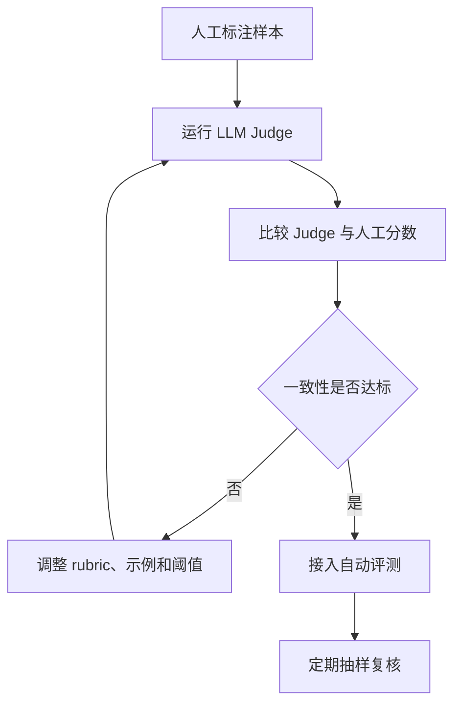

# 评测指标与评分器

## 1. 指标要覆盖结果和过程

### 1.1 背景

Agent 的最终回答只是结果的一部分。它可能生成正确答案，但使用了错误来源；也可能完成工具操作，却违反权限策略；还可能成功完成任务，但成本和延迟无法接受。评测指标要同时覆盖 outcome、trajectory、policy、retrieval、cost 和 latency。

指标设计要贴近业务。客服 Agent 关注任务完成、政策合规和人工接管；代码 Agent 关注测试通过、补丁范围和回归风险；网页 Agent 关注页面状态和操作路径。

### 1.2 指标分层

| 指标类别 | 示例 | 适用 Agent |
| --- | --- | --- |
| 业务完成 | 订单状态正确、代码测试通过 | 全部 |
| 工具使用 | 工具选择、参数合法、调用次数 | 工具型 Agent |
| 检索质量 | 召回、引用覆盖、来源可靠 | RAG/研究 Agent |
| 策略合规 | 权限、隐私、业务政策 | 企业 Agent |
| 成本延迟 | token、模型调用数、P95 | 生产 Agent |
| 可恢复性 | 重试、澄清、人工接管 | 长任务 Agent |

评估报告应同时展示总分和分项。总分下降时，分项可以帮助定位问题。

## 2. 评分器类型

### 2.1 对比

| 评分器 | 机制 | 优点 | 局限 |
| --- | --- | --- | --- |
| 代码评分器 | 用程序检查 outcome | 稳定、可复现 | 需要可判定结果 |
| 规则评分器 | 检查字段、策略、轨迹 | 适合合规和工具行为 | 规则维护成本 |
| LLM Judge | 用模型评价文本或轨迹 | 适合开放输出 | 需要校准和抽样复核 |
| 人工评分 | 专家审核 | 高可信 | 成本高、速度慢 |
| 混合评分 | 多个评分器组合 | 覆盖更全 | 需要权重和冲突处理 |

代码评分器优先用于有确定答案的任务，例如测试是否通过、数据库状态是否正确。LLM Judge 适合开放写作、客服对话和复杂归因，但要用人工样本校准。

### 2.2 评分器结构

```python
def grade_code_fix(case, outcome, trace):
    return {
        "passed": (
            outcome["tests"]["fail_to_pass"] is True
            and outcome["tests"]["pass_to_pass"] is True
            and no_forbidden_files_changed(trace)
        ),
        "scores": {
            "test": 1.0 if outcome["tests"]["fail_to_pass"] else 0.0,
            "scope": 1.0 if no_forbidden_files_changed(trace) else 0.0,
            "tool": score_tool_sequence(trace),
        },
        "failure_type": infer_failure_type(outcome, trace),
    }
```

评分器要返回通过与否、分项分数和失败类型。失败类型用于后续聚类、回放和修复。

## 3. LLM Judge 的校准

### 3.1 使用边界

LLM Judge 适合判断开放文本质量、客服语气、总结完整性和复杂轨迹解释。它不适合替代权限检查、数据库状态检查和测试结果检查。确定性信息优先用代码或规则评估。

```json
{
  "rubric": [
    "回答是否只基于提供证据",
    "是否指出资料不足之处",
    "是否包含可验证来源",
    "是否避免越权建议"
  ],
  "scale": "0-4",
  "require_rationale": true
}
```

评分提示要写成可执行 rubric，并要求 Judge 引用证据。对于发布门禁，建议抽样人工复核 Judge 的一致性。

### 3.2 校准流程



LLM Judge 的输出要保存版本。模型、rubric 或阈值变化后，历史分数需要可追溯。

## 4. 指标组合与门禁

### 4.1 组合方式

| 组合方式 | 适用场景 | 说明 |
| --- | --- | --- |
| 硬阻断 | 安全、权限、财务 | 出现一次即阻断 |
| 加权平均 | 内容质量、多维体验 | 分项可折中 |
| 分层门禁 | 先安全，再质量，再成本 | 避免高风险被平均掩盖 |
| 趋势监控 | 线上质量和成本 | 看版本变化 |

高风险指标不应被平均分稀释。例如越权写操作、隐私泄露和关键业务状态错误，应直接阻断发布。

## 参考资料

- [Anthropic: Demystifying evals for AI agents](https://www.anthropic.com/engineering/demystifying-evals-for-ai-agents)
- [OpenAI Evals](https://github.com/openai/evals)
- [LangSmith Evaluation](https://docs.smith.langchain.com/evaluation)
- [tau-bench](https://github.com/sierra-research/tau-bench)
