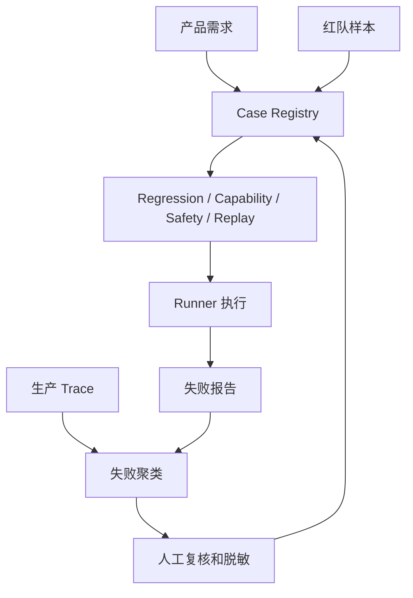

# 评测数据集建设

## 1. 数据集是持续工程资产

### 1.1 背景

Agent 评测数据集不能只是一批问答样本。真实任务包含用户目标、初始环境、可用工具、权限、成功条件、风险边界和期望业务状态。数据集建设的难点在于把这些业务语义稳定表达出来，并随着线上失败持续更新。

高质量数据来自产品需求、真实 trace、客服工单、运营反馈、红队样本、历史 bug、模拟用户和合成对抗样本。每条样本都要能复现，否则失败无法修复。

### 1.2 Case 结构

```json
{
  "case_id": "refund_001",
  "suite": "regression",
  "input": {
    "user_message": "帮我查询订单 2026-A17 能不能退款"
  },
  "environment": {
    "fixtures": ["orders_seed.json"],
    "permissions": ["order.read"]
  },
  "expected": {
    "outcome": "returns_policy_explained",
    "must_not_call": ["refund.create"]
  },
  "risk": "medium",
  "source": "production_trace"
}
```

Case 要描述环境和限制。没有 fixtures、权限和禁止动作，评测很难发现工具误用。

## 2. 数据集分层

### 2.1 Suite 类型

| Suite | 来源 | 目标 | 运行时机 |
| --- | --- | --- | --- |
| Smoke | 核心路径手工编写 | 验证系统可用 | 每次提交 |
| Regression | 稳定能力和线上事故 | 防止倒退 | PR 和发布前 |
| Capability | 新需求和困难任务 | 衡量能力提升 | nightly |
| Safety | 红队和策略边界 | 阻断高风险 | 发布前 |
| Replay | 生产失败 trace | 验证修复 | 事故后 |
| Calibration | 人工标注样本 | 校准 LLM Judge | 定期 |

Capability 可以随系统成熟迁移到 Regression。Replay 让线上失败进入持续改进流程。

### 2.2 数据流



生产 trace 不能直接进入数据集。需要脱敏、裁剪、环境重建和成功条件定义。

## 3. 数据质量控制

### 3.1 常见问题

| 问题 | 表现 | 处理方式 |
| --- | --- | --- |
| 样本不可复现 | 同一 case 多次结果不一致 | 固定环境和数据版本 |
| 成功条件模糊 | 评分器无法判断 | 定义 outcome 和禁止动作 |
| 数据泄露 | 训练或提示中见过答案 | 隔离评测集和开发样本 |
| 分布偏移 | 离线高分线上低分 | trace 回流和分布对比 |
| 样本饱和 | 全部通过，无改进信号 | 增加 capability 和对抗样本 |

数据集要记录来源、版本和最后复核时间。业务政策变化后，旧样本可能需要更新。

### 3.2 样本审核流程

```python
def validate_case(case):
    required = ["case_id", "suite", "input", "environment", "expected", "source"]
    missing = [k for k in required if k not in case]
    if missing:
        return {"ok": False, "error": f"missing fields: {missing}"}
    if "outcome" not in case["expected"]:
        return {"ok": False, "error": "expected.outcome required"}
    return {"ok": True}
```

最小审核器先保证字段完整。成熟后可加入环境可启动、评分器可运行、敏感内容检测和重复样本识别。

## 4. 真实 trace 回流

### 4.1 回流步骤

| 步骤 | 说明 |
| --- | --- |
| 识别失败 | 低分、投诉、人工接管、异常成本 |
| 聚类归因 | 按工具、策略、检索、模型错误分类 |
| 脱敏裁剪 | 移除 PII 和无关上下文 |
| 重建环境 | 固定数据库、文件、工具返回 |
| 定义评分 | 写 outcome 和 trajectory 评分器 |
| 加入 suite | 进入 replay 或 regression |

回流的关键是可复现。只有能在离线环境重现的失败，才能稳定验证修复。

## 参考资料

- [Anthropic: Demystifying evals for AI agents](https://www.anthropic.com/engineering/demystifying-evals-for-ai-agents)
- [SWE-bench](https://www.swebench.com/)
- [WebArena](https://webarena.dev/)
- [tau-bench](https://github.com/sierra-research/tau-bench)
