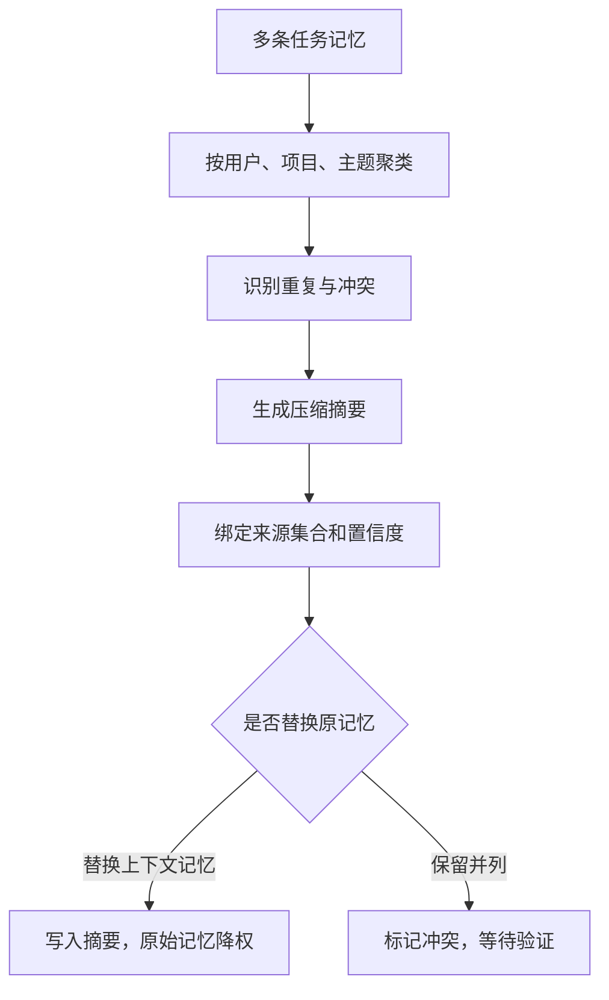

# 记忆压缩与更新

## 1. 长期记忆的膨胀来源

### 1.1 背景

Agent 运行时间越久，trace、偏好、事实和失败经验越多。如果只追加不整理，检索结果会变慢、噪声会增加，旧事实会和新事实冲突。记忆压缩与更新要解决长期运行后的维护问题：合并重复内容，降权过期内容，处理冲突，把大量情节记忆总结成可复用语义。

Generative Agents 使用反思把大量观察总结成更高层次的记忆；MemGPT 使用分层内存和显式迁移缓解上下文压力。工程系统可以把这些思想落到压缩、合并、过期和版本控制上。

### 1.2 何时压缩

| 触发条件 | 说明 | 动作 |
| --- | --- | --- |
| 同类记忆过多 | 同一项目多条相似事实 | 合并为一条带来源集合的语义记忆 |
| 检索噪声上升 | 高相关结果里无关项变多 | 降权低质量记忆 |
| 事实冲突 | 新旧信息不一致 | 标记冲突并等待验证 |
| trace 归档 | 任务结束后一段时间 | 抽取摘要并归档原始轨迹 |
| 用户纠错 | 用户明确否定旧偏好 | 更新或删除旧记忆 |

压缩不应丢失审计来源。摘要可以进入上下文，原始 trace 仍要保留在可追溯存储中。

## 2. 压缩流程

### 2.1 从情节到语义



压缩结果应写明来源集合，避免只保存一段总结。这样后续发现摘要错误时，可以回到原始任务轨迹。

### 2.2 压缩对象结构

```json
{
  "type": "semantic",
  "content": "liyyro 文档站点使用 VitePress，Agent 文档改动后需要运行 npm run docs:build。",
  "sources": ["tr_001", "tr_014", "tr_019"],
  "confidence": 0.93,
  "supersedes": ["mem_011", "mem_018"],
  "last_verified_at": "2026-06-24T12:30:00+08:00"
}
```

`supersedes` 表示这条摘要替代了旧记忆在上下文中的优先级，旧记忆可以保留用于审计，但检索排序降低。

## 3. 更新与冲突处理

### 3.1 更新策略

```python
def upsert_memory(new_memory, store):
    existing = store.find_similar(
        namespace=new_memory["namespace"],
        memory_type=new_memory["type"],
        text=new_memory["content"],
        limit=5,
    )

    conflict = detect_conflict(new_memory, existing)
    if conflict:
        return store.mark_conflict(new_memory, conflict)

    duplicate = find_duplicate(new_memory, existing)
    if duplicate:
        return store.merge_sources(duplicate["id"], new_memory["source"])

    return store.insert(new_memory)
```

更新不能只做向量相似去重。相似文本可能表达相反事实，例如“项目使用 VuePress”和“项目迁移到 VitePress”。冲突检测要结合实体、属性、时间和来源。

### 3.2 冲突状态

| 状态 | 含义 | 后续动作 |
| --- | --- | --- |
| active | 当前可用 | 可进入上下文 |
| superseded | 被新记忆替代 | 降权，保留审计 |
| conflict | 与其他记忆冲突 | 不直接用于事实回答 |
| expired | 已过期 | 默认不召回 |
| deleted | 用户要求删除 | 物理删除或合规擦除 |

冲突记忆进入上下文会制造不稳定输出。Runtime 应阻止未解决冲突作为事实依据使用，必要时向用户或工具请求验证。

## 4. 评估压缩质量

### 4.1 指标

| 指标 | 含义 | 检查方式 |
| --- | --- | --- |
| 信息保留率 | 摘要是否保留关键事实 | 人工对照来源 |
| 噪声降低 | 检索结果是否更聚焦 | 检索评测集 |
| 冲突发现率 | 新旧矛盾是否被标记 | 合成冲突样本 |
| 可追溯率 | 摘要能否回到来源 | source 字段检查 |
| 用户纠错恢复 | 用户纠正后是否生效 | 回放测试 |

记忆压缩的底线是不能把未经验证的总结伪装成事实。压缩后的内容必须带来源、置信度和更新时间。

## 参考资料

- [Generative Agents](https://arxiv.org/abs/2304.03442)
- [MemGPT](https://arxiv.org/abs/2310.08560)
- [LangGraph Memory](https://docs.langchain.com/oss/python/langgraph/memory)
- [LangGraph Persistence](https://docs.langchain.com/oss/python/langgraph/persistence)
