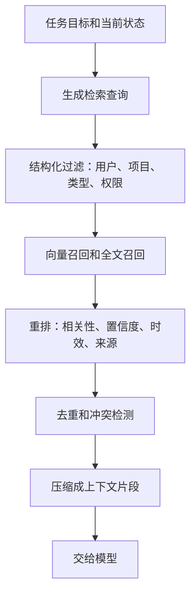

# 记忆存储与检索

## 1. 存储层如何服务 Agent

### 1.1 背景

记忆抽取后，需要存到可检索、可更新、可审计的系统里。很多原型直接把记忆写入向量库，但长期运行后会遇到权限隔离、重复记忆、事实冲突、过期、召回噪声和来源追溯问题。Agent 记忆存储要同时支持语义召回和结构化过滤。

一个可用的记忆系统通常包含三类索引：向量索引用于语义相似召回，结构化字段用于用户、项目、类型、权限和时间过滤，全文索引用于精确词匹配。单一向量检索很难覆盖所有需求。

### 1.2 数据模型

```json
{
  "id": "mem_001",
  "namespace": "user:liys05/project:liyyro",
  "type": "semantic",
  "content": "liyyro 项目使用 VitePress 构建文档站点。",
  "embedding": [0.01, 0.02],
  "source": {"trace_id": "tr_001", "path": "package.json"},
  "confidence": 0.95,
  "created_at": "2026-06-24T10:00:00+08:00",
  "expires_at": null,
  "tags": ["docs", "vitepress"]
}
```

`namespace` 决定隔离边界，`type` 决定检索和使用方式，`source` 支持复核，`confidence` 和 `expires_at` 支持排序和清理。

## 2. 检索流程

### 2.1 多阶段检索



先过滤再召回，可以减少跨用户和跨项目泄露。重排时不能只看向量相似度，还要考虑记忆类型、更新时间、置信度和来源可信度。

### 2.2 检索伪代码

```python
def retrieve_memories(query, user_id, project_id, memory_type=None, limit=5):
    filters = {
        "namespace": f"user:{user_id}/project:{project_id}",
        "not_expired": True,
    }
    if memory_type:
        filters["type"] = memory_type

    candidates = vector_store.search(query, filters=filters, limit=30)
    ranked = sorted(
        candidates,
        key=lambda m: (m.score, m.confidence, freshness_score(m)),
        reverse=True,
    )

    return dedupe_and_clip(ranked, limit=limit)
```

检索函数必须接收用户和项目边界。若只传 query，长期记忆很容易出现权限串扰。

## 3. 存储方案对比

### 3.1 方案选择

| 方案 | 优点 | 局限 | 适用场景 |
| --- | --- | --- | --- |
| 关系型数据库 | 事务、权限、结构化过滤强 | 语义召回需要扩展 | 偏好、事实、审计 |
| 向量数据库 | 相似召回方便 | 冲突和权限需要额外设计 | 语义记忆、情节记忆 |
| 文档数据库 | 存储灵活 | 查询和一致性要设计 | 复杂元数据 |
| 混合检索 | 结构化过滤 + 向量 + 全文 | 实现复杂 | 生产长期记忆 |

生产系统更常见的是混合方案：关系型数据库保存元数据、权限和来源，向量索引保存 embedding，全文索引支持精确召回。

### 3.2 记忆进入上下文

检索结果不能原样塞入模型。Runtime 应把记忆压缩为少量上下文片段，并标注类型和来源。

```text
相关记忆：
1. [preference][source: tr_12] 用户偏好中文技术写作。
2. [semantic][source: package.json] 当前项目使用 VitePress 构建文档。
3. [reflection][source: eval_07] 修改文档后需要运行 docs:build。
```

这样的格式能让模型区分偏好、事实和经验。最终回答引用事实时，应优先引用原始来源。

## 4. 风险控制

### 4.1 常见失败

| 失败 | 表现 | 处理方式 |
| --- | --- | --- |
| 召回无关 | 相似文本挤占上下文 | 加类型过滤和重排 |
| 重复记忆 | 同一偏好写入多次 | 写入时做近似去重 |
| 冲突事实 | 新旧项目状态互相矛盾 | 标记冲突并请求验证 |
| 权限串扰 | 读到其他用户记忆 | namespace 强制过滤 |
| 过期污染 | 旧信息影响新任务 | TTL、版本、最近验证时间 |

记忆检索要服务任务，不应追求召回越多越好。少量可信、相关、可追溯的记忆更适合进入模型上下文。

## 参考资料

- [MemGPT](https://arxiv.org/abs/2310.08560)
- [LangGraph Memory](https://docs.langchain.com/oss/python/langgraph/memory)
- [LangGraph Persistence](https://docs.langchain.com/oss/python/langgraph/persistence)
- [pgvector](https://github.com/pgvector/pgvector)
