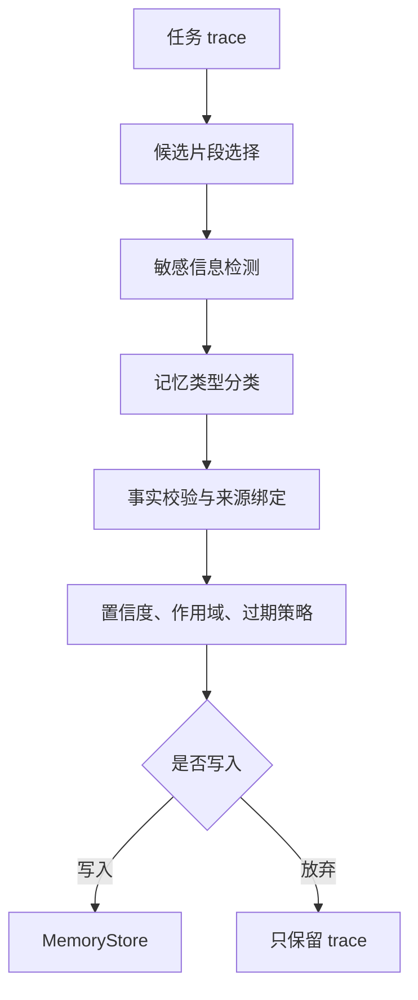

# 记忆抽取

## 1. 从 trace 中提取可复用信息

### 1.1 背景

Agent 运行后会留下大量轨迹：用户目标、工具调用、文件片段、错误、修复尝试、最终结果。并非每一段轨迹都值得写入长期记忆。记忆抽取要解决的问题是：从一次任务中找出稳定、可复用、被授权保存的信息，并给它们打上类型、来源、置信度和过期策略。

如果没有抽取层，系统容易把临时路径、一次性报错、未验证猜测和敏感内容都存进去。后续任务检索到这些内容，会把过去的噪声变成新的错误。

### 1.2 候选记忆来源

| 来源 | 可能抽取内容 | 风险 |
| --- | --- | --- |
| 用户显式陈述 | 偏好、项目背景、约束 | 可能只针对当前任务 |
| 工具结果 | 文件事实、业务数据 | 需要来源和权限 |
| 任务结果 | 成功路径、失败原因 | 需要验证结果支撑 |
| 人工反馈 | 纠错、偏好变更 | 需要覆盖旧记忆 |
| 评测 trace | 稳定失败模式 | 需要区分测试和生产 |

抽取层要区分“用户说了什么”和“系统推断了什么”。用户显式陈述的可信度通常更高，但也要看适用范围。

## 2. 抽取流程

### 2.1 管线



候选片段选择可以用规则、模型或混合方式。比如用户说“以后输出都用中文”，规则就能抽取偏好；工具结果里出现项目依赖版本，则需要来源绑定和后续验证。

### 2.2 抽取结果结构

```json
{
  "type": "preference",
  "subject": "user:liys05",
  "content": "技术文章输出使用中文，并优先使用表格做多方案对比。",
  "source": {
    "trace_id": "tr_20260624_001",
    "message_index": 2
  },
  "confidence": 0.92,
  "scope": "writing",
  "expires_at": null
}
```

记忆对象需要保留来源。后续如果用户改变偏好，系统可以找到旧记忆并覆盖或降权。

## 3. 最小抽取器

### 3.1 Python 伪代码

```python
SENSITIVE_KEYS = ["password", "token", "secret"]


def is_sensitive(text):
    lowered = text.lower()
    return any(k in lowered for k in SENSITIVE_KEYS)


def extract_memory(trace):
    memories = []
    for event in trace:
        if event["type"] != "user_message":
            continue

        text = event["content"]
        if is_sensitive(text):
            continue

        if "以后" in text and "中文" in text:
            memories.append({
                "type": "preference",
                "content": "用户偏好中文技术写作。",
                "source": event["id"],
                "confidence": 0.8,
                "scope": "writing",
            })

    return memories
```

这个示例很简单，但展示了抽取器的基本边界：只从明确事件中抽取，先做敏感信息过滤，再写入带类型和来源的对象。生产系统会加入模型抽取、规则校验、人工校准和冲突合并。

### 3.2 LLM 抽取提示

```json
{
  "instruction": "从输入中抽取可长期复用的用户偏好、项目事实或失败经验。只输出有来源支撑的信息。",
  "output_schema": {
    "type": "object",
    "properties": {
      "memories": {
        "type": "array",
        "items": {
          "type": "object",
          "properties": {
            "type": {"enum": ["preference", "semantic", "episodic", "reflection"]},
            "content": {"type": "string"},
            "source_event_id": {"type": "string"},
            "confidence": {"type": "number"}
          },
          "required": ["type", "content", "source_event_id", "confidence"]
        }
      }
    }
  }
}
```

使用模型抽取时，要让输出绑定来源事件，并设置“没有可写入内容时返回空数组”。否则模型容易把任务上下文总结成看似有用的长期记忆。

## 4. 质量控制

### 4.1 抽取评估

| 指标 | 含义 | 评估方式 |
| --- | --- | --- |
| 精确率 | 写入的记忆是否真的可复用 | 人工标注或规则检查 |
| 召回率 | 重要偏好和事实是否被漏掉 | 对照标注样本 |
| 来源完整率 | 每条记忆是否能回到 trace | 检查 source 字段 |
| 敏感过滤率 | 敏感内容是否被阻断 | 红队样本 |
| 冲突处理率 | 新旧记忆冲突是否可解释 | 回放用户纠错 |

记忆抽取追求少量高质量写入。一个错误长期记忆可能影响很多后续任务。

## 参考资料

- [MemGPT](https://arxiv.org/abs/2310.08560)
- [Generative Agents](https://arxiv.org/abs/2304.03442)
- [LangGraph Memory](https://docs.langchain.com/oss/python/langgraph/memory)
- [OpenAI Evals](https://github.com/openai/evals)
