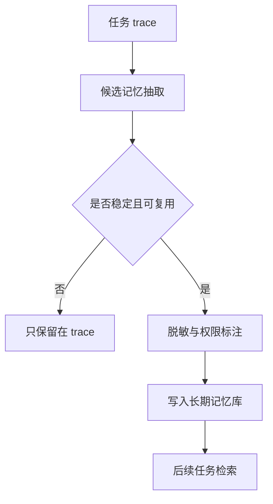
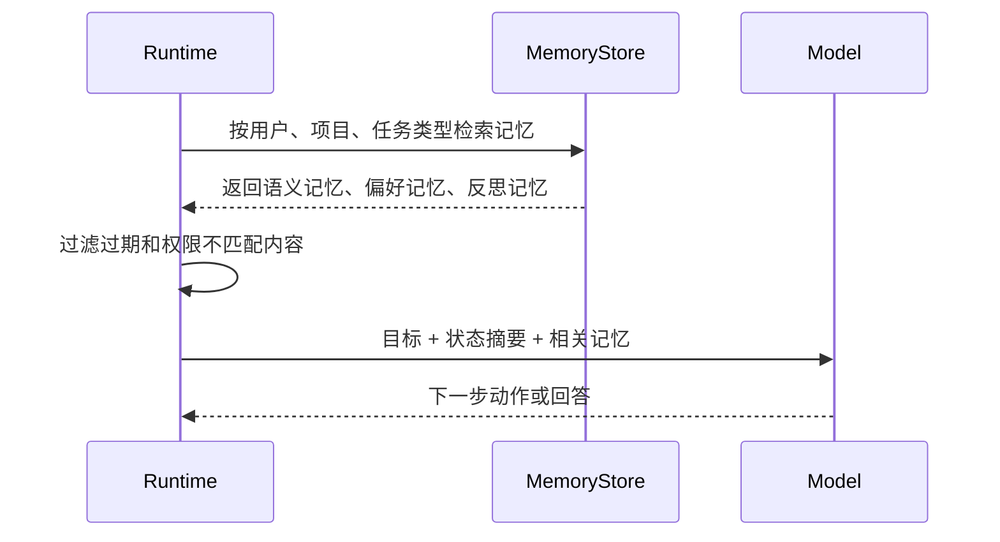

# 记忆类型

## 1. Agent 的记忆需求

### 1.1 背景

大模型上下文窗口可以保存一次会话里的内容，但 Agent 任务经常跨越多轮、多天、多工具和多个用户。只依赖当前上下文，会出现三个问题：早期信息被截断，用户偏好无法复用，任务过程中形成的经验无法沉淀。记忆机制把一部分上下文外置，让 Agent 在需要时检索和更新。

研究上，Generative Agents 用自然语言记忆、反思和计划构造长期行为；MemGPT 把内存分成类似主上下文和外部存储的层次；LangGraph 等框架则把线程状态、checkpoint 和长期 memory 分开。工程实现可以借鉴这些思想，但要先分清记忆类型。

### 1.2 记忆分类

| 类型 | 保存内容 | 生命周期 | 示例 |
| --- | --- | --- | --- |
| 工作记忆 | 当前任务状态、近期工具结果 | 单次任务 | 已读文件、当前计划、错误 |
| 情节记忆 | 过去发生过的事件和轨迹 | 多次任务 | 某次修复失败的原因 |
| 语义记忆 | 稳定知识和事实 | 长期 | 用户项目使用 PostgreSQL |
| 偏好记忆 | 用户习惯和输出偏好 | 长期 | 喜欢表格对比、需要中文 |
| 反思记忆 | 失败经验和策略修正 | 中长期 | 先跑最小测试再扩大修改 |

不同记忆的写入条件、检索方式和过期策略不同。把所有内容都丢进向量库，会导致检索噪声和隐私风险。

## 2. 工作记忆与长期记忆

### 2.1 工作记忆

工作记忆服务当前任务。它通常保存在 Runtime 状态中，包含目标、计划、工具调用、观察结果、预算、错误和证据。工作记忆强调可恢复和可追踪。

```json
{
  "goal": "整理 Agent 记忆文章",
  "plan_step": "compare_memory_types",
  "read_files": ["memory.md", "memgpt.md"],
  "evidence": [
    {"source": "memgpt.md", "claim": "内存层次可缓解上下文限制"}
  ],
  "turn": 4
}
```

工作记忆不一定进入长期存储。任务结束后，Runtime 应判断哪些内容有复用价值，哪些只适合保存在 trace 中。

### 2.2 长期记忆

长期记忆跨任务复用。它应按命名空间、用户、项目和权限隔离。写入前要判断内容是否稳定、是否得到用户授权、是否包含敏感数据、是否会过期。



长期记忆并不等于永久保存。偏好可能变化，项目事实可能过期，失败经验也可能随着工具升级失效。

## 3. 记忆类型如何影响实现

### 3.1 存储和检索差异

| 类型 | 推荐索引 | 检索触发 | 更新方式 |
| --- | --- | --- | --- |
| 工作记忆 | 内存状态、checkpoint | 每一轮 Agent 循环 | Runtime 直接更新 |
| 情节记忆 | 时间、任务类型、向量索引 | 类似任务开始时 | 追加为主，低频压缩 |
| 语义记忆 | 实体键、向量索引、来源 | 需要事实背景时 | 合并、冲突检测 |
| 偏好记忆 | 用户键、偏好类型 | 生成输出前 | 新偏好覆盖旧偏好 |
| 反思记忆 | 任务类型、失败类型 | 执行策略制定时 | 过期、降权、人工校准 |

检索时要带上记忆类型。用户偏好不能替代事实证据，反思记忆不能直接当成当前任务事实。最终回答里引用事实时，应引用原始资料或可验证来源。

### 3.2 记忆读取流程



Runtime 要控制记忆进入上下文的数量和顺序。最相关的少量记忆通常比大量历史片段更有效。

## 4. 风险与边界

### 4.1 常见问题

| 问题 | 表现 | 处理方式 |
| --- | --- | --- |
| 过度记忆 | 把临时信息长期保存 | 写入前做稳定性判断 |
| 记忆污染 | 错误事实反复被引用 | 保留来源、置信度和冲突状态 |
| 隐私泄露 | 跨用户检索到敏感内容 | 命名空间隔离和权限过滤 |
| 过期事实 | 项目信息变化但记忆未更新 | TTL、版本、最近验证时间 |
| 检索噪声 | 无关记忆挤占上下文 | 类型过滤、重排、阈值 |

记忆系统的目标是提高连续任务表现，同时保持可控和可审计。没有写入策略的向量库只会把历史噪声带入未来任务。

## 参考资料

- [Generative Agents](https://arxiv.org/abs/2304.03442)
- [MemGPT](https://arxiv.org/abs/2310.08560)
- [LangGraph Memory](https://docs.langchain.com/oss/python/langgraph/memory)
- [LangGraph Persistence](https://docs.langchain.com/oss/python/langgraph/persistence)
