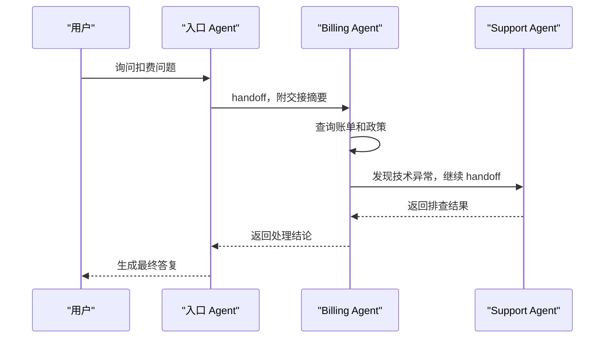

# Handoff与动态切换

## 1. Handoff 的使用场景

### 1.1 面向用户的专业接力

Handoff 表示当前 Agent 把后续处理交给另一个 Agent。它常见于企业助手：入口 Agent 判断用户在问账单，交给 Billing Agent；账单问题牵涉技术故障，再交给 Support Agent；处理完成后返回入口 Agent 统一答复。

Handoff 更适合面向用户的连续体验。与 Supervisor-Worker 的中心化调度不同，Handoff 让当前 Agent 把控制权转给专业 Agent，用户感受到的是服务转接。

### 1.2 与路由的差异

| 模式 | 发生时机 | 控制方式 |
| --- | --- | --- |
| Routing | 任务入口 | 路由器选择处理链 |
| Handoff | 任务进行中 | 当前 Agent 交给另一个 Agent |
| Supervisor-Worker | 后台任务执行中 | Supervisor 始终维护全局状态 |

路由解决入口分流，Handoff 解决过程中的专业接力。两者可以组合使用。

## 2. 交接摘要

### 2.1 必要字段

交接摘要决定下游 Agent 能否延续任务。建议包含用户目标、已完成动作、关键证据、权限状态、未解决问题、风险提示和下一步建议。

```json
{
  "user_goal": "查询扣费原因并申请处理",
  "completed": ["已查询账单 B2026-06"],
  "evidence": ["扣费来自订阅续费"],
  "permission": "用户已通过身份校验",
  "open_questions": ["是否需要取消自动续费"],
  "next_agent": "BillingAgent"
}
```

摘要过短会丢信息，过长会把无关历史带给下游。结构化字段能降低遗漏。

### 2.2 时序



## 3. 动态切换治理

### 3.1 触发条件

动态切换应基于清晰信号：用户意图变化、当前 Agent 工具不足、权限不匹配、任务进入专业领域、风险等级升高。低置信度时，可以先请求澄清。

### 3.2 权限继承

下游 Agent 不应自动继承全部权限。Runtime 要按任务和角色重新计算可用工具。若需要高风险动作，应再次确认或走审批。

### 3.3 失败回退

Handoff 失败时，系统应能回到上游 Agent，说明失败原因并选择替代路径。常见策略包括换专业 Agent、请求用户补充、降级为人工处理。

## 参考资料

- [OpenAI Agents SDK: Handoffs](https://openai.github.io/openai-agents-python/handoffs/)
- [A2A Project](https://github.com/a2aproject/A2A)
- [Anthropic: Building effective agents](https://www.anthropic.com/engineering/building-effective-agents)
