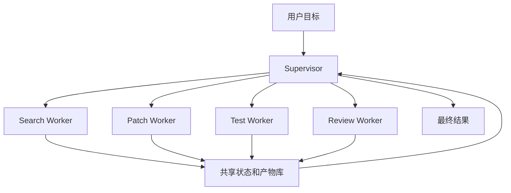

# Supervisor-Worker

## 1. 中心化调度

### 1.1 模式结构

Supervisor-Worker 模式由一个 Supervisor 维护全局目标和状态，多个 Worker 执行专业子任务。Supervisor 负责拆分、分派、汇总、冲突处理和完成判断。Worker 只关注自己的输入和产物。

这个模式适合后台复杂任务，例如大型代码迁移、研究报告、数据分析和安全审查。它让调度和执行分离，便于权限管理和并行。

### 1.2 架构图



共享状态不应是自由写入的全局变量。它应包含任务 id、子任务状态、产物位置、文件锁、冲突记录和完成条件。

## 2. Worker 设计

### 2.1 输入输出

Worker 输入要清楚，输出要结构化。

```json
{
  "task_id": "search-login-error",
  "role": "Search Worker",
  "input": "定位登录页 TypeError 来源",
  "output": {
    "summary": "错误来自 token 为空时访问属性。",
    "evidence": ["src/login.ts:42"],
    "next": "交给 Patch Worker 修改空值处理"
  }
}
```

结构化输出能减少 Supervisor 的聚合成本。证据、限制和下一步建议应分字段保存。

### 2.2 权限分层

Search Worker 只读仓库，Patch Worker 能写补丁，Test Worker 能运行受控测试，Review Worker 只读 diff 和日志。权限分层减少误操作，也让日志更容易归因。

## 3. 冲突和聚合

### 3.1 冲突类型

| 类型 | 示例 | 处理 |
| --- | --- | --- |
| 文件冲突 | 两个 Worker 修改同一文件 | 文件锁或串行合并 |
| 结论冲突 | 研究结果来源矛盾 | Supervisor 请求补证 |
| 权限冲突 | Worker 请求超出授权工具 | 拒绝并记录原因 |
| 成本冲突 | 子任务反复重跑 | 限制轮次和预算 |

### 3.2 完成判断

Supervisor 应基于完成条件而非角色发言判断任务结束。例如代码迁移要检查补丁、测试结果、风险审查和最终说明。研究报告要检查覆盖维度、引用来源和未覆盖限制。

## 参考资料

- [OpenAI Agents SDK: Handoffs and agents](https://openai.github.io/openai-agents-python/)
- [Microsoft AutoGen AgentChat](https://microsoft.github.io/autogen/stable/user-guide/agentchat-user-guide/index.html)
- [CrewAI Documentation](https://docs.crewai.com/)
