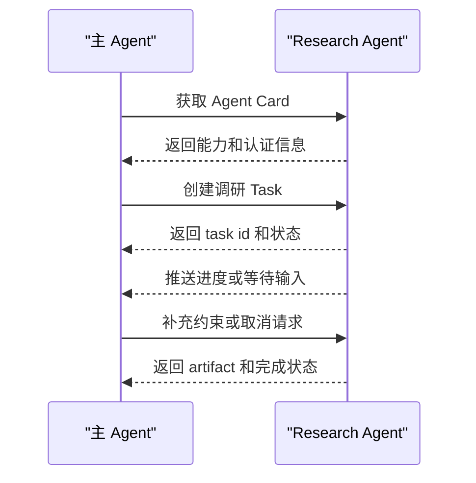

# A2A与Agent间通信

## 1. Agent 间通信的边界

### 1.1 A2A 的定位

Agent2Agent Protocol 关注 Agent 与 Agent 之间如何发现能力、委派任务、传递状态和接收产物。它和 MCP 关注的对象不同：MCP 连接 Agent 与工具或上下文服务，A2A 连接不同 Agent 系统。

多 Agent 系统中，Research Agent、Coding Agent、Review Agent 可能来自不同框架或供应商。若没有统一通信方式，任务委派会退化成一批私有 API。A2A 尝试把 Agent 能力描述、任务状态和产物交付标准化。

### 1.2 与 MCP 的差异

| 维度 | MCP | A2A |
| --- | --- | --- |
| 连接对象 | Host 与工具、资源、提示 Server | Agent 与 Agent |
| 交互单元 | tool call、resource read、prompt get | task、message、artifact、status |
| 关注重点 | 能力接入和上下文获取 | 任务委派和协作状态 |
| 典型场景 | 文件搜索、数据库查询、浏览器控制 | 跨专业 Agent 协作 |

两者可以同时使用。主 Agent 通过 A2A 委派研究任务给 Research Agent，Research Agent 内部再通过 MCP 使用搜索和资料库工具。

## 2. 组成部分

### 2.1 Agent Card

Agent Card 用于描述一个 Agent 的能力、入口、认证要求和交互方式。调用方可以据此判断是否适合委派任务。它类似服务发现中的能力说明，但内容更贴近 Agent 任务。

### 2.2 Task 与 Artifact

Task 是委派工作的核心对象，包含目标、输入、状态和上下文。Artifact 是任务产物，例如报告、文件、结构化结果或链接。长任务需要状态流转，例如 submitted、working、input-required、completed、failed。

### 2.3 时序

## 3. 工程问题

### 3.1 状态和取消

Agent 间任务可能持续很久。协议和 Runtime 应支持查询状态、取消任务、恢复任务和获取产物。任务状态要能关联 trace，方便跨系统排查。

### 3.2 权限与信任

委派任务不代表下游 Agent 获得上游全部权限。主 Agent 应传递最小必要上下文，并限制下游可访问的数据和动作。产物也要标记来源、时间和置信度，避免把下游结果直接当成已验证事实。

### 3.3 失败处理

下游 Agent 失败时，应返回结构化原因：输入不足、工具失败、权限不足、超时、能力不支持或任务冲突。主 Agent 根据失败类型决定重试、换 Agent、请求用户补充或降级处理。

## 参考资料

- [A2A Project](https://github.com/a2aproject/A2A)
- [Google Developers Blog: Agent2Agent Protocol](https://developers.googleblog.com/en/a2a-a-new-era-of-agent-interoperability/)
- [MCP Introduction](https://modelcontextprotocol.io/docs/getting-started/intro)
