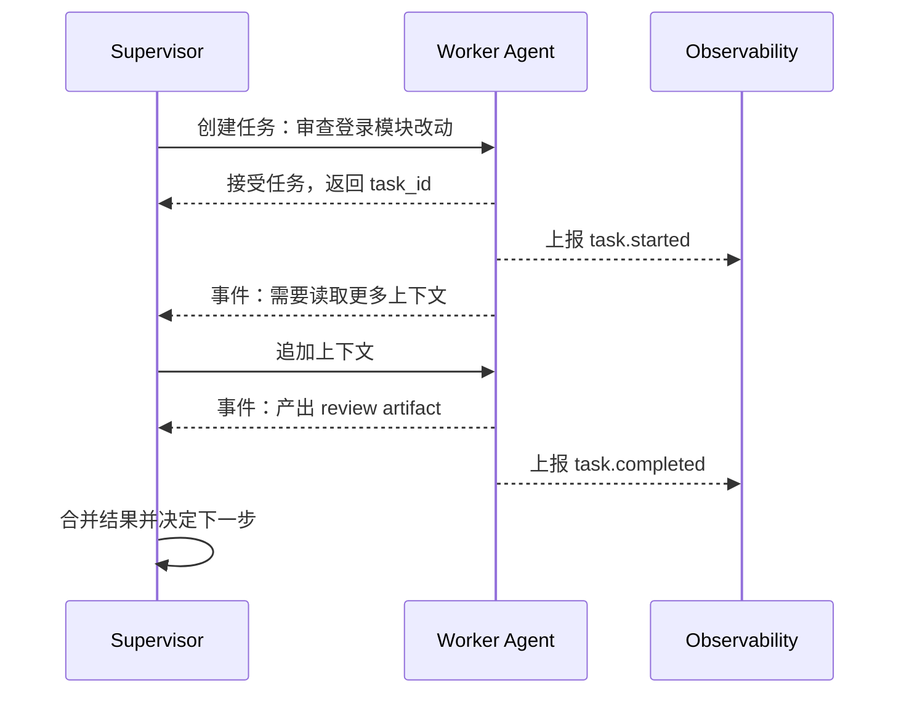

# A2A与Agent间通信

## 1. Agent 间通信的边界

### 1.1 背景

当系统里只有一个 Agent，它可以直接使用工具和资源完成任务。复杂业务中常会出现多个 Agent：研究 Agent 收集资料，代码 Agent 修改仓库，审查 Agent 检查风险，客服 Agent 与用户沟通。此时系统需要描述能力、委派任务、传递状态、取消任务、恢复任务和记录审计。

Google 提出的 Agent2Agent（A2A）协议关注 Agent 与 Agent 或应用之间的任务通信。它与 MCP 的关注点不同：MCP 连接 Host 与工具/资源 Server，A2A 关注不同 Agent 或服务之间如何表达任务、能力和状态。

### 1.2 MCP 与 A2A 对比

| 维度 | MCP | A2A |
| --- | --- | --- |
| 主要对象 | 工具、资源、提示 | Agent 能力、任务、事件 |
| 调用方向 | Host 调用 Server 能力 | Agent 或应用委派任务 |
| 交互粒度 | tool call、resource read | task、message、artifact、status |
| 典型场景 | 接入文件、数据库、业务工具 | 跨 Agent 分工、远程助手协作 |

两者可以共存。一个 Supervisor 通过 A2A 把任务交给代码 Agent，代码 Agent 内部再通过 MCP 调用 Git、文件系统和测试工具。

## 2. 通信模型

### 2.1 能力描述

Agent 间通信首先要知道对方能做什么。能力描述通常包含名称、说明、输入输出、支持的事件、认证方式和限制。它类似服务发现，但语义更贴近任务。

```json
{
  "name": "code-review-agent",
  "description": "审查代码变更并返回风险、测试建议和阻断问题。",
  "capabilities": ["review_diff", "suggest_tests"],
  "input_modes": ["text", "patch"],
  "output_modes": ["text", "json"],
  "auth": "bearer_token"
}
```

能力描述不要夸大范围。若审查 Agent 只能读 diff，描述里就不应暗示它能访问完整仓库。

### 2.2 任务生命周期



任务通信应支持事件流。长任务不能只等待最终响应，因为上层需要知道进度、阻塞原因、部分产出和取消状态。

## 3. 状态、取消与恢复

### 3.1 任务状态

| 状态 | 含义 | 上层处理 |
| --- | --- | --- |
| submitted | 任务已提交 | 等待接收 |
| running | 正在执行 | 展示进度或继续等待 |
| input_required | 需要补充信息 | 向用户或上游 Agent 请求 |
| completed | 已完成 | 读取产物 |
| failed | 执行失败 | 查看错误和可恢复性 |
| canceled | 已取消 | 停止下游工具 |

状态机要明确。没有状态约定时，Supervisor 很难判断 Worker 是仍在运行、等待输入，还是已经失败。

### 3.2 取消与恢复

```python
def cancel_task(task_id, reason):
    task = task_store.get(task_id)
    task.status = "canceled"
    task.cancel_reason = reason
    task_store.save(task)
    event_bus.publish("task.canceled", {"task_id": task_id})


def resume_task(task_id, extra_input):
    task = task_store.get(task_id)
    if task.status != "input_required":
        return {"ok": False, "error_type": "not_resumable"}
    task.messages.append(extra_input)
    task.status = "running"
    task_store.save(task)
    return {"ok": True}
```

取消要能传播到下游工具，尤其是长时间运行的浏览器、测试或数据查询。恢复要依赖可持久化状态，不能只靠进程内上下文。

## 4. 治理与审计

### 4.1 风险

| 风险 | 表现 | 处理方式 |
| --- | --- | --- |
| 能力冒用 | 上游把任务交给无权限 Agent | 能力发现和认证绑定 |
| 上下文泄露 | 敏感资料传给下游 | 最小上下文、脱敏、租户隔离 |
| 责任不清 | 多 Agent 失败难归因 | 统一 task id、trace id、artifact |
| 循环委派 | Agent 之间反复转交 | 最大委派深度和超时 |
| 状态丢失 | 长任务中断后无法恢复 | 持久化任务状态和事件 |

Agent 间通信的重点是任务边界。只有把能力、状态、事件和产物表达清楚，多 Agent 系统才具备调试和治理基础。

## 参考资料

- [Google A2A Project](https://github.com/google-a2a/A2A)
- [A2A Protocol Documentation](https://google-a2a.github.io/A2A/)
- [Model Context Protocol](https://modelcontextprotocol.io/docs/getting-started/intro)
- [Anthropic: Building effective agents](https://www.anthropic.com/research/building-effective-agents)
