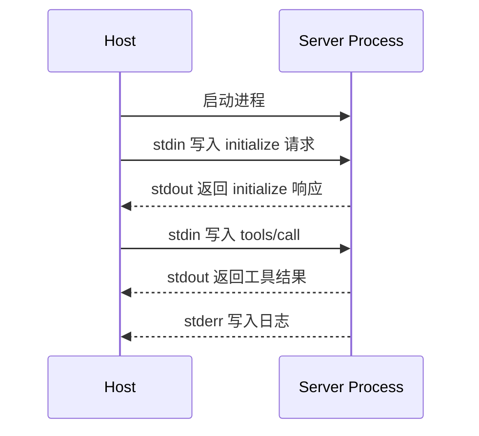
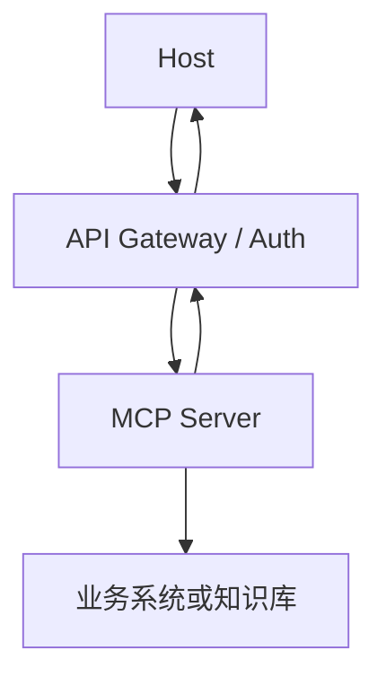

# MCP传输机制

## 1. 传输层解决什么问题

### 1.1 背景

MCP 的数据层定义 JSON-RPC 方法和能力模型，传输层负责把这些消息送到 Server。传输选择会影响部署方式、权限边界、调试方式和网络安全。官方文档中常见传输包括 stdio 和 Streamable HTTP。

stdio 适合本地 Host 启动本地 Server 进程，例如 IDE 启动文件系统 Server。Streamable HTTP 适合远程服务或长连接场景，便于穿过服务网关、接入鉴权和支持流式响应。

### 1.2 对比

| 传输 | 连接形态 | 适合场景 | 风险点 |
| --- | --- | --- | --- |
| stdio | Host 启动子进程，通过标准输入输出通信 | 本地工具、开发机、IDE | 进程权限、日志污染 stdout |
| Streamable HTTP | HTTP 请求和流式响应 | 远程工具、云服务、企业系统 | 鉴权、网络暴露、代理配置 |
| 自定义传输 | 嵌入特定运行环境 | 内部平台 | 兼容性和调试成本 |

传输层不改变 tools/resources/prompts 的语义，但会改变安全和运维模型。

## 2. stdio 传输

### 2.1 通信方式

stdio 模式下，Host 启动 Server 子进程，JSON-RPC 消息通过 stdin/stdout 传递。Server 的普通日志不能写入 stdout，否则会污染协议流；日志应写 stderr 或单独文件。



stdio 的权限模型接近本地插件。Server 进程通常继承 Host 给予的环境变量、工作目录和文件系统权限，因此启动命令和工作目录要严格控制。

```json
{
  "jsonrpc": "2.0",
  "id": 1,
  "method": "initialize",
  "params": {
    "protocolVersion": "2025-06-18",
    "clientInfo": {"name": "local-host", "version": "1.0.0"}
  }
}
```

这类 JSON-RPC 消息在 stdio 中按行或按消息边界传输。Host 读取响应后，才能继续进行 `tools/list` 或 `resources/list`。

### 2.2 常见问题

| 问题 | 表现 | 处理方式 |
| --- | --- | --- |
| stdout 被日志污染 | Client 无法解析 JSON-RPC | 日志写 stderr |
| 进程僵死 | Host 等不到响应 | 设置超时和心跳 |
| 权限过大 | Server 可读过多本地文件 | 用启动参数限制根目录 |
| 版本漂移 | Client/Server 协议不一致 | 初始化时校验 protocolVersion |

## 3. Streamable HTTP

### 3.1 运行方式

Streamable HTTP 让 Host 通过 HTTP 与 Server 通信。它更适合远程部署，可以结合企业网关、OAuth、服务发现和审计系统。对于长任务，Server 可以通过流式响应或通知把进度返回给 Host。



远程传输必须把用户身份、授权范围和审计信息带到 Server 侧。Host 过滤工具列表只能减少暴露，Server 自身仍要做权限校验。

### 3.2 部署关注点

| 关注点 | 说明 |
| --- | --- |
| 鉴权 | 使用企业身份体系或 token，避免匿名访问 |
| 速率限制 | 按用户、工具和租户限制调用频率 |
| 内容脱敏 | 请求和响应日志不能直接保存敏感内容 |
| 版本管理 | Server 能力变化要兼容旧 Host |
| 可观测性 | 记录 request id、trace id、方法、耗时 |

## 4. 传输选择方法

### 4.1 选择依据

| 场景 | 推荐传输 | 原因 |
| --- | --- | --- |
| 本地文件搜索 | stdio | 权限靠本地目录和进程控制 |
| IDE 插件工具 | stdio | 启停简单，贴近用户工作区 |
| 企业知识库 | Streamable HTTP | 需要远程鉴权、审计和共享 |
| 业务 API | Streamable HTTP | 需要网关、限流、监控 |
| 原型验证 | stdio | 部署成本低 |

先根据能力位置选择传输：能力在用户本机时优先 stdio；能力在远程业务系统时优先 HTTP。随后再补鉴权、日志和 trace。

## 参考资料

- [MCP Transports](https://modelcontextprotocol.io/docs/learn/transports)
- [MCP Architecture](https://modelcontextprotocol.io/docs/learn/architecture)
- [MCP Specification](https://modelcontextprotocol.io/specification/)
- [JSON-RPC 2.0 Specification](https://www.jsonrpc.org/specification)
