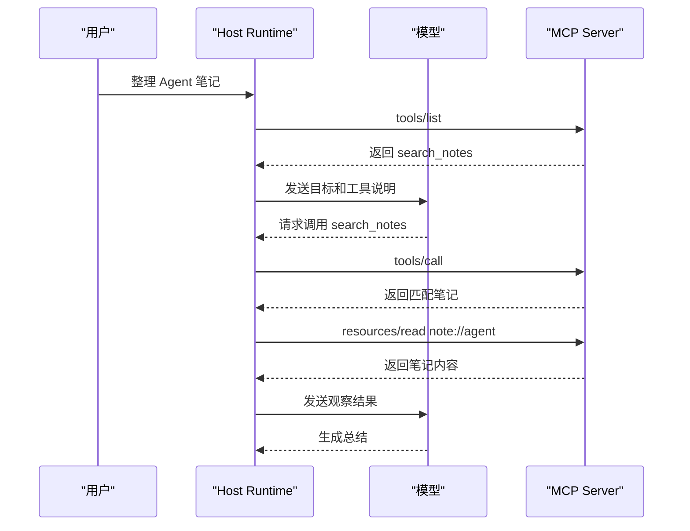

# MCP最小实现

## 1. 最小 Server 的能力

### 1.1 示例场景

最小 MCP Server 可以从本地笔记开始：提供一个搜索工具、一个资源读取入口和一个提示模板。这样既能展示 tools、resources、prompts 三类能力，也能避免引入真实业务依赖。

示例使用 Python SDK 中的 FastMCP 风格。代码定位为教学示例，真实项目还要加入鉴权、路径限制、日志、错误结构和测试。

### 1.2 能力设计

| 能力 | 名称 | 作用 |
| --- | --- | --- |
| Tool | `search_notes` | 按关键词查找笔记 |
| Resource | `note://{name}` | 读取指定笔记内容 |
| Prompt | `summarize_note` | 生成总结笔记的提示 |

## 2. FastMCP 代码

### 2.1 最小实现

```python
from mcp.server.fastmcp import FastMCP

mcp = FastMCP("notes")

NOTES = {
    "agent": "Agent 由模型、工具、状态和 Runtime 组成。",
    "mcp": "MCP 用于把工具、资源和提示暴露给 Host。",
}


@mcp.tool()
def search_notes(keyword: str) -> list[str]:
    # Tool：模型可请求执行的搜索动作
    return [name for name, text in NOTES.items() if keyword in text]


@mcp.resource("note://{name}")
def read_note(name: str) -> str:
    # Resource：Host 可读取的上下文内容
    return NOTES.get(name, "")


@mcp.prompt()
def summarize_note(name: str) -> str:
    # Prompt：复用任务提示模板
    return f"请总结 note://{name} 的核心观点，并说明来源。"


if __name__ == "__main__":
    mcp.run(transport="stdio")
```

Server 启动后，Host 通过 stdio 与它通信。Host 会先完成初始化，再列出工具、资源和提示。模型需要使用 `search_notes` 时，Host 侧 Runtime 会发起 tool call，而非让模型直接执行 Python。

### 2.2 Host 侧调用时序



## 3. 从示例到生产

### 3.1 必补能力

最小示例只说明协议形态。生产 Server 还需要：输入校验、权限控制、错误结构、超时、日志、结果截断、版本管理和测试。文件类 Server 要限制根目录，数据库类 Server 要限制只读查询或审批写入。

### 3.2 调试方法

调试 MCP Server 时，应先验证 `initialize`、`tools/list`、`tools/call` 和 `resources/read` 是否稳定，再接入模型。这样可以把协议问题和模型决策问题分开定位。

## 参考资料

- [MCP Server quickstart](https://modelcontextprotocol.io/quickstart/server)
- [MCP Python SDK](https://github.com/modelcontextprotocol/python-sdk)
- [MCP Specification](https://modelcontextprotocol.io/specification/2025-06-18)
