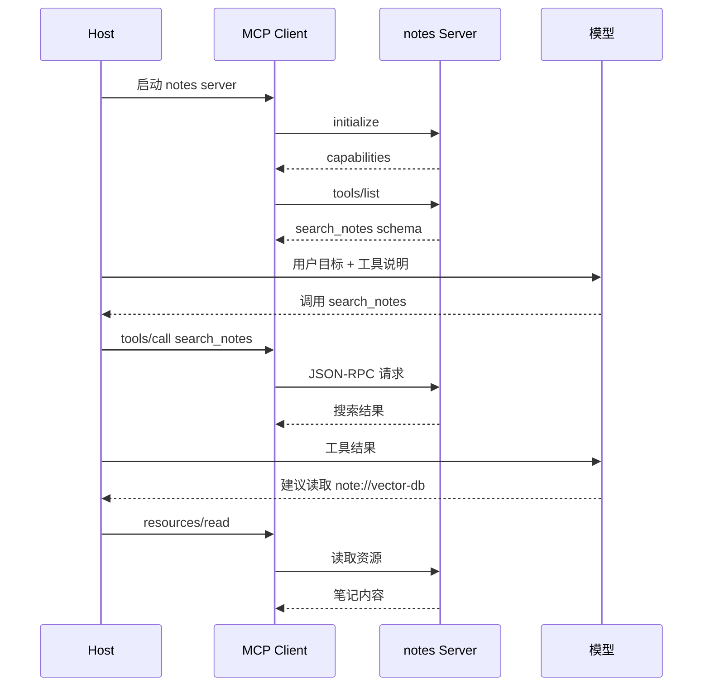

# MCP最小实现

## 1. 从本地函数到 MCP Server

### 1.1 场景

假设我们有一批本地笔记，希望任何支持 MCP 的 Host 都能搜索和读取它们。直接把搜索函数写进某个 Agent 应用，只能服务这个应用；实现成 MCP Server 后，IDE、桌面助手或聊天应用都能通过协议发现 `search_notes` 工具和 `note://` 资源。

最小 MCP Server 需要暴露三类能力中的至少一种。本文用 Python SDK 风格实现一个 notes server：一个 tool 用于搜索笔记，一个 resource 用于读取指定笔记，一个 prompt 用于生成整理任务提示。

### 1.2 运行边界

| 边界 | 说明 |
| --- | --- |
| Server | 只管理笔记数据和能力定义 |
| Host | 决定是否把工具暴露给模型 |
| 模型 | 选择是否调用工具 |
| 用户权限 | 由 Host 和 Server 共同限制 |

最小实现可以运行在 stdio 上，Host 启动 Server 进程，通过标准输入输出交换 JSON-RPC 消息。

## 2. FastMCP 示例

### 2.1 Server 代码

```python
from mcp.server.fastmcp import FastMCP

mcp = FastMCP("notes")

notes = {
    "vector-db": "向量数据库用于存储 embedding，并支持相似度检索。",
    "rag": "RAG 通常先检索资料，再把片段交给模型生成回答。",
}


@mcp.tool()
def search_notes(keyword: str) -> list[dict]:
    """按关键词搜索授权笔记。"""
    return [
        {"id": note_id, "preview": text[:80]}
        for note_id, text in notes.items()
        if keyword in text
    ]


@mcp.resource("note://{note_id}")
def read_note(note_id: str) -> str:
    """读取一篇笔记资源。"""
    return notes.get(note_id, "")


@mcp.prompt()
def summarize_note(topic: str) -> str:
    """生成笔记整理提示。"""
    return f"请基于已读取笔记整理 {topic} 的核心概念、适用场景和限制。"


if __name__ == "__main__":
    # stdio 适合本地 Host 启动子进程并通信。
    mcp.run(transport="stdio")
```

这段代码没有引入真实文件系统，便于看清 MCP 能力定义。`@mcp.tool()` 生成可调用动作，`@mcp.resource()` 暴露可读取内容，`@mcp.prompt()` 提供可复用提示模板。

### 2.2 Host 侧调用时序



Host 侧要把 MCP 返回的工具列表映射成模型可理解的工具说明。模型生成调用后，Host 再走 MCP Client 调用 Server。

## 3. JSON-RPC 交互形态

### 3.1 列出工具

```json
{
  "jsonrpc": "2.0",
  "id": 2,
  "method": "tools/list",
  "params": {}
}
```

Server 返回工具名称、描述和输入 schema。Host 可以选择全部暴露给模型，也可以根据用户权限、任务阶段或安全策略过滤。

### 3.2 调用工具

```json
{
  "jsonrpc": "2.0",
  "id": 3,
  "method": "tools/call",
  "params": {
    "name": "search_notes",
    "arguments": {
      "keyword": "向量数据库"
    }
  }
}
```

工具返回结果后，Host 需要把结果转成模型上下文中的观察。若结果包含大量文本，Host 应截断或提供资源 URI，引导模型按需读取。

## 4. 最小实现的工程补强

### 4.1 需要补上的能力

| 能力 | 最小示例状态 | 生产实现补强 |
| --- | --- | --- |
| 权限 | 内存数据公开 | 按用户、目录、资源类型过滤 |
| 错误 | 空字符串返回 | 返回错误类型和可重试信息 |
| 日志 | 未记录 | 记录 request id、方法、耗时 |
| 资源 | 简单 URI | 支持列表、分页、版本 |
| 传输 | stdio | 本地 stdio 或远程 Streamable HTTP |

最小示例帮助理解协议形态。生产系统还需要鉴权、审计、脱敏、超时、并发控制和 schema 版本管理。

## 参考资料

- [MCP Server Quickstart](https://modelcontextprotocol.io/docs/develop/build-server)
- [MCP Server Concepts](https://modelcontextprotocol.io/docs/learn/server-concepts)
- [MCP Python SDK](https://github.com/modelcontextprotocol/python-sdk)
- [JSON-RPC 2.0 Specification](https://www.jsonrpc.org/specification)
