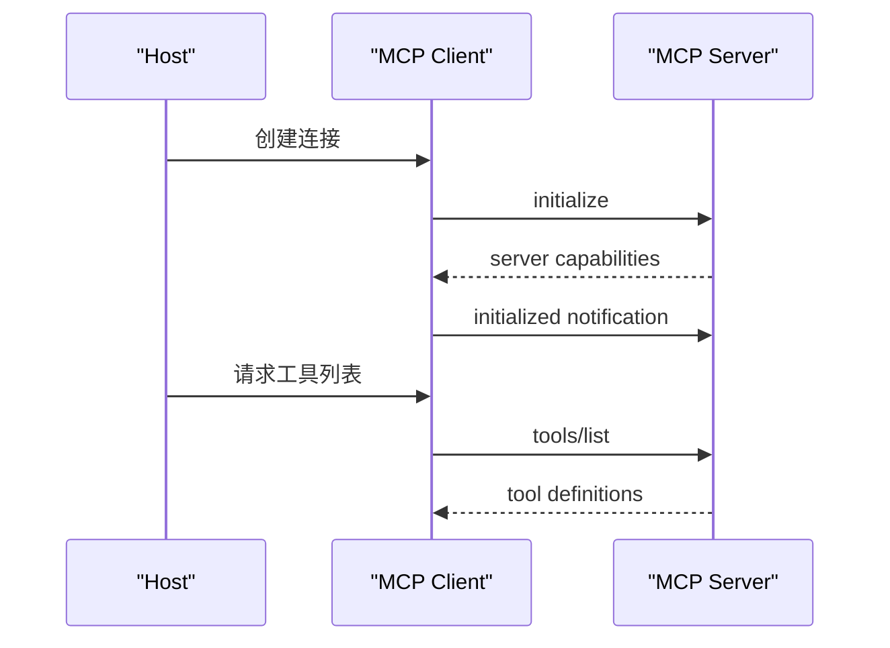

# MCP组成部分

## 1. 通信边界

### 1.1 MCP 的定位

Model Context Protocol 是连接 Agent 应用和外部能力的开放协议。它关注工具、资源、提示等能力如何被发现、描述和调用。模型仍通过 Runtime 或 Host 使用这些能力，MCP Server 负责把外部系统包装成标准接口。

MCP 适合多客户端复用同一批工具的场景，例如文件系统、数据库、浏览器、企业知识库和业务 API。与应用内部直接注册函数相比，MCP 把能力实现从 Agent Runtime 中拆出来，便于独立部署、升级和审计。

### 1.2 Host、Client、Server

| 角色 | 职责 |
| --- | --- |
| Host | 承载用户界面和 Agent Runtime，例如 IDE、桌面应用、聊天产品 |
| Client | Host 内部负责与某个 MCP Server 通信的连接对象 |
| Server | 暴露 tools、resources、prompts 等能力 |

一个 Host 可以连接多个 Server。每个连接通常对应一个 Client。Server 不直接控制模型，它只响应能力发现和调用请求。

## 2. 能力类型

### 2.1 Tools

Tools 表示可执行动作，例如查询数据库、搜索文件、发起 HTTP 请求。Tool 调用可能产生副作用，因此 Host 和 Runtime 应控制权限、确认流程和日志。

Tool 定义通常包含名称、描述、输入 schema 和返回内容。模型看到的是能力说明，真正执行发生在 Host 或 Client 调用 Server 之后。

### 2.2 Resources

Resources 表示可读取上下文，例如文件、数据库记录、网页片段或应用状态。资源使用 URI 标识。Host 可以让用户或模型选择资源，再把内容注入上下文。

资源适合稳定数据暴露。若某个能力只是读取内容，优先设计成 resource，而非带副作用的 tool。

### 2.3 Prompts

Prompts 表示可复用提示模板。Server 可以提供某类任务的提示，例如“生成 SQL 解释”“总结错误日志”。Prompt 本身不执行外部动作，它帮助 Host 组织模型输入。

## 3. Data Layer 与 Transport

### 3.1 JSON-RPC

MCP 的消息层基于 JSON-RPC。它包含请求、响应和通知三类交互。请求有 id，响应通过 id 对应。通知没有响应，适合状态变化和进度事件。

```json
{
  "jsonrpc": "2.0",
  "id": 1,
  "method": "tools/list",
  "params": {}
}
```

### 3.2 初始化和能力协商

连接建立后，Client 和 Server 需要初始化并交换能力信息。Host 通过能力列表知道 Server 提供哪些 tools、resources、prompts，以及是否支持进度、取消、日志等能力。



### 3.3 协议设计启发

MCP 把能力发现、调用格式和传输分开。这样同一套工具可以通过不同传输方式接入，不同 Host 也能复用 Server。Agent 工程中应沿用这个思路：能力边界清楚，调用记录完整，权限由 Host 侧控制。

## 参考资料

- [MCP Introduction](https://modelcontextprotocol.io/docs/getting-started/intro)
- [MCP Architecture](https://modelcontextprotocol.io/docs/concepts/architecture)
- [MCP Specification](https://modelcontextprotocol.io/specification/2025-06-18)
