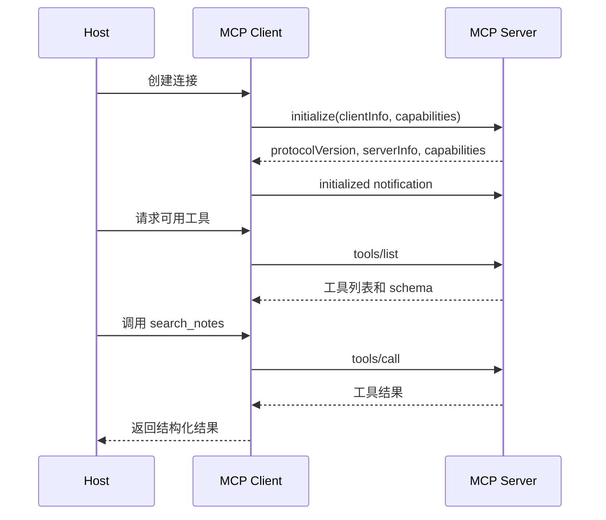

# MCP组成部分

## 1. 从工具集成到协议边界

### 1.1 背景

早期 Agent 接入外部工具时，通常在应用代码里写死函数列表。一个客户端想接入文件系统、数据库、浏览器、企业知识库，就要为每种系统写一套适配逻辑。随着工具数量增加，集成成本、权限边界、上下文注入和能力发现都会变复杂。

Model Context Protocol（MCP）把工具、资源和提示能力放进统一协议。Host 负责承载用户应用和模型，Client 负责与某个 Server 建立连接，Server 暴露工具、资源和提示。这样 Agent 应用可以通过协议发现能力，再按 JSON-RPC 请求调用具体能力。

### 1.2 三个角色

| 角色 | 位置 | 职责 | 示例 |
| --- | --- | --- | --- |
| Host | 用户使用的 AI 应用 | 管理模型、用户会话、权限和多个 MCP client | IDE、桌面助手、聊天应用 |
| Client | Host 内部的协议客户端 | 与一个 server 建立一条连接并发送请求 | 文件系统 client、Git client |
| Server | 外部能力提供者 | 暴露 tools、resources、prompts | notes server、数据库 server |

Host 可以连接多个 Server，但每个 Client 通常对应一个 Server 连接。这个边界能让权限、生命周期和错误定位更清晰。

## 2. 数据层与传输层

### 2.1 MCP 能力模型

MCP 的数据层基于 JSON-RPC 2.0 请求、响应和通知。Server 可以暴露三类常见能力：tools、resources、prompts。Tools 面向可执行动作；resources 面向可读取上下文；prompts 面向可复用提示模板。

| 能力 | 用途 | 典型操作 | Agent 场景 |
| --- | --- | --- | --- |
| Tools | 执行动作并返回结果 | `tools/list`、`tools/call` | 搜索笔记、查数据库、运行脚本 |
| Resources | 提供可读取内容 | `resources/list`、`resources/read` | 读取文件、配置、文档片段 |
| Prompts | 提供模板化提示 | `prompts/list`、`prompts/get` | 生成代码审查提示、总结模板 |
| Notifications | 推送状态变化 | progress、resource updated | 长任务进度、资源变更 |

这些能力通过初始化和能力协商暴露给 Host。Host 不应假设 Server 拥有某个能力，而应先读取 server capabilities，再决定是否调用。

### 2.2 初始化时序



初始化阶段决定协议版本和能力边界。之后 Host 才能安全地展示工具或让模型使用这些工具。

## 3. Tools、Resources、Prompts 的关系

### 3.1 Tools

Tool 是 Server 暴露的可执行能力，包含名称、描述和 input schema。模型通过 Host 看到工具说明后，生成 tool call；Host 再通过 MCP Client 调用 Server。

```json
{
  "name": "search_notes",
  "description": "按关键词搜索授权笔记。",
  "inputSchema": {
    "type": "object",
    "properties": {
      "keyword": {"type": "string"}
    },
    "required": ["keyword"]
  }
}
```

MCP tool schema 与 Function Calling schema 可以相互映射。差别在于 MCP 解决的是 Host 与外部 Server 的协议边界，Function Calling 解决的是模型与 Runtime 的结构化调用边界。

### 3.2 Resources

Resource 用 URI 表示可读取内容，例如 `note://vector-db`、`file:///project/README.md`。资源适合承载上下文，而非动作。Host 可以读取资源并放入模型上下文，也可以让用户选择资源后再触发 Agent。

### 3.3 Prompts

Prompt 是 Server 提供的可复用提示模板。它适合把领域任务的输入要求和输出格式封装起来，例如“根据笔记生成技术选型报告”。Prompt 不执行外部动作，通常与 tools 和 resources 配合使用。

## 4. 协议设计的工程含义

### 4.1 MCP 与本地工具封装对比

| 维度 | 本地工具注册表 | MCP |
| --- | --- | --- |
| 集成范围 | 应用内部 | 跨应用、跨 Server |
| 能力发现 | 代码注册 | 协议 list 方法 |
| 传输 | 函数调用 | stdio、Streamable HTTP |
| 权限位置 | Runtime 内部 | Host 与 Server 分别控制 |
| 复用性 | 依赖应用实现 | Server 可被多个 Host 使用 |

MCP 的价值在于把能力提供方和 Agent Host 解耦。文件系统、数据库、业务系统都可以用 Server 方式暴露能力，Host 通过统一协议连接。

### 4.2 风险与控制

| 风险 | 表现 | 控制方式 |
| --- | --- | --- |
| 能力过宽 | Server 暴露危险写操作 | Host 做权限分级和用户确认 |
| 资源注入 | Resource 内容诱导模型越权 | 工具结果标注为不可信数据 |
| 版本不兼容 | 协议或 schema 变化 | 初始化阶段检查 protocolVersion |
| 传输泄露 | 敏感内容进入日志 | 脱敏、分级日志、最小权限 |
| 调试困难 | Host、Client、Server 责任混乱 | trace 记录 JSON-RPC 方法和 request id |

MCP 提供协议边界，安全治理仍需要 Host、Client 和 Server 共同实现。

## 参考资料

- [Model Context Protocol Introduction](https://modelcontextprotocol.io/docs/getting-started/intro)
- [MCP Architecture](https://modelcontextprotocol.io/docs/learn/architecture)
- [MCP Server Concepts](https://modelcontextprotocol.io/docs/learn/server-concepts)
- [JSON-RPC 2.0 Specification](https://www.jsonrpc.org/specification)
