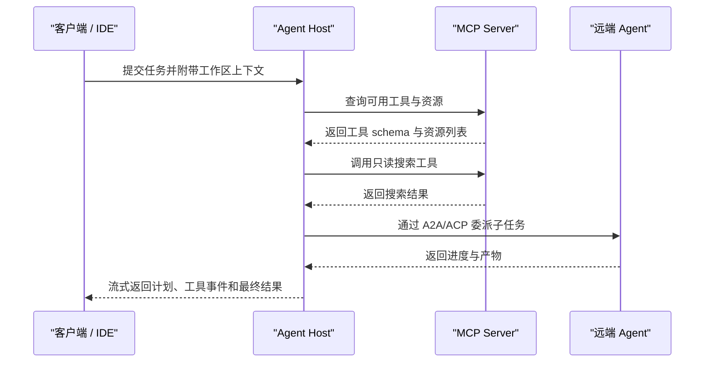

# Agent协议

Agent 协议解决的是互操作问题。单个 Agent 应用可以把工具、状态和模型都写在一个进程里，但当系统开始连接多种数据源、多种工具、多家模型、多套 Agent 框架和多个客户端时，私有接口会迅速变成维护负担。协议的价值在于把通信对象、消息格式、能力发现、权限边界和运行语义明确下来，让不同实现可以在共同约束下协作。当前 Agent 生态中较常被讨论的协议包括 MCP、A2A、ACP 和 Agent Client Protocol。它们的目标不同，适用层次也不同。

理解这些协议时，先区分三类通信关系。第一类是 Agent 应用和外部上下文或工具之间的关系，例如读取文件、查询数据库、访问业务系统、调用浏览器。MCP 主要服务这一层。第二类是 Agent 和 Agent 之间的关系，例如一个研究 Agent 找到另一个数据分析 Agent，发送任务、接收进度、交换产物。A2A 和 Agent Communication Protocol 更偏向这一层。第三类是客户端和 Agent 运行时之间的关系，例如 IDE、终端或编辑器如何连接一个编码 Agent，如何传递任务、展示计划、接收补丁和处理权限。Agent Client Protocol 主要服务这一层。

## MCP：把上下文和工具标准化

MCP 的全称是 Model Context Protocol。它由 Anthropic 发起，目标是为模型应用连接外部系统提供标准接口。MCP 文档把它描述为一种开放协议，用于让应用向大模型提供上下文。MCP 的核心对象包括 host、client 和 server。Host 是使用模型的应用，例如桌面助手、IDE、聊天应用或 Agent 运行时。Client 通常嵌在 host 内部，负责和某个 MCP server 建立连接。Server 暴露具体能力，例如文件系统、GitHub、数据库、浏览器、搜索服务或企业内部 API。

MCP 常见能力包括 tools、resources 和 prompts。Tools 表示可执行动作，模型可以通过 host 请求调用；resources 表示可读取的上下文对象，例如文件、文档、记录或查询结果；prompts 表示可复用的提示模板。这个划分让工具调用和上下文读取有了统一描述方式。一个 MCP server 可以声明自己有哪些工具、每个工具需要什么参数、返回什么结果；host 可以据此把工具暴露给模型，并在调用前进行权限检查。

MCP 的边界很清晰：它主要解决“模型应用如何接入工具和上下文”。它不规定某个 Agent 应该如何规划任务，也不要求多个 Agent 之间如何协商角色。一个 Agent 可以使用 MCP 工具完成文件搜索、数据库查询和浏览器访问；多个 Agent 也可以共享同一组 MCP server。但 MCP 本身更像能力层协议，负责把外部能力以标准方式接入模型应用。

MCP 的工程价值在于降低工具集成成本。没有协议时，每个 Agent 框架都要为每种工具写一套适配器，工具开发者也要为不同宿主重复实现。使用 MCP 后，一个 server 可以被多个 host 复用，一个 host 也可以挂载多个 server。对企业场景来说，这种复用尤其重要，因为数据源和权限系统通常复杂且变化缓慢，应用层 Agent 变化更快。把工具适配逻辑沉到 MCP server，可以让上层 Agent 更专注于任务编排。

MCP 的安全设计也值得关注。工具调用并不天然安全，尤其是文件系统、shell、数据库和生产 API。Host 需要在暴露工具时决定用户是否授权，server 需要限制能力范围，工具参数需要校验，调用记录需要审计。MCP 提供协议结构，但不会替开发者自动完成业务授权。一个严谨实现会把工具分级，明确哪些工具只读、哪些工具可写、哪些工具需要人工确认，并在 UI 中展示能力来源和调用影响。

## A2A：Agent 之间的任务协作

A2A 通常指 Agent2Agent Protocol。Google 在 A2A 公告中把它定位为开放协议，用于让不同供应商、不同框架构建的 Agent 彼此通信和协作。A2A GitHub 项目围绕 Agent 发现、能力声明、任务交互、消息、状态和产物等概念组织。它关注的对象是“一个 Agent 如何把任务交给另一个 Agent，并跟踪对方执行过程”。

A2A 的典型场景是跨系统协作。比如一个企业助手接到“帮我准备下周客户会议材料”的任务，它可能需要联系 CRM Agent 获取客户信息，联系日历 Agent 获取会议安排，联系文档 Agent 生成材料，联系数据分析 Agent 生成报表。如果这些 Agent 来自不同团队或供应商，统一协议可以减少点对点私有集成。A2A 的重点不只是发送一段文本，还包括发现对方能力、传递任务上下文、接收执行状态、处理长任务、获取最终产物。

A2A 和 MCP 的差异在通信对象上。MCP server 通常暴露工具或上下文，调用方仍然是本地 Agent 或 host；A2A 交互的另一端是具备自主处理能力的 Agent。调用 MCP 工具像调用一个能力接口，调用 A2A Agent 更像委派一个任务。被委派方可能需要多轮执行、调用自己的工具、维护自己的状态，并在过程中返回进度和产物。这要求协议能表达任务生命周期，而不仅是一次函数调用。

A2A 的工程挑战在信任和责任边界。一个 Agent 把任务交给另一个 Agent 后，如何确认对方身份，如何限制可见上下文，如何验证产物质量，如何处理失败和超时，如何记录审计链路，都是落地时必须解决的问题。协议提供消息和状态结构，系统仍需要身份认证、权限策略、数据脱敏和结果验证。跨组织场景还需要考虑合规和数据驻留，不能把用户上下文无差别发送给外部 Agent。

## ACP：Agent Communication Protocol

Agent Communication Protocol 关注 Agent 间通信的标准化。不同社区对 ACP 的实现和命名存在差异，常见目标是让 Agent 能够以统一消息格式交换任务、能力、上下文和结果。和 A2A 类似，ACP 也面向 Agent 互操作，但具体规范、运行时假设和生态支持可能不同。阅读 ACP 文档时要注意它所指的具体项目、版本和参与方，避免把不同协议的概念混用。

ACP 的核心价值在于给 Agent 协作提供通用通信层。一个 Agent 如果只暴露 HTTP 接口，调用方需要预先知道 URL、请求格式、鉴权方式、任务状态查询方式和结果格式。ACP 试图把这些共性抽象出来，让 Agent 能描述自身能力、接收任务、返回状态、传递中间消息和交付结果。对于需要多个自治 Agent 共同工作的系统，这种抽象可以降低集成成本。

ACP 的边界也需要清楚。它不能替代业务协议，也不能自动统一所有 Agent 的语义。比如“分析客户风险”这个任务，不同企业对风险指标、数据权限、合规要求和输出格式会有不同定义。ACP 可以承载任务请求和结果，但业务含义仍要由能力描述、schema、文档和评估标准补充。协议层标准化的是通信方式，业务层标准化仍需要领域建模。

选择 ACP 或 A2A 时，开发者应关注生态成熟度、规范稳定性、身份与安全机制、长任务支持、产物表示、错误模型和框架适配。若系统主要在某个框架或组织内部运行，私有协议加清晰接口可能已经足够；若目标是跨供应商互操作，开放协议的价值会更明显。协议选择不应只看名称，还要看是否有可用 SDK、示例、兼容测试和实际集成案例。

## Agent Client Protocol：客户端与编码 Agent 的交互

Agent Client Protocol 面向客户端和 Agent 之间的连接，尤其常见于编码 Agent、IDE Agent 和终端 Agent 场景。它关注的是用户界面如何与 Agent 运行时交换消息、计划、文件变更、权限请求、工具执行结果和会话状态。这个层次与 MCP、A2A 不同：MCP 连接工具，A2A/ACP 连接 Agent，Agent Client Protocol 连接客户端和 Agent 服务。

在编码场景中，客户端需要的不只是聊天消息。它还要展示 Agent 正在读哪些文件、准备运行哪些命令、生成了什么补丁、测试结果如何、是否需要用户批准、任务是否可以暂停和恢复。一个统一客户端协议可以让不同编辑器或 UI 连接不同 Agent 后端，也可以让 Agent 后端复用同一套前端体验。对开发者来说，这意味着 Agent 的核心运行时可以和 UI 解耦。

Agent Client Protocol 的典型消息包括用户请求、Agent 响应、会话状态、文件上下文、工具调用事件、权限请求、补丁或产物、错误和完成信号。它需要支持长连接或流式更新，因为 Agent 任务经常持续数十秒到数分钟。客户端还要能展示增量进展，而不是只等待最终回答。对长任务来说，协议还应考虑断线恢复、会话持久化和事件重放。

这个协议层的安全关注点是用户确认和本地资源访问。编码 Agent 可能读取私有代码、运行测试、安装依赖、修改文件和执行命令。客户端协议必须能把高风险动作清晰展示给用户，并把确认结果传回 Agent。权限请求应包含动作类型、命令或文件路径、影响范围和原因。只用自然语言说明风险不够，协议消息最好包含机器可读字段，方便客户端做 UI 呈现和策略判断。

## 协议组合方式

真实系统往往会同时使用多种协议。一个 IDE 中的编码 Agent 可以通过 Agent Client Protocol 和编辑器 UI 通信，通过 MCP 访问文件系统、GitHub 和数据库工具，通过 A2A 把文档撰写任务委派给另一个内容 Agent。每个协议负责一段边界，组合后形成完整系统。下图展示了一次可能的交互链路。

这个链路可以看出协议分层的意义。客户端不需要知道 MCP server 的内部实现，MCP server 也不需要知道 UI 如何展示进度，远端 Agent 只需要理解委派任务的消息格式。每个边界都保持相对独立，系统也更容易替换局部组件。比如未来更换数据库 MCP server，不影响 Agent Client Protocol；未来更换 UI，也不影响 A2A 委派逻辑。

## 能力发现与 schema

能力发现是 Agent 协议的重要组成部分。MCP server 需要告诉 host 自己有哪些 tools、resources 和 prompts；A2A 或 ACP Agent 需要告诉调用方自己能处理什么任务、需要什么输入、会产出什么结果；Agent Client Protocol 也需要让客户端知道后端支持哪些会话能力、权限请求类型和事件格式。能力发现降低了硬编码依赖，但也带来描述质量问题。能力描述过于模糊时，模型或调用方很难正确选择；描述过于复杂时，维护成本会上升。

Schema 是能力发现的基础。工具参数、任务输入、产物格式、错误结构和事件字段都应该有明确 schema。JSON Schema 常用于工具调用和结构化输出，因为它能表达对象、字段类型、必填项、枚举、数组和嵌套结构。协议中的 schema 不只是给模型看的，也是给客户端、执行器、验证器和审计系统看的。一个 schema 清晰的工具更容易被模型正确调用，也更容易被宿主程序安全执行。

## 身份、权限与审计

Agent 协议落地时，身份和权限是绕不过去的部分。MCP server 可能连接企业数据库，A2A Agent 可能处理客户数据，客户端协议可能允许执行本地命令。每一次跨边界调用都需要回答四个问题：调用方是谁，调用方被允许做什么，本次调用使用了哪些用户授权，调用结果如何被记录。协议可以提供认证和消息结构，业务系统仍要实现访问控制和审计策略。

权限还要处理代理关系。Agent 代表用户行动，但 Agent 本身也可能由服务账号运行。系统需要区分用户身份、Agent 身份、工具服务身份和外部系统身份。比如用户让 Agent 查询数据库，数据库权限应该基于用户授权、服务策略或两者组合，而不能默认使用 Agent 服务器的最高权限。跨 Agent 委派时，还要限制下游 Agent 能看到的上下文范围，避免把不必要的隐私数据传递出去。

审计需要记录完整链路。一次最终回答可能经过客户端请求、MCP 工具调用、A2A 子任务和多个模型调用。日志要能串起这些事件，包含 trace id、用户、Agent、工具、参数摘要、结果摘要、时间、错误和授权信息。这样在出现错误、数据泄漏或结果争议时，团队才能定位责任边界。没有审计链路的协议集成，在 demo 中可能顺畅，在生产事故中会非常难排查。

## 长任务与状态

Agent 协议必须支持长任务。很多 Agent 任务无法用一次请求响应完成，例如研究报告、代码迁移、数据清洗、跨系统审批和多步骤运维。长任务需要状态机：已接收、运行中、等待用户、等待外部系统、部分完成、失败、取消、完成。A2A 和 ACP 这类 Agent 间协议尤其需要任务状态，因为被委派的 Agent 可能运行较久。Agent Client Protocol 也需要把状态持续推送给 UI。

长任务还需要取消和恢复。用户可能中途改变目标，客户端可能断线，工具可能超时，远端 Agent 可能暂时不可用。协议如果只支持最终结果，会让这些情况难以处理。更成熟的设计会提供任务 id、事件流、检查点、取消信号和错误恢复建议。状态持久化则属于实现层，协议可以规定状态如何表达，但具体存储仍由运行时负责。

## 互操作的现实边界

开放协议能降低集成成本，但不能消除所有差异。模型能力不同，工具权限不同，业务语义不同，组织安全策略不同，运行时可靠性也不同。两个 Agent 即使用同一协议通信，也可能因为任务描述不清、schema 不兼容、证据标准不同而产生质量问题。因此协议互操作要配合能力文档、兼容测试、评估集和安全审查。

协议还会经历版本演进。早期生态中，规范、SDK、示例和最佳实践都可能变化。生产系统应锁定协议版本，记录兼容范围，避免把未稳定能力用于关键路径。对外部 Agent 或外部 MCP server，要有超时、降级和隔离策略。协议带来的便利不应掩盖依赖风险。

## 选型建议

如果目标是把本地或企业工具接入模型应用，优先研究 MCP。它适合文件、数据库、API、搜索、浏览器和内部系统等能力暴露。如果目标是让多个独立 Agent 协同处理任务，研究 A2A 和 ACP，重点看任务生命周期、能力发现、身份认证、产物格式和生态支持。如果目标是构建 IDE、终端或桌面端 Agent 产品，研究 Agent Client Protocol，重点看会话、事件流、权限请求、文件变更和用户交互。如果系统同时覆盖这些场景，可以分层采用，而不要试图让一个协议承担所有职责。

协议层设计的最终目标是让 Agent 系统可连接、可替换、可审计、可治理。可连接意味着不同工具、客户端和 Agent 能按稳定接口通信；可替换意味着局部组件变化时不会重写整套系统；可审计意味着跨边界调用能被追踪；可治理意味着权限、安全和版本能被集中管理。理解 MCP、A2A、ACP 和 Agent Client Protocol 的层次后，开发者就能更准确地判断某个协议应该放在哪个边界，也能避免在工具调用、Agent 协作和客户端交互之间产生职责混乱。

## 能力卡片与发现机制

Agent 间协议通常需要一种能力卡片或能力描述文档。它回答调用方最关心的几个问题：这个 Agent 能处理哪些任务，输入需要哪些字段，支持同步还是异步，能返回哪些产物，是否支持流式进度，失败时如何表达，调用需要哪些身份和权限。能力卡片的质量会影响路由和委派效果。如果能力描述只有宽泛自然语言，调用方很难判断是否适合；如果描述包含任务类型、schema、示例、限制和成本信息，自动路由会稳定得多。

能力发现还要考虑动态变化。一个 Agent 的可用工具、服务状态、限流额度和权限范围可能随时间变化。协议可以提供静态能力声明，也可以提供运行时查询接口。对企业系统来说，运行时能力发现很重要，因为同一个 Agent 对不同用户可能暴露不同能力。比如管理员可以触发部署，普通用户只能查询状态；财务人员可以读取账单，工程人员只能查看技术指标。能力发现如果不结合身份，就会暴露过多内部信息或引发无效调用。

## 版本与兼容

协议版本管理是长期运行的基础。MCP server 的工具 schema 会变化，A2A Agent 的任务格式会扩展，Agent Client Protocol 的事件类型也可能增加。调用方和服务方需要约定版本协商方式，至少要能识别不兼容变更。新增可选字段通常比较安全，删除字段、修改字段语义、改变状态机和错误码都属于高风险变更。生产系统应把协议版本写入 trace，便于事故排查。

兼容测试可以降低升级风险。对于 MCP，可以准备工具列表、schema 校验、正常调用、错误调用和权限拒绝测试。对于 A2A/ACP，可以准备能力发现、任务创建、进度流、取消、失败、产物下载和超时测试。对于 Agent Client Protocol，可以准备会话创建、消息流、权限请求、文件变更展示、断线恢复和任务完成测试。协议实现通过这些测试后，再接入上层 Agent，会比直接端到端调试更稳定。

## 落地路径

在已有系统中引入协议，适合从边界最清楚的部分开始。若当前痛点是工具集成重复，可以先把常用只读能力做成 MCP server，例如文件搜索、知识库查询、数据库只读查询。若当前痛点是多个 Agent 系统彼此隔离，可以先定义一个小范围 A2A 或 ACP 试点，只支持任务创建、状态查询和最终产物。若当前痛点是 UI 和 Agent 运行时耦合，可以先抽象客户端事件流，把模型消息、工具事件和权限请求用稳定消息表示。

落地初期不要追求一次覆盖所有能力。一个只支持只读工具的 MCP server，如果权限和审计做得好，就能立刻提升复用性。一个只支持少数任务类型的 A2A Agent，如果能力描述和状态机清楚，也能验证跨 Agent 委派价值。协议接入应与评估同步推进：记录调用成功率、失败原因、平均耗时、人工确认次数、产物质量和安全拦截次数。没有这些指标，团队很难判断协议层是否真正降低了系统复杂度。

## 与现有 API 的关系

很多企业已经有大量 REST、GraphQL、gRPC 或消息队列接口。Agent 协议并不要求推翻这些接口。更常见的做法是在现有 API 上方增加 Agent 友好的适配层。MCP server 可以调用内部 REST API，再把能力以 tools/resources 形式暴露；A2A Agent 可以把内部业务流程封装成任务状态机；Agent Client Protocol 可以把已有后端事件转换成客户端可展示的流式消息。这样既能利用现有系统，也能给 Agent 提供更一致的交互方式。

适配层还可以隐藏内部复杂性。模型不需要知道数据库表结构、微服务拓扑或消息队列主题，它只需要看到经过治理的能力。协议层越靠近 Agent，就越应该使用任务语义和清晰 schema；越靠近内部系统，就越需要遵守已有的鉴权、限流、审计和事务规则。这个分层能减少模型对底层实现的依赖，也能让安全团队更容易审查。

## 参考资料

- [Model Context Protocol: Introduction](https://modelcontextprotocol.io/docs/getting-started/intro)
- [A2A GitHub](https://github.com/a2aproject/A2A)
- [Google Developers Blog: A2A - a new era of agent interoperability](https://developers.googleblog.com/en/a2a-a-new-era-of-agent-interoperability/)
- [Agent Communication Protocol: Introduction](https://agentcommunicationprotocol.dev/introduction/welcome)
- [Agent Client Protocol: Introduction](https://agentclientprotocol.com/get-started/introduction)
- [OpenAI Agents SDK: Agents](https://openai.github.io/openai-agents-python/agents/)
- [Anthropic Docs: Tool use](https://docs.anthropic.com/en/docs/agents-and-tools/tool-use/implement-tool-use)
