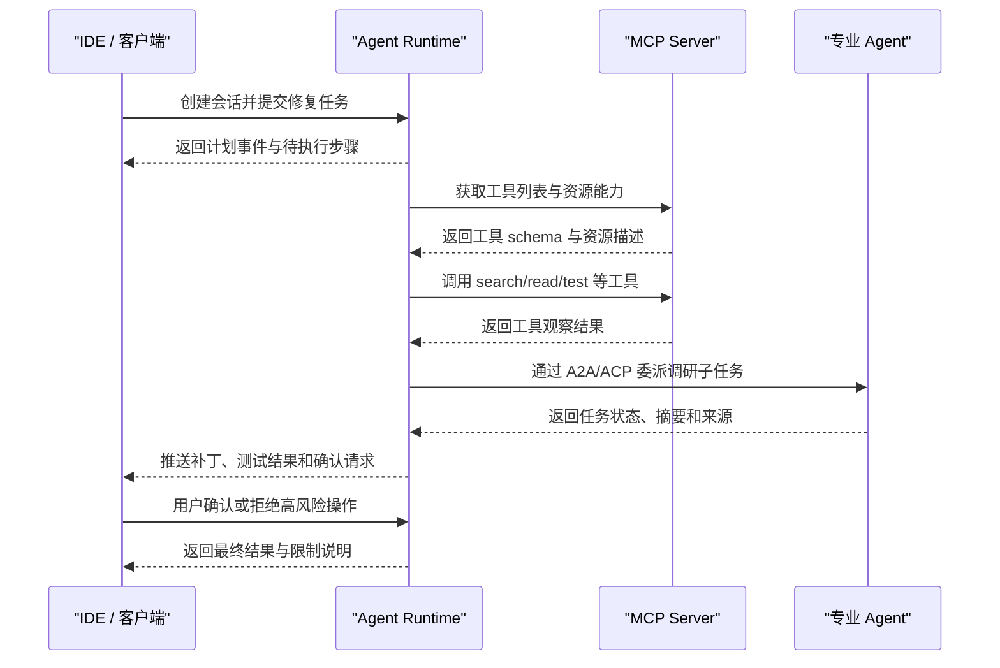

# Agent协议

## 1. 先按通信边界理解协议

Agent 协议解决的是互操作问题。一个 Agent 原型可以把模型调用、工具函数、状态和界面写在同一个进程里；当系统要接入多种工具、多个客户端、多个 Agent 服务和不同厂商模型时，私有接口会让维护成本迅速上升。协议的作用是把通信对象、能力发现、消息格式、任务状态、权限和产物表达标准化。

理解 MCP、A2A、ACP 和 Agent Client Protocol 时，不要先记名称，而要先看通信边界。第一层是客户端到 Agent Runtime，例如 IDE、网页或终端如何提交任务、展示工具事件、确认高风险操作。Agent Client Protocol 主要处在这一层。第二层是 Agent Runtime 到工具和上下文系统，例如文件、数据库、GitHub、浏览器、知识库。MCP 主要处在这一层。第三层是 Agent 到 Agent，例如一个企业助手把子任务委派给另一个专业 Agent。A2A 和 ACP 主要处在这一层。

| 边界 | 典型通信双方 | 代表协议 | 主要问题 |
| --- | --- | --- | --- |
| 客户端到 Agent | IDE、终端、Web UI 与 Agent Runtime | Agent Client Protocol | 会话、事件流、权限确认、文件变更展示 |
| Agent 到工具 | Agent Runtime 与外部数据源或工具服务 | MCP | 工具发现、资源读取、参数 schema、工具结果 |
| Agent 到 Agent | 一个 Agent 与另一个 Agent | A2A、ACP | 能力发现、任务委派、状态跟踪、产物交付 |

下面用一个“编码 Agent”贯穿说明：用户在 IDE 中要求修复一个 bug；编码 Agent 通过客户端协议把进度展示给 IDE；通过 MCP 调用文件搜索、GitHub 和测试工具；若需要生成调研摘要，可以把子任务通过 A2A 或 ACP 委派给研究 Agent。

## 2. MCP：Agent 连接工具和上下文

MCP 的全称是 Model Context Protocol。它由 Anthropic 发起，目标是让模型应用以标准方式连接外部上下文和工具。MCP 的基本角色包括 host、client 和 server。Host 是模型应用或 Agent Runtime，client 嵌在 host 内部负责连接，server 暴露具体能力，例如文件系统、数据库、浏览器、GitHub 或企业 API。

MCP server 通常暴露三类能力：tools、resources 和 prompts。Tools 表示可执行动作，例如搜索文件、查询数据库、创建工单。Resources 表示可读取上下文，例如文件、文档、记录或查询结果。Prompts 表示可复用提示模板。对编码 Agent 来说，一个文件系统 MCP server 可以暴露 `search`、`read_file`、`list_directory`；一个 GitHub MCP server 可以暴露 issue、PR、commit 等资源和操作。

MCP 的核心价值是工具适配复用。没有协议时，每个 Agent 框架都要为每个外部系统写私有适配器。使用 MCP 后，工具提供者实现一次 server，不同 host 可以复用。对企业内部系统尤其有价值，因为数据源和权限系统往往稳定，而上层 Agent 应用迭代很快。

MCP 的边界也要清楚。它标准化的是工具和上下文访问，不负责定义 Agent 的规划逻辑。一个 MCP tool 可以执行“搜索文件”，但它不决定搜索后是否修改代码；这个决策仍由 Agent Runtime 和模型完成。MCP server 也不应默认拥有无限权限，host 和 server 都要参与授权、参数校验和审计。

## 3. A2A：Agent 之间的任务委派

A2A 通常指 Agent2Agent Protocol。Google 对 A2A 的介绍强调它用于让不同供应商、不同框架构建的 Agent 彼此协作。A2A 关注的是一个 Agent 如何发现另一个 Agent 的能力、向它发送任务、接收进度、处理长任务状态，并获取最终产物。

在编码 Agent 场景中，A2A 可以用于跨专业协作。主 Agent 负责修改代码，但需要一份“相关框架版本变更说明”。它可以把调研任务委派给 Research Agent。Research Agent 使用自己的搜索工具和资料库，运行一段时间后返回摘要、来源和限制。主 Agent 不需要知道 Research Agent 内部用了哪些工具，只需要理解任务状态和产物格式。

A2A 与 MCP 的区别在于被调用对象的能力层级。调用 MCP tool 更像调用一个受控函数，输入参数后得到结果。调用 A2A Agent 更像委派一项任务，对方可能多轮执行、调用自己的工具、维护自己的状态，并持续返回进度。A2A 因此需要更强的任务生命周期表达，例如已接收、运行中、等待输入、失败、取消、完成。

跨 Agent 委派还带来信任问题。上游 Agent 要确认下游 Agent 身份和能力，下游 Agent 只能看到完成任务所需上下文，产物要带来源和置信度。若把完整用户会话、私有代码和密钥信息无差别传给外部 Agent，协议再标准也无法保证安全。A2A 落地时必须结合身份认证、数据脱敏、权限范围和审计链路。

## 4. ACP：Agent 间通信的另一类标准化尝试

ACP 常指 Agent Communication Protocol。不同社区和项目对 ACP 的定义略有差异，目标通常是为 Agent 间消息、任务、能力和产物提供通用通信层。它和 A2A 面向的问题相近：多个自治 Agent 如何互相发现、交换任务、传递中间结果、交付最终产物。

ACP 的工程价值在于减少点对点私有集成。若每个 Agent 都只暴露一套自定义 HTTP API，调用方必须单独适配 URL、请求字段、状态查询、错误码和结果格式。ACP 试图把这些共性抽象成协议对象，让 Agent 能声明能力、接收任务、返回状态和发送消息。

使用 ACP 时要注意两点。第一，协议名称相同不代表实现兼容，必须看具体规范版本、SDK 和示例。第二，协议只能标准化通信方式，不能自动统一业务语义。比如“分析客户风险”这个任务，不同组织对风险指标、数据来源、合规要求和输出格式有不同定义。ACP 可以承载请求和产物，业务语义仍要通过 schema、说明文档和评估标准补齐。

## 5. Agent Client Protocol：客户端与 Agent Runtime

Agent Client Protocol 面向客户端和 Agent Runtime 的连接。它常见于 IDE、终端和桌面 Agent 场景。客户端需要的不只是聊天消息，还要展示 Agent 正在读哪些文件、准备运行哪些命令、生成了哪些补丁、测试是否通过、是否需要用户批准。这个协议层把 UI 与 Agent 后端解耦。

以 IDE 编码 Agent 为例，客户端协议需要支持会话创建、用户消息、Agent 事件流、工具调用事件、权限请求、文件变更、诊断信息、任务完成和错误。工具事件应包含工具名、参数摘要、状态和结果摘要；权限请求应包含动作类型、影响范围和确认结果；文件变更应能被 IDE 以 diff 形式展示。若 Agent 任务持续数分钟，协议还要支持流式进度和断线恢复。

Agent Client Protocol 不负责连接数据库或执行工具，这些属于 Agent Runtime 和 MCP server 的边界。它也不负责 Agent 与 Agent 之间的任务委派，这属于 A2A 或 ACP 的边界。把这几个边界分开后，系统更容易替换 UI、替换工具服务或替换下游 Agent。

## 6. 一次完整交互链路

下面的时序图展示编码 Agent 如何组合多个协议。用户在 IDE 中提交任务，Agent Runtime 通过 MCP 查询和调用工具，通过 A2A 或 ACP 委派子任务，再把事件流返回给客户端。

这条链路中，每个协议处理不同问题。客户端协议服务用户交互和可视化；MCP 服务工具和上下文接入；A2A/ACP 服务 Agent 间任务协作。若某个系统把所有能力都塞进一个私有 HTTP 接口，短期可能简单，长期会难以替换、难以审计、难以让其他工具复用。

## 7. 能力发现与 schema

协议要可用，必须让调用方知道“对方能做什么”。MCP server 需要声明 tools、resources 和 prompts；A2A/ACP Agent 需要声明可处理任务、输入 schema、产物格式、支持的状态和认证要求；客户端协议需要声明后端支持哪些事件类型、权限请求和文件操作。

能力描述不能只写宽泛自然语言。一个工具如果描述为“搜索资料”，模型很难判断它搜索本地文件、网页还是数据库。更好的描述包含适用场景、参数约束、返回结构、结果上限和权限级别。Agent 能力卡片也应包含任务类型、示例输入、输出产物、最长运行时间、是否支持取消、错误模型和数据使用范围。

Schema 是协议稳定性的基础。工具参数、任务输入、状态事件、产物和错误都应有机器可读字段。JSON Schema 常用于工具调用，因为它能表达字段类型、必填项、枚举和嵌套对象。Schema 不只服务模型，也服务客户端、校验器、审计系统和兼容测试。

## 8. 身份、权限与审计

协议互操作不能绕过权限。MCP server 可能连接企业数据库，A2A Agent 可能接收私有文档，客户端协议可能触发本地命令。每一次跨边界调用都要回答四个问题：调用方是谁；它代表哪个用户；本次操作需要什么权限；调用记录如何审计。

身份还要区分用户身份、Agent 身份、工具服务身份和下游 Agent 身份。用户让 Agent 查询数据库时，不应默认使用 Agent 服务器的最高权限；更合理的是基于用户授权、服务策略或二者组合。跨 Agent 委派时，上游 Agent 应只传递必要上下文，并记录委派原因和数据范围。

审计链路应贯穿多个协议。一次最终回答可能经过客户端会话、MCP 工具、A2A 子任务和多次模型调用。日志要能串起 trace id、用户、Agent、工具、参数摘要、结果摘要、授权状态、错误和耗时。没有审计链路，问题发生后很难判断是模型决策、工具实现、协议适配还是下游 Agent 造成的。

## 9. 长任务、取消与恢复

Agent 任务经常不是一次请求响应。代码迁移、调研报告、数据清洗和跨系统审批都可能持续较久。协议需要表达任务状态：已接收、运行中、等待用户、等待外部系统、部分完成、失败、取消、完成。A2A/ACP 尤其需要状态机，因为下游 Agent 可能异步执行。Agent Client Protocol 也需要事件流，让客户端能展示实时进度。

长任务还要支持取消和恢复。用户可能改变目标，客户端可能断线，下游工具可能超时。协议如果只定义最终结果，Runtime 就很难处理这些情况。更成熟的设计会提供任务 id、事件序列号、检查点、取消请求和错误恢复建议。状态持久化属于实现层，但协议要提供可表达状态的消息结构。

## 10. 落地建议

已有系统接入协议时，建议从边界最清楚的部分开始。若当前痛点是工具重复适配，先把只读能力做成 MCP server，例如文件搜索、知识库查询、数据库只读查询。若当前痛点是 UI 和 Agent 后端耦合，先抽象客户端事件流，把模型消息、工具事件、权限请求和文件变更统一表示。若当前痛点是多个 Agent 系统彼此隔离，再试点 A2A 或 ACP，只支持少量任务类型和清晰状态机。

协议接入要配合兼容测试。MCP 测试工具列表、schema、正常调用、错误调用和权限拒绝。A2A/ACP 测试能力发现、任务创建、进度流、取消、失败和产物下载。客户端协议测试会话、事件流、权限确认、文件 diff 和断线恢复。协议层通过测试后，再接入上层 Agent，会比直接端到端调试稳定得多。

## 11. MCP server 设计样例

一个文件系统 MCP server 可以从三个能力开始。第一个 tool 是 `search_text`，参数包括查询词、路径、是否固定字符串、最大结果数。第二个 resource 是文件片段，客户端可以通过 URI 读取指定文件和行范围。第三个 prompt 是“基于文件片段解释代码”的模板。这样设计后，IDE Agent、聊天 Agent 和命令行 Agent 都能复用同一个 server。

server 端必须做路径归一化和权限检查。收到 `path` 后先解析绝对路径，再确认它位于允许工作区内；读取文件时限制行数和字节数；搜索时限制结果数量和耗时。返回结果要包含路径、行号、摘要和截断状态。Host 端还要决定是否把某个 tool 暴露给模型，以及用户是否已经授权。MCP 提供工具和资源的表达方式，最终安全策略仍由实现方完成。

这个样例说明 MCP 的适用位置：它适合把“能力”标准化。文件搜索、数据库查询、浏览器访问、工单查询、日历读取都可以做成 MCP server。上层 Agent 不需要知道每个系统的 SDK 细节，只需要看到统一的 tools/resources。这样新增工具时，不必重写 Agent Runtime 的核心循环。

## 12. A2A/ACP 任务卡片样例

Agent 间协作需要任务卡片。一个 Research Agent 的能力卡片可以包含：支持任务类型 `technical_research`；输入字段 `topic`、`scope`、`required_sources`、`deadline`；输出产物 `summary`、`source_list`、`open_questions`；状态包括 `accepted`、`running`、`needs_input`、`failed`、`completed`；限制说明包括不访问付费数据库、不处理个人隐私数据。调用方据此判断是否适合委派。

任务创建后，上游 Agent 应保存任务 id 和委派摘要。下游 Agent 返回进度时，不应只返回一句“正在处理”，更好的事件包括当前阶段、已访问来源数量、发现的阻塞和预计下一步。最终产物要带来源和限制。若下游 Agent 失败，应返回错误类型和是否可重试。这样上游 Agent 可以决定重试、换 Agent、请求用户补充信息或以部分结果结束。

ACP 或 A2A 的消息格式越结构化，跨 Agent 协作越稳定。自然语言适合描述目标和总结，任务状态、产物位置、错误类型和权限范围应使用机器可读字段。这样做也便于 UI 展示和审计系统记录。

## 13. 客户端协议的事件设计

客户端协议的核心是事件流。用户提交任务后，Agent Runtime 可能连续发出计划事件、工具开始事件、工具完成事件、权限请求、文件变更、测试结果和最终回答。客户端可以根据事件类型展示不同 UI：工具事件显示进度，权限请求显示确认按钮，文件变更显示 diff，测试结果显示通过或失败。

事件应该包含稳定字段。比如工具开始事件包含 `tool_name`、`arguments_summary`、`risk_level`；工具完成事件包含 `ok`、`summary`、`elapsed_ms`、`truncated`；权限请求包含 `action`、`target`、`reason`、`impact`；文件变更包含 `path`、`diff`、`language`。这些字段让客户端可以做专业展示，也让用户知道 Agent 正在做什么。

若没有客户端协议，Agent 后端经常只能输出一段不断追加的文本。用户看不到工具边界，也无法确认高风险动作。编码 Agent 尤其需要结构化事件，因为文件变更和命令执行都需要可视化。协议设计越清晰，用户越容易建立信任。

## 14. 协议组合中的错误处理

协议组合后，错误来源会变多。客户端可能断开，MCP server 可能拒绝工具调用，A2A 下游 Agent 可能超时，模型调用可能失败。Runtime 需要把错误映射到统一状态。比如 MCP 权限失败可以返回给模型调整策略；客户端断开应保持任务暂停或继续后台执行；下游 Agent 超时可以重试或换供应方；模型失败可以使用退避重试。

错误也要进入 trace。一次任务如果最终失败，开发者需要知道失败发生在哪个边界：客户端到 Runtime、Runtime 到 MCP、Runtime 到下游 Agent，还是模型生成参数阶段。协议消息中保留 task id、trace id 和 correlation id，会让跨服务排查容易很多。没有这些标识，多个系统日志很难串起来。

## 15. 版本治理与升级策略

协议版本升级要谨慎。MCP server 新增一个可选字段通常风险较低；修改工具参数含义会影响模型调用；删除状态事件会影响客户端展示；改变 A2A 任务状态机会影响上游 Agent 的恢复逻辑。生产环境应为协议对象标注版本，并准备兼容层。

升级时可以采用双写或灰度。比如新的 MCP tool schema 先与旧版本并存，让部分 Agent 使用新工具；客户端协议新增事件时，旧客户端可以忽略未知事件；A2A 能力卡片新增字段时，上游 Agent 不应依赖它作为唯一判断依据。协议越开放，越需要把兼容性当作长期工程问题处理。

## 16. 选型判断清单

选择协议前，可以用清单判断。当前问题是否跨进程或跨团队；是否需要多个客户端复用同一个 Agent Runtime；是否需要多个 Agent 互相委派任务；是否需要工具能力被多个 Agent 复用；是否有身份、权限和审计要求；是否需要长任务状态和取消恢复；是否已经有稳定 schema。若答案大多是否，直接使用内部接口可能更简单；若答案大多是，引入协议会降低长期集成成本。

协议的价值来自稳定边界。MCP 稳定工具边界，A2A/ACP 稳定 Agent 协作边界，Agent Client Protocol 稳定客户端交互边界。把边界选对，比追逐协议名称更重要。

## 17. 官方协议资料的共同语义

MCP 官方文档把它描述为连接模型应用和外部上下文的开放协议，重点是 tools、resources、prompts 和 host-client-server 关系。Google 的 A2A 资料强调跨供应商、跨框架 Agent 的互操作，重点是能力发现、任务状态和产物交付。ACP 文档强调 Agent 之间用统一通信方式交换任务和结果。Agent Client Protocol 关注客户端和 Agent Runtime 的协作，重点是会话、事件、权限和用户界面。

这些协议看起来都和 Agent 有关，但它们回答的问题不同。MCP 问的是“Agent 如何安全使用工具和上下文”；A2A/ACP 问的是“一个 Agent 如何把任务交给另一个 Agent”；Agent Client Protocol 问的是“用户界面如何和 Agent 后端协作”。新手学习时先记住这三个问题，再去看具体字段和 SDK，会轻松很多。

## 18. 用餐厅系统理解协议边界

可以用一个企业助手类比协议边界。用户在网页或 IDE 中下达任务，相当于顾客和前台沟通，这一层需要客户端协议：展示进度、确认操作、返回结果。前台要查库存、查订单、打印小票，相当于 Agent Runtime 调用工具，这一层适合 MCP：每个系统提供标准工具接口。前台发现需要另一个部门处理，例如售后、财务或仓储，相当于 Agent 委派任务给另一个 Agent，这一层适合 A2A 或 ACP。

这个类比的重点是帮助理解通信对象，并不追求覆盖协议全部细节。客户端协议面向用户交互，MCP 面向工具能力，A2A/ACP 面向自治 Agent。若把三层混在一起，一个工具 server 可能被迫处理用户界面逻辑，一个客户端可能被迫理解数据库工具细节，一个下游 Agent 可能收到过多无关上下文。分层能降低耦合。

## 19. 与企业白皮书中的治理要求结合

OpenAI 关于 agentic AI systems 治理的资料强调，越能采取行动的系统，越需要记录、授权、评估和可逆性。Microsoft 的失败模式分析强调 Agent 生态会带来新的信任边界，例如插件和工具供应链、跨 Agent 权限升级、恶意上下文和错误委派。协议设计正好是治理落点之一：每个跨边界调用都应带身份、权限、任务 id、状态和审计信息。

例如，MCP tool 调用要记录用户、工具名、参数摘要、结果摘要和授权状态。A2A/ACP 委派要记录上游 Agent、下游 Agent、传递的数据范围、任务状态和产物。客户端协议要记录用户确认了哪些操作、拒绝了哪些操作。没有这些协议字段，治理只能依赖自然语言日志，事故排查会非常困难。

## 20. 初学者常见误解

第一个误解是“用了 MCP 就有了完整 Agent”。MCP 只解决工具和上下文接入，Agent 的规划、状态、终止条件和用户体验仍要由 Runtime 设计。第二个误解是“A2A 可以替代工具调用”。A2A 面向具备自主处理能力的 Agent，普通文件搜索、数据库查询和 HTTP 请求更适合工具协议。第三个误解是“协议越多越先进”。小系统可以先用内部函数和清晰 schema，等跨进程、跨团队、跨客户端需求出现后再引入协议。

第四个误解是“协议会自动保证安全”。协议提供结构，安全来自实现。身份认证、权限检查、数据脱敏、结果验证、限流、审计和人工确认仍要由系统实现。第五个误解是“自然语言足够表达任务”。自然语言适合描述目标，但任务 id、状态、错误类型、产物位置、权限范围应使用结构化字段。

## 21. 学习路径

建议按顺序学习。第一，先做一个本地 Agent，理解工具调用和状态。第二，把本地搜索或数据库查询封装成 MCP server，理解工具发现和资源读取。第三，做一个简单客户端事件流，理解用户如何看到工具调用、确认和最终结果。第四，再做两个 Agent 之间的委派，理解 A2A/ACP 的任务状态和产物。第五，为所有调用加 trace，检查一次任务能否从用户请求追踪到每个工具和下游 Agent。

这个路径能避免直接被协议名词淹没。协议是工程边界的标准化表达，先有清楚的边界，再引入协议，学习效率更高。

## 参考资料

- [Model Context Protocol: Introduction](https://modelcontextprotocol.io/docs/getting-started/intro)
- [A2A GitHub](https://github.com/a2aproject/A2A)
- [Google Developers Blog: A2A - a new era of agent interoperability](https://developers.googleblog.com/en/a2a-a-new-era-of-agent-interoperability/)
- [Agent Communication Protocol: Introduction](https://agentcommunicationprotocol.dev/introduction/welcome)
- [Agent Client Protocol: Introduction](https://agentclientprotocol.com/get-started/introduction)
- [OpenAI: Practices for governing agentic AI systems](https://openai.com/index/practices-for-governing-agentic-ai-systems/)
- [Microsoft: Agentic AI failure modes and effects analysis](https://www.microsoft.com/en-us/security/security-insider/intelligence-reports/agentic-ai-failure-modes-and-effects-analysis)
- [OpenAI Agents SDK: Agents](https://openai.github.io/openai-agents-python/agents/)
- [Anthropic Docs: Tool use](https://docs.anthropic.com/en/docs/agents-and-tools/tool-use/implement-tool-use)
