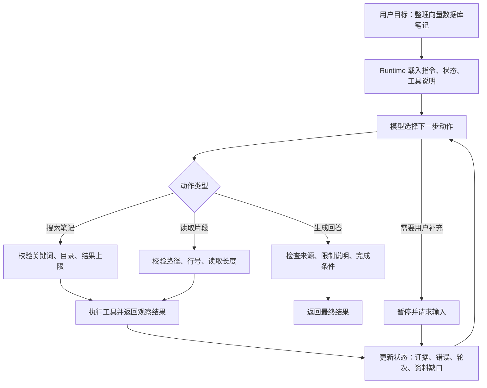
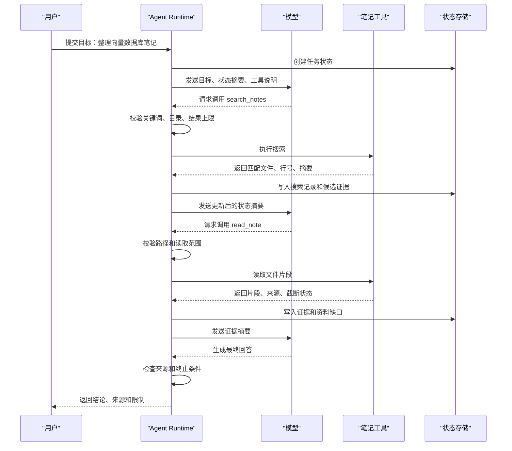

# Agent基础概念

## 1. Agent 概念的来源与演进

### 1.1 经典 AI 中的智能体

Agent 这个词早于大模型时代。经典教材《Artificial Intelligence: A Modern Approach》把智能体描述为接收环境感知并采取行动的系统。这里的环境可以是物理世界，也可以是软件世界；感知可以来自传感器、用户输入、文件、网页和数据库查询结果；行动可以是移动机械臂，也可以是调用 API、搜索资料、写入文件或返回一段答复。

这个定义给了后来的 LLM Agent 一个底层框架：系统围绕目标运行，每一步都要理解当前环境，再选择下一步动作。大模型带来的变化在于，动作选择不再完全写死在代码分支里。模型可以根据上下文、工具结果和任务进展生成新的搜索词、选择要读取的文件、判断证据是否足够，再把结果组织成用户能理解的输出。

### 1.2 LLM Agent 的工程语境

在工程语境中，可以把 LLM Agent 理解为围绕目标运行的软件执行系统。它用模型理解任务和选择动作，用工具连接外部系统，用状态记录任务进展，用 Runtime 控制执行边界。这个定义刻意保持克制，因为真实项目里最容易失控的地方恰恰是把“模型能生成文字”误读成“模型可以直接控制系统”。

换句话说，Agent 的关注点已经从“生成一段回答”扩展到“推动一次任务”。用户给出目标后，系统要知道已经做过什么、还缺什么、下一步能调用什么工具、哪些动作需要停下来等待确认。模型负责策略选择，Runtime 负责把策略变成可控执行。

### 1.3 多方定义的共识

不同资料对 Agent 的侧重点略有差异，但落到工程实现后，大多会回到目标、工具、状态、编排和治理这几类问题。

| 来源 | 关注点 | 对工程实现的启发 |
| --- | --- | --- |
| AIMA | 感知、环境、行动、目标表现 | 软件 Agent 也要明确输入来源、可执行动作和成功标准 |
| Anthropic | 区分固定路径的 workflow 与模型动态选择流程的 agent | 路径稳定时优先使用工作流，路径依赖观察结果时再引入 Agent 循环 |
| OpenAI 实践指南 | 模型、工具、指令、编排、护栏和多 Agent 组织方式 | 从单 Agent 和少量工具开始，复杂度随真实问题增加 |
| Google Cloud | 理解意图、制定多步计划、使用工具执行 | Agent 架构需要模型、工具、记忆和前端交互共同配合 |
| AWS | 与环境交互、收集数据、围绕预设目标自主选择动作 | 人设定目标，系统在限定范围内选择执行路径 |
| IBM | 使用可用工具自主完成任务，覆盖决策、问题求解和外部环境交互 | Agent 能力超出自然语言生成，工具调用是进入业务系统的边界 |
| Microsoft 安全资料 | 供应链、目标劫持、跨 Agent 信任升级、上下文污染等失败模式 | 治理要覆盖完整任务链路，不能只评估单次模型输出 |

这些资料共同指向一个结论：Agent 的核心包含目标拆解、行动执行、观察反馈和受控推进，单纯的自然语言生成只能覆盖其中一部分。

## 2. 从问答系统到可行动系统

### 2.1 本地笔记整理案例

先看一个本地笔记整理场景。用户输入：“整理我关于向量数据库的笔记，输出核心概念和选型建议。”如果系统只是一次模型问答，模型只能基于上下文中已有内容回答。若上下文里没有笔记原文，回答就会退化成通用介绍，无法说明哪些结论来自用户自己的材料。

RAG 改进了这个问题。系统可以先检索相关文档，再把片段交给模型生成回答。对“基于文档回答问题”这类任务，RAG 已经足够有效。麻烦出现在任务路径变长之后：检索结果可能太少，模型需要换关键词；片段可能只有概念，没有产品对比；用户可能要求把结果写成新 Markdown 文件；某些来源之间可能互相冲突，需要继续读取上下文。此时，系统需要多轮观察和行动。

### 2.2 LLM 问答、RAG、Workflow 与 Agent 的边界

固定工作流也有边界。假设流程写成“检索一次、读取前三个片段、生成摘要”，它很容易实现，也容易测试。但用户的问题并不总是落在这个固定路径里。向量数据库选型可能需要继续搜索 HNSW、IVF、pgvector、Milvus、Pinecone、成本、运维等维度；代码修复任务可能需要先搜索报错，再读实现，再改代码，再运行测试。分支全部写在代码里，很快会膨胀。

下面的对比有助于判断该用哪种形态。

| 形态 | 系统行为 | 适合场景 | 主要限制 |
| --- | --- | --- | --- |
| LLM 问答 | 模型直接基于输入生成回答 | 问题简单、上下文已完整 | 无法主动获取新资料 |
| RAG | 检索资料后生成回答 | 文档问答、知识库查询 | 检索后是否继续行动通常由固定流程决定 |
| Workflow | 代码控制每个阶段 | 表单抽取、审批、格式转换、稳定业务链路 | 开放任务会产生大量分支 |
| Agent | 模型在 Runtime 管控下选择工具和下一步 | 调研、代码修复、复杂资料整理、跨系统任务 | 成本、延迟、权限和调试复杂度更高 |

这张表的重点在于任务路径。路径稳定时，工作流更容易测试；路径依赖中间结果时，Agent 循环更有价值。RAG 可以作为 Agent 的一个工具存在，负责召回候选材料；Runtime 继续判断是否读取更多片段、扩展查询或生成结论。

### 2.3 最小 Agent 的目标收敛

本地笔记整理 Agent 的目标可以收敛为：在指定目录内搜索和读取 Markdown 文件，逐步沉淀证据，生成带来源和限制说明的回答。它不需要一开始就写文件、联网搜索或调用企业系统。能力边界越清楚，后续工具和状态设计越稳定。

这个收敛方式能把教学案例控制在可理解范围内。读者只需要关注两个工具：搜索和读取；一个状态对象：记录任务进展；一个循环：模型选择动作，Runtime 执行动作并回填观察。后续写入文件、联网搜索、多 Agent 协作，都可以在这个最小闭环上扩展。

## 3. 最小 Agent 如何运行

### 3.1 五个组成部分

一个可运行的最小 Agent 至少包含五部分：指令、模型、工具、状态和 Runtime。它们分别承担不同职责，混在一起会让调试变得困难。

| 组件 | 在本地笔记整理 Agent 中的作用 | 常见工程问题 |
| --- | --- | --- |
| 指令 | 说明只基于指定目录笔记回答、需要引用来源、资料不足时说明限制 | 指令写得很长，却没有 Runtime 权限控制 |
| 模型 | 基于目标、状态和工具结果选择搜索、读取或最终回答 | 工具太多时选择不稳定，长上下文中容易遗漏早期约束 |
| 工具 | 提供 `search_notes`、`read_note` 等外部能力 | 参数过于自由、输出太长、错误信息缺少结构 |
| 状态 | 记录目标、已搜索关键词、已读取文件、证据、错误和轮次 | 只保存聊天历史，长任务中无法判断进展 |
| Runtime | 调用模型、校验工具参数、执行工具、更新状态、判断是否结束 | 把模型生成的动作直接执行，缺少权限和预算控制 |

指令负责影响模型策略，但不承担安全执行。比如指令可以要求“不要读取目录外文件”，真正的路径检查仍要由 Runtime 做。模型输出的工具调用只代表候选动作，Runtime 必须检查工具是否存在、参数是否符合 schema、路径是否在允许范围内、调用次数是否超过预算。

工具是 Agent 接触外部世界的接口。对本地笔记整理 Agent，`search_notes` 只负责按关键词返回候选文件和行号，`read_note` 只负责读取指定文件片段。工具返回值要保留来源、截断状态和错误类型，方便模型判断下一步，也方便用户复核最终结论。

状态让 Agent 从“多次聊天”变成“一个持续任务”。本地笔记整理任务里，状态至少应包含当前目标、已搜索关键词、已读取文件、证据摘录、资料缺口、错误记录、轮次和预算。模型每轮看到的内容可以是压缩后的状态摘要，而不必读完整消息历史。

### 3.2 一个最小 Python 示例

下面的代码用内存字典模拟本地笔记，用 `fake_model` 模拟模型决策。它不依赖真实模型 SDK，也不访问文件系统，重点展示工具、状态、循环和停止条件如何连在一起。

```python
notes = {
    "vector-db.md": "向量数据库用于存储 embedding，并支持相似度检索。HNSW 适合低延迟召回。",
    "rag-notes.md": "RAG 通常先检索资料，再把片段交给模型生成回答。",
    "pgvector.md": "pgvector 适合已经使用 PostgreSQL 的小规模向量检索场景。",
}


def search_notes(keyword):
    # 工具：根据关键词返回命中的笔记路径
    return [path for path, text in notes.items() if keyword in text]


def read_note(path):
    # 工具：读取指定笔记内容，真实系统里还要校验路径权限
    return notes.get(path, "")


def fake_model(state):
    # 模拟模型：先搜索，再读取命中文档，最后生成回答
    if not state["matches"]:
        return {"tool": "search_notes", "args": {"keyword": "向量"}}

    unread = [path for path in state["matches"] if path not in state["read"]]
    if unread:
        return {"tool": "read_note", "args": {"path": unread[0]}}

    return {"final": "已整理向量数据库笔记，结论见 evidence。"}


def run_agent(goal):
    # 状态：记录目标、搜索结果、已读文件和证据
    state = {
        "goal": goal,
        "matches": [],
        "read": set(),
        "evidence": [],
        "step": 0,
    }

    while state["step"] < 5:
        action = fake_model(state)

        if "final" in action:
            return {
                "answer": action["final"],
                "sources": sorted(state["read"]),
                "evidence": state["evidence"],
            }

        if action["tool"] == "search_notes":
            state["matches"] = search_notes(**action["args"])

        if action["tool"] == "read_note":
            path = action["args"]["path"]
            content = read_note(path)
            state["read"].add(path)
            state["evidence"].append({"path": path, "content": content})

        # 停止条件的一部分：防止循环无限执行
        state["step"] += 1

    return {"answer": "达到最大轮次，当前证据不足。", "sources": sorted(state["read"])}


result = run_agent("整理向量数据库笔记")
print(result)
```

这个示例里，`fake_model` 只做了非常简单的三段式决策：没有搜索结果就搜索，有未读文件就读取，资料读完后生成回答。真实 Agent 会把这一步交给大模型，但 Runtime 的职责并没有变化：接收动作、执行工具、更新状态、检查是否停止。

### 3.3 Runtime 执行循环

Agent Runtime 是整个系统的执行中枢。它不负责替模型思考结论，却负责决定模型生成的动作能否落地。一个典型循环包含六个阶段：加载状态、调用模型、解析动作、校验参数、执行工具、写回观察结果。



这条流程里，模型每次只负责提出下一步。Runtime 在每个工具调用前都要做校验。以 `read_note` 为例，模型可能给出 `../private/secret.md`，也可能要求一次读取几千行。Runtime 应把路径解析为绝对路径，确认它位于允许目录下，再限制读取行数和字节数。校验失败时，Runtime 把结构化错误写回状态，让模型选择改用其他关键词、请求授权或结束任务。

一次运行的时序可以展开得更细。



这个设计把模型调用和工具执行隔离开。模型看到的是工具说明和观察结果，Runtime 掌握真实执行权。这样做会多写一些框架代码，却能让日志、权限、错误恢复和测试都有明确位置。

### 3.4 工具调用机制

工具调用的底层可以分成三层：模型侧的工具说明、Runtime 侧的参数校验、工具函数侧的真实执行。工具说明通常包含名称、描述、参数 schema 和返回格式。模型据此生成结构化调用，Runtime 据此解析和校验，再把合法参数传给工具函数。

一个 `read_note` 工具可以用下面的 schema 约束参数。

```json
{
  "name": "read_note",
  "parameters": {
    "type": "object",
    "properties": {
      "path": {"type": "string"},
      "start_line": {"type": "integer", "minimum": 1},
      "line_count": {"type": "integer", "minimum": 1, "maximum": 80}
    },
    "required": ["path", "start_line"]
  }
}
```

工具返回值也要结构化。成功结果可以包含 `ok`、`summary`、`data`、`source`、`truncated` 和 `elapsed_ms`。失败结果可以包含 `ok`、`error_type`、`message` 和 `retryable`。模型看到 `retryable: true` 时可以换关键词或缩小读取范围；看到权限拒绝时应停止或请求用户补充授权。

```json
{
  "ok": true,
  "summary": "Found 6 matches in 3 notes.",
  "data": [
    {
      "path": "notes/vector-db.md",
      "line": 42,
      "text": "HNSW indexes trade memory for low-latency approximate nearest neighbor search."
    }
  ],
  "source": "local_notes",
  "truncated": false,
  "elapsed_ms": 18
}
```

这里的关键点是，工具输出只是一段观察数据。网页、文档、代码注释、上传文件都可能包含诱导模型改变行为的文本。Runtime 回填工具结果时，应明确标记来源，并避免把工具内容提升成系统级指令。对命令执行类工具，还要保留退出码、超时状态和输出截断情况。

### 3.5 状态、失败与终止

很多入门 Demo 把 `messages` 当作全部状态。短对话中这样做足够；任务一旦变长，消息历史会迅速膨胀，工具结果挤占上下文，早期约束被冲淡，失败尝试也难以被程序识别。工程实现里，状态要从聊天记录中拆出来。

本地笔记整理 Agent 的状态可以包含以下信息：用户目标、输出要求、已搜索关键词、已读取文件、证据摘录、资料缺口、错误记录、当前轮次、预算、trace id。模型每轮只需要看到压缩后的状态摘要，例如“已确认事实”“仍缺少的维度”“下一步候选动作”。完整日志则保留在系统侧，用于审计和调试。

状态设计直接影响失败处理。搜索无结果、路径越界、读取范围过大、工具超时、外部 API 限流、用户目标缺少必要条件，这些失败都应进入状态。可恢复失败可以让模型调整参数继续尝试；不可恢复失败应尽早结束，并向用户说明原因。

终止条件同样要写在 Runtime 中。常见结束场景包括：模型生成最终回答；达到最大轮次或成本上限；连续几轮没有新增证据；用户拒绝高风险动作；工具返回不可恢复错误；当前证据已经覆盖用户要求的关键维度。对资料整理任务，还应要求最终回答带来源；没有来源时，结果应说明本地资料未覆盖相关内容。

以向量数据库笔记为例，一次合理运行可能是这样的：第一轮搜索“向量数据库”“embedding”“ANN”；第二轮读取 `vector-db.md` 和 `rag-notes.md` 的相关片段；第三轮发现产品选型维度不足，继续搜索 “pgvector Milvus Pinecone”；第四轮读取产品对比片段；第五轮生成回答。若搜索不到成本和运维资料，最终结果应把这个缺口写出来，避免把通用知识包装成本地笔记结论。

## 4. 工程落地与学习路径

### 4.1 治理、权限与日志

Agent 能调用工具，就会产生真实影响。只读搜索的风险较低，写文件、发消息、改配置、提交审批、部署服务的风险会明显上升。治理要让每一次行动都有边界、记录和恢复路径，同时把自动执行范围限定在可接受风险内。

生产系统里可以把工具按风险分层。只读工具用于搜索和读取资料；低风险写入工具用于生成草稿或临时文件；高风险工具用于删除文件、发送消息、修改生产配置或触发支付。不同风险对应不同策略：只读工具自动执行，低风险写入展示变更摘要，高风险动作要求人工确认，并保留审计记录。

日志要覆盖完整链路。一次任务至少应记录用户目标、模型版本、指令版本、工具调用、参数摘要、返回摘要、错误、耗时、状态变化和最终回答。对跨系统任务，还要有 trace id，把模型调用、工具服务、数据库、下游 Agent 和客户端事件串起来。没有这些记录，问题发生后只能从最终回答倒推，定位成本很高。

Microsoft 对 agentic AI failure modes 的更新提醒了几个新的风险面：工具和插件供应链可能通过自然语言说明影响 Agent 行为；目标可能被恶意内容悄悄改写；多 Agent 协作中可能出现信任升级；图形界面中的隐藏文本也可能影响计算机使用类 Agent。OpenAI 关于 agentic AI systems 治理的资料也强调行动记录、人工批准、能力边界、阶段性部署和可逆性。把这些观点落到实现层，就是让 Runtime、工具和日志一起承担安全职责。

### 4.2 从只读 Agent 到写入能力

本地笔记整理 Agent 初版可以保持只读。等搜索、读取、引用来源和失败处理稳定后，再加入“生成新 Markdown 文件”。加入写入能力时，应增加路径检查、覆盖确认、diff 展示和回滚方式。这个推进顺序能让系统先建立可靠观察，再逐步开放行动。

写入能力还会改变测试重点。只读阶段主要检查是否搜索到正确资料、是否引用来源、是否说明资料缺口。写入阶段还要检查文件路径、覆盖行为、产物格式、重复运行结果和人工确认流程。若没有这些验证，Agent 看起来完成了任务，实际可能留下难以追踪的文件变更。

### 4.3 与后续文章的关系

学习 Agent 时，建议先手写一个只读版本。它只接收一个目录和一个问题，能搜索、读取、整理来源，并在资料不足时说明限制。这个版本可以帮助理解目标、状态、工具、观察和终止条件，也能暴露工具描述、参数校验和结果截断中的实际问题。

只读链路稳定后，再学习工具设计。工具文章会进一步展开 `find_files`、`search_text`、`read_file`、`apply_patch`、`run_tests` 等工具的参数、权限、返回结构和调试方式。工具设计做得好，模型更容易选对动作，Runtime 也更容易校验和审计。

随后可以进入设计模式。固定工作流、单 Agent、Routing、Supervisor-Worker、Handoff、Evaluator-Optimizer 解决的是任务组织问题。它们建立在本文的最小闭环之上，通过控制权、分工方式和验证方式的变化处理更复杂的任务。

最后再看协议。MCP 解决 Agent Runtime 与工具和上下文系统的连接；A2A 和 ACP 解决 Agent 之间的任务协作；Agent Client Protocol 解决客户端与 Runtime 之间的事件、权限和结果展示。协议能提升互操作性，但前提仍然是最小 Agent 的边界、状态和工具结果已经设计清楚。

理解 Agent 可以从一次任务拆解开始：用户给出目标，Runtime 组织上下文，模型选择动作，工具返回观察，状态记录进展，系统判断是否继续。只要这条链路清楚，后续学习多 Agent、MCP、评估和治理都会更容易落到工程实现上。

## 参考资料

- [AIMA Chapter 2: Intelligent Agents](https://aima.cs.berkeley.edu/4th-ed/pdfs/newchap02.pdf)
- [Anthropic: Building effective agents](https://www.anthropic.com/engineering/building-effective-agents)
- [OpenAI: A practical guide to building agents](https://openai.com/business/guides-and-resources/a-practical-guide-to-building-ai-agents/)
- [OpenAI: Practices for governing agentic AI systems](https://openai.com/index/practices-for-governing-agentic-ai-systems/)
- [Google Cloud: Core concepts of AI agents](https://cloud.google.com/resources/core-concepts-ai-agents)
- [Google Cloud: Choose your agentic AI architecture components](https://docs.cloud.google.com/architecture/choose-agentic-ai-architecture-components)
- [AWS: What are AI Agents?](https://aws.amazon.com/what-is/ai-agents/)
- [IBM: What Are AI Agents?](https://www.ibm.com/think/topics/ai-agents)
- [Microsoft: Updating the taxonomy of failure modes in agentic AI systems](https://www.microsoft.com/en-us/security/blog/2026/06/04/updating-taxonomy-failure-modes-agentic-ai-systems-year-red-teaming-taught-us/)
