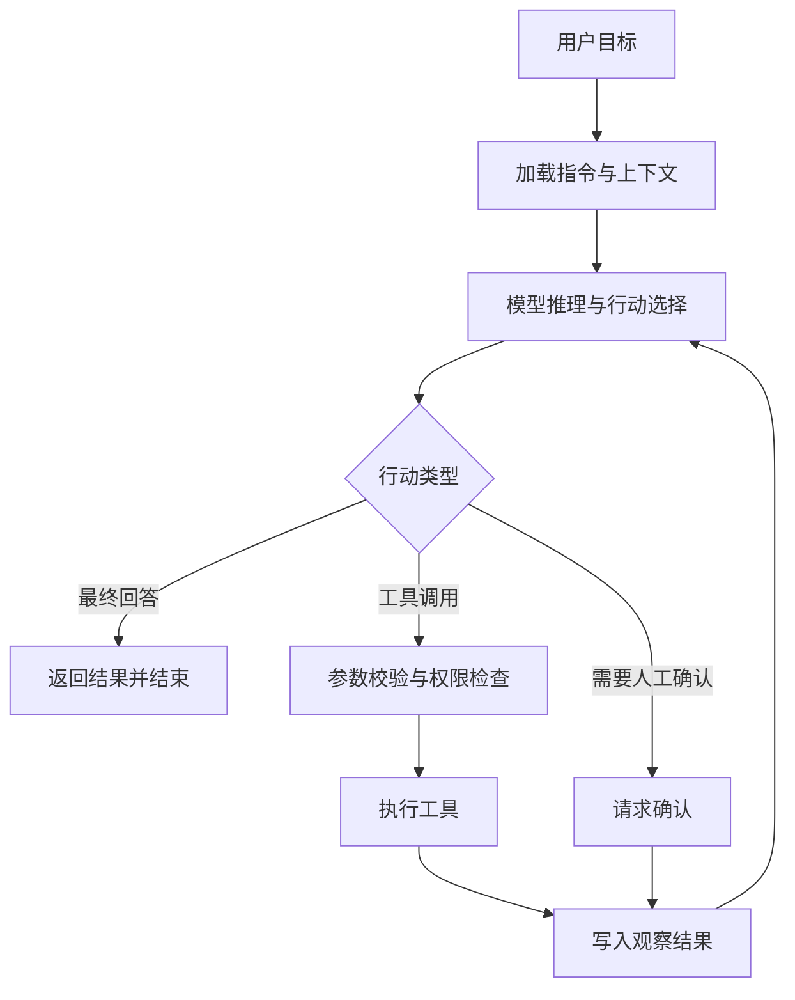

# Agent基础概念

Agent 是一种由模型参与控制执行过程的软件系统。它接收任务、读取上下文、决定下一步行动、调用外部工具、观察结果，并在多轮循环中逐步推进目标。和普通问答应用相比，Agent 的关键变化在于模型输出不只是一段自然语言，它还可能包含结构化行动，例如调用搜索、读文件、运行命令、写入数据库、请求人工确认，或者把任务移交给另一个更专门的执行单元。工程上可以把 Agent 看作一个“模型驱动的控制器”，模型负责在当前状态下选择动作，宿主程序负责验证动作、执行工具、记录状态和处理异常。

Anthropic 在关于 effective agents 的讨论中把系统分为 workflow 和 agent 两类：workflow 更强调预先写好的控制路径，agent 更强调模型根据环境反馈动态决定流程。这个区分对工程实践很有帮助，因为它提醒开发者不要把所有自动化流程都称为 Agent。一个只按固定步骤调用检索、摘要和输出的程序，本质上是工作流；一个在任务不确定、工具结果不可预测、路径需要动态调整的场景中持续选择下一步行动的程序，才具有典型 Agent 特征。OpenAI Agents SDK、LangChain Agents、AutoGen、CrewAI 等框架虽然抽象层不同，但核心都围绕模型、指令、工具、状态、执行器和追踪这几个部分展开。

一个 Agent 至少包含七个基础部件。第一是模型，它提供语言理解、推理和决策能力。第二是指令，它规定角色、目标、约束、输出格式和安全边界。第三是上下文，它可以来自用户输入、系统消息、历史对话、检索文档、文件内容、环境变量或者业务状态。第四是工具，它把模型连接到外部世界，例如搜索、数据库、HTTP 请求、代码执行、文件读写和业务 API。第五是状态，它记录任务进度、消息历史、工具结果、预算、失败次数和中间决策。第六是执行器，它解析模型输出、校验工具参数、调用工具、捕获错误、把观察结果写回状态。第七是终止条件，它决定循环何时结束，常见条件包括模型给出最终回答、达到最大轮次、工具失败达到阈值、预算耗尽或者人工中止。

最小 Agent 的结构可以用一个循环表示。用户给出目标后，系统把目标和当前状态交给模型，模型选择自然语言回答或工具调用。工具调用被执行后，结果重新回到上下文，模型再根据新观察做下一步判断。这个循环看似简单，实际承载了 Agent 的主要工程复杂度：每一次模型输出都可能改变路径，每一次工具结果都可能引入新的不确定性，每一次状态追加都会影响后续推理。



最简单的 Agent 可以只支持一个工具。下面的伪代码展示了常见实现方式：工具使用 JSON Schema 描述参数，模型输出 tool call，执行器根据工具名找到函数并执行，再把结果作为 tool message 追加回消息列表。真实项目中还需要加入鉴权、超时、重试、审计和并发控制，这里只保留最小闭环。

```python
tools = {
    "search_notes": {
        "description": "Search local notes by keyword.",
        "schema": {
            "type": "object",
            "properties": {
                "keyword": {"type": "string"}
            },
            "required": ["keyword"]
        },
        "handler": lambda keyword: search_notes(keyword)
    }
}

messages = [
    {"role": "system", "content": "You are a careful research agent."},
    {"role": "user", "content": "整理我关于向量数据库的笔记。"}
]

for step in range(8):
    response = call_model(messages=messages, tools=tools)
    if response.final_answer:
        print(response.final_answer)
        break

    for call in response.tool_calls:
        tool = tools[call.name]
        validate(call.arguments, tool["schema"])
        result = tool["handler"](**call.arguments)
        messages.append({
            "role": "tool",
            "tool_call_id": call.id,
            "content": serialize(result)
        })
```

这个例子揭示了 Agent 的第一个原则：模型只负责提出动作，宿主程序必须负责执行动作。模型生成的工具参数要经过结构校验，工具名要在白名单内，执行环境要受到权限和资源限制。把模型输出直接拼接到 shell、SQL 或浏览器自动化脚本里会放大注入风险。一个严谨的 Agent 系统会把“模型计划”和“系统执行”分成两个边界清晰的阶段：计划阶段允许模型表达意图，执行阶段由确定性代码完成校验、授权、记录和实际调用。

第二个原则是状态必须显式管理。很多入门示例把消息数组当作唯一状态，这在小任务中足够，但在生产系统里很快会遇到问题。消息历史会不断增长，工具结果可能很大，隐私数据需要隔离，某些中间结果需要持久化，某些思考过程不能泄漏给用户，长任务还需要断点恢复。更合理的做法是把状态拆成多层：对话状态保存用户可见上下文，任务状态保存目标、阶段、待办项和完成条件，工具状态保存调用记录和结果摘要，运行状态保存预算、轮次、错误和追踪标识，长期记忆保存可跨会话复用的信息。状态拆分后，模型每轮接收的上下文可以通过选择和压缩得到，系统也更容易做审计和恢复。

第三个原则是工具要按能力边界设计。工具名称应该表达稳定能力，描述应该说明适用场景，参数 schema 应该尽量约束清楚。工具粒度过粗时，模型很难精确控制；工具粒度过细时，模型需要进行大量低价值决策。比如“修改项目代码”作为工具过于宽泛，模型会把太多意图塞进一个字符串参数；“读取文件”“搜索文本”“应用补丁”“运行测试”这些工具更便于审计和控制。Anthropic 的 tool use 文档强调工具定义通常包含名称、描述和输入 schema，这种结构化描述让模型能够在自然语言推理和程序化行动之间建立稳定接口。

第四个原则是循环必须有边界。Agent 很容易陷入重复搜索、反复尝试、不断追加上下文的低效状态。最小实现也应该设置最大步数、最大工具调用次数、单次工具超时、总预算和失败阈值。更高级的系统会加入 progress evaluator，让模型或规则检查任务是否真正前进；也会加入 plan checkpoint，在关键阶段要求模型总结当前结论、剩余问题和下一步依据。循环边界并不只为了省资源，它也是产品可靠性的基础。用户需要知道系统何时完成、何时失败、失败原因是什么、是否可以恢复。

第五个原则是观察结果需要经过整理再回填。工具返回的数据经常包含冗余、异常、格式错误或敏感信息。直接把原始结果塞回模型上下文会增加 token 成本，也可能引入提示注入。检索网页时尤其明显：网页内容可能包含“忽略之前指令”之类的恶意文本。执行器应该把工具结果视为不可信输入，对其进行截断、清洗、摘要、引用标注和来源隔离。对于文件系统、命令行、数据库这类高影响工具，结果回填还应包含退出码、耗时、标准输出摘要、错误摘要和被访问资源，以便后续步骤能做稳定判断。

Agent 的“自主性”来源于动态决策，但这并不意味着系统要让模型无限制行动。工程上通常把自主性分成几个级别。最低级别是建议型 Agent，模型只生成计划或候选动作，用户手动执行。第二级是受限执行 Agent，模型可以调用只读工具或低风险 API。第三级是可写执行 Agent，模型能修改文件、创建任务、调用外部服务，但关键动作需要审批。第四级是长任务 Agent，模型可以在后台运行、定期唤醒、维护持久状态，并在失败时恢复。不同级别对应不同的安全设计，不能只用一个“是否自动化”的标签概括。

最小可运行 Agent 的实现顺序通常是：先定义任务边界，再定义工具集合，然后设计状态结构，接着写执行循环，最后补齐观测、错误处理和测试。任务边界要说明 Agent 能处理哪类目标，例如“基于本地 Markdown 笔记生成摘要”比“帮我管理知识库”更适合初版。工具集合要从只读工具开始，例如搜索、读取、列目录、查询 API。状态结构要能记录每次工具调用的输入输出和模型决策。执行循环要保持简单，让每轮只有一种明确结果：最终回答、工具调用、请求确认或失败。测试要覆盖正常路径、工具参数缺失、工具不存在、工具超时、结果为空、达到最大轮次等情况。

Agent 与传统后端服务的最大工程差异在于控制流的可预测性。传统服务的路径由代码分支决定，输入通过规则或模型分类后进入固定处理链。Agent 的路径会随模型判断变化，同一个任务在不同上下文下可能选择不同工具、不同顺序和不同停止点。因此，Agent 系统需要比普通模型调用更多的可观测性。每次运行都应有 trace id，记录模型输入摘要、输出类型、工具调用、参数、结果、错误、耗时、token 消耗和最终状态。OpenAI Agents SDK 将 tracing 作为重要能力，LangChain 也强调持久执行、流式、人机协作和调试能力，这些设计都服务于同一个目标：让动态流程可以被复盘、评估和改进。

评估 Agent 也要从单轮回答质量扩展到任务完成质量。一个 Agent 可能在最终回答上看起来完整，但中间调用了错误工具、引用了不可靠来源、忽略了失败输出，或者把用户没有授权的内容带入结果。评估指标可以分为五类：任务成功率、工具调用正确率、步骤效率、事实可靠性和安全合规性。任务成功率关注最终目标是否完成；工具调用正确率关注工具选择和参数是否合理；步骤效率关注是否存在无意义循环和重复搜索；事实可靠性关注回答是否能追溯到工具结果或可靠上下文；安全合规性关注权限、隐私、注入和越权操作。

在实际项目中，很多 Agent 问题来自过早追求复杂架构。单 Agent 加少量工具就能完成的任务，不需要马上引入多 Agent 协作。固定流程能稳定解决的场景，可以优先使用 workflow。只有当任务路径高度依赖中间结果，或者需要多个专业能力动态协作时，Agent 才能明显降低手写分支的复杂度。Anthropic 对构建 effective agents 的建议也强调先从简单组合模式开始，只有在效果需求确实推动时再增加复杂度。这个建议对小团队尤其重要，因为复杂 Agent 的维护成本通常体现在调试、评估、权限和失败恢复上。

一个成熟 Agent 的代码通常由四层组成。接口层负责接收用户请求、展示进度、收集确认。编排层负责执行循环、状态转移、终止条件和人机交互。能力层负责工具注册、参数 schema、执行隔离和结果标准化。基础设施层负责日志、追踪、队列、缓存、密钥、权限和持久化。把这些层分开后，模型和工具可以替换，状态可以迁移，安全策略也能独立演进。很多入门代码把这些职责写在一个函数里，短期可以跑通，长期会导致每次新增工具都影响循环逻辑，每次修改提示词都影响安全边界。

最小 Agent 的提示词应当强调可执行目标、可用工具、输出格式和停止条件。一个常见结构是：系统身份、任务边界、工具使用规则、禁止行为、失败处理、最终回答格式。提示词不应该承担所有安全责任，它只能作为模型行为约束的一部分。真正的权限控制要写在执行器里，真正的数据隔离要写在工具层，真正的审计要写在日志和追踪系统里。把提示词当作唯一防线会让系统在面对恶意输入、模型漂移或上下文污染时失去稳定性。

上下文选择是 Agent 性能的重要来源。模型每轮看到的内容越多，成本越高，干扰也越多。一个有效策略是把上下文分为固定指令、短期状态、相关证据和运行摘要。固定指令每轮都带上；短期状态包含用户目标、当前计划和最近工具结果；相关证据通过检索或引用选择进入；运行摘要用于替代冗长历史。这样做可以减少上下文膨胀，也能让模型更清楚当前阶段。对长任务 Agent 来说，状态摘要的质量会直接影响后续决策，摘要应保留已完成事项、未解决问题、关键证据、失败尝试和用户偏好。

工具调用结果的可信度需要分级。来自官方 API 的结构化结果可信度较高，但仍可能过期或权限不足；来自网页和用户上传文件的文本要按不可信内容处理；来自命令行工具的输出要结合退出码判断；来自另一个 Agent 的结论需要带来源和置信度。Agent 在最终回答中引用事实时，最好能指出事实来自哪个工具结果或哪份材料。对于需要高准确性的任务，系统可以要求模型先列出证据，再生成结论，或者让一个评估器检查结论是否被证据支持。

错误处理决定了 Agent 能否从不完美环境中恢复。工具可能超时，参数可能不合法，外部服务可能返回 429，文件可能不存在，搜索结果可能为空。执行器应该把错误转换成模型可理解的观察结果，同时保留机器可读字段。比如工具结果可以包含 `ok`、`error_type`、`message`、`retryable` 和 `suggested_fix`。模型看到可恢复错误时可以调整参数重试，看到不可恢复错误时应该改变策略或向用户说明。错误结果也要进入 trace，便于后续分析失败模式。

人机协作是 Agent 落地中的常态。很多操作可以自动完成，但高影响动作需要确认，例如删除文件、发送邮件、支付费用、修改生产数据、发布内容。确认不应只在 UI 上弹一句“是否继续”，还要展示 Agent 准备执行的动作、影响范围、依据和可撤销性。更好的设计是把工具分为只读、低风险写入和高风险写入三类，并为每类设置不同审批策略。这样既能保持效率，也能降低误操作成本。

从开发者视角看，Agent 的最小闭环并不复杂：消息、工具、循环、状态和终止条件。真正的难点在闭环之外：如何让工具接口稳定，如何让状态可恢复，如何让模型输出可审计，如何防止注入和越权，如何评估任务完成质量，如何在失败时给用户清晰反馈。理解这些基础概念后，再去学习设计模式、协议和工具实现，会更容易区分哪些能力属于模型，哪些能力属于宿主程序，哪些能力属于外部系统。

## 从最小示例到可维护实现

把最小 Agent 写成一个循环很容易，把它维护成长期可演进的系统要做更多拆分。第一步是把模型适配层独立出来。模型适配层只负责把内部消息、工具定义和调用选项转换成具体供应商 API 所需格式，再把响应转换成统一结构。这样可以在不影响业务逻辑的情况下替换模型或升级 SDK。第二步是把工具注册表独立出来。工具注册表维护工具名称、schema、描述、权限级别、执行函数和结果格式，执行器只根据注册表做分发。第三步是把状态存储独立出来。内存状态适合短任务，数据库或对象存储适合长任务和可恢复任务，事件日志适合审计和回放。

第四步是引入运行策略。运行策略包含最大轮次、工具预算、重试规则、并发限制、人工确认规则和降级规则。策略不应散落在提示词里，最好由配置或代码统一管理。第五步是建立 trace。每一次模型调用、工具调用、用户确认和状态变更都进入同一条 trace，便于定位“模型选错工具”“工具返回异常”“上下文过长”“用户输入不完整”等问题。第六步是建设评估集。评估集可以从真实任务中抽样，覆盖成功路径、边界条件、失败恢复和安全拦截。没有评估集时，Agent 的改进很容易停留在主观感受。

一个可维护 Agent 还需要清楚地区分实时上下文和长期记忆。实时上下文服务当前任务，应该尽量短、准、可追溯。长期记忆服务跨会话偏好或稳定知识，写入时要谨慎，读取时要带来源和时间。把所有历史对话都当作长期记忆会带来隐私和污染问题；完全没有记忆又会让系统无法学习用户偏好。常见做法是只把用户明确确认的偏好、稳定配置和项目级规则写入长期记忆，并提供查看、修改和删除机制。

Agent 的输出也需要分层。最终回答面向用户，应该清晰、简洁、说明结论和必要依据；运行日志面向开发者，应该记录细节；工具结果面向模型，应该结构化且经过清洗；审计记录面向安全和合规，应该保留调用链和授权信息。这四类输出服务不同对象，混在一起会导致泄密、噪声和调试困难。比如把完整工具日志展示给用户会影响体验，把用户可读摘要当作审计记录又会缺少关键细节。

## 一个最小 Agent 的验收标准

判断一个最小 Agent 是否真正可用，可以从十个问题检查。它是否能说明自己能做什么和不能做什么；工具参数是否经过 schema 校验；工具结果是否保留来源；是否有最大轮次和超时；失败时是否给出可理解原因；高风险动作是否需要确认；日志是否能复盘每一步；上下文是否会无限增长；提示注入是否被视为不可信输入；同一组测试任务在多次运行中是否保持基本稳定。只要这些问题中有多项没有答案，系统就还停留在原型阶段。

最小 Agent 不追求覆盖所有工具，而追求闭环可靠。一个只会读取文件、搜索文本和生成摘要的 Agent，如果权限清晰、状态可追踪、错误可恢复，就已经具备良好基础。后续增加写文件、运行测试、调用网页和跨 Agent 协作时，也能沿用同一套执行器、状态和审计设计。反过来，一个一开始就接入几十个工具、没有清晰权限和评估的 Agent，即使演示效果丰富，也很难在真实环境中稳定运行。

## 参考资料

- [Anthropic: Building effective agents](https://www.anthropic.com/research/building-effective-agents)
- [Anthropic Docs: Implement tool use](https://docs.anthropic.com/en/docs/agents-and-tools/tool-use/implement-tool-use)
- [OpenAI Developers: Agents](https://developers.openai.com/api/docs/guides/agents)
- [OpenAI Agents SDK: Agents](https://openai.github.io/openai-agents-python/agents/)
- [OpenAI Agents SDK: Tools](https://openai.github.io/openai-agents-python/tools/)
- [LangChain Docs: Agents](https://docs.langchain.com/oss/python/langchain/agents)
