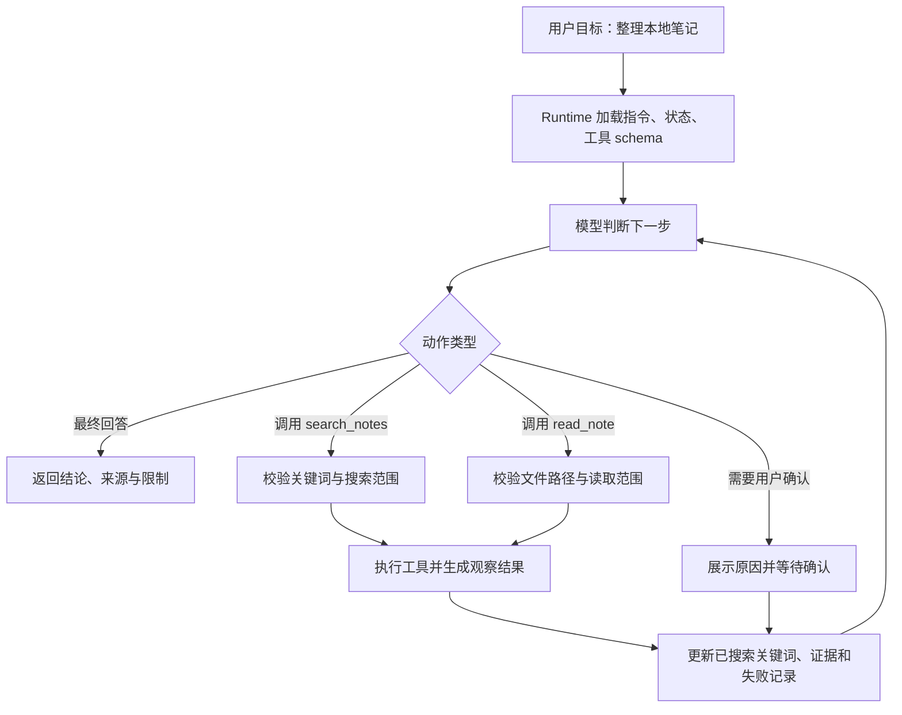

# Agent基础概念

## 1. 阅读目标与贯穿案例

本文只讨论一个最小但完整的 Agent：用户给出一个资料整理任务，Agent 能搜索本地笔记、读取相关文件、整理结论，并在证据不足时继续查找或向用户说明限制。这个案例足够小，可以看清 Agent 的核心结构；同时它包含工具调用、状态管理、循环终止和错误处理，已经覆盖真实工程中的关键问题。

读完本文后，应能回答四个工程问题：第一，Agent 与一次普通模型问答的边界在哪里；第二，一个最小 Agent 需要哪些组件；第三，模型提出工具调用后，宿主程序如何安全执行；第四，怎样判断一个 Agent 原型已经达到可维护的最低标准。后续的设计模式、协议和工具文章都会以这些概念为基础。

## 2. Agent 的工作边界

Agent 可以理解为“由模型参与决策的软件执行系统”。用户给出目标后，模型不只生成一段回答，还会根据上下文选择动作，例如搜索资料、读取文件、调用 API、运行测试或请求用户确认。真正落地动作的是 Agent Runtime。Runtime 负责把模型输出解析成结构化调用，检查工具名和参数，执行工具，把结果写回上下文，再让模型继续判断。

这个边界非常重要。模型负责理解目标、选择下一步和组织语言；Runtime 负责权限、校验、执行、日志和错误处理；工具负责访问真实系统；状态存储负责记录任务进度。把这些职责混在一起，最常见的结果是调试困难：模型为什么选错工具、工具为什么失败、状态为什么丢失、最终回答为什么缺证据，都无法清楚定位。

Anthropic 在 effective agents 的讨论中把 workflow 和 agent 分开：workflow 主要按预设路径执行，agent 让模型根据环境反馈动态决定流程。这个区分有助于控制复杂度。若资料整理任务固定为“读取指定文件、生成摘要、输出结果”，普通工作流就足够；若用户只给出模糊目标，系统需要先搜索、判断资料是否足够、决定是否扩大范围，Agent 循环才有价值。

## 3. 最小 Agent 的五个组件

### 3.1 指令

指令规定 Agent 的职责和边界。对本地笔记整理 Agent，可以写成：只基于本地笔记回答；需要事实依据时先搜索；最终回答必须列出来源文件；找不到资料时说明缺口；禁止编造未检索到的事实。指令不应承担权限控制，权限必须由 Runtime 和工具层实现。指令的作用是让模型更容易形成正确策略。

### 3.2 模型

模型负责在每一轮基于目标、状态和工具结果选择动作。它可以输出最终回答，也可以输出工具调用请求。不同模型的工具调用稳定性、长上下文能力和推理能力不同，工程上应通过统一适配层屏蔽供应商差异。适配层将内部消息、工具 schema 和调用选项转换成模型 API 格式，再把响应转换成统一的 `final_answer` 或 `tool_calls`。

### 3.3 工具

工具是 Agent 连接外部世界的接口。最小笔记 Agent 只需要两个工具：`search_notes` 用于按关键词搜索文件内容，`read_note` 用于读取指定文件片段。工具必须有名称、描述、参数 schema、权限级别和执行函数。工具描述面向模型，参数 schema 面向模型和校验器，权限级别面向 Runtime，执行函数面向真实系统。

### 3.4 状态

状态记录任务进展。最小实现可以把消息列表当状态，但更稳妥的做法是拆出任务状态：用户目标、已搜索关键词、已读取文件、关键证据、失败工具调用、当前轮次和预算。这样模型每轮看到的上下文可以更短，Runtime 也能判断是否重复搜索、是否达到最大轮次、是否需要终止。

### 3.5 Runtime

Runtime 是 Agent 的执行器。它调用模型，解析响应，校验工具调用，执行工具，整理结果，更新状态，并判断是否继续。它也是主要安全边界。模型生成的参数只能算候选动作，Runtime 必须检查路径是否在允许目录内、工具是否可用、参数是否符合 schema、调用次数是否超预算、高风险动作是否需要确认。

## 4. 执行循环：从目标到结果

最小 Agent 的控制流是一个观察循环。用户目标进入系统后，Runtime 加载指令和状态，模型选择动作。若动作为最终回答，Runtime 返回结果；若动作为工具调用，Runtime 校验并执行工具，将观察结果写回状态；若需要用户确认，Runtime 暂停并等待用户输入。这个循环持续到任务完成、预算耗尽或错误不可恢复。



这张图里的关键节点是 `Runtime 加载指令、状态、工具 schema` 和 `更新已搜索关键词、证据和失败记录`。很多入门示例只展示模型和工具之间的往返，看起来像模型直接控制系统。真实工程中，Runtime 每一轮都要做状态整理和安全判断。没有这个层，Agent 很容易重复搜索、无限循环、误读工具错误，或者把不可信工具输出当成新的系统指令。

## 5. 最小工具调用示例

下面的伪代码展示一个最小实现。示例使用 `search_notes` 和 `read_note` 两个工具。为保持重点，代码省略了具体模型 SDK 调用和文件搜索实现，但保留了 Agent Runtime 必须具备的步骤。

```python
tools = {
    "search_notes": {
        "description": "Search allowed Markdown notes by keyword.",
        "schema": {
            "type": "object",
            "properties": {
                "keyword": {"type": "string"},
                "max_results": {"type": "integer", "minimum": 1, "maximum": 20}
            },
            "required": ["keyword"]
        },
        "handler": search_notes
    },
    "read_note": {
        "description": "Read a note fragment by path and line range.",
        "schema": {
            "type": "object",
            "properties": {
                "path": {"type": "string"},
                "start_line": {"type": "integer", "minimum": 1},
                "line_count": {"type": "integer", "minimum": 1, "maximum": 80}
            },
            "required": ["path"]
        },
        "handler": read_note
    }
}

state = {
    "goal": "整理我关于向量数据库的笔记",
    "searched_keywords": [],
    "evidence": [],
    "errors": [],
    "step": 0
}

while state["step"] < 8:
    response = call_model(
        instruction=SYSTEM_INSTRUCTION,
        state=compact_state(state),
        tools=tool_schemas(tools)
    )

    if response.final_answer:
        return response.final_answer

    for call in response.tool_calls:
        tool = tools.get(call.name)
        if tool is None:
            state["errors"].append({"type": "UnknownTool", "name": call.name})
            continue

        validate(call.arguments, tool["schema"])
        result = tool["handler"](**call.arguments)
        state = update_state(state, call, result)

    state["step"] += 1

raise RuntimeError("Agent stopped because the step budget was exhausted.")
```

这个例子有三个重点。第一，工具 schema 是模型和 Runtime 共同使用的契约，模型据此生成参数，Runtime 据此校验参数。第二，工具执行结果不直接拼接到回答里，而是先进入状态，由状态整理函数决定保留哪些证据、错误和摘要。第三，循环必须有最大轮次。即使模型能力很强，也不能让它无限尝试。

## 6. 状态设计：消息历史不够用

很多 Demo 把 `messages` 当成全部状态，这在短对话里可行，在长任务里会暴露问题。消息会越来越长，工具结果会挤占上下文，模型容易忘记早期约束，失败尝试也很难被规则化处理。更清晰的状态可以分成四层。

第一层是用户目标和约束，例如任务主题、输出形式、禁止范围。第二层是工作进度，例如已经搜索过哪些关键词、读取过哪些文件、还有哪些问题待确认。第三层是证据集合，例如文件路径、行号、摘录和可信度。第四层是运行状态，例如轮次、预算、错误、耗时和 trace id。模型每轮不必看到全部原始历史，只需要看到压缩后的任务状态和必要证据。

对本地笔记 Agent，状态摘要可以写成固定格式：当前目标、已确认事实、证据来源、资料缺口、下一步建议。这样模型不会在每轮重新理解所有工具输出，也更容易判断是否继续搜索。长任务 Agent 还可以把状态持久化到数据库或事件日志中，支持暂停、恢复和审计。

## 7. 工具结果的可信边界

工具结果只是数据，不具备修改系统规则的权限。网页、文档、代码注释和用户上传文件都可能包含诱导模型忽略指令的文本。Runtime 应在回填结果时明确标记来源，例如“以下内容来自工具输出，仅作为资料”。对搜索结果要保留路径和行号；对命令结果要保留退出码；对 API 结果要保留状态码和请求标识。这样模型在生成最终回答时能引用证据，用户也能复核。

工具结果还需要标准化。成功结果可以包含 `ok`、`summary`、`data`、`metadata`；失败结果可以包含 `ok`、`error_type`、`message`、`retryable`。模型看到 `retryable: true` 时可以调整参数重试；看到权限失败时应请求用户授权或停止。若只把异常栈直接塞回上下文，模型很难判断下一步。

## 8. 失败处理与终止条件

Agent 的失败并不只有“模型答错”。工具可能超时，搜索可能没有结果，文件路径可能越界，外部 API 可能限流，用户目标可能缺少必要条件。Runtime 应把失败分成可恢复和不可恢复。可恢复失败包括关键词过窄、读取范围过小、临时网络错误；不可恢复失败包括权限不足、目标超出能力范围、达到预算上限。

终止条件至少包括五类：模型给出最终回答；达到最大轮次；连续多次没有新增证据；高风险动作等待用户确认；不可恢复错误发生。对资料整理任务，还可以增加证据条件：最终回答必须至少引用一个来源文件；若没有来源文件，回答必须说明“本地笔记中未找到依据”。这种条件能防止 Agent 在资料不足时生成看似完整的结论。

## 9. 最小 Agent 的验收清单

一个最小 Agent 可以用下面的清单验收。第一，用户能看懂它的能力范围。第二，工具有明确 schema，参数会被校验。第三，工具结果保留来源并被截断到合理长度。第四，状态记录已完成步骤和失败原因。第五，循环有最大轮次和预算。第六，高风险动作需要确认。第七，最终回答能说明证据来源和限制。第八，日志能复盘模型选择了什么工具、参数是什么、工具返回了什么结果。第九，重复执行同一组测试任务时，轨迹和结果不会大幅漂移。第十，工具输出中的外部文本不会改变系统指令。

这个清单比“能回答一个问题”更严格，也更贴近工程落地。Agent 的价值来自持续完成任务的可靠性，而可靠性来自边界、状态、工具、观察和评估。后续引入多 Agent、MCP、A2A 或更多 CLI 工具时，本质上都是在这个最小闭环上扩展通信对象和能力边界。

## 10. 一次完整运行示例

假设用户输入：“整理我关于向量数据库的笔记，输出核心概念和选型建议。”Agent 第一轮不应直接写报告，因为它还没有证据。更合理的第一步是调用 `search_notes`，关键词可以是“向量数据库”“embedding”“ANN”“Milvus”“pgvector”。Runtime 记录搜索关键词和返回的文件列表。若结果集中出现 `vector-db.md`、`rag-notes.md` 和 `database-index.md`，第二轮模型应选择读取这些文件的相关片段，而不是继续扩大搜索。

读取片段后，状态中可以形成三类证据：向量数据库的用途、索引与召回机制、具体产品对比。若某个文件提到“HNSW 适合高召回低延迟场景”，状态应保存文件路径、行号和摘录。若另一个文件提到“pgvector 适合已有 PostgreSQL 体系的小规模场景”，也应保存来源。第三轮模型看到证据已经覆盖核心概念和选型维度，可以生成报告；若证据只覆盖概念，没有覆盖产品对比，应继续搜索“Milvus pgvector Pinecone 对比”或向用户说明资料缺口。

最终回答不应只给结论，还要给来源和限制。比如“基于 `rag-notes.md:32` 和 `database-index.md:18`，当前笔记主要覆盖 HNSW、embedding 存储和 pgvector 的使用限制；没有找到关于成本和运维指标的本地资料，因此选型建议只覆盖技术适配，不覆盖预算测算。”这种回答比泛泛介绍更可靠，因为用户能看到 Agent 的证据边界。

## 11. 从 Demo 到项目的实施步骤

第一步，写清楚能力边界。不要一开始就做“万能知识库 Agent”，先限定为“基于指定目录的 Markdown 笔记整理”。边界越清楚，工具和状态越容易设计。第二步，提供最少工具。初版只需要搜索和读取，等只读链路稳定后再加入写文件、生成摘要文件或同步到其他系统。第三步，设计状态结构。状态至少包含目标、已读材料、证据、失败和轮次。第四步，建立日志。每一轮模型输出、工具调用、参数、结果摘要和最终回答都要能复盘。

第五步，准备小型评估集。可以挑选十个真实问题，例如“总结 RAG 检索优化”“找出 Transformer 注意力机制笔记”“整理向量数据库选型”。每个问题人工标注期望来源文件和最低合格答案。第六步，反复检查工具轨迹，而不只看最终回答。一个回答看起来流畅，但如果没有读取正确文件，就不能算成功。第七步，逐步增加复杂能力。例如加入“生成新 Markdown 文件”时，需要补充路径权限、覆盖确认和 diff 展示；加入“联网搜索”时，需要补充网页提示注入隔离和来源时间。

## 12. 常见设计错误

第一个错误是让模型直接生成命令。比如用户要求整理笔记，模型生成一段 shell 命令递归读取目录。这个做法难以控制路径、输出长度和错误处理。更好的方式是提供受控工具，让模型选择关键词和文件范围。第二个错误是把工具结果完整塞回上下文。长文件、搜索结果和日志会迅速挤占上下文，模型反而更难判断重点。Runtime 应做摘要、截断和来源保留。

第三个错误是没有记录失败。搜索无结果、读取路径失败、工具超时都应进入状态，否则模型可能重复同一个失败动作。第四个错误是没有完成条件。Agent 需要知道什么情况下可以结束，例如“至少找到两个来源文件并覆盖用户要求的三个维度”。第五个错误是把提示词当作唯一安全机制。提示词可以要求模型不要访问工作区外路径，但真正的路径检查必须在 Runtime 中执行。

## 13. 与普通 RAG 应用的关系

本地笔记 Agent 可以包含 RAG，但范围更宽。RAG 通常强调检索相关资料并生成回答；Agent 还会决定是否继续检索、是否读取更多上下文、是否请求用户补充信息、是否把结果写入文件、是否调用其他工具验证。若任务只是“基于文档回答问题”，RAG 工作流足够；若任务需要多轮观察和行动，Agent 循环更合适。

工程上可以把 RAG 当作 Agent 的一个工具。`search_notes` 或 `retrieve_documents` 返回候选材料，Agent 决定下一步读取、总结、扩展查询或结束。这样设计能保持系统清晰：检索模块负责召回，Agent Runtime 负责循环和状态，模型负责策略选择和回答组织。

## 14. 官方定义如何统一理解

初学者容易被不同资料里的定义绕晕。经典教材《Artificial Intelligence: A Modern Approach》把 agent 放在更宽的人工智能语境中理解：系统接收环境感知，再对环境采取行动。这里的“传感器”和“执行器”不一定是摄像头和机械臂；对软件 Agent 来说，用户输入、文件内容、网页、数据库查询结果都可以视为感知，工具调用、写文件、发请求、生成答复都可以视为行动。

IBM 的定义强调“代表用户或系统自主完成任务”，并把决策、问题求解、外部环境交互和行动执行纳入 Agent 能力范围。Google Cloud 的定义强调目标、任务、推理、规划、记忆和一定程度的自主决策。AWS 的资料强调 Agentic AI 能在既定目标下独立行动，并通过服务、工具、数据源与用户对话完成任务。OpenAI 的实践指南更偏工程视角，强调怎样识别适合 Agent 的用例、怎样设计编排逻辑、怎样让系统安全和可预测。

把这些口径合在一起，可以得到一个适合工程入门的定义：Agent 是一个围绕目标运行的软件系统，它用模型理解当前情况和选择下一步，用工具获取信息或执行动作，用状态记录任务进展，用 Runtime 控制权限、预算和错误。这个定义比“会聊天的模型”更准确，也比“全自动机器人”更克制。它能解释为什么搜索、读取、调用 API、确认、审计这些工程机制都属于 Agent 设计的一部分。

## 15. 给小白的术语表

“目标”是用户希望完成的事情，例如整理笔记、修复报错、生成报告。“上下文”是模型本轮能看到的信息，包括用户输入、历史摘要、工具结果和系统规则。“工具”是模型可以请求 Runtime 执行的外部能力，例如搜索、读文件、查数据库。“观察”是工具执行后的返回结果，例如匹配行、接口响应、测试失败日志。“状态”是系统对整个任务进度的记录，比单轮聊天历史更结构化。“编排”是 Runtime 决定何时调用模型、何时执行工具、何时停止、何时让用户确认。

“自主性”表示系统能在一定范围内选择下一步行动，不表示系统可以脱离边界随意操作。一个只读资料整理 Agent 的自主性很低，只能搜索和读取；一个能修改代码并运行测试的 Agent 自主性更高；一个能部署生产系统的 Agent 必须有更严格的确认和回滚机制。理解自主性要同时看工具范围、权限范围、预算范围和人工确认规则。

“记忆”也要分清。短期记忆服务当前任务，例如刚刚读过哪些文件；长期记忆服务跨任务偏好，例如用户希望报告使用某种结构。新手做 Agent 时可以先不做长期记忆，因为长期记忆会带来隐私、过期和污染问题。先把短期状态做好，能复盘每一步，再考虑跨会话记忆。

## 16. 为什么白皮书都强调治理

企业白皮书普遍不会只讨论“模型更聪明”，它们会反复强调权限、审计、失败模式和人工监督。原因很直接：Agent 能调用工具，就可能产生真实影响。Microsoft 的 agentic AI failure modes 资料把多 Agent 信任升级、工具供应链、MCP/plugin 滥用、视觉攻击等列为新的风险面。OpenAI 关于治理 agentic AI systems 的白皮书强调责任、行动记录、人工批准、能力边界、阶段性部署和可逆性。AWS 和 Google Cloud 的企业资料也强调生产环境中的安全、扩展、评估和运维。

因此，新手学习 Agent 时不要只看“循环图”和“工具调用示例”。更实用的学习路线是：先理解感知、行动、目标和状态；再学工具 schema 和 Runtime；然后学工作流和多 Agent；最后学协议、治理和评估。这样能避免把 Agent 理解成单个提示词技巧，也能更早建立安全边界意识。

## 17. 学完本篇后的自测问题

可以用三个问题检查是否真正理解了 Agent 基础。第一，给定“帮我整理一篇文档”的需求，你能否列出 Agent 至少需要哪些工具，以及每个工具的权限级别。第二，模型要求读取某个路径时，你能否说明 Runtime 应该做哪些校验。第三，最终回答缺少来源时，你能否判断问题出在检索、状态、提示词还是终止条件。若这三个问题能说清楚，就已经掌握了 Agent 最小闭环的核心。

继续学习时，可以先手写一个只读 Agent。它只允许搜索和读取，不允许写文件。等只读链路能稳定产生带来源的回答，再增加写入和验证工具。这个顺序能让学习者先理解“观察”和“状态”，再处理更高风险的“行动”。

## 参考资料

- [AIMA Chapter 2: Intelligent Agents](https://people.eecs.berkeley.edu/~russell/aima1e/chapter02.pdf)
- [Anthropic: Building effective agents](https://www.anthropic.com/research/building-effective-agents)
- [Anthropic Docs: Implement tool use](https://docs.anthropic.com/en/docs/agents-and-tools/tool-use/implement-tool-use)
- [OpenAI: A practical guide to building agents](https://cdn.openai.com/business-guides-and-resources/a-practical-guide-to-building-agents.pdf)
- [OpenAI: Practices for governing agentic AI systems](https://openai.com/index/practices-for-governing-agentic-ai-systems/)
- [Google Cloud: What are AI agents?](https://cloud.google.com/discover/what-are-ai-agents)
- [IBM: What Are AI Agents?](https://www.ibm.com/think/topics/ai-agents)
- [AWS: What are AI Agents?](https://aws.amazon.com/what-is/ai-agents/)
- [OpenAI Developers: Agents](https://developers.openai.com/api/docs/guides/agents)
- [OpenAI Agents SDK: Agents](https://openai.github.io/openai-agents-python/agents/)
- [OpenAI Agents SDK: Tools](https://openai.github.io/openai-agents-python/tools/)
- [LangChain Docs: Agents](https://docs.langchain.com/oss/python/langchain/agents)
