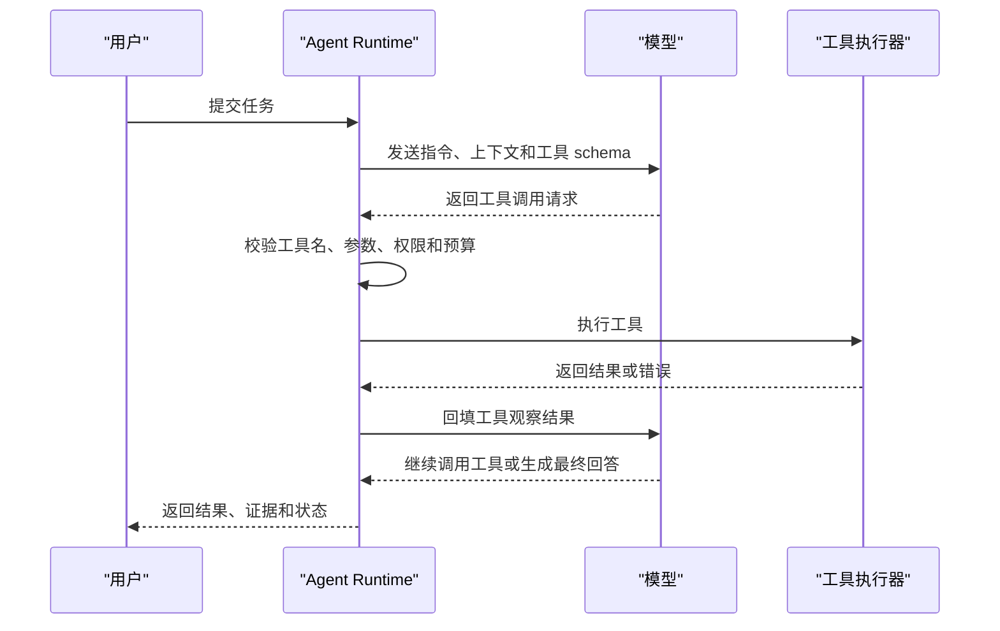

# Agent工具

工具调用是 Agent 从“生成文本”走向“执行任务”的核心机制。模型本身不能读取磁盘、访问数据库、运行命令或调用业务系统，它只能根据上下文生成输出。工具层把这些外部能力用结构化接口暴露给模型，让模型在需要时选择工具、生成参数，再由宿主程序完成校验和执行。理解工具调用时要牢牢记住边界：模型负责提出意图，执行器负责安全落地，工具函数负责访问真实系统，观察结果再回到模型上下文。

OpenAI 的 function calling 和 Agents SDK tools、Anthropic 的 tool use、LangChain 的 tools、MCP 的 tools，在抽象上都包含同一组元素：工具名称、工具描述、输入 schema、执行函数和返回结果。工具名称用于模型选择，描述用于说明何时使用，schema 用于约束参数，执行函数由宿主程序实现，返回结果会被转换成模型可阅读的消息。不同平台的字段名和运行时不同，但工程思想一致：把非结构化自然语言意图转成可验证的结构化调用。

## 工具调用生命周期

一次工具调用通常包含七个步骤。第一步是工具注册，开发者把工具名称、描述和参数 schema 提供给模型运行时。第二步是模型决策，模型根据用户目标、上下文和工具描述判断是否需要工具。第三步是参数生成，模型输出符合 schema 的 JSON 参数。第四步是执行前校验，宿主程序检查工具是否存在、参数是否有效、权限是否允许、预算是否足够。第五步是执行工具，工具访问文件系统、网络、数据库或业务 API。第六步是结果标准化，执行器把原始结果转换成可控格式，并处理错误、截断、脱敏和摘要。第七步是结果回填，模型看到观察结果后继续推理或给出最终回答。



这个生命周期说明工具调用不是一次简单函数调用。模型输出的 JSON 只是候选动作，真正的执行必须经过宿主程序控制。宿主程序要能拒绝不存在的工具、修正或拒绝无效参数、限制路径访问、处理超时、记录审计日志、给用户请求确认。对高风险工具来说，执行前还要展示影响范围，例如将要删除哪些文件、将要发送什么邮件、将要写入哪个数据库表。工具调用的安全性主要来自执行器和权限系统，而不是来自模型自觉。

## JSON Schema 与参数设计

工具参数通常用 JSON Schema 描述。Schema 可以约束字段类型、必填项、枚举值、数组、对象和嵌套结构。一个好的 schema 会让模型更容易生成正确参数，也让执行器更容易校验。比如搜索工具可以定义 `query`、`path`、`case_sensitive`、`max_results`；文件读取工具可以定义 `path`、`start_line`、`line_count`；命令执行工具可以把命令限制为数组参数，而不是让模型生成一整段 shell 字符串。参数越结构化，越容易做权限判断。

工具描述要说明适用场景和限制条件。只写“搜索文件”不够，最好说明它搜索什么范围、是否支持正则、是否遵守忽略文件、返回格式是什么。模型依赖工具描述做选择，描述模糊会导致滥用或误用。描述也不能承诺工具做不到的能力，例如一个只搜索本地文件名的工具不应描述成能理解项目语义。对于相近工具，描述要强调差异，例如 `find_files` 用于按名称和路径查找文件，`search_text` 用于在文件内容中查找文本。

Schema 还要避免过度自由。字符串参数最灵活，也最难保护。比如 `run_shell(command: string)` 对模型很方便，但执行器很难判断风险。更安全的设计可以拆成受控工具：`list_files(path, pattern)`、`search_text(path, query)`、`read_file(path)`、`apply_patch(patch)`、`run_tests(test_target)`。如果确实需要 shell 工具，应把它放在隔离环境中，限制工作目录、环境变量、网络、超时和可写路径，并对危险命令进行确认。

## 工具选择

模型选择工具时，会综合用户目标、当前上下文、工具描述、以往观察和停止条件。开发者可以通过提示词引导模型：需要事实依据时先检索，需要修改文件前先读取相关代码，需要执行高风险操作时请求确认，工具失败后根据错误类型决定是否重试。工具选择质量也可以通过 few-shot 示例提升，但示例不能替代 schema 和权限控制。

工具过多会影响选择质量。模型面对几十个名称相近的工具时，容易选错或重复试探。常见做法是按任务动态裁剪工具，只把当前阶段可用工具传给模型。比如研究阶段提供搜索和读取，编辑阶段提供补丁和测试，发布阶段提供构建和部署确认。OpenAI Agents SDK 和 LangChain 都支持把工具绑定到特定 Agent 或运行上下文，多 Agent 系统还可以让不同 Agent 只看到自己需要的工具。

工具选择还要考虑成本。一次检索可能很便宜，一次浏览器自动化或代码执行可能很慢，一次外部 API 调用可能收费。工具描述和执行器都可以包含成本信号，例如 `max_results`、预算剩余、调用频率限制、缓存命中情况。模型可以基于这些信号做更节制的选择，执行器也可以在预算不足时拒绝调用并返回可恢复错误。

## 执行器与结果回填

工具执行器是 Agent 的关键安全边界。它接收模型提出的 tool call，完成参数校验、权限检查、实际调用、错误处理和结果序列化。执行器应该把所有工具结果转换成统一结构，例如：

```json
{
  "ok": true,
  "tool": "search_text",
  "summary": "Found 12 matches in 4 files.",
  "data": [
    {"path": "docs/AI/index.md", "line": 12, "text": "..."}
  ],
  "metadata": {
    "elapsed_ms": 43,
    "truncated": false
  }
}
```

统一结构能减少模型误解，也方便日志和评估。错误结果也要结构化：

```json
{
  "ok": false,
  "error_type": "PermissionDenied",
  "message": "Path is outside the allowed workspace.",
  "retryable": false
}
```

模型看到错误后可以选择换路径、请求用户授权或结束任务。错误消息应给出足够信息，但不能泄漏敏感细节。比如数据库鉴权失败可以告诉模型权限不足，不应把完整连接串、密钥或内部网络拓扑写回上下文。

结果回填需要做上下文控制。大型工具结果应截断或摘要，尤其是搜索结果、日志、网页和长文件。回填内容要保留可追溯信息，例如文件路径、行号、URL、时间戳和查询条件。对于不可信文本，要把它标记为工具输出，避免模型把其中的指令当成系统指令。提示注入防护的基本原则是：工具结果只是数据，不具备改变系统规则的权限。

## 常见工具类型

Agent 工具可以分为只读工具、变更工具、交互工具和控制工具。只读工具包括搜索、读取文件、查询数据库、访问网页、获取日历、查看工单。变更工具包括写文件、提交代码、发送消息、创建工单、更新数据库、部署服务。交互工具包括请求用户确认、弹出表单、询问澄清问题。控制工具包括终止任务、切换 Agent、生成子任务、等待外部事件。不同类型的工具应有不同权限策略。

只读工具通常风险较低，但仍要考虑隐私。读取本地文件可能暴露密钥，查询数据库可能返回个人信息，网页访问可能泄漏用户查询。变更工具风险更高，需要更严格的确认和回滚策略。交互工具会影响用户体验，使用过多会让 Agent 显得拖沓，使用过少会增加误操作。控制工具决定 Agent 的流程结构，错误使用可能导致循环或任务丢失。

## `find` 工具及原理

`find` 是 Unix/Linux 系统中经典的文件树遍历工具。GNU find 手册描述了它按目录树搜索文件，并根据表达式匹配执行动作。它的核心能力是从一个或多个起始路径出发，递归遍历目录，对每个文件应用条件表达式。条件可以包括名称、类型、大小、修改时间、权限、所有者、路径、深度等；动作可以是打印路径、删除、执行命令或格式化输出。

对 Agent 来说，`find` 适合回答“文件在哪里”这类问题。比如查找所有 Markdown 文件、查找某个目录下最近修改的图片、查找超过一定大小的日志文件。它按文件系统元数据筛选，通常不读取文件内容，因此对内容搜索不如 `rg` 合适。把 `find` 暴露给 Agent 时，最好封装成结构化工具，例如：

```json
{
  "name": "find_files",
  "description": "Find files under an allowed directory by name, extension, type, size, or modified time.",
  "parameters": {
    "type": "object",
    "properties": {
      "root": {"type": "string"},
      "name_pattern": {"type": "string"},
      "file_type": {"type": "string", "enum": ["file", "directory", "any"]},
      "max_results": {"type": "integer", "minimum": 1, "maximum": 200}
    },
    "required": ["root"]
  }
}
```

底层执行时，工具可以调用系统 `find`，也可以用语言标准库遍历目录。关键是限制 root 在允许工作区内，限制最大结果数量，处理符号链接循环，避免执行任意 `-exec`。对 Agent 暴露原始 `find` 命令字符串风险较高，因为 `find` 支持复杂表达式和执行动作。更稳妥的方式是把常见查询能力封装成白名单参数，由执行器生成安全命令或直接使用文件系统 API。

## `rg` 工具及原理

`rg` 是 ripgrep 的命令行程序，由 BurntSushi 开发，使用 Rust 编写。它常用于高速文本搜索，默认遵守 `.gitignore`，支持 Unicode，支持正则表达式，能在大型代码库中快速查找内容。它的速度来自多方面：高效目录遍历、并行搜索、对忽略规则的优化、内存映射或分块读取、基于 Rust regex 的有限自动机匹配，以及对常见情况的字面量优化。

对 Agent 来说，`rg` 是非常重要的代码库理解工具。它能快速回答“某个函数在哪里定义”“某个配置项出现在哪些文件”“是否还有旧 URL 残留”“哪些测试引用了这个模块”等问题。和 `find` 相比，`rg` 搜索文件内容；和传统 `grep -R` 相比，`rg` 更适合现代代码库，因为它默认跳过被忽略文件和二进制文件，输出也更适合定位文件行号。

`rg` 的底层正则能力主要来自 Rust regex crate。Rust regex 文档强调其搜索具有线性时间复杂度特性，避免了许多回溯型正则在特定输入上的指数爆炸问题。这个特性对 Agent 工具很重要，因为模型可能生成复杂搜索模式。如果底层正则引擎容易被恶意或错误模式拖垮，工具就可能成为拒绝服务入口。即便如此，执行器仍应设置超时、结果上限和路径限制。

把 `rg` 暴露给 Agent 时，可以提供两个层次的工具。一个是简单文本搜索，参数包括 `query`、`path`、`case_sensitive`、`fixed_string`、`max_results`。另一个是高级正则搜索，只在需要时开放 `regex`、`glob`、`include_hidden` 等参数。默认使用固定字符串搜索可以减少正则转义错误和性能风险。只有当用户明确需要模式匹配，或者 Agent 已经确认普通搜索不足时，再启用正则。

`rg` 返回结果需要格式化。原始输出通常包含文件路径、行号和匹配文本，适合人类阅读。回填给模型时，最好转换成结构化数组，并限制上下文行数。比如每个匹配项包含 `path`、`line`、`text`、`before`、`after`。如果结果很多，应返回摘要和前若干项，让模型决定是否缩小查询。无限制把几千条匹配结果塞进上下文会浪费 token，也会降低推理质量。

## CLI 工具的封装原则

很多 Agent 系统会把命令行工具作为能力来源，例如 `find`、`rg`、`git`、`npm test`、`python -m pytest`、`docker`、`curl`。CLI 工具成熟、可组合、易调试，但直接让模型生成命令字符串有风险。封装原则是：优先暴露语义工具，其次暴露受限命令，最后才考虑通用 shell。语义工具的输入输出清晰，执行器能做强校验；受限命令可以白名单子命令和参数；通用 shell 需要沙箱、审批和审计。

命令执行还要处理跨平台差异。Windows、Linux 和 macOS 的路径分隔符、shell 语法、默认工具、编码和退出码表现可能不同。Agent 工具最好在执行器中吸收差异，给模型一个稳定接口。比如 `search_text` 不要求模型知道当前系统使用 PowerShell 还是 Bash；`read_file` 也不要求模型拼接 `type` 或 `cat` 命令。这样模型更专注于任务，系统也更安全。

CLI 工具的输出编码也要注意。中文路径、UTF-8 文件、Windows 控制台编码都可能导致乱码。执行器应使用明确编码读取输出，并在必要时做解码修正。错误输出和标准输出要分开记录，退出码要进入结果结构。模型判断命令是否成功时，不能只看是否有文本输出，还要看退出码和错误类型。

## 工具安全

工具安全可以分为输入安全、执行安全、输出安全和审计安全。输入安全要求参数经过 schema 校验、路径归一化、白名单检查和注入防护。执行安全要求工具在最小权限环境中运行，设置超时、内存限制、网络限制和工作目录限制。输出安全要求结果脱敏、截断、隔离不可信指令。审计安全要求记录谁发起调用、调用了什么、参数摘要是什么、结果如何、是否经过用户确认。

路径安全是文件工具中最常见的问题。模型可能生成 `../` 路径，也可能访问工作区外文件。执行器应该把用户输入路径解析成绝对路径，检查它是否位于允许根目录内，再执行读取或写入。符号链接也要处理，否则一个工作区内链接可能指向外部敏感目录。删除、移动和覆盖文件要有额外确认，递归操作要尤其谨慎。

网络工具需要防止 SSRF 和数据泄漏。让 Agent 访问任意 URL 可能触达内网地址、云元数据服务或敏感后台。执行器可以限制协议、域名、IP 范围、请求方法、请求头和响应大小。对网页内容要做提示注入隔离，不把网页中的指令当成系统规则。对需要登录态的浏览器工具，要明确哪些 cookie 和账号权限会被使用。

数据库和业务 API 工具需要最小权限账号和业务级校验。即使模型只调用一个 `query_database` 工具，也可能通过参数读取大量敏感数据。工具应限制表、字段、行数和查询类型，必要时提供预定义查询而不是自由 SQL。写入类 API 要校验业务规则，并在执行前展示变更摘要。Agent 的便利性不能绕过既有权限系统。

## 工具结果与事实可靠性

Agent 的最终回答应尽量绑定工具证据。搜索工具提供文件行号，网页工具提供 URL 和抓取时间，数据库工具提供查询条件和行数，命令工具提供退出码和输出摘要。模型在回答时可以引用这些证据，用户也能复核。没有证据绑定的工具调用容易产生“看似执行过”的错觉，尤其当模型在结果为空时仍然生成自信结论。

结果为空也有语义。`rg` 没有匹配，可能表示代码中不存在某个字符串，也可能表示路径不对、忽略规则跳过了文件、大小写不匹配或搜索模式写错。工具结果应区分“成功但无匹配”和“执行失败”。模型看到无匹配时可以尝试同义词、扩大路径或检查文件列表；看到失败时应优先修正错误。结构化结果能帮助模型做这种判断。

## 工具评估

评估工具调用能力时，不只看最终回答。可以准备一组任务，检查模型是否选择了正确工具、参数是否合理、是否处理了失败、是否避免了不必要调用、最终结论是否引用工具证据。对搜索类任务，可以统计召回率和无关结果比例；对写入类任务，可以统计误改率和回滚成功率；对命令类任务，可以统计超时率、失败恢复率和危险命令拦截率。

工具描述和 schema 的改动也要做回归。一个看似更详细的描述可能让模型过度使用工具，一个新增参数可能让模型生成无效组合，一个工具改名可能破坏已有提示示例。生产系统应记录工具调用分布，并在版本变化后比较任务成功率、平均调用次数、失败类型和用户确认次数。

## 工具与协议

MCP 把工具暴露做成标准协议后，工具层可以独立于 Agent 框架演进。一个文件搜索 MCP server 可以被桌面助手、IDE Agent 和聊天 Agent 同时使用。A2A 或 ACP 场景中，一个远端 Agent 也可以把自己封装成工具式能力供主 Agent 调用。工具、协议和 Agent 设计模式之间并没有硬边界，关键是明确每层承担的职责：工具执行具体能力，协议定义通信方式，Agent 决定何时使用能力。

Agent 工具的设计质量会直接决定系统上限。模型再强，如果工具描述混乱、参数自由、执行无权限控制、结果不可追溯，最终系统仍然不可靠。反过来，清晰的工具集合可以显著降低模型负担，让 Agent 更稳定地完成任务。实践中应从少量高质量工具开始，逐步增加能力，并用 trace 和评估数据判断每个工具是否真正提升任务完成率。

## 沙箱与权限分层

当工具具备写入、执行命令或访问网络的能力时，沙箱就成为基础设施。沙箱可以是容器、虚拟机、受限用户、临时目录、浏览器隔离上下文，也可以是云厂商提供的执行环境。沙箱目标是限制工具影响范围：文件只能写到工作区或临时目录，网络只能访问允许域名，命令只能运行在指定用户下，环境变量只暴露必要项，任务结束后可以清理。沙箱不能替代权限设计，但能在模型或工具出错时降低损害。

权限分层可以按风险划分。第一层是安全只读工具，例如列目录、搜索文本、读取公开文档。第二层是敏感只读工具，例如读取私有代码、查询用户数据、访问内部知识库。第三层是低风险写入工具，例如创建草稿、写入临时文件、生成补丁。第四层是高风险写入工具，例如删除文件、发送消息、修改生产配置、执行部署。不同层级对应不同确认方式和审计要求。Agent 运行时应把工具层级作为机器可读元数据，而不是只写在文档里。

## 工具目录治理

随着工具数量增加，工具目录需要治理。每个工具应有负责人、版本、能力描述、schema、权限级别、依赖系统、限流策略、测试用例和弃用计划。工具描述变化会影响模型行为，因此也应走评审。相似工具要合并或明确边界，例如同时存在 `search`、`grep`、`rg`、`lookup` 会让模型难以选择。工具目录还应记录调用统计，长期无人使用或失败率很高的工具应下线或重写。

工具版本也要谨慎处理。一个工具新增字段通常问题不大，修改字段含义可能破坏已有 Agent。执行器可以支持多版本 schema，让旧 Agent 继续使用旧格式，新 Agent 逐步迁移。对于 MCP server 或其他远端工具，版本信息应进入能力发现和 trace。这样在工具升级后出现异常，团队可以快速判断是模型提示变化、工具 schema 变化还是外部系统变化。

## 调试方法

调试工具调用时，要把一次运行拆成可观察片段。先看模型是否选择了正确工具，再看参数是否符合预期，再看执行器是否正确校验，再看工具本身是否返回预期结果，最后看结果回填后模型是否正确使用。很多问题看起来像模型推理错误，实际来自工具描述不清、返回格式噪声太多、错误消息不可恢复或上下文截断。把这些环节分开，定位会更快。

调试资料最好包含原始 tool call、标准化参数、执行前权限判断、原始输出、清洗后输出和回填消息。对搜索工具，还要记录搜索路径、忽略规则、是否固定字符串、是否大小写敏感、结果是否截断。对命令工具，要记录命令数组、工作目录、退出码、标准输出、标准错误和耗时。对业务 API，要记录请求标识、状态码、错误类型和限流信息。敏感字段可以脱敏，但结构不能丢。

## 用户体验

工具调用会影响用户对 Agent 的信任。用户需要知道 Agent 正在做什么、是否还在前进、哪些操作需要确认。只读工具可以用简短状态展示，例如“正在搜索项目文档”；高风险工具要展示更完整的信息，例如“准备修改 3 个文件，运行 1 个测试命令”。最终回答中应说明关键证据和验证结果。对于失败任务，Agent 应区分“工具不可用”“权限不足”“没有找到结果”“执行超时”和“需要用户补充信息”，不要把所有失败都写成泛泛的无法完成。

良好的工具体验还包括可撤销性。写入文件可以先生成补丁，用户确认后再应用；发送消息可以先创建草稿；数据库变更可以先生成计划和影响行数；部署操作可以先运行预检。把高风险动作拆成“准备、展示、确认、执行、验证”几个阶段，会显著降低误操作风险。Agent 的自动化能力越强，越需要把关键动作设计得可见、可控、可追溯。

## 参考资料

- [OpenAI Developers: Function calling](https://platform.openai.com/docs/guides/function-calling)
- [OpenAI Agents SDK: Tools](https://openai.github.io/openai-agents-python/tools/)
- [Anthropic Docs: Implement tool use](https://docs.anthropic.com/en/docs/agents-and-tools/tool-use/implement-tool-use)
- [Anthropic Docs: Bash tool](https://docs.anthropic.com/en/docs/agents-and-tools/tool-use/bash-tool)
- [LangChain Docs: Agents](https://docs.langchain.com/oss/python/langchain/agents)
- [ripgrep GitHub](https://github.com/BurntSushi/ripgrep)
- [GNU find manual](https://man7.org/linux/man-pages/man1/find.1.html)
- [Rust regex crate](https://docs.rs/regex/latest/regex/)
