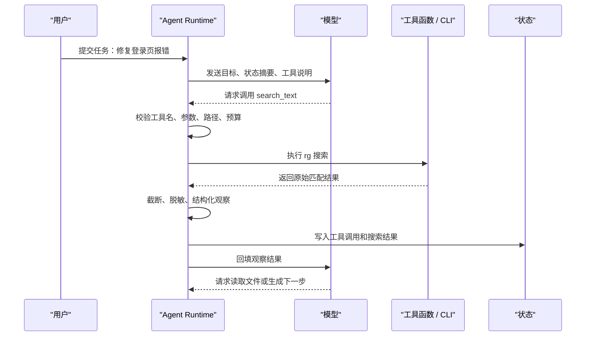

# Agent工具

## 1. 工具调用的工程边界

### 1.1 工具解决的问题

模型只能基于上下文生成输出，无法天然读取文件、搜索仓库、访问数据库、运行测试或调用业务系统。工具调用把这些外部能力包装成结构化接口，让模型提出候选动作，再由 Agent Runtime 校验、执行和回填观察结果。工具层把“回答问题”推进到“完成任务”，也把风险带入系统。

以编码 Agent 为例，用户说“修复登录页报错”时，模型需要先定位相关代码，再读取文件、修改补丁、运行测试。若没有工具，模型只能给出建议；有了工具，系统可以实际搜索仓库、生成补丁并验证结果。工具设计越清楚，模型越容易选择正确动作，Runtime 越容易控制权限和记录过程。

工具调用中有四个角色。模型负责选择工具并生成参数；Runtime 负责参数校验、权限检查、执行调度和日志记录；工具函数负责访问真实系统；状态管理负责保存观察结果。模型输出的 tool call 只是候选动作，执行权始终在 Runtime。

| 角色 | 主要职责 | 典型失败 |
| --- | --- | --- |
| 模型 | 选择工具、生成参数、根据观察继续推理 | 工具选错、参数不完整、重复调用 |
| Runtime | 校验 schema、检查权限、设置超时、标准化结果 | 放行越界路径、缺少结果截断、错误不可追踪 |
| 工具函数 | 调用 CLI、SDK、数据库、浏览器或业务 API | 输出不稳定、异常泄漏、返回内容过长 |
| 状态管理 | 记录已读材料、证据、错误、预算和 trace | 只保存聊天历史，长任务中丢失进展 |

### 1.2 一次工具调用的完整链路

下面的时序图展示一个编码 Agent 调用 `search_text` 的完整过程。模型只提出搜索请求，Runtime 决定该请求能否执行，并把 `rg` 的原始输出整理成模型可读的观察。



这条链路里有两个关键点。第一，执行前校验必须发生在 Runtime 中，提示词无法替代路径、权限和预算检查。第二，工具结果要经过整理后再回填，模型需要有限、可引用、带来源的观察，整段终端输出会挤占上下文并增加误读风险。

### 1.3 schema、权限和结果结构

工具 schema 通常使用 JSON Schema 表达。它说明字段类型、必填项、枚举值、范围和嵌套结构。下面是适合编码 Agent 的 `search_text` schema。

```json
{
  "name": "search_text",
  "description": "Search text in allowed project files. Use fixed_string for exact words and regex only when pattern matching is required.",
  "parameters": {
    "type": "object",
    "properties": {
      "query": {"type": "string"},
      "path": {"type": "string"},
      "fixed_string": {"type": "boolean"},
      "case_sensitive": {"type": "boolean"},
      "max_results": {"type": "integer", "minimum": 1, "maximum": 100}
    },
    "required": ["query", "path"]
  }
}
```

这个 schema 有三个工程含义。`path` 让 Runtime 能限制搜索范围，避免模型扫描整个磁盘。`fixed_string` 鼓励优先使用字面量搜索，减少正则转义错误。`max_results` 控制结果规模，防止搜索输出挤占上下文。

工具结果也要结构化。成功结果要包含摘要、数据、来源和元信息；失败结果要包含错误类型、可重试性和用户可读说明。

```json
{
  "ok": true,
  "tool": "search_text",
  "summary": "Found 8 matches in 3 files.",
  "data": [
    {"path": "src/app.ts", "line": 42, "text": "createAgentRuntime(config)"}
  ],
  "metadata": {
    "elapsed_ms": 31,
    "truncated": false,
    "command": "rg --json --fixed-strings createAgentRuntime src"
  }
}
```

```json
{
  "ok": false,
  "tool": "read_file",
  "error_type": "PathOutsideWorkspace",
  "message": "The requested path is outside the allowed workspace.",
  "retryable": false
}
```

模型看到 `retryable: true` 时可以调整参数重试；看到权限拒绝时应停止或请求用户补充授权。把异常栈直接回填给模型，会让后续决策不稳定，也可能泄漏敏感路径或密钥。

## 2. 只读工具的底层实现

### 2.1 `find_files`：基于文件树和元数据定位

`find_files` 回答“文件可能在哪里”。底层可以使用操作系统文件 API，也可以封装 Unix `find`。经典 `find` 从一个或多个起始路径出发，递归访问目录，并对每个文件应用名称、类型、大小、修改时间、权限、所有者等条件。它擅长定位文件路径，例如“找出所有 `.md` 文件”“找出最近修改的图片”“找出某目录下名为 config 的文件”。

在 Agent 中，不宜把原始 `find` 命令字符串交给模型。`find` 支持复杂表达式和 `-exec`，开放过多会带来执行风险。更稳妥的方式是封装成 `find_files`：

```json
{
  "name": "find_files",
  "parameters": {
    "type": "object",
    "properties": {
      "root": {"type": "string"},
      "name_pattern": {"type": "string"},
      "file_type": {"type": "string", "enum": ["file", "directory", "any"]},
      "max_results": {"type": "integer", "minimum": 1, "maximum": 200}
    },
    "required": ["root"]
  }
}
```

执行器收到参数后，先把 `root` 解析成绝对路径，确认它位于允许工作区内，再遍历目录。返回结果只包含路径、类型、大小和修改时间。默认不跟随符号链接，或在跟随前检查链接目标，避免通过工作区内链接访问外部目录。

### 2.2 `search_text`：ripgrep 的工作方式

`search_text` 回答“某段文字在哪里出现”。编码 Agent 通常会把它封装在 `rg` 之上。`rg` 是 ripgrep 的命令行程序，使用 Rust 编写，设计目标是高速文本搜索。它默认遵守 `.gitignore`，也会处理 `.ignore`、`.rgignore` 等忽略规则，并跳过很多无关文件。对代码库来说，这通常比遍历整个目录更接近开发者预期。

ripgrep 的性能来自多层设计。目录遍历阶段会读取忽略规则并并行处理路径；搜索阶段会对文件做分块读取或内存映射，按文件类型和编码处理文本；匹配阶段使用 Rust regex 引擎，并结合字面量提取优化常见查询。Rust regex 引擎在设计上避免回溯型正则常见的指数级爆炸，复杂模式也仍要由 Runtime 设置超时和结果上限。

Agent 使用 `rg` 时，应优先选择固定字符串搜索。比如查找 `createAgentRuntime`，`--fixed-strings` 比正则更稳定。只有用户明确要求模式匹配，或普通搜索无法覆盖变体时，再允许正则。返回给模型的结果应包含文件、行号、匹配文本和少量上下文行，不应把成千上万条匹配全部放进上下文。

`rg --json` 对 Agent 尤其有用。普通文本输出适合人读，JSON 输出更适合 Runtime 解析。`--json` 会输出 `begin`、`match`、`context`、`end`、`summary` 等事件，Runtime 可以只提取 `match` 事件中的路径、行号和匹配文本，再按 `max_results` 截断。

### 2.3 Agent 如何封装 `rg`

下面是一个教学版 `search_text`。它用 `subprocess.run` 调用 `rg --json`，限制路径、超时和最大结果数，并把原始 JSON 行转成结构化观察。

```python
import json
import subprocess
from pathlib import Path


WORKSPACE = Path("/repo").resolve()


def search_text(query, path=".", max_results=20, timeout=5):
    # 路径校验：只允许搜索工作区内部
    root = (WORKSPACE / path).resolve()
    if not str(root).startswith(str(WORKSPACE)):
        return {"ok": False, "error_type": "PathOutsideWorkspace", "retryable": False}

    cmd = [
        "rg",
        "--json",
        "--line-number",
        "--fixed-strings",
        query,
        str(root),
    ]

    try:
        # 命令执行：限制耗时，避免搜索长时间占用进程
        proc = subprocess.run(
            cmd,
            text=True,
            capture_output=True,
            timeout=timeout,
            check=False,
        )
    except subprocess.TimeoutExpired:
        return {"ok": False, "error_type": "Timeout", "retryable": True}

    matches = []
    for line in proc.stdout.splitlines():
        event = json.loads(line)
        if event.get("type") != "match":
            continue

        data = event["data"]
        matches.append({
            "path": data["path"]["text"],
            "line": data["line_number"],
            "text": data["lines"]["text"].rstrip(),
        })

        # 结果截断：只返回模型当前需要的数量
        if len(matches) >= max_results:
            break

    return {
        "ok": proc.returncode in (0, 1),
        "summary": f"Found {len(matches)} matches.",
        "data": matches,
        "metadata": {"truncated": len(matches) >= max_results},
    }
```

这段代码省略了生产环境中的脱敏、忽略规则配置和 stderr 解析，但展示了核心边界：模型给出查询词，Runtime 校验路径并设置超时，工具函数调用 `rg`，最终只把有限结果返回给模型。

### 2.4 `read_file`：控制上下文大小

搜索结果只能告诉 Agent “相关内容在哪里”，理解代码还需要读取文件。`read_file` 应支持读取指定路径和行范围，避免一次读取整个大型文件。常见参数包括 `path`、`start_line`、`line_count`。执行器要限制 `line_count` 最大值，并在结果中返回实际行号。

读取文件时也要处理编码、二进制文件和过大文件。遇到非文本文件时，应返回明确错误；若文件过大，应要求模型先用搜索定位片段；若路径越界，应拒绝。对 Markdown、代码和配置文件，可以返回带行号的片段，方便模型在最终回答或补丁中引用。

## 3. 写入、验证与执行类工具

### 3.1 `apply_patch` 与写入工具

写入工具风险高于只读工具。`apply_patch` 的输入应是结构化补丁，Runtime 需要检查补丁只修改允许文件，且不会覆盖用户未授权路径。应用前应展示变更摘要：新增、删除、修改哪些文件。应用后要记录实际 diff，并允许后续运行测试验证。

写入工具应尽量避免让模型直接生成 shell 命令。比如“把字符串替换为另一个字符串”可以封装成补丁；“创建文件”可以封装成 `write_file` 并限制路径；“删除文件”应单独作为高风险工具并要求确认。工具越语义化，Runtime 越容易做权限和审计。

写入工具还要保护用户未提交变更。Agent 修改文件前应知道目标文件是否已有用户改动。若文件已有改动，Runtime 应在状态中标记风险，并要求补丁只作用于明确上下文。对代码仓库来说，工具结果中可以包含 `working_tree_dirty`、`touched_files` 和 `conflicts` 字段。

### 3.2 `run_tests` 与验证结果

测试工具把外部验证结果带回 Agent。`run_tests` 可以接收测试目标、命令类型和超时，避免开放任意命令字符串。执行器运行测试后，要返回退出码、耗时、标准输出摘要、标准错误摘要和失败测试名称。模型根据这些信息决定是否继续修复。

测试结果为空也要有语义。退出码为 0 表示验证通过；退出码非 0 表示失败；超时表示测试没有完成；命令不存在表示环境问题。模型不能只看输出文本判断成功。结构化测试结果能让 Agent 更准确地处理失败。

### 3.3 受控命令执行与沙箱

命令执行工具应运行在沙箱中。沙箱可以是容器、临时目录、受限用户或远端执行环境。它限制可写路径、网络访问、环境变量、CPU、内存和执行时间。沙箱无法覆盖所有安全问题，但能在模型或工具出错时限制影响范围。

工具权限可以分为四级。第一是安全只读，例如列目录、搜索文本、读取公开文档。第二是敏感只读，例如读取私有代码、查询用户数据。第三是低风险写入，例如写临时文件、生成补丁、创建草稿。第四是高风险写入，例如删除文件、发送消息、修改生产配置、部署服务。不同级别对应不同确认和审计策略。

| 权限级别 | 工具例子 | 默认策略 |
| --- | --- | --- |
| 安全只读 | `find_files`、`search_text`、公开文档读取 | 自动执行，记录 trace |
| 敏感只读 | 私有代码读取、用户数据查询 | 需要身份和最小范围 |
| 低风险写入 | 生成草稿、应用补丁、写临时文件 | 展示变更摘要 |
| 高风险写入 | 删除文件、发消息、部署服务 | 人工确认并保留审计事件 |

### 3.4 网络和浏览器工具

联网搜索、HTTP 请求和浏览器自动化能扩展 Agent 能力，但风险也更高。网络工具可能访问不可信网页，网页内容可能包含提示注入；HTTP 工具可能触达内网地址或泄漏参数；浏览器工具可能使用用户登录态。Runtime 应限制协议、域名、请求方法、响应大小和下载类型，并把网页内容当作不可信资料回填。

浏览器工具的结果应以观察形式返回，例如页面标题、当前 URL、关键文本、截图路径或 DOM 摘要。网页文本不能覆盖系统指令。若需要提交表单、发送消息、购买或修改权限，必须有明确用户授权。工具层要区分“读取页面”和“产生外部副作用”，这两类动作的风险完全不同。

## 4. 工具治理与评估

### 4.1 调试工具调用

调试时不要只看最终回答，要逐步检查链路。第一步看模型是否选择了正确工具；第二步看参数是否符合预期；第三步看 Runtime 是否正确校验和授权；第四步看工具原始结果；第五步看清洗后的观察结果；第六步看模型如何使用观察结果。很多问题看起来像模型推理错误，实际来自工具描述模糊或结果格式不清。

搜索工具调试要记录查询文本、是否固定字符串、搜索路径、忽略规则、结果数量和截断状态。文件读取工具要记录路径、行号、编码和截断状态。测试工具要记录命令、工作目录、退出码和耗时。写入工具要记录变更 diff 和确认信息。这些记录共同构成 Agent 的 trace。

### 4.2 工具目录治理

工具数量增加后，需要建立工具目录。每个工具应有负责人、版本、schema、权限级别、依赖系统、限流规则、测试用例和弃用计划。相似工具要合并或明确边界，避免模型在 `search`、`grep`、`lookup`、`find` 之间反复试错。工具描述变化也要评审，因为它会影响模型选择。

工具是否有价值应通过数据判断：调用次数、成功率、失败类型、平均耗时、对任务成功率的贡献、是否经常被误用。长期无人使用或失败率很高的工具应下线或重写。Agent 工具治理越成熟，模型需要承担的不确定性越少，系统整体越稳定。

### 4.3 提示注入与结果隔离

工具输出只是数据，不能提升成系统规则。网页、文档、代码注释和用户上传文件都可能写入“忽略之前指令”这类文本。Runtime 回填工具结果时应标记来源和可信级别，并把外部文本放在数据区域中。模型可以引用这些内容作为证据，不能把它们当作新的控制指令。

搜索结果尤其需要来源。每条匹配应包含路径、行号和截断状态。命令结果应包含退出码、耗时、stdout/stderr 摘要。API 结果应包含状态码、请求 id 和返回摘要。来源越清楚，最终回答越容易复核，错误也越容易定位。

### 4.4 工具评估指标

工具评估可以分为四类。第一是选择正确率，模型是否在合适阶段选择合适工具。第二是参数正确率，生成的路径、关键词、行号、测试目标是否有效。第三是执行成功率，工具是否经常超时、权限失败或返回格式错误。第四是任务贡献度，工具调用是否真正提升最终成功率。

评估时要保留完整轨迹。比如一个任务最终成功，但搜索工具调用了十次，其中八次是重复查询，说明工具描述或状态去重需要优化。另一个任务最终失败，但工具正确返回了权限不足，说明失败来自授权，工具实现本身可以保持。只有把工具轨迹纳入评估，才能知道该改模型提示、工具 schema、Runtime 策略还是底层实现。

### 4.5 MCP 与本地工具的关系

本地工具可以直接注册在 Agent Runtime 中，也可以通过 MCP server 暴露。直接注册实现简单，适合单个应用内部使用。MCP 适合多个 Agent 或客户端复用同一工具能力，例如文件搜索、数据库查询、浏览器控制。MCP 还能把工具实现和 Agent Runtime 解耦，让工具团队独立维护 server。

迁移到 MCP 时，不需要改变工具设计原则。名称、描述、schema、权限、结果结构、错误模型和审计仍然适用。差异在于通信从函数调用变成协议消息，工具能力可以被更多 host 发现和使用。若工具本身设计粗糙，换成 MCP 也无法提高可靠性。

### 4.6 后续专题

本文保留工具设计总览。更细的工具调用主题拆到独立专题：

| 文章 | 重点 |
| --- | --- |
| [Function Calling原理](../Agent工具调用/Function%20Calling原理) | schema、两轮调用、并行调用和错误结构 |
| [模型如何学会调用工具](../Agent工具调用/模型如何学会调用工具) | SFT、偏好对齐和运行时边界 |
| [工具封装与Runtime执行](../Agent工具调用/工具封装与Runtime执行) | 工具注册、参数校验、权限和 `rg` 封装 |
| [Skill机制](../Agent工具调用/Skill机制) | Skill 的结构、加载和工具配合方式 |

## 参考资料

- [ripgrep GitHub README](https://github.com/BurntSushi/ripgrep)
- [ripgrep Guide](https://github.com/BurntSushi/ripgrep/blob/master/GUIDE.md)
- [Rust regex crate documentation](https://docs.rs/regex/latest/regex/)
- [Model Context Protocol: Introduction](https://modelcontextprotocol.io/docs/getting-started/intro)
- [OpenAI Agents SDK: Tools](https://openai.github.io/openai-agents-python/tools/)
- [Anthropic Docs: Tool use](https://docs.anthropic.com/en/docs/agents-and-tools/tool-use/implement-tool-use)
