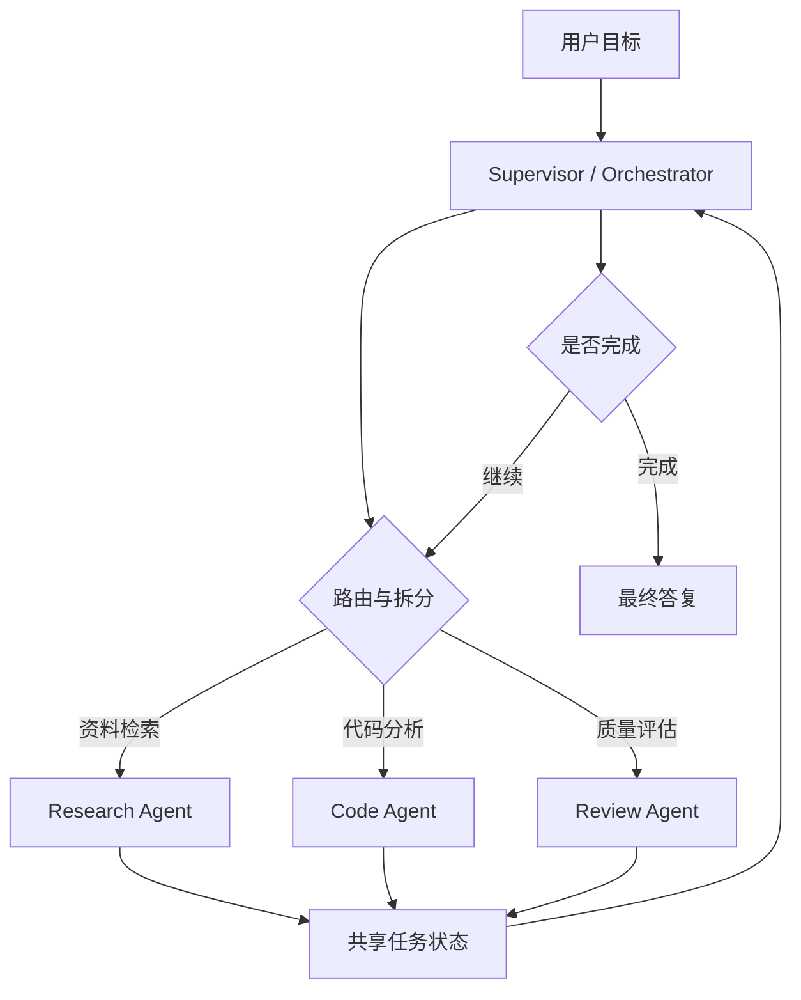

# Agent设计模式

Agent 设计模式关注的是“模型、工具、状态和控制流如何组合”。同样是让模型调用工具，系统可以做成单 Agent 循环，也可以做成固定工作流，也可以做成多个 Agent 分工协作。模式选择会直接影响可靠性、调试成本、延迟、权限设计和评估方式。一个稳健的设计通常从最简单的结构开始：能用固定流程解决的任务先用工作流，单 Agent 足够处理的任务先保持单 Agent，只有在任务需要明显的角色分工、并行处理或跨系统协作时，再引入多 Agent。

Anthropic 在 effective agents 一文中把常见构建方式拆成 prompt chaining、routing、parallelization、orchestrator-workers、evaluator-optimizer 等模式。这些模式可以单独使用，也可以组合。OpenAI Agents SDK 提供 agent、tool、handoff、guardrail、trace 等基础构件；LangChain 在 agent 和 multi-agent 文档中强调模型驱动的工具调用、持久执行和上下文工程；CrewAI 把 agent、task、crew、flow 作为组织协作的核心概念；AutoGen AgentChat 使用 agent 和 team 来表达对话式协作。这些框架的命名不同，背后都在处理同一组问题：谁做决策，谁执行工具，状态放在哪里，失败如何恢复，多个执行单元如何交接上下文。

## 单 Agent 模式

单 Agent 模式是最基础的结构。一个模型实例在统一指令下接收任务，持有同一份短期状态，按需调用工具，直到给出最终结果。它适合目标明确、工具数量有限、上下文可以集中管理的任务，例如根据本地文档回答问题、整理会议纪要、生成代码补丁、执行一次数据分析、把用户需求转成待办列表。单 Agent 的优点是实现简单、追踪清晰、上下文一致、失败路径少。缺点是当任务跨度变大时，同一个指令需要覆盖规划、检索、写作、校验、沟通等多个职责，提示词会膨胀，模型在不同职责之间切换也更容易出现混乱。

单 Agent 的关键设计点是工具边界和状态摘要。工具数量不宜一次性堆得太多，初期可以只提供完成任务必需的只读工具和低风险写入工具。状态摘要要明确当前目标、已完成步骤、重要观察、剩余问题和终止标准。对于复杂任务，单 Agent 也可以采用“内部阶段”管理：先规划，再检索，再执行，再验证，再回答。阶段可以由模型自行描述，也可以由外部状态机控制。外部状态机更稳定，模型自由度更高的循环更灵活，选择取决于任务不确定性。

单 Agent 的常见风险是过度循环和上下文污染。过度循环表现为反复搜索同一关键词、重复读取同一文件、不断改写计划却不产生新证据。上下文污染表现为把工具返回的无关文本、网页提示注入、错误输出当成可靠事实。解决方法包括设置最大步数、记录工具调用去重、对工具结果做摘要和来源隔离、要求最终回答引用证据、在关键步骤使用规则或评估器检查进度。一个单 Agent 如果具备清晰工具、预算边界和 trace，通常已经可以支撑大量实用场景。

## 工作流式 Agent

工作流式 Agent 把模型能力嵌入预设流程。控制路径主要由代码决定，模型在每个节点承担局部任务，例如分类、抽取、重写、生成查询、选择候选、校验输出。Prompt chaining 是典型模式：第一个模型调用生成结构化中间结果，第二个模型调用基于中间结果继续处理，后续节点逐步收敛到最终输出。它适合可拆分、顺序明确、每一步都能定义输入输出格式的任务，例如合同审查、客服工单分类、简历筛选、文档摘要和结构化数据抽取。

Routing 模式让模型或规则决定任务进入哪条处理路径。比如用户问题可能被路由到代码助手、知识库问答、账单查询或人工客服；代码问题也可以路由到前端、后端、数据库和运维子流程。路由器可以是轻量分类模型，也可以是规则和模型混合。路由模式的核心是类别定义要互斥且可验证，路由失败要有兜底路径。类别过多会增加误分风险，类别过粗会降低后续处理质量。生产系统常把路由结果和置信度写入 trace，并对低置信度任务触发人工确认或通用流程。

Parallelization 模式把任务拆成多个可并行子任务，再聚合结果。常见例子包括同时检索多个数据源、让多个提示从不同角度审查同一输出、并行生成多个候选方案后由评估器选择。并行模式的收益是降低总耗时、增加覆盖面，代价是 token 成本和聚合复杂度上升。聚合器不能简单拼接结果，它需要去重、冲突检测、来源标注和优先级判断。对于事实性任务，聚合器还应把结论和证据绑定；对于创作性任务，聚合器可以用评分标准选择或合成候选。

Evaluator-optimizer 模式让一个生成器产生结果，另一个评估器按标准检查并反馈，生成器再修改。它适合输出质量可以被明确评估的任务，例如代码修复、SQL 生成、报告撰写、测试用例生成和格式转换。评估器可以是规则、测试、静态分析、另一个模型，也可以组合使用。这个模式的重点是评估标准要具体，例如“构建通过”“所有字段齐全”“引用必须来自给定文档”“不得改动无关文件”。如果评估标准只有“更好”或“更完整”，循环会变成主观改写，稳定性较差。

## Orchestrator-Workers 模式

Orchestrator-workers 模式适合任务可以动态拆分，但每个子任务又相对独立的场景。Orchestrator 负责理解目标、拆分任务、分派 worker、收集结果和决定下一轮行动。Worker 负责执行具体子任务，例如搜索资料、阅读代码、生成测试、检查安全、撰写某个章节。这个模式和固定并行不同，worker 的数量和任务内容可以由 orchestrator 根据当前状态决定。Anthropic 将这类模式用于复杂问题分解，OpenAI Agents SDK 中的 handoff 和 agent-as-tool 也可以表达类似结构。

这种模式的优点是职责清晰、可并行、可扩展。每个 worker 可以有专门指令和工具，例如 research worker 只能访问搜索工具，code worker 可以读取仓库，review worker 只看补丁和测试结果。权限按角色拆分后，系统风险更容易控制。缺点是上下文同步复杂，worker 之间可能重复工作，orchestrator 可能错误拆分任务，最终聚合时可能丢失细节。共享状态设计非常关键，它需要记录任务分派、输入材料、输出摘要、证据来源、冲突点和完成情况。

## 多 Agent 协作模式

多 Agent 协作在 orchestrator-workers 之外还有几种常见形态。第一种是 handoff，一个 Agent 在判断自己不适合继续处理时把控制权交给另一个 Agent。比如客服 Agent 识别到技术故障后移交给技术支持 Agent，技术支持 Agent 完成诊断后再移交回客服 Agent 生成用户可读答复。Handoff 的关键是交接摘要，摘要要包含用户目标、已做动作、关键证据、未解决问题和下一步建议。交接摘要过短会丢上下文，过长会增加成本和干扰。

第二种是 agent-as-tool。主 Agent 不直接暴露另一个 Agent 的内部循环，只把它当成一个工具调用。比如主 Agent 调用 `analyze_repository`，底层由代码 Agent 多轮读取文件、搜索引用、运行测试，最后返回结构化分析结果。这个模式让主 Agent 的上下文更干净，也便于隐藏复杂执行细节。它适合专业能力可以封装成明确输入输出的场景。缺点是主 Agent 无法观察子 Agent 的每一步，调试时需要跨 trace 查看内部过程。

第三种是 peer collaboration。多个 Agent 在同一任务上轮流发言、互相审查、共同收敛。AutoGen 的对话式 team 可以表达这种协作。它适合探索性任务、方案讨论和需要多个视角的审查，但生产系统要谨慎控制轮次和发言权限。开放式对话容易增加成本，也容易出现重复观点和目标漂移。更稳定的做法是给每个 Agent 固定职责和输出格式，再由聚合器生成最终结论。

第四种是 debate 或 critique。一个 Agent 生成方案，另一个 Agent 查找问题，第三个 Agent 裁决或综合。这个模式可用于高风险决策前的审查，例如安全策略、合同条款、架构设计和论文摘要。它的质量取决于评审标准和证据约束。如果 critique 只给抽象意见，系统会陷入空泛改写；如果 critique 必须引用具体证据、测试输出或规范条款，改进会更可控。

## 常见框架的设计取向

OpenAI Agents SDK 的核心抽象包括 Agent、handoff、tool、guardrail、session 和 tracing。Agent 承载指令、模型和工具，handoff 支持把任务转交给其他 Agent，tool 把函数或外部能力暴露给模型，guardrail 用于输入输出约束，tracing 用于记录执行过程。它适合希望在 OpenAI 生态内快速构建可追踪 Agent 应用的场景，也适合把多 Agent 交接和工具调用统一到一个运行时里。

LangChain Agents 更强调把模型用作推理引擎，在工具调用中完成动态决策。LangChain 的新文档强调其 Agent 构建在 LangGraph 之上，可以获得持久执行、流式、人机协作和更细粒度控制。LangChain multi-agent 文档把多 Agent 场景拆成 tool calling 和 handoffs 两类：tool calling 中由中心 Agent 调用子 Agent，handoffs 中控制权在不同 Agent 之间转移。这个分类对架构设计很实用，因为它直接对应“集中控制”和“分散交接”两种运行方式。

CrewAI 的设计更接近角色化协作。开发者定义 agents、tasks、crews 和 flows，让不同角色围绕任务协同。Crew 强调多个角色按任务目标协作，Flow 则适合描述更确定的业务流程。这个框架适合内容生产、研究整理、市场分析、运营流程等需要角色分工的任务。使用时要注意角色数量和任务边界，角色过多会增加协作成本，任务描述不清会导致输出重叠。

AutoGen AgentChat 关注多 Agent 对话和团队协作。它提供 assistant agent、user proxy、tool use、team 等概念，适合构建多个可对话 Agent 共同完成任务的系统。AutoGen 的优势在于表达交互式协作和研究原型，开发者可以观察 Agent 之间如何交换消息。生产化时要补充严格的状态管理、权限限制、轮次控制和评估策略。

## 模式选择方法

选择模式时可以从五个维度判断。第一是任务路径是否稳定。路径稳定时优先工作流，路径高度依赖中间观察时使用 Agent 循环。第二是职责是否需要专业化。单一职责可以用单 Agent，多种专业能力可以拆成 worker 或子 Agent。第三是工具风险级别。高风险工具应集中在权限更严格的执行单元中，必要时加入人工确认。第四是延迟和成本。多 Agent、并行和评估优化会增加调用次数，只有在质量收益明确时才值得引入。第五是可评估性。模式越复杂，越需要 trace、测试集、任务成功指标和回归评估。

一个实用的演进路径是：先做固定工作流，把输入输出格式和工具结果处理稳定下来；当固定流程无法覆盖不确定任务时，引入单 Agent 循环；当单 Agent 指令过长、工具过多或职责混杂时，拆出子 Agent 或 worker；当多个系统需要互操作时，再考虑协议层集成。这个路径可以降低一次性引入复杂架构的风险，也便于逐步积累评估数据。

## 上下文工程

多 Agent 系统的核心难点之一是上下文工程。每个 Agent 看到什么内容，直接决定它能否完成职责。把全部上下文广播给所有 Agent 会带来成本和干扰，也可能扩大敏感信息暴露面。更合理的策略是按角色裁剪上下文：research agent 看到问题和资料来源，code agent 看到相关文件和测试要求，review agent 看到补丁、规范和验证结果，supervisor 看到摘要和关键证据。LangChain multi-agent 文档也强调多 Agent 的上下文控制，包括传递哪些消息、保留哪些中间推理、如何格式化状态。

上下文还要处理冲突。不同 worker 可能给出不同结论，聚合器需要判断冲突来源：是数据源不同、时间不同、解释不同，还是某个工具失败。最终输出不应掩盖冲突，尤其在研究、法律、医疗、金融和工程决策中。系统可以让 worker 输出置信度、证据链接和不确定性说明，再由 supervisor 决定是否继续查证、请求人工判断或在最终答复中保留限制条件。

## 评估与回归

Agent 设计模式要通过评估闭环来验证。单 Agent 的评估可以从任务成功率、工具选择正确率和轮次成本入手。工作流的评估可以逐节点检查格式、准确率和失败率。多 Agent 的评估需要额外关注分派质量、重复工作、交接摘要质量、聚合冲突处理和总成本。Evaluator-optimizer 模式还要检查是否出现无效迭代，例如评估器持续提出风格意见但没有改善核心指标。

回归测试可以使用一组固定任务，记录每个版本的最终结果、工具轨迹、耗时和 token 消耗。对动态 Agent 来说，最终回答相似并不代表执行过程可靠，工具轨迹也要纳入比较。如果一次改动让成功率提高但工具调用次数翻倍，需要评估业务场景是否接受这个成本。对高影响工具，还要模拟失败和攻击输入，验证权限边界是否仍然生效。

## 工程取舍

Agent 模式没有统一最优解。单 Agent 简洁，但复杂任务中容易职责拥挤。工作流稳定，但面对开放任务时需要大量手写分支。多 Agent 有利于专业化和并行，但调试、状态和成本都会增加。框架能提供抽象和运行时能力，但也会带来约定和依赖。工程判断应以任务需求和可验证指标为准：如果固定流程能达到目标，就保留固定流程；如果模型动态决策能显著降低分支复杂度，就引入 Agent；如果角色分工能带来可衡量质量提升，再引入多 Agent。

设计 Agent 架构时，最好把“能跑通”和“能维护”分开看。Demo 阶段可以用一个循环和几个工具快速验证想法；生产阶段需要明确状态结构、权限边界、错误恢复、追踪、评估和回滚方案。模式越复杂，越要用小范围任务集验证收益。这样构建出来的 Agent 系统才有机会在真实业务中稳定运行，而不只是一次成功的演示。

## 典型场景拆解

以“生成一篇技术调研报告”为例，固定工作流可以按“收集资料、抽取要点、生成提纲、撰写正文、校验引用”顺序运行。这个任务路径相对稳定，工作流能提供较高可控性。若资料来源不确定，系统可以在收集资料阶段加入单 Agent，让它根据初步结果决定是否继续搜索、是否扩大关键词、是否请求用户补充范围。若报告涉及多个专业领域，例如模型能力、协议生态、安全合规和成本测算，可以把这些部分分给多个 worker，再由 supervisor 聚合。这个例子说明模式不是互斥选择，常见系统会在一个总体工作流中嵌入局部 Agent，也会在多 Agent 系统中保留固定审批节点。

再以“代码迁移”为例，单 Agent 可以读取代码、搜索引用、修改文件并运行测试。对于小型仓库，这种结构效率很高。大型仓库中，单 Agent 可能因为上下文过大而遗漏模块，也可能在多个技术栈之间切换困难。此时可以引入 orchestrator-workers：一个 supervisor 负责迁移计划，多个 worker 分别处理前端、后端、配置和测试，review worker 负责检查补丁和构建结果。为了避免 worker 互相覆盖修改，共享状态中要记录文件锁、变更范围和依赖关系。最终合并前，supervisor 需要运行全量验证，并把失败反馈给对应 worker。

客服和企业助手适合使用 routing 与 handoff。入口 Agent 负责理解用户意图和身份权限，路由到知识库问答、工单查询、账单处理或人工客服。若某个子 Agent 判断任务超出自身边界，可以 handoff 给更合适的 Agent。这里最重要的是交接摘要和权限继承。交接摘要应包含用户原始诉求、已确认身份、已查询信息、当前阻塞和建议下一步。权限继承要遵循最小授权原则，子 Agent 只能获得完成任务所需的上下文和工具。

数据分析场景常使用并行和评估优化。一个 Agent 生成分析计划，多个工具或 worker 并行执行查询，聚合器检查结果是否一致，再由报告生成器输出结论。若 SQL 或图表代码失败，评估器可以根据错误信息要求生成器修正。这个模式的关键是把“数据事实”和“解释结论”分开。数据事实来自可复现查询，解释结论来自模型整理。最终报告最好保留查询条件、样本范围和限制说明，便于用户复核。

## 反模式与治理

常见反模式之一是角色过度拆分。把一个简单任务拆成计划 Agent、搜索 Agent、阅读 Agent、写作 Agent、审查 Agent、总结 Agent，可能让调用次数和上下文传递成本远超收益。拆分应当基于真实职责差异和可评估收益，而不是为了形式上显得“多 Agent”。另一个反模式是所有 Agent 共享全部工具。这样会让权限边界失效，也会增加错误工具选择概率。每个 Agent 应只看到完成职责所需工具，高风险工具要集中到受控执行单元。

第三个反模式是缺少全局状态。多个 Agent 各自维护局部消息，最终由某个节点简单拼接输出，会导致重复工作、冲突无处记录、失败无法恢复。共享状态不需要暴露全部细节，但必须记录任务分派、关键证据、产物位置、冲突和完成状态。第四个反模式是没有退出策略。多 Agent 对话如果没有轮次、预算和完成条件，容易长时间循环。Supervisor 应在每轮判断是否继续分派、是否请求人工确认、是否以部分结果结束。

治理多 Agent 系统时，可以把每个 Agent 当作一个受控服务单元。它有明确输入输出、工具权限、预算、日志、评估指标和版本。上线前为每个单元准备测试任务，升级时比较输出质量和调用轨迹。跨 Agent 变更要关注接口兼容性，例如 worker 输出 schema 改动会影响 supervisor 聚合。随着系统规模扩大，Agent 治理会越来越接近微服务治理，只是调用内容从传统 JSON API 扩展到了模型消息、工具轨迹和自然语言产物。

## 从框架到架构

框架能加速开发，但框架选择不等同于架构设计。OpenAI Agents SDK 适合快速构建具备工具、handoff 和 tracing 的应用；LangChain/LangGraph 适合需要可控图结构、持久状态和复杂编排的系统；CrewAI 适合角色和任务关系清楚的协作流程；AutoGen 适合对话式多 Agent 实验和团队协作原型。选型时应把运行时能力、生态工具、调试体验、部署方式和团队熟悉度放在一起评估。

更重要的是保留可迁移的系统边界。工具 schema、状态模型、评估集、权限策略和业务接口不应完全绑定在某个框架私有概念上。这样未来从单 Agent 演进到多 Agent，或从一个框架迁移到另一个框架时，不需要重写所有业务能力。一个良好的 Agent 架构应让模型供应商、框架、工具和 UI 都可以在合理成本内替换，而核心业务语义和安全策略保持稳定。

## 参考资料

- [Anthropic: Building effective agents](https://www.anthropic.com/research/building-effective-agents)
- [OpenAI Agents SDK: Agents](https://openai.github.io/openai-agents-python/agents/)
- [OpenAI Agents SDK: Tools](https://openai.github.io/openai-agents-python/tools/)
- [LangChain Docs: Agents](https://docs.langchain.com/oss/python/langchain/agents)
- [LangChain Docs: Multi-agent](https://docs.langchain.com/oss/python/langchain/multi-agent)
- [CrewAI Docs](https://docs.crewai.com/)
- [Microsoft AutoGen AgentChat User Guide](https://microsoft.github.io/autogen/stable//user-guide/agentchat-user-guide/index.html)
