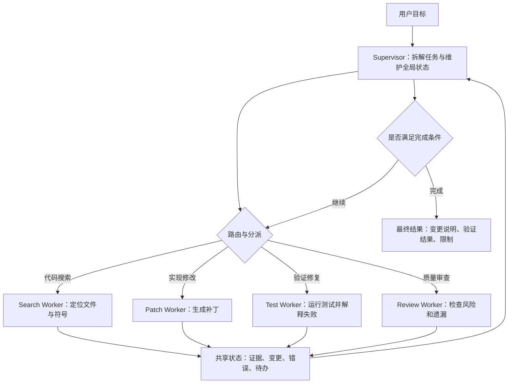

# Agent设计模式

## 1. 先确定问题类型

Agent 设计模式解决的是架构选型问题：同样是让模型调用工具，系统可以做成固定工作流、单 Agent 循环、Supervisor-Worker、多 Agent 交接，也可以加入评估器不断优化结果。模式选择会影响工具权限、上下文组织、失败恢复、成本和可观测性。设计前先回答三个问题，比直接挑框架更重要。

第一，任务路径是否稳定。若每次都按固定步骤处理，例如“抽取字段、校验格式、写入表格”，优先使用工作流。若下一步高度依赖工具观察，例如“先搜索代码，再决定改哪些文件”，使用 Agent 循环。第二，职责是否需要拆分。若一个模型能在同一上下文内完成规划、检索、执行和总结，单 Agent 足够；若任务涉及不同专业能力或权限边界，考虑多 Agent。第三，质量是否可以自动评估。若输出能通过测试、规则或审查标准验证，可以加入 evaluator-optimizer；若评价高度主观，迭代次数要严格限制。

本文用两个场景贯穿说明。场景一是“代码迁移”：需要搜索仓库、修改文件、运行测试、修复失败。场景二是“企业助手”：需要识别用户意图、查询知识库、调用业务系统、必要时移交人工或专业 Agent。这两个场景能覆盖单 Agent、工作流、多 Agent 和路由的主要取舍。

## 2. 模式选择矩阵

| 模式 | 适用任务 | 控制权 | 优点 | 主要风险 |
| --- | --- | --- | --- | --- |
| 固定工作流 | 步骤稳定、输入输出明确 | 代码 | 可预测、易测试 | 面对开放任务时分支膨胀 |
| 单 Agent | 路径动态、工具数量少 | 模型和 Runtime | 实现简单、上下文集中 | 工具过多后选择混乱 |
| Routing | 多类任务入口 | 路由器 | 降低单 Agent 负担 | 类别定义不清导致误分 |
| Supervisor-Worker | 可拆分复杂任务 | Supervisor | 职责清晰、可并行 | 状态同步和聚合复杂 |
| Handoff | 多个专业 Agent 顺序接力 | 当前 Agent | 用户体验自然 | 交接摘要质量决定成败 |
| Evaluator-Optimizer | 输出可验证 | 评估器和生成器 | 能逐步提高质量 | 容易无效迭代 |

这个矩阵不是静态答案。真实系统常把多种模式组合起来。例如代码迁移可以由固定工作流管理阶段：分析、修改、测试、总结；在分析和修复阶段使用单 Agent；在大型仓库中再引入 worker 分工处理前端、后端和配置。企业助手可以先用 routing 判断任务类型，再把复杂任务 handoff 给专业 Agent。

## 3. 固定工作流：优先选择的基线

固定工作流把控制流写在代码里，模型只在局部节点执行任务。以企业助手的工单分类为例，流程可以固定为：清洗用户输入、分类、抽取字段、查询知识库、生成答复、规则校验、返回结果。每一步都有明确输入输出，失败时也容易定位。Anthropic 提到的 prompt chaining、routing、parallelization 等模式，本质上都可以先在工作流框架内实现。

工作流适合三类任务。第一类是业务规则明确的任务，例如表单抽取、合同条款检查、客服意图分类。第二类是有强格式要求的任务，例如生成 JSON、SQL、配置文件。第三类是需要可审计的流程，例如审批、发布、数据写入。代码控制路径能让团队明确知道每一步何时发生、失败如何处理、哪些节点需要人工确认。

工作流的限制在于开放性。代码迁移任务如果只写固定流程，很快会遇到分支爆炸：测试失败后可能需要搜索错误、读取相关实现、判断是否改测试或改代码、再次运行验证。每个仓库的失败原因不同，手写所有分支成本很高。此时可以保留工作流作为外层阶段，把动态判断交给局部 Agent。

## 4. 单 Agent：小范围动态决策

单 Agent 模式由一个 Agent 维护统一状态和工具集合。代码迁移的初版可以这样设计：Agent 看到目标和仓库状态，拥有 `rg`、`read_file`、`apply_patch`、`run_tests` 四类工具。它先搜索相关符号，读取文件，生成补丁，运行测试，根据错误继续修复，最后总结变更。这个模式的优点是上下文集中，trace 清晰，实现成本低。

单 Agent 的关键是让模型在 Runtime 管控下做小范围动态决策。工具数量应控制在当前任务所需范围内。搜索阶段只给只读工具，编辑阶段再给写入工具，发布阶段才给部署工具。状态中要记录已读文件、已改文件、测试结果和失败原因。这样模型每轮能看到任务进度，也能避免重复读取同一材料。

单 Agent 的失败信号很明显。若提示词越来越长，工具列表越来越多，模型频繁选错工具，或者同一上下文中既要处理法律、代码、客服和数据分析，就说明职责已经拥挤。此时不要继续堆提示词，应拆分工具或拆分 Agent。

## 5. Routing：把入口任务分流

Routing 模式用于多类任务入口。企业助手经常同时面对“查知识库”“查订单”“修改资料”“报故障”“闲聊”几类请求。入口 Agent 或分类模型先判断任务类型，再把请求交给对应处理链。路由可以使用规则、轻量模型或大模型。稳定业务场景里，规则和模型混合更可靠：明确关键词和权限先走规则，模糊请求再交给模型判断。

路由设计的重点是类别要可执行。类别名称不能只写“复杂问题”“一般问题”，而要对应后续能力，例如 `knowledge_qa`、`billing_query`、`ticket_create`、`human_escalation`。每个类别都要定义输入、工具、权限和失败兜底。低置信度路由不应强行进入某条路径，可以请求澄清或进入通用处理链。

对代码助手来说，Routing 也有价值。用户请求可能是解释代码、修复 bug、添加功能、写测试、检查性能或整理文档。不同任务需要不同工具和上下文。解释代码通常只读，修复 bug 需要编辑和测试，性能分析可能需要运行基准。入口路由能减少模型看到的工具数量，也能降低误操作风险。

## 6. Supervisor-Worker：复杂任务拆分

当任务可以拆成多个相对独立的子任务时，可以使用 Supervisor-Worker。Supervisor 负责理解目标、拆分任务、分派 worker、收集产物、处理冲突和输出最终结果。Worker 只负责具体领域，例如资料检索、代码修改、测试修复、安全审查。这个模式适合大型代码迁移、深度调研报告、跨系统业务流程和多专业审查。

Supervisor-Worker 的收益来自职责和权限分离。Search Worker 只读仓库，Patch Worker 能写文件但不能部署，Test Worker 能运行测试，Review Worker 只能读取补丁和日志。权限分离能减少高风险工具暴露面。Worker 输出也要结构化：任务 id、输入摘要、执行步骤、证据、产物、失败和建议。Supervisor 根据这些结构化结果聚合，而不是简单拼接自然语言。

这个模式的主要成本是状态同步。多个 worker 可能读取同一文件、重复搜索、给出冲突建议，甚至同时修改相邻代码。共享状态必须记录文件锁、已完成任务、冲突点和产物位置。Supervisor 还要判断是否继续分派，避免多 Agent 系统在反复讨论中消耗预算。

## 7. Handoff：控制权转移

Handoff 表示当前 Agent 把控制权交给另一个 Agent。企业助手中常见：入口 Agent 判断用户在问账单问题，于是交给 Billing Agent；Billing Agent 发现需要技术排查，再交给 Support Agent；Support Agent 完成诊断后交回入口 Agent 生成用户可读答复。OpenAI Agents SDK 中的 handoff 抽象正是为这类协作提供结构。

Handoff 的关键产物是交接摘要。摘要要包含用户原始目标、身份和权限状态、已完成动作、关键证据、未解决问题、下一步建议。交接摘要过短会丢信息，过长会把无关历史带给下游 Agent。工程上可以把摘要分成固定字段，而不是让模型自由发挥。

Handoff 与 Supervisor-Worker 的差异在控制权。Supervisor-Worker 中 supervisor 始终管理全局任务；handoff 中当前 Agent 会把后续对话交给另一个 Agent。面向用户的多专业助手适合 handoff，因为用户体验接近真实服务转接；后台复杂任务适合 Supervisor-Worker，因为集中控制更容易做审计和预算管理。

## 8. Evaluator-Optimizer：可验证输出的迭代

Evaluator-Optimizer 模式由生成器和评估器组成。生成器产出代码、报告、SQL 或配置，评估器使用测试、规则、静态分析或另一个模型给出反馈，生成器再修正。代码迁移天然适合这个模式：生成补丁后运行测试，失败输出作为反馈；若测试通过，再运行 lint 或 review 规则；最终输出验证结果。

这个模式有效的前提是评价标准具体。好的标准包括“构建通过”“所有引用来自给定文件”“JSON schema 校验通过”“没有修改无关文件”。差的标准是“写得更好”“更专业”“更完整”，因为模型很难据此收敛。迭代次数必须有上限，连续两轮没有新增改进时应停止并说明限制。

评估器可以是模型，也可以是程序。能用程序验证的部分优先用程序，例如单元测试、类型检查、JSON schema、链接检查。模型评估适合语义质量、遗漏风险和可读性审查。两者结合时，程序结果优先级更高。

## 9. 框架落地方式

OpenAI Agents SDK 适合需要工具、handoff、guardrail 和 tracing 的应用。它的 Agent 抽象清晰，适合把多个专业 Agent 和工具统一到一个运行时。LangChain Agents 构建在 LangGraph 之上，更适合需要图结构、持久执行、人机协作和复杂编排的系统。CrewAI 强调 roles、tasks、crews 和 flows，适合角色分工明确的内容生产、研究和运营任务。AutoGen AgentChat 适合对话式多 Agent 协作和研究原型。

框架选择不应替代架构设计。先定义任务边界、工具权限、状态结构、评估方法，再选框架承载。工具 schema、状态模型和评估集最好保持框架无关，避免未来迁移时重写业务语义。框架可以加速开发，但长期稳定性来自清晰边界和可验证指标。

## 10. 选型流程

实际项目可以按以下顺序推进。第一，先用固定工作流做出可测试基线。第二，在路径动态的节点引入单 Agent，而不是把全流程交给模型。第三，当单 Agent 工具过多或职责拥挤时，拆成 worker 或专业 Agent。第四，把高风险工具放在权限更窄的执行单元中。第五，为每种模式建立 trace 和评估集，记录任务成功率、平均工具调用次数、失败类型和成本。第六，只有在跨团队或跨供应商协作时，再引入 A2A、ACP 等 Agent 间协议。

这个流程的核心是渐进式复杂度。Agent 系统最容易失控的地方在于过早引入多 Agent 和开放工具。架构越复杂，越需要明确的完成条件、状态模型和回归测试。一个小而稳定的单 Agent，通常比一个缺少治理的多 Agent 系统更适合生产环境。

## 11. 代码迁移场景的落地架构

代码迁移可以作为设计模式选择的完整样例。假设目标是把项目中的旧请求库替换成新请求库。外层可以使用固定工作流：创建迁移计划、定位引用、生成补丁、运行测试、修复失败、输出总结。定位引用和修复失败这两个阶段路径不稳定，适合交给单 Agent。定位阶段给 Agent `search_text`、`find_files` 和 `read_file`；修复阶段再开放 `apply_patch` 和 `run_tests`。

当仓库规模较小时，单 Agent 足够。它能在同一状态中记录旧 API 的引用、已修改文件、失败测试和修复尝试。仓库规模变大后，可以拆成 Supervisor-Worker。Supervisor 先按模块拆任务，Search Worker 负责定位，Patch Worker 负责修改，Test Worker 负责验证。共享状态中记录每个模块的迁移状态：未开始、处理中、补丁完成、测试失败、完成。这样 Supervisor 可以发现哪个模块卡住，而不需要让一个模型记住全部细节。

这个架构中不建议让多个 worker 同时写同一个文件。可以用文件锁或任务分片避免冲突。比如按目录分派，`src/api` 由一个 worker 处理，`src/pages` 由另一个 worker 处理。若两个 worker 都需要修改共享工具函数，Supervisor 应暂停并创建单独任务。多 Agent 的并行收益只有在冲突可控时才成立。

## 12. 企业助手场景的落地架构

企业助手的入口通常是 Routing。用户可能询问制度、查询订单、申请权限、反馈故障或要求生成报告。入口 Agent 先做意图识别和权限检查。知识类问题进入 RAG 工作流；订单类问题进入业务 API 工具链；故障类问题进入工单或技术支持 Agent；高风险操作进入人工确认。这个架构能让每条路径只暴露必要工具。

如果用户的问题从一个领域转到另一个领域，可以使用 Handoff。例如用户先问“这笔费用为什么扣款”，Billing Agent 查询账单后发现疑似系统故障，再移交 Support Agent。交接摘要必须包含账单号、已查询记录、异常现象、用户权限和待处理问题。Support Agent 不需要看到用户完整聊天历史，只需要完成排查所需信息。这样可以降低隐私暴露和上下文噪声。

企业助手还适合加入 Evaluator。对于政策回答，评估器检查是否引用制度文档；对于订单操作，评估器检查是否展示影响范围；对于工单创建，评估器检查字段是否齐全。评估器可以先用规则实现，只有语义检查再引入模型。这样既能保证业务规则稳定，又能保留模型处理自然语言的能力。

## 13. 模式组合的状态设计

多模式组合时，状态要分层。全局状态由工作流或 Supervisor 管理，记录用户目标、阶段、预算、权限和最终产物。局部 Agent 状态记录本阶段工具轨迹和中间证据。Worker 状态记录子任务输入、输出、失败和建议。评估器状态记录检查项、通过项和失败项。分层状态能避免所有消息堆在一个上下文里。

状态还要定义产物格式。代码迁移的产物可以是补丁、测试结果和变更说明；企业助手的产物可以是答案、业务记录、工单号和确认结果。Supervisor 聚合时依赖这些结构化产物，而不是依赖自然语言段落。产物格式稳定后，前端展示、日志审计和回归评估都会简单很多。

## 14. 评估模式是否有效

模式选择最终要靠数据验证。单 Agent 引入后，应比较任务成功率、平均轮次、工具调用数和人工接管率。多 Agent 引入后，应额外比较重复工作、冲突次数、交接失败和总成本。Evaluator 引入后，应比较质量提升和迭代成本。若一个模式让成本上升明显，成功率没有提升，就应回退到更简单结构。

评估集应包含正常任务和异常任务。代码迁移中要包含测试通过、测试失败、依赖缺失、无相关代码、需要人工确认等情况。企业助手中要包含权限不足、意图模糊、资料缺失、业务 API 失败和高风险操作。只有覆盖失败场景，才能判断架构是否稳健。

## 15. 实施顺序建议

第一阶段，用固定工作流和少量只读工具跑通最常见任务。第二阶段，引入单 Agent 处理动态节点，并给它设置严格工具和预算。第三阶段，为任务建立 trace 和评估集。第四阶段，当单 Agent 指令拥挤或权限边界不清时，再拆分专业 Agent。第五阶段，引入多 Agent 后先关闭并行，让系统按顺序运行，确认状态和产物正确后再开启并行。第六阶段，最后考虑跨系统协议和开放生态。

这个顺序看起来保守，但能减少调试成本。Agent 架构真正困难的地方不在于创建多个角色，而在于让每个角色的输入、输出、权限和失败都可控。模式越复杂，越要用小步演进保持可理解性。

## 16. 官方资料中的模式共识

OpenAI 的实践指南把 Agent 构建看成“模型、工具、指令、编排和护栏”的组合，并强调适合 Agent 的场景通常具有开放目标、多步任务、需要工具和需要判断的特征。Anthropic 的文章把 prompt chaining、routing、parallelization、orchestrator-workers、evaluator-optimizer 作为常见 building blocks。Google 的 Agents 白皮书和 companion 资料把 Agent 拆成模型、工具、编排层，并进一步讨论工具扩展、记忆、规划和多 Agent 关系。LangChain 的 multi-agent 文档把多 Agent 协作分为 tool calling 和 handoffs 两类。

这些资料的共同点是：先用简单结构解决明确问题，再在需要时引入复杂编排。它们很少建议一开始就堆很多角色。原因是多 Agent 增加的不只是能力，还有上下文传递、状态冲突、权限扩散和评估难度。对初学者来说，最稳妥的理解方式是把设计模式看成“复杂度阶梯”：固定工作流最低，单 Agent 次之，路由和评估优化进一步增加控制逻辑，Supervisor-Worker 和 Handoff 进入多 Agent 协作。

## 17. 用企业场景理解各模式

企业采购助手可以展示模式差异。若用户上传采购申请，系统只需抽取金额、供应商、部门和预算科目，再按规则提交审批，这是固定工作流。若用户说“帮我判断这次采购是否合理”，系统需要查历史采购、读取合同、比较供应商报价，并根据证据决定是否继续查询，这是单 Agent。若用户同时问采购、法务和财务问题，入口需要 routing，把问题分给对应处理链。若一次采购涉及合同风险、预算风险和技术可行性，可以由 Supervisor 分派给法务 Worker、财务 Worker 和技术 Worker。

另一个例子是运维助手。重启开发环境服务可以是固定工作流；排查线上错误需要单 Agent 搜索日志、读监控、查变更记录；复杂事故可以用 Supervisor-Worker 分工处理日志分析、回滚评估、用户影响评估；事故报告可以用 Evaluator 检查是否包含时间线、影响范围、根因、修复动作和后续计划。这样看，模式是解决不同任务不确定性的工具，不能只当作抽象名词记忆。

## 18. 给初学者的判断口诀

如果你能提前写出每一步，就先做工作流。如果你只能写出目标和可用工具，让模型根据中间结果决定下一步，就做单 Agent。如果入口任务类型很多，就先做路由。如果任务能拆给不同专业能力，就做 Supervisor-Worker。如果用户对话需要从一个专业助手切换到另一个专业助手，就做 Handoff。如果结果能被测试或规则检查，就加 Evaluator。

每一次升级模式，都要问三个问题。它是否降低了手写分支复杂度；它是否提升了任务成功率；它是否仍然能被日志和评估解释。若答案不清楚，复杂模式可能只是增加了不可控性。对新手项目，建议先把单 Agent 的工具轨迹、状态摘要和失败处理做好，再学习多 Agent。

## 19. 与框架功能的对应关系

OpenAI Agents SDK 中的 Agent、Tool、Handoff、Guardrail 和 Trace，可以对应到单 Agent、多 Agent 交接、安全规则和可观测性。LangGraph 的图结构和持久状态适合表达工作流、循环和恢复。CrewAI 的 Agent、Task、Crew 和 Flow 适合表达角色化协作和固定流程结合。AutoGen 的 team 和 conversation 适合研究多个 Agent 的互动。选择框架时，可以先把自己的架构画出来，再映射到框架概念。

框架文档通常会展示很多能力，新手不要一次性全部使用。先用一个 Agent、两个工具、一条 trace 做出可验证结果；再增加路由或评估器；最后再做多 Agent。这样能知道每个能力解决了什么问题，也能在出错时快速回退。

## 参考资料

- [Anthropic: Building effective agents](https://www.anthropic.com/research/building-effective-agents)
- [OpenAI: A practical guide to building agents](https://cdn.openai.com/business-guides-and-resources/a-practical-guide-to-building-agents.pdf)
- [Google: Agents whitepaper](https://www.kaggle.com/whitepaper-agents)
- [Google: Agents companion](https://www.kaggle.com/whitepaper-agent-companion)
- [AWS Prescriptive Guidance: Agentic AI patterns](https://docs.aws.amazon.com/prescriptive-guidance/latest/agentic-ai-patterns/introduction.html)
- [Microsoft: Agentic AI failure modes and effects analysis](https://www.microsoft.com/en-us/security/security-insider/intelligence-reports/agentic-ai-failure-modes-and-effects-analysis)
- [OpenAI Agents SDK: Agents](https://openai.github.io/openai-agents-python/agents/)
- [OpenAI Agents SDK: Tools](https://openai.github.io/openai-agents-python/tools/)
- [LangChain Docs: Agents](https://docs.langchain.com/oss/python/langchain/agents)
- [LangChain Docs: Multi-agent](https://docs.langchain.com/oss/python/langchain/multi-agent)
- [CrewAI Docs](https://docs.crewai.com/)
- [Microsoft AutoGen AgentChat User Guide](https://microsoft.github.io/autogen/stable//user-guide/agentchat-user-guide/index.html)
