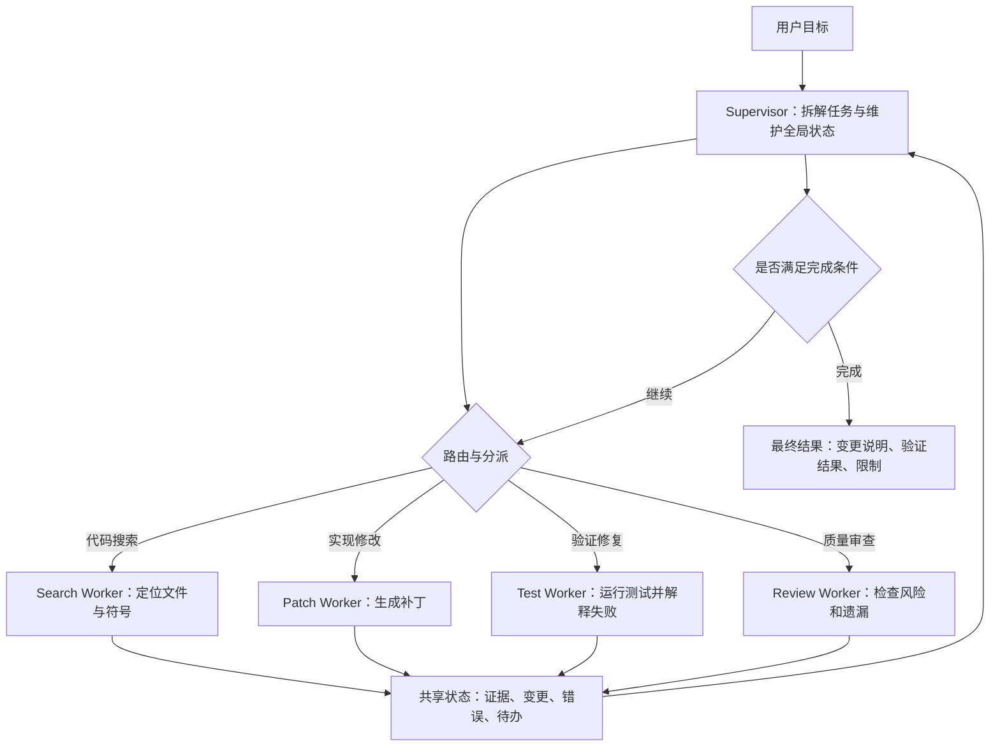

# Agent设计模式

## 1. 先确定任务形态

### 1.1 设计模式解决的问题

Agent 设计模式解决的是架构选型问题。同样是让模型调用工具，系统可以做成固定工作流、单 Agent 循环、入口路由、Supervisor-Worker、多 Agent 交接，也可以加入评估器不断优化结果。模式选择会影响工具权限、上下文组织、失败恢复、成本和可观测性。

设计前先判断任务形态。路径稳定、输入输出明确的任务，优先使用工作流。下一步高度依赖工具观察的任务，适合引入 Agent 循环。任务入口类型很多时，需要路由。任务可以拆给多个专业能力时，可以使用 Supervisor-Worker 或 Handoff。输出可以被测试、规则或审查标准验证时，可以加入 Evaluator-Optimizer。

本文用两个场景贯穿说明。场景一是代码迁移：需要搜索仓库、修改文件、运行测试、修复失败。场景二是企业助手：需要识别用户意图、查询知识库、调用业务系统、必要时移交人工或专业 Agent。这两个场景能覆盖主要模式的取舍。

### 1.2 模式选择矩阵

| 模式 | 适用任务 | 控制权 | 优点 | 主要风险 |
| --- | --- | --- | --- | --- |
| 固定工作流 | 步骤稳定、输入输出明确 | 代码 | 可预测、易测试 | 面对开放任务时分支膨胀 |
| 单 Agent | 路径动态、工具数量少 | 模型和 Runtime | 实现简单、上下文集中 | 工具过多后选择混乱 |
| Routing | 多类任务入口 | 路由器 | 降低单 Agent 负担 | 类别定义不清导致误分 |
| Supervisor-Worker | 可拆分复杂任务 | Supervisor | 职责清晰、可并行 | 状态同步和聚合复杂 |
| Handoff | 多个专业 Agent 顺序接力 | 当前 Agent | 用户体验自然 | 交接摘要质量决定成败 |
| Evaluator-Optimizer | 输出可验证 | 评估器和生成器 | 能逐步提高质量 | 容易无效迭代 |

这个矩阵只提供选型起点。真实系统常把多种模式组合起来。例如代码迁移可以由固定工作流管理阶段：分析、修改、测试、总结；在分析和修复阶段使用单 Agent；在大型仓库中再引入 worker 分工处理前端、后端和配置。企业助手可以先用 routing 判断任务类型，再把复杂任务 handoff 给专业 Agent。

### 1.3 从简单结构开始

Agent 架构最常见的问题是过早复杂化。一个任务若能用稳定工作流解决，直接上多 Agent 会增加状态同步、权限管理、上下文传递和调试成本。更稳妥的路径是先做可测试工作流，再在路径动态的节点引入单 Agent，最后根据职责和权限拆分多个 Agent。

这条路径也便于评估。每次引入新模式，都应比较任务成功率、平均工具调用次数、失败类型、人工接管率和成本。若复杂模式没有改善结果，就应回到更简单的结构。

## 2. 从工作流到单 Agent

### 2.1 固定工作流：可测试的基线

固定工作流把控制流写在代码里，模型只在局部节点执行任务。以企业助手的工单分类为例，流程可以固定为：清洗用户输入、分类、抽取字段、查询知识库、生成答复、规则校验、返回结果。每一步都有明确输入输出，失败时也容易定位。

工作流适合三类任务。第一类是业务规则明确的任务，例如表单抽取、合同条款检查、客服意图分类。第二类是有强格式要求的任务，例如生成 JSON、SQL、配置文件。第三类是需要可审计的流程，例如审批、发布、数据写入。代码控制路径能让团队明确知道每一步何时发生、失败如何处理、哪些节点需要人工确认。

代码迁移也可以先用工作流搭外层阶段：创建迁移计划、定位引用、生成补丁、运行测试、修复失败、输出总结。这个外层流程给任务提供边界，后续只在“定位引用”和“修复失败”这类动态节点引入 Agent。

### 2.2 单 Agent：小范围动态决策

单 Agent 模式由一个 Agent 维护统一状态和工具集合。代码迁移的初版可以这样设计：Agent 看到目标和仓库状态，拥有 `search_text`、`read_file`、`apply_patch`、`run_tests` 四类工具。它先搜索相关符号，读取文件，生成补丁，运行测试，根据错误继续修复，最后总结变更。

单 Agent 的关键是让模型在 Runtime 管控下做小范围动态决策。工具数量应控制在当前任务所需范围内。搜索阶段只给只读工具，编辑阶段再给写入工具，发布阶段才给部署工具。状态中要记录已读文件、已改文件、测试结果和失败原因。这样模型每轮能看到任务进度，也能避免重复读取同一材料。

单 Agent 的失败信号很明显。若提示词越来越长，工具列表越来越多，模型频繁选错工具，或同一上下文中要处理法律、代码、客服和数据分析，职责已经过于拥挤。此时应拆分工具集合、拆分任务阶段，或引入路由和多 Agent 协作。

### 2.3 代码迁移中的组合方式

假设目标是把项目中的旧请求库替换成新请求库。外层工作流可以固定阶段：创建迁移计划、定位引用、生成补丁、运行测试、修复失败、输出总结。定位引用和修复失败这两个阶段路径不稳定，适合交给单 Agent。

定位阶段只开放 `search_text`、`find_files` 和 `read_file`。Agent 先搜索旧 API 名称、配置项和测试引用，再把候选文件写入状态。修改阶段再开放 `apply_patch`。验证阶段开放 `run_tests`，并把失败测试名称、退出码和错误摘要回填给模型。

这个组合能避免一开始把全部权限交给模型。Runtime 按阶段暴露工具，模型按观察结果选择下一步。若仓库规模较小，单 Agent 足够；若模块很多、文件冲突频繁，再考虑 Supervisor-Worker。

## 3. 任务入口与多 Agent 协作

### 3.1 Routing：把入口任务分流

Routing 模式用于多类任务入口。企业助手经常同时面对“查知识库”“查订单”“修改资料”“报故障”“闲聊”几类请求。入口 Agent 或分类模型先判断任务类型，再把请求交给对应处理链。路由可以使用规则、轻量模型或大模型。稳定业务场景里，规则和模型混合更可靠：明确关键词和权限先走规则，模糊请求再交给模型判断。

路由设计的重点是类别要可执行。类别名称要对应后续能力，例如 `knowledge_qa`、`billing_query`、`ticket_create`、`human_escalation`。每个类别都要定义输入、工具、权限和失败兜底。低置信度路由可以请求澄清，或进入工具更少的通用处理链。

对代码助手来说，Routing 也有价值。用户请求可能是解释代码、修复 bug、添加功能、写测试、检查性能或整理文档。不同任务需要不同工具和上下文。解释代码通常只读，修复 bug 需要编辑和测试，性能分析可能需要运行基准。入口路由能减少模型看到的工具数量，也能降低误操作风险。

### 3.2 Supervisor-Worker：复杂任务拆分

当任务可以拆成多个相对独立的子任务时，可以使用 Supervisor-Worker。Supervisor 负责理解目标、拆分任务、分派 worker、收集产物、处理冲突和输出最终结果。Worker 只负责具体领域，例如资料检索、代码修改、测试修复、安全审查。

Supervisor-Worker 的收益来自职责和权限分离。Search Worker 只读仓库，Patch Worker 能写文件但不能部署，Test Worker 能运行受控测试，Review Worker 读取补丁和日志。权限分离能减少高风险工具暴露面。Worker 输出也要结构化，至少包含任务 id、输入摘要、执行步骤、证据、产物、失败和建议。

这个模式的主要成本是状态同步。多个 worker 可能读取同一文件、重复搜索、给出冲突建议，甚至同时修改相邻代码。共享状态必须记录文件锁、已完成任务、冲突点和产物位置。Supervisor 还要判断是否继续分派，避免多 Agent 系统在反复讨论中消耗预算。

### 3.3 Handoff：面向用户的专业接力

Handoff 表示当前 Agent 把控制权交给另一个 Agent。企业助手中常见：入口 Agent 判断用户在问账单问题，于是交给 Billing Agent；Billing Agent 发现需要技术排查，再交给 Support Agent；Support Agent 完成诊断后交回入口 Agent 生成用户可读答复。

Handoff 的关键产物是交接摘要。摘要要包含用户原始目标、身份和权限状态、已完成动作、关键证据、未解决问题、下一步建议。摘要过短会丢信息，过长会把无关历史带给下游 Agent。工程上可以把摘要分成固定字段，降低自由文本带来的遗漏。

Handoff 与 Supervisor-Worker 的差异在控制方式。Supervisor-Worker 中 supervisor 始终管理全局任务；handoff 中当前 Agent 会把后续对话交给另一个 Agent。面向用户的多专业助手适合 handoff，因为体验接近真实服务转接；后台复杂任务适合 Supervisor-Worker，因为集中控制更容易做审计和预算管理。

### 3.4 企业助手中的组合方式

企业助手的入口通常是 Routing。用户可能询问制度、查询订单、申请权限、反馈故障或要求生成报告。入口 Agent 先做意图识别和权限检查。知识类问题进入 RAG 工作流；订单类问题进入业务 API 工具链；故障类问题进入工单或技术支持 Agent；高风险操作进入人工确认。

如果用户的问题从一个领域转到另一个领域，可以使用 Handoff。例如用户先问“这笔费用扣款原因”，Billing Agent 查询账单后发现疑似系统故障，再移交 Support Agent。交接摘要必须包含账单号、已查询记录、异常现象、用户权限和待处理问题。Support Agent 不需要看到完整聊天历史，只需要完成排查所需信息。

## 4. 评估、迭代与框架落地

### 4.1 Evaluator-Optimizer：可验证输出的迭代

Evaluator-Optimizer 模式由生成器和评估器组成。生成器产出代码、报告、SQL 或配置，评估器使用测试、规则、静态分析或另一个模型给出反馈，生成器再修正。代码迁移天然适合这个模式：生成补丁后运行测试，失败输出作为反馈；测试通过后，再运行 lint 或 review 规则。

这个模式有效的前提是评价标准具体。好的标准包括“构建通过”“所有引用来自给定文件”“JSON schema 校验通过”“没有修改无关文件”。模糊标准会导致模型反复润色，却难以收敛。迭代次数必须有上限，连续多轮没有新增改进时应停止并说明限制。

评估器可以是模型，也可以是程序。能用程序验证的部分优先用程序，例如单元测试、类型检查、JSON schema、链接检查。模型评估适合语义质量、遗漏风险和可读性审查。两者结合时，程序结果优先级更高。

### 4.2 模式组合的状态设计

多模式组合时，状态要分层。全局状态由工作流或 Supervisor 管理，记录用户目标、阶段、预算、权限和最终产物。局部 Agent 状态记录本阶段工具轨迹和中间证据。Worker 状态记录子任务输入、输出、失败和建议。评估器状态记录检查项、通过项和失败项。

分层状态能避免所有消息堆在一个上下文里。代码迁移中，全局状态只需要知道模块迁移进度和最终验证结果；Patch Worker 的局部状态可以包含具体文件 diff；Test Worker 的局部状态可以包含失败测试日志。Supervisor 汇总结构化结果，而无需读取每个 worker 的完整对话。

状态还要支持暂停和恢复。长任务可能持续数分钟甚至数小时，用户可能中途修改目标。Runtime 应保存阶段、工具结果、失败原因和已生成产物。恢复时，Agent 读取压缩后的状态，无需重放全部历史消息。

### 4.3 框架落地方式

框架选择应服务架构设计。OpenAI Agents SDK 适合需要工具、handoff、guardrail 和 tracing 的应用。LangGraph 适合需要图结构、持久状态、人机协作和复杂编排的系统。CrewAI 适合角色分工明确的内容生产、研究和运营任务。AutoGen AgentChat 适合对话式多 Agent 协作和研究原型。

选择框架前，应先画出自己的控制流：任务如何进入、工具在哪里调用、状态如何保存、失败如何恢复、哪些动作需要确认。工具 schema、状态模型和评估集最好保持框架无关，未来迁移时成本更低。框架可以加速开发，长期稳定性来自清晰边界和可验证指标。

### 4.4 实施顺序

实际项目可以按以下顺序推进。第一阶段，用固定工作流和少量只读工具跑通最常见任务。第二阶段，在路径动态的节点引入单 Agent，并设置严格工具和预算。第三阶段，为任务建立 trace 和评估集。第四阶段，当单 Agent 指令拥挤或权限边界不清时，再拆分专业 Agent。第五阶段，引入多 Agent 后先关闭并行，让系统按顺序运行，确认状态和产物正确后再开启并行。

这个顺序看起来保守，但能减少调试成本。Agent 架构真正困难的地方在于让每个角色的输入、输出、权限和失败都可控。模式越复杂，越要用小步演进保持可理解性。

### 4.5 判断一个模式是否有效

模式选择最终要靠数据验证。单 Agent 引入后，应比较任务成功率、平均轮次、工具调用数和人工接管率。多 Agent 引入后，应额外比较重复工作、冲突次数、交接失败和总成本。Evaluator 引入后，应比较质量提升和迭代成本。

若一个模式让成本上升明显，成功率没有提升，就应回退到更简单结构。一个小而稳定的单 Agent，通常比缺少治理的多 Agent 系统更适合生产环境。复杂模式的价值来自明确分工和可验证收益，而非角色数量本身。

## 参考资料

- [Anthropic: Building effective agents](https://www.anthropic.com/engineering/building-effective-agents)
- [OpenAI: A practical guide to building agents](https://openai.com/business/guides-and-resources/a-practical-guide-to-building-ai-agents/)
- [OpenAI Agents SDK: Agents](https://openai.github.io/openai-agents-python/agents/)
- [OpenAI Agents SDK: Handoffs](https://openai.github.io/openai-agents-python/handoffs/)
- [LangChain Docs: Agents](https://docs.langchain.com/oss/python/langchain/agents)
- [LangGraph Documentation](https://langchain-ai.github.io/langgraph/)
- [CrewAI Documentation](https://docs.crewai.com/)
- [Microsoft AutoGen AgentChat User Guide](https://microsoft.github.io/autogen/stable/user-guide/agentchat-user-guide/index.html)
