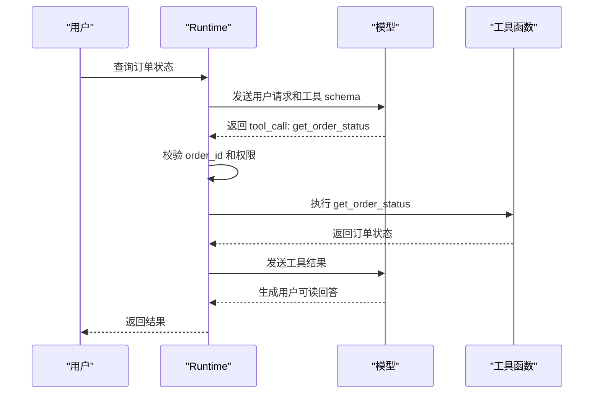

# Function Calling原理

## 1. 工具调用的基础接口

### 1.1 解决的问题

Function Calling 让模型以结构化方式表达“要调用哪个工具、传入哪些参数”。模型本身不执行代码，也不直接访问数据库。真正的执行发生在应用 Runtime 中。模型生成调用请求，Runtime 校验参数，调用本地函数或远程服务，再把结果作为工具消息交回模型。

这套机制把自然语言意图转换成程序可以处理的调用格式。它适合查询天气、检索订单、搜索文件、运行测试、生成 SQL 前的 schema 查询等场景。调用格式稳定后，Runtime 才能做权限、日志、重试和成本统计。

### 1.2 三个角色

| 角色 | 职责 |
| --- | --- |
| 模型 | 根据上下文和工具说明生成调用请求 |
| Runtime | 校验请求、执行函数、回填工具结果 |
| 工具函数 | 访问外部系统并返回结构化结果 |

如果把工具执行交给模型描述，系统很难验证结果。工程上必须让 Runtime 掌握真实执行权，并把执行记录写入 trace。

## 2. 调用流程

### 2.1 两轮对话



第一次模型调用产出工具请求，第二次模型调用基于工具结果生成回答。某些 API 支持并行工具调用，模型可以一次返回多个独立调用；Runtime 执行后再统一回填结果。

### 2.2 工具 schema

```json
{
  "name": "get_order_status",
  "description": "查询用户订单状态",
  "parameters": {
    "type": "object",
    "properties": {
      "order_id": {
        "type": "string",
        "description": "订单编号"
      }
    },
    "required": ["order_id"]
  }
}
```

schema 影响模型是否能正确生成参数，也影响 Runtime 校验。字段名要贴近业务，描述要说明数据来源、格式和限制。枚举、数字范围、数组长度等约束应写入 schema，不能只依赖提示词。

## 3. 并行和错误

### 3.1 并行调用

并行工具调用适合互不依赖的查询，例如同时查询订单、发票和物流。Runtime 应为每个调用分配 id，分别记录耗时、结果和错误。若其中一个调用失败，模型需要看到哪个 id 失败，以及失败是否可重试。

### 3.2 错误结构

工具失败不能只返回一段报错文本。建议返回：

```json
{
  "ok": false,
  "error_type": "permission_denied",
  "message": "当前用户无权查询该订单。",
  "retryable": false
}
```

这种结构能让模型区分“换参数重试”“请求用户补充信息”“停止并说明限制”。对有副作用的工具，Runtime 还要记录事务 id、幂等键和回滚信息。

## 参考资料

- [OpenAI Function Calling](https://platform.openai.com/docs/guides/function-calling)
- [OpenAI Tools Guide](https://platform.openai.com/docs/guides/tools)
- [JSON Schema](https://json-schema.org/)
