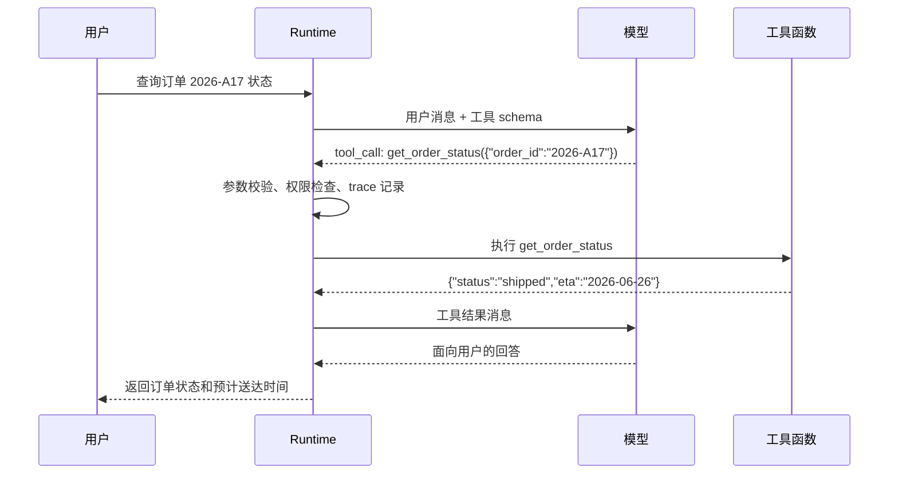

# Function Calling原理

## 1. 工具调用接口的来源

### 1.1 从文本生成到结构化调用

大模型最初面向的是文本补全和对话生成。应用想让模型查订单、搜文件或调用数据库时，只能让模型输出一段自然语言，再由程序从文本里解析“要调用哪个函数”。这种做法很脆弱：字段名可能变化，参数可能缺失，模型也可能把解释文字和调用请求混在一起。

Function Calling 的出现，把模型输出约束为结构化调用意图。模型根据用户输入、上下文和工具说明，生成工具名与参数；Runtime 负责校验参数、执行函数、记录 trace，并把工具结果回填给模型。模型本身不直接执行代码，也不直接访问数据库。

### 1.2 三个参与者

| 参与者 | 职责 | 工程关注点 |
| --- | --- | --- |
| 模型 | 选择工具并生成参数 | 工具描述、字段语义、上下文证据 |
| Runtime | 校验、执行、回填、审计 | 权限、超时、重试、幂等、错误结构 |
| 工具函数 | 连接外部系统并返回结果 | 输入边界、输出截断、副作用控制 |

这三个角色分开后，系统才能把自然语言意图转成可控执行。提示词可以让模型更愿意调用工具，真正的安全边界仍由 Runtime 和工具实现决定。

## 2. 调用流程与消息结构

### 2.1 两轮模型调用

典型流程包含两次模型调用。第一次让模型决定是否调用工具；Runtime 执行工具后，第二次让模型基于结果生成用户可读回答。



并行工具调用是在第一轮返回多个独立 tool call。Runtime 需要为每个调用分配 id，分别记录成功、失败、耗时和可重试信息，再把所有结果一起回填。

### 2.2 工具 schema

```json
{
  "name": "get_order_status",
  "description": "查询当前用户可访问订单的物流状态。",
  "parameters": {
    "type": "object",
    "properties": {
      "order_id": {
        "type": "string",
        "description": "订单编号，格式为年份加短横线加字母数字编号。"
      }
    },
    "required": ["order_id"],
    "additionalProperties": false
  }
}
```

schema 同时服务模型和 Runtime。对模型而言，字段名和描述影响参数生成；对 Runtime 而言，类型、必填项、枚举、长度、额外字段策略都是校验依据。schema 写得越模糊，模型越容易生成宽泛参数，Runtime 的拒绝率也会升高。

### 2.3 回填消息

工具结果不宜直接返回原始对象。它应包含可判定的状态、必要数据、错误类型和截断标记。

```json
{
  "tool_call_id": "call_01",
  "ok": false,
  "error_type": "permission_denied",
  "message": "当前用户无权查询该订单。",
  "retryable": false
}
```

模型看到 `retryable: false` 后，应停止换参数重试，转向解释权限限制或请求用户登录。错误结构决定模型后续策略，因此工具失败也要返回结构化结果。

## 3. Runtime 的执行细节

### 3.1 校验和执行

```python
def handle_tool_call(call, registry, user):
    tool = registry.get(call["name"])
    if tool is None:
        return {"ok": False, "error_type": "unknown_tool", "retryable": False}

    args = tool.schema.validate(call["args"])
    if not tool.policy.allowed(user=user, args=args):
        return {"ok": False, "error_type": "permission_denied", "retryable": False}

    try:
        result = tool.run(**args, timeout=tool.timeout_seconds)
        return {"ok": True, "data": tool.shape_output(result)}
    except TimeoutError:
        return {"ok": False, "error_type": "timeout", "retryable": True}
```

这段伪代码把模型输出当作候选请求处理。真正执行前必须经过工具注册表、schema 校验、权限策略和超时控制。对写入类工具，还要加入幂等键、确认步骤和回滚记录。

### 3.2 失败类型

| 错误类型 | 常见原因 | Runtime 返回策略 |
| --- | --- | --- |
| `validation_error` | 参数缺失、类型错误、枚举不匹配 | 给出字段级错误，可让模型修正 |
| `permission_denied` | 用户无权访问资源 | 停止重试，说明限制 |
| `not_found` | 资源不存在 | 可请求用户确认编号 |
| `timeout` | 工具响应过慢 | 标记可重试并限制次数 |
| `side_effect_blocked` | 写操作缺少确认 | 请求用户确认或人工接管 |

错误分类越稳定，模型越容易采取正确后续动作，评测也能按失败类型归因。

## 4. 与其他工具机制的关系

### 4.1 对比

| 机制 | 连接方式 | 适合场景 | 关注点 |
| --- | --- | --- | --- |
| Function Calling | 模型输出工具名和参数 | 应用内函数、API 调用 | schema、校验、回填 |
| MCP Tool | 通过协议发现和调用工具 | 跨应用、跨客户端复用 | 能力发现、传输、权限 |
| Skill | 封装说明、资源和执行步骤 | 复杂能力包、领域操作 | 触发条件、上下文加载 |
| Workflow Step | 代码固定调用 | 稳定业务流程 | 可测试性、确定性 |

Function Calling 是模型到 Runtime 的基础接口。MCP、Skill 和工作流可以建立在这个接口之上，也可以由 Runtime 映射成统一的工具注册表。

## 参考资料

- [OpenAI Function Calling](https://platform.openai.com/docs/guides/function-calling)
- [OpenAI Tools Guide](https://platform.openai.com/docs/guides/tools)
- [JSON Schema](https://json-schema.org/)
- [Anthropic Tool Use](https://docs.anthropic.com/en/docs/agents-and-tools/tool-use/overview)
