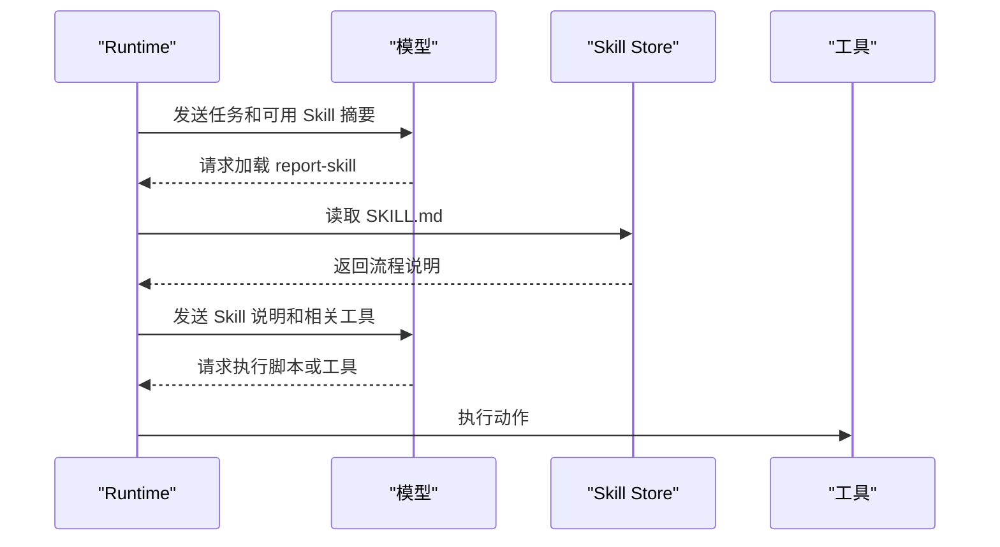

# Skill机制

## 1. Skill 的定位

### 1.1 从工具到能力包

工具提供可执行动作，例如搜索文件、调用 API、运行测试。Skill 更像一个可复用能力包，通常包含说明、脚本、模板、参考资料和使用流程。它解决的是“Agent 拿到工具后如何完成一类任务”的问题。

Anthropic 对 Skills 的介绍强调渐进式加载。Agent 先看到 Skill 的简短描述，判断需要时再读取详细说明或资源文件。这样既减少上下文占用，也能让团队把重复流程沉淀成稳定模块。

### 1.2 与工具和提示词的差异

| 概念 | 内容 | 典型用途 |
| --- | --- | --- |
| Prompt | 一段指令文本 | 调整当前对话行为 |
| Tool | 可执行接口 | 读取、搜索、写入、查询 |
| Skill | 指令、脚本、模板和资料的组合 | 复用一类任务流程 |

Skill 可以包含工具使用方法，但它本身通常不等同于工具。一个“生成财务报表”的 Skill 可以说明数据字段、图表模板、校验规则和导出流程，并调用查询数据库和生成文件的工具。

## 2. 文件结构与加载

### 2.1 常见结构

```text
report-skill/
  SKILL.md
  scripts/
    build_report.py
  templates/
    monthly_report.md
  references/
    metric_definitions.md
```

`SKILL.md` 负责说明触发场景、输入要求、步骤和输出格式。脚本和模板承载可复用实现。参考资料用于较长的领域知识，不必每次都进入上下文。

### 2.2 加载流程



加载应是按需的。若任务不需要某个 Skill，就不读取它的详细文档。这样能避免上下文被大量流程说明淹没。

## 3. 工程治理

### 3.1 适合沉淀为 Skill 的场景

| 场景 | 原因 |
| --- | --- |
| 重复出现的业务流程 | 可以统一步骤和格式 |
| 多工具组合任务 | 能记录工具调用顺序和注意事项 |
| 强模板输出 | 可以复用文件或报告模板 |
| 团队共享经验 | 减少每个 Agent 单独维护提示词 |

### 3.2 风险控制

Skill 可能包含脚本和外部资料，因此需要版本管理、权限审查和来源记录。Agent 加载 Skill 后，Runtime 仍然要校验工具调用和文件访问。Skill 的说明不能绕过工具权限，也不能自动获得高风险操作权限。

### 3.3 与 MCP 的配合

MCP 可以把外部能力标准化为工具、资源和提示。Skill 可以描述如何组合这些能力完成任务。实际系统中，MCP 负责能力接入，Skill 负责流程复用，两者可以同时存在。

## 参考资料

- [Anthropic: Agent Skills overview](https://docs.anthropic.com/en/docs/agents-and-tools/skills/overview)
- [Anthropic: Equipping agents for the real world with Agent Skills](https://www.anthropic.com/engineering/equipping-agents-for-the-real-world-with-agent-skills)
- [Model Context Protocol Documentation](https://modelcontextprotocol.io/docs/getting-started/intro)
