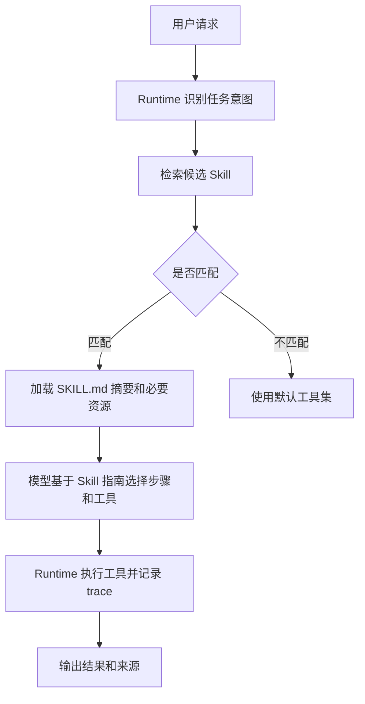

# Skill机制

## 1. Skill 要解决的工程问题

### 1.1 背景

工具函数通常很窄：搜索文件、读取资源、调用 API、运行测试。复杂任务还需要背景知识、操作步骤、注意事项、示例输入、领域资源和失败处理策略。把这些全部塞进系统提示词，会让上下文膨胀，也会让无关任务加载无关信息。

Skill 机制把某类能力封装成可按需加载的资源包。Anthropic 的 Agent Skills 把说明文件、脚本和资源组织在一起；很多企业内部 Agent 也会把“报表分析”“客服退款”“代码发布”做成可触发能力包。Skill 的核心是按任务需要加载合适能力，而非一开始把所有知识塞进模型上下文。

### 1.2 Skill 与 Tool 的差异

| 维度 | Tool | Skill |
| --- | --- | --- |
| 基本形态 | 可调用函数或外部接口 | 能力说明、资源、脚本和工具组合 |
| 触发方式 | 模型选择 tool call | Runtime 或模型根据任务匹配 |
| 上下文内容 | 名称、描述、schema | 操作步骤、示例、限制、相关文件 |
| 适合场景 | 单一动作 | 领域流程或复合能力 |

Tool 是执行接口，Skill 是能力包。一个 Skill 可以包含多个工具，也可以只提供操作方法和参考资源。

## 2. Skill 的组成

### 2.1 最小结构

```text
refund-skill/
  SKILL.md
  scripts/
    validate_refund.py
  references/
    refund-policy.md
```

`SKILL.md` 一般说明触发条件、可用工具、操作步骤、风险边界和输出格式。脚本目录放可复用的校验或转换逻辑，参考资料目录放领域政策或样例。Runtime 发现 Skill 后，只在相关任务中读取说明，避免污染无关上下文。

### 2.2 调用流程



Skill 的加载应有预算。说明太长时，先加载触发条件和关键步骤；只有任务进入某个阶段时，再读取具体参考资料或脚本说明。

## 3. 实现一个最小 Skill Runtime

### 3.1 Skill 元数据

```json
{
  "name": "code-migration",
  "description": "处理 TypeScript 项目的 API 迁移任务。",
  "triggers": ["迁移", "升级 API", "替换旧接口"],
  "allowed_tools": ["search_text", "read_file", "apply_patch", "run_tests"],
  "entry": "SKILL.md"
}
```

触发词只是起点。更稳的实现会结合用户目标、当前目录、文件类型、历史任务和模型分类结果。Runtime 可以先召回多个 Skill，再让模型选择最相关的一个或几个。

### 3.2 伪代码

```python
def select_skills(goal, skills, limit=2):
    matched = []
    for skill in skills:
        score = sum(1 for t in skill["triggers"] if t in goal)
        if score > 0:
            matched.append((score, skill))
    return [s for _, s in sorted(matched, reverse=True)[:limit]]


def build_context(goal, selected_skills):
    context = {"goal": goal, "skills": []}
    for skill in selected_skills:
        # 只加载入口摘要，详细资料按阶段再读取。
        context["skills"].append({
            "name": skill["name"],
            "guide": read_summary(skill["entry"]),
            "allowed_tools": skill["allowed_tools"],
        })
    return context
```

这个最小实现体现两件事：Skill 选择要受限，加载内容要分层。否则 Skill 会退化成一个不断增长的系统提示词。

## 4. 治理与评估

### 4.1 常见风险

| 风险 | 表现 | 处理方式 |
| --- | --- | --- |
| 触发过宽 | 无关任务加载错误 Skill | 记录触发原因，做命中评测 |
| 内容过长 | 上下文被说明挤满 | 摘要加载、阶段加载、资源索引 |
| 能力重叠 | 多个 Skill 给出冲突步骤 | 维护优先级和适用边界 |
| 脚本失控 | Skill 内脚本执行外部副作用 | 沙箱、权限、命令白名单 |
| 版本漂移 | 说明与真实工具不一致 | Skill 版本与工具版本绑定 |

Skill 的质量要通过任务轨迹评估。只看“是否触发”不够，还要看触发后是否减少错误工具调用、是否提升任务成功率、是否增加成本。

## 参考资料

- [Anthropic Agent Skills](https://docs.anthropic.com/en/docs/agents-and-tools/agent-skills/overview)
- [Anthropic: Writing tools for agents](https://www.anthropic.com/engineering/writing-tools-for-agents)
- [OpenAI Tools Guide](https://platform.openai.com/docs/guides/tools)
- [Model Context Protocol](https://modelcontextprotocol.io/docs/getting-started/intro)
