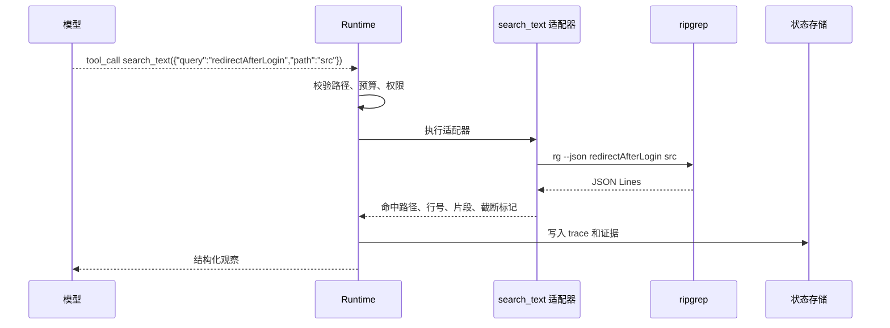
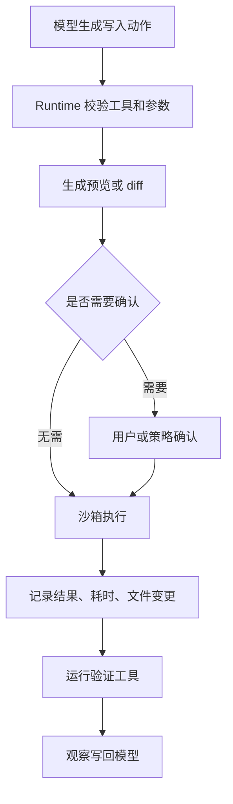

# 工具封装与Runtime执行

## 1. Runtime 的工具封装边界

### 1.1 背景

模型生成的工具调用只是候选动作。真正执行文件搜索、读取、写入、命令运行和网络请求时，必须经过 Runtime。Runtime 负责把模型的自然语言意图转成受控系统操作，同时记录每一次动作的输入、输出、耗时、错误和权限判断。

以 `rg` 搜索为例，ripgrep 本身负责递归遍历目录、遵守 ignore 规则、使用 Rust regex 引擎匹配文本、在适合场景下做字面量优化和并行目录遍历，还支持 `--json` 输出。Agent Runtime 要做的事情不同：限制搜索路径、设置超时、控制结果数量、解析 JSON 行、截断片段、把结果整理成模型可消费的观察。

### 1.2 工具封装边界

| 层次 | 职责 | 示例 |
| --- | --- | --- |
| 底层工具 | 执行具体能力 | `rg --json`、数据库查询、HTTP API |
| 工具适配器 | 参数校验、命令构造、输出解析 | `search_text(query, path)` |
| Runtime | 权限、预算、trace、错误回填 | 最大轮次、沙箱、审计 |
| 模型 | 选择工具和参数 | 生成 `search_text` 调用 |

这层封装让底层工具的复杂能力变成稳定接口。模型无需知道 `rg` 的所有参数，只需要选择受控的 `search_text` 工具。

## 2. 只读工具的实现

### 2.1 `rg` 到 `search_text`



`rg` 的速度来自多方面：默认递归搜索、自动读取 `.gitignore` 等忽略文件、使用 Rust regex 库、对简单查询做字面量加速、并行遍历目录、在部分场景使用内存映射或缓冲读取。Runtime 不应把这些细节直接暴露给模型，而应把它封装成窄接口。

### 2.2 Python 示例

```python
import json
import subprocess
from pathlib import Path


ROOT = Path("/workspace/project").resolve()


def search_text(query, path=".", limit=20):
    # 路径校验：模型给出的 path 只能落在工作区内。
    target = (ROOT / path).resolve()
    if ROOT not in target.parents and target != ROOT:
        return {"ok": False, "error_type": "path_denied", "retryable": False}

    cmd = ["rg", "--json", "--max-count", "20", query, str(target)]

    try:
        # 命令执行：设置超时，避免搜索拖住 Agent 循环。
        proc = subprocess.run(cmd, capture_output=True, text=True, timeout=3)
    except subprocess.TimeoutExpired:
        return {"ok": False, "error_type": "timeout", "retryable": True}

    items = []
    for line in proc.stdout.splitlines():
        event = json.loads(line)
        if event.get("type") != "match":
            continue
        data = event["data"]
        items.append({
            "path": data["path"]["text"],
            "line": data["line_number"],
            "text": data["lines"]["text"].strip()[:240],
        })
        # 结果截断：只给模型足够判断下一步的信息。
        if len(items) >= limit:
            break

    return {
        "ok": proc.returncode in (0, 1),
        "items": items,
        "truncated": len(items) >= limit,
        "error_type": None if proc.returncode in (0, 1) else "rg_error",
    }
```

这个示例把 `rg` 包成了 Agent 工具：路径校验、超时、结果截断和错误返回都在适配器里完成。真实系统还要记录 trace id、命令版本、工作目录、调用耗时和用户权限。

## 3. 写入与执行类工具

### 3.1 风险分层

| 工具类型 | 示例 | 风险 | Runtime 控制 |
| --- | --- | --- | --- |
| 只读 | 搜索、读取文件 | 信息泄露 | 路径范围、脱敏、截断 |
| 可逆写入 | 应用 patch、写草稿 | 修改错误 | diff 展示、版本控制、回滚 |
| 命令执行 | 运行测试、构建 | 资源消耗、命令注入 | 命令白名单、沙箱、超时 |
| 外部副作用 | 发邮件、下单、改权限 | 业务事故 | 人工确认、幂等键、审计 |

写入类工具需要把“模型建议修改”和“系统执行修改”分开。`apply_patch` 这类工具适合接收 diff，因为 diff 可审查、可回滚，也容易在 trace 中记录。

### 3.2 执行流程



测试工具也要受控。允许模型传任意 shell 命令风险很高，工程上通常提供 `run_tests(scope)`、`run_lint(scope)` 这类窄接口，由 Runtime 映射到固定命令。

## 4. 评估工具封装质量

### 4.1 指标

| 指标 | 含义 | 观测方式 |
| --- | --- | --- |
| 调用成功率 | 参数校验通过并正常返回的比例 | tool span |
| 误用率 | 选择了无关工具或越权参数 | trace 评分 |
| 结果有效率 | 工具结果推动了下一步 | 轨迹评估 |
| 截断损失 | 截断导致模型漏掉关键信息 | 失败回放 |
| 成本延迟 | 单次调用耗时和资源消耗 | metrics |

工具封装的好坏最终体现在轨迹上。一次工具调用返回了很多内容，但没有帮助模型前进，对 Agent 来说仍然是低质量工具。

## 参考资料

- [ripgrep README](https://github.com/BurntSushi/ripgrep)
- [Rust regex crate](https://docs.rs/regex/latest/regex/)
- [OpenAI Tools Guide](https://platform.openai.com/docs/guides/tools)
- [Anthropic: Writing tools for agents](https://www.anthropic.com/engineering/writing-tools-for-agents)
