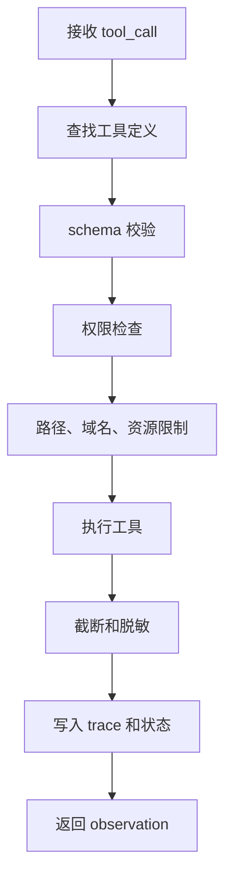

# 工具封装与Runtime执行

## 1. 工具封装的边界

### 1.1 避免开放命令字符串

Agent 工具应是受控接口，而非任意命令字符串。以搜索代码为例，模型不应直接拼接 shell 命令。Runtime 可以把 `rg` 封装成 `search_text`，只暴露 `query`、`path`、`max_results`、`fixed_strings` 等参数。

这样做能限制路径、超时、结果数量和输出格式。工具越接近业务语义，模型越容易选对动作，Runtime 越容易审计。

### 1.2 工具元数据

| 字段 | 作用 |
| --- | --- |
| name | 稳定工具名 |
| description | 使用条件和限制 |
| parameters | JSON schema |
| risk_level | 只读、低风险写入、高风险动作 |
| timeout | 最大执行时间 |
| output_policy | 截断、脱敏、摘要方式 |

工具描述要短而明确。描述过长会占用上下文，也可能让模型把说明文字当作任务内容。高风险工具应有额外确认流程。

## 2. Runtime 执行链路

### 2.1 执行步骤



Runtime 是工具调用的控制面。所有外部副作用都要经过它。即使模型输出看起来合理，也要执行同样校验。

### 2.2 `rg` 封装示例

```python
import json
import subprocess
from pathlib import Path


def search_text(root, query, rel_path=".", max_results=20):
    base = Path(root).resolve()
    target = (base / rel_path).resolve()

    # 路径校验：限制搜索范围在工作区内
    if base not in target.parents and target != base:
        return {"ok": False, "error_type": "path_denied", "retryable": False}

    cmd = [
        "rg",
        "--json",
        "--fixed-strings",
        query,
        str(target),
    ]

    try:
        # 命令执行：设置超时，避免长时间占用资源
        proc = subprocess.run(cmd, capture_output=True, text=True, timeout=5)
    except subprocess.TimeoutExpired:
        return {"ok": False, "error_type": "timeout", "retryable": True}

    matches = []
    for line in proc.stdout.splitlines():
        event = json.loads(line)
        if event.get("type") != "match":
            continue
        data = event["data"]
        matches.append({
            "path": data["path"]["text"],
            "line": data["line_number"],
            "text": data["lines"]["text"].strip(),
        })
        # 结果截断：控制上下文体积
        if len(matches) >= max_results:
            break

    return {
        "ok": proc.returncode in (0, 1),
        "matches": matches,
        "truncated": len(matches) >= max_results,
        "returncode": proc.returncode,
    }
```

这个示例只展示关键控制点。真实系统还要处理编码、忽略规则、上下文行、二进制文件、输出脱敏和日志关联。

## 3. 工具结果设计

### 3.1 观察结果

工具结果应面向模型决策，而非面向人类终端。成功结果要包含摘要、结构化数据、来源、截断状态和耗时。失败结果要包含错误类型、是否可重试和建议动作。

### 3.2 安全隔离

工具读取到的网页、文档、代码注释都属于外部内容。Runtime 回填时应标记来源，并避免把其中的文本提升为系统指令。写入类工具还要记录 diff、确认状态和回滚信息。

## 参考资料

- [ripgrep README](https://github.com/BurntSushi/ripgrep)
- [OpenAI Tools Guide](https://platform.openai.com/docs/guides/tools)
- [Microsoft: Updating the taxonomy of failure modes in agentic AI systems](https://www.microsoft.com/en-us/security/blog/2026/06/04/updating-taxonomy-failure-modes-agentic-ai-systems-year-red-teaming-taught-us/)
