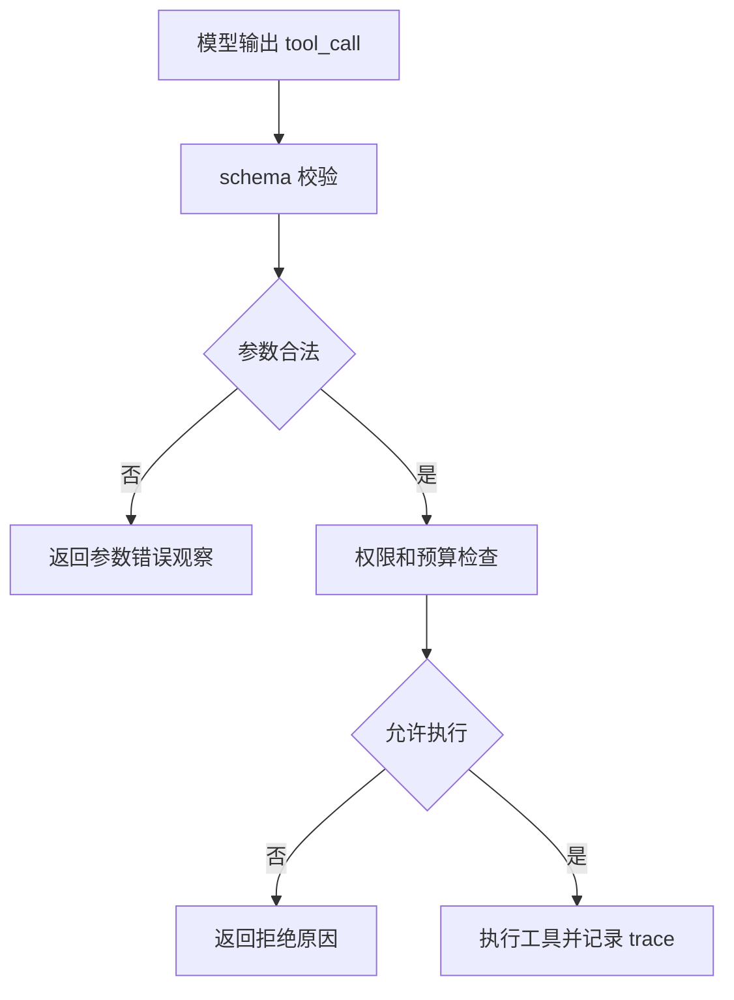

# 模型如何学会调用工具

## 1. 从文本生成到结构化调用

### 1.1 预训练的限制

预训练模型主要学习根据上下文预测下一个 token。它可能会描述“需要查询订单系统”，但未必会稳定输出 Runtime 可解析的工具调用 JSON。工具调用能力需要专项训练和运行时约束共同完成。

一个能调工具的模型至少要学会三件事：识别何时需要工具，选择合适工具，生成合法参数。后两者依赖工具说明和 schema，第一件事依赖任务理解和偏好对齐。

### 1.2 训练信号

| 阶段 | 学到的能力 | 数据样式 |
| --- | --- | --- |
| SFT | 按 schema 输出工具调用 | 用户请求、工具定义、正确调用、工具结果、最终回答 |
| 偏好对齐 | 判断是否应该调用工具 | 调用与不调用的偏好比较、错误调用惩罚 |
| 运行时反馈 | 根据工具结果继续决策 | 失败、重试、澄清、多轮工具轨迹 |

训练数据应覆盖直接回答、单工具调用、多工具调用、工具失败、参数缺失、权限拒绝和多轮追问。只训练成功样本会让模型在异常场景中表现脆弱。

## 2. 运行时仍然关键

### 2.1 模型负责候选动作

模型学会调用格式后，仍然可能选错工具、传错参数或在不需要工具时调用工具。Runtime 不能把模型输出视为可信执行指令。它要做 schema 校验、权限检查、预算控制和日志记录。

工具调用能力是模型和 Runtime 的协作结果。模型产出候选动作，Runtime 决定能否执行，并把结果转成下一轮可用观察。

### 2.2 该不该调用

判断是否调用工具比“会输出 JSON”更难。简单算术、常识改写、格式整理通常不需要工具；订单状态、实时库存、私有知识、文件内容需要工具。工具说明应明确使用条件，Runtime 也可以通过路由或阶段控制减少误用。

## 3. 评估方式

### 3.1 工具调用指标

| 指标 | 含义 |
| --- | --- |
| 工具选择准确率 | 需要工具时是否选中合适工具 |
| 参数有效率 | 参数是否通过 schema 和业务校验 |
| 无效调用率 | 不需要工具时是否滥用工具 |
| 失败恢复率 | 工具失败后是否能换策略 |
| 任务完成率 | 工具调用是否推动最终目标完成 |

评测要同时包含正样本和反样本。只测试“应该调用”的场景，会掩盖模型过度调用工具的问题。

### 3.2 数据集构造

工具调用数据集应记录用户目标、可用工具、期望调用、允许的替代方案、禁止动作和最终状态。对 Agent 任务，还要保存完整 trace，用于判断失败发生在工具选择、参数生成、工具返回还是最终表达。

## 参考资料

- [OpenAI Function Calling](https://platform.openai.com/docs/guides/function-calling)
- [OpenAI: Evaluating Large Language Models Trained on Code](https://arxiv.org/abs/2107.03374)
- [Anthropic: Demystifying evals for AI agents](https://www.anthropic.com/engineering/demystifying-evals-for-ai-agents)
