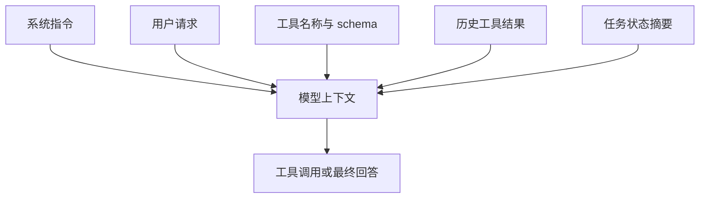

# 模型如何学会调用工具

## 1. 工具调用能力从哪里来

### 1.1 背景

模型会调用工具，并非因为它真的执行了函数。它学习到的是在给定上下文和工具说明时，生成符合格式的调用请求。这个能力通常来自预训练中的代码和 API 语料、指令微调中的工具调用样本、强化学习或偏好优化中的轨迹反馈，以及模型服务端对结构化输出的解码约束。

应用开发者能控制的部分主要是工具描述、schema、上下文状态、示例和 Runtime 反馈。模型底层训练不可见时，工程上只能通过这些输入信号影响工具选择质量。

### 1.2 学习信号

| 信号来源 | 影响 | 工程侧可控性 |
| --- | --- | --- |
| 代码/API 语料 | 理解函数名、参数和调用模式 | 不可控 |
| 指令微调样本 | 学会在用户意图下选择工具 | 间接可控，依赖模型供应商 |
| 轨迹反馈 | 学会哪些工具调用能完成任务 | 可通过评测和反馈优化 |
| schema 描述 | 影响参数生成和工具选择 | 高 |
| 工具结果 | 影响下一轮是否继续调用 | 高 |

所以工具调用质量并不只由模型决定。工具命名、描述、参数边界、错误结构和 trace 反馈都会影响最终表现。

## 2. 工具选择的上下文机制

### 2.1 模型看到的内容



模型并不知道工具真实实现。它只能根据工具名、描述、参数 schema 和上下文里的任务状态判断下一步。工具描述要避免营销式措辞，应说明工具能做什么、不能做什么、参数来自哪里、失败时如何表现。

### 2.2 描述质量示例

| 写法 | 问题 | 更稳的写法 |
| --- | --- | --- |
| `search`：搜索内容 | 范围不明 | `search_notes`：在授权笔记目录中按关键词搜索 Markdown 文件 |
| `run`：运行命令 | 权限过宽 | `run_tests`：只运行项目测试命令，返回退出码和日志摘要 |
| `write`：写文件 | 副作用不明 | `apply_patch`：对工作区文件应用 diff，返回改动摘要 |

命名要贴近动作和对象。`search_notes` 比 `query` 更容易让模型理解工具范围；`read_file` 比 `open` 更容易生成正确路径参数。

## 3. Runtime 如何辅助模型学习

### 3.1 结构化反馈

工具失败时，Runtime 不应只返回报错字符串。字段级反馈可以让模型在下一轮修正参数。

```json
{
  "ok": false,
  "error_type": "validation_error",
  "fields": {
    "path": "path must stay under docs/AI"
  },
  "retryable": true
}
```

模型看到 `path` 字段错误后，可以改用允许目录；如果只看到一段异常栈，它可能重复生成同样的路径。

### 3.2 评测驱动改进

```python
def grade_tool_call(expected, actual):
    return {
        "tool_match": expected["name"] == actual["name"],
        "required_args": all(k in actual["args"] for k in expected["required_args"]),
        "no_extra_risky_args": not any(k in actual["args"] for k in expected["forbidden_args"]),
    }
```

工具调用评测可以独立于最终答案。即使最终回答看起来正确，错误工具、越权参数、重复调用和无效重试都应单独记录。长期看，工具调用日志能反过来改进工具描述、schema 和 few-shot 示例。

## 4. 常见误区

### 4.1 工程修正方式

| 误区 | 表现 | 修正方式 |
| --- | --- | --- |
| 工具越多越好 | 模型在相似工具之间摇摆 | 合并重复工具，分阶段暴露 |
| 描述越长越好 | 上下文膨胀，重点被稀释 | 写清边界、参数和失败语义 |
| 靠提示词保证安全 | 模型仍可能生成越权参数 | Runtime 做强校验 |
| 只看最终答案 | 过程里可能有危险调用 | 评测工具选择、参数和副作用 |

工具调用能力是模型能力和工程约束共同形成的结果。把工具设计成稳定、窄边界、可观察的接口，比单纯增加提示词更可靠。

## 参考资料

- [OpenAI Function Calling](https://platform.openai.com/docs/guides/function-calling)
- [Anthropic Tool Use Overview](https://docs.anthropic.com/en/docs/agents-and-tools/tool-use/overview)
- [Anthropic: Writing tools for agents](https://www.anthropic.com/engineering/writing-tools-for-agents)
- [OpenAI Evals](https://github.com/openai/evals)
