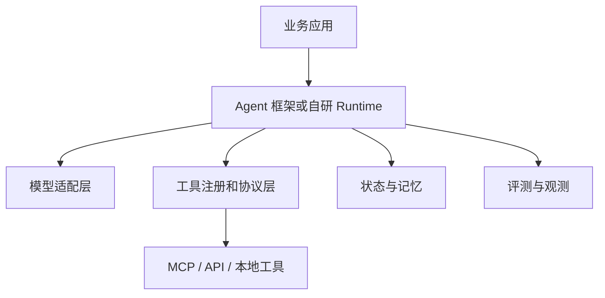

# Agent框架选型

## 1. 先看系统需求

### 1.1 背景

Agent 框架很多，名称也容易让人分心。实际选型应从系统需求出发：任务是固定流程还是动态决策，是否需要多 Agent，是否需要持久状态，是否要接入 MCP，是否要评测和可观测，是否能接受框架对运行时的约束。

框架的价值在于减少重复建设，但它也会带来抽象成本。原型阶段可以用轻量 Runtime；任务复杂后，再引入状态图、多 Agent、工具协议和评测平台。

### 1.2 选型维度

| 维度 | 需要回答的问题 |
| --- | --- |
| 状态 | 是否需要 checkpoint、恢复、长期任务 |
| 工具 | 是否要 Function Calling、MCP、自定义工具 |
| 流程 | 固定工作流、ReAct、计划、图结构哪种为主 |
| 协作 | 是否需要多 Agent 和 handoff |
| 观测 | 是否能记录 trace、span、成本和错误 |
| 评测 | 是否能接入自动化 eval 和 replay |
| 部署 | 是否支持现有语言、云环境和权限体系 |

如果这些问题没有答案，直接比较框架功能会导致选择偏差。

## 2. 常见框架对比

### 2.1 工程视角

| 框架/平台 | 侧重点 | 适合场景 | 注意点 |
| --- | --- | --- | --- |
| OpenAI Agents SDK | Agent、tool、handoff、guardrail、trace | 使用 OpenAI 生态快速搭建 Agent | 与 OpenAI 模型和 SDK 集成较深 |
| LangGraph | 状态图、checkpoint、可恢复执行 | 复杂流程、长期状态、多节点图 | 需要设计图和状态结构 |
| AutoGen | 多 Agent 对话和协作 | 研究原型、多角色协作 | 生产治理要额外补齐 |
| CrewAI | 角色和任务编排 | 团队式任务分派 | 适合角色抽象清晰的场景 |
| 自研 Runtime | 完全贴合业务 | 强权限、强审计、特殊工具 | 建设成本高 |

这张表只提供工程取舍。实际选型还要结合团队语言栈、模型供应商、部署环境、合规要求和现有观测系统。

### 2.2 架构位置



框架位于业务应用和底层模型、工具、状态之间。选型时要看它是否能接入你的工具系统和观测系统，而不只是看示例代码是否简洁。

## 3. 选型流程

### 3.1 分阶段路线

| 阶段 | 推荐方式 | 目标 |
| --- | --- | --- |
| 原型 | 手写 Runtime 或 SDK 示例 | 跑通目标、工具和状态 |
| 小规模试点 | 引入框架的状态和工具能力 | 形成可复现 trace |
| 生产灰度 | 接入权限、评测、观测和回放 | 控制风险 |
| 平台化 | 框架能力与内部网关、MCP、AgentOps 集成 | 多团队复用 |

不要在原型阶段一次性引入所有平台能力。先用最小 Runtime 验证任务价值，再围绕真实失败补框架能力。

### 3.2 评估脚本

```python
def score_framework(framework):
    weights = {
        "state": 0.2,
        "tooling": 0.2,
        "observability": 0.2,
        "eval": 0.15,
        "deployment": 0.15,
        "team_fit": 0.1,
    }
    return sum(framework[k] * w for k, w in weights.items())
```

这个评分只适合内部讨论。最终要用同一组真实任务跑 POC，比较成功率、成本、延迟、trace 完整度和开发复杂度。

## 4. 风险

### 4.1 常见问题

| 问题 | 表现 | 处理方式 |
| --- | --- | --- |
| 被示例误导 | demo 很快，生产缺权限和评测 | 用真实任务 POC |
| 过度抽象 | 简单流程被图结构复杂化 | 从最小链路开始 |
| 锁定供应商 | 模型和工具难切换 | 抽象模型适配层 |
| trace 缺失 | 失败无法复盘 | 选型时检查观测能力 |
| 状态不可恢复 | 长任务中断丢失上下文 | 要求 checkpoint |

框架选型会随着系统阶段调整。可以先把业务接口、工具 schema、状态模型和评测数据集设计好，再根据阶段选择框架或自研实现。

## 参考资料

- [OpenAI Agents SDK](https://openai.github.io/openai-agents-python/)
- [LangGraph Concepts](https://langchain-ai.github.io/langgraph/concepts/)
- [AutoGen](https://microsoft.github.io/autogen/)
- [CrewAI Documentation](https://docs.crewai.com/)
