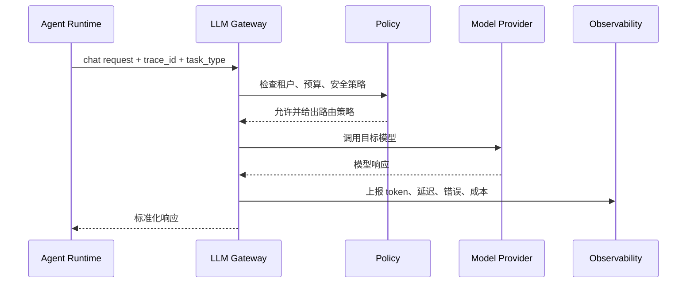

# LLM网关

## 1. Agent 的模型接入边界

### 1.1 背景

单个原型可以直接调用模型供应商 API。进入生产后，Agent 往往要接入多个模型、多个租户、不同预算、不同安全策略和统一观测。每个业务系统都直接调用模型，会导致密钥分散、成本不可控、日志格式不一致、模型切换困难。

LLM 网关位于 Agent Runtime 和模型供应商之间，负责统一鉴权、路由、限流、重试、缓存、成本统计、日志脱敏和策略控制。它不替代 Runtime 的工具执行，但会影响每一次模型调用的稳定性和可观测性。

### 1.2 网关职责

| 职责 | 说明 |
| --- | --- |
| 统一接入 | 屏蔽不同模型 API 差异 |
| 路由 | 按任务、成本、延迟、能力选择模型 |
| 限流 | 按用户、租户、应用控制请求量 |
| 重试 | 处理临时错误和供应商故障 |
| 安全 | 密钥管理、脱敏、策略拦截 |
| 观测 | 记录 token、延迟、错误、trace id |
| 成本 | 统计预算和单任务成本 |

Agent 场景里，一次用户任务可能包含多次模型调用。没有网关，成本和错误会分散在各个 Runtime 里，难以统一治理。

## 2. 请求链路

### 2.1 基本结构



网关返回给 Runtime 的响应应尽量稳定。即使底层供应商字段不同，Runtime 也应看到统一的 message、tool call、usage、finish reason 和错误结构。

### 2.2 标准化响应

```json
{
  "model": "gpt-4.1",
  "provider": "openai",
  "message": {
    "role": "assistant",
    "content": "..."
  },
  "tool_calls": [],
  "usage": {
    "input_tokens": 1200,
    "output_tokens": 320
  },
  "latency_ms": 840,
  "trace_id": "tr_001"
}
```

标准化响应是后续评测和观测的基础。否则不同模型的日志难以横向比较。

## 3. 路由与降级

### 3.1 路由策略

| 策略 | 适合场景 | 风险 |
| --- | --- | --- |
| 固定模型 | 核心生产链路 | 成本和容量弹性低 |
| 按任务路由 | 简单任务用小模型，复杂任务用强模型 | 任务分类错误 |
| 成本优先 | 大批量低风险任务 | 质量下降 |
| 延迟优先 | 实时交互 | 复杂任务可能失败 |
| 容灾降级 | 主模型故障切换备用 | 输出风格和能力变化 |

Agent Runtime 需要知道模型切换可能影响工具调用能力。某些模型对结构化输出或长上下文支持不同，网关降级时要把能力变化反馈给 Runtime。

### 3.2 降级伪代码

```python
def route_request(req, policy, providers):
    candidates = policy.models_for(req["task_type"])
    for model in candidates:
        if budget_exceeded(req["tenant"], model):
            continue
        try:
            return providers[model.provider].chat(model.name, req)
        except TemporaryProviderError:
            continue
    return {"ok": False, "error_type": "no_model_available", "retryable": True}
```

降级不能静默改变高风险任务的模型能力。对写入、财务、合规任务，降级前可以要求 Runtime 进入人工确认或只读模式。

## 4. 治理与观测

### 4.1 Agent 场景指标

| 指标 | 含义 |
| --- | --- |
| cost_per_task | 单个 Agent 任务总模型成本 |
| model_calls_per_task | 每个任务模型调用次数 |
| tool_call_success_after_model | 模型输出工具调用后的执行成功率 |
| fallback_rate | 网关降级比例 |
| policy_block_rate | 策略拦截比例 |
| p95_latency | 用户感知延迟和内部步骤延迟 |

网关指标要和 Agent trace 关联。只看模型调用成功率，无法判断一次 Agent 任务是否成功；只看 Agent 成功率，也无法定位是模型、工具还是网关导致失败。

### 4.2 常见风险

| 风险 | 表现 | 处理方式 |
| --- | --- | --- |
| 密钥分散 | 多服务直接持有供应商密钥 | 网关统一密钥管理 |
| 日志泄露 | prompt 和响应含敏感数据 | 脱敏、采样、访问控制 |
| 降级破坏工具调用 | 备用模型不支持同等 schema | 路由前检查能力 |
| 成本失控 | Agent 循环多次调用强模型 | 按任务预算限流 |
| 供应商锁定 | API 差异扩散到业务代码 | 网关统一适配 |

LLM 网关是 Agent 工程的基础设施。它和 Runtime 的边界要清楚：网关管模型调用，Runtime 管任务执行和工具调用。

## 参考资料

- [OpenAI API Documentation](https://platform.openai.com/docs)
- [LiteLLM](https://docs.litellm.ai/)
- [Kong AI Gateway](https://docs.konghq.com/gateway/latest/ai-gateway/)
- [Envoy AI Gateway](https://aigateway.envoyproxy.io/)
