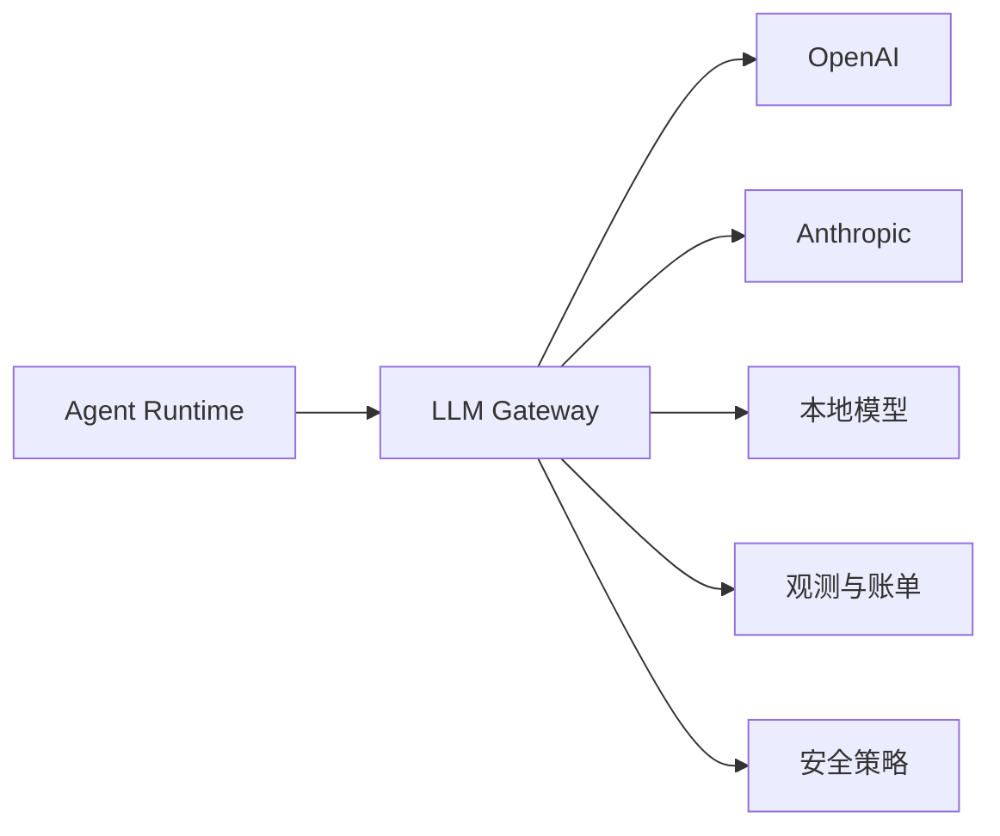

# LLM网关

## 1. 网关在 Agent 系统中的位置

### 1.1 解决的工程问题

LLM 网关位于业务应用和模型供应商之间。它统一模型接口、管理 API Key、做限流和配额、记录成本、支持故障转移、接入安全策略和缓存。Agent 系统调用模型频繁，且会触发工具、检索和多轮循环，网关能把模型调用治理集中起来。

普通 API 网关主要处理 HTTP 流量。LLM 网关还要理解模型、token、prompt、响应、流式输出、语义缓存和模型路由。对多团队共用模型额度的企业环境，网关可以显著降低接入和审计成本。

### 1.2 典型链路

Agent Runtime 不直接散落多个供应商 SDK。它调用统一网关，由网关决定路由、重试、限流和记录。

## 2. 核心能力

### 2.1 能力对比

| 能力 | 作用 |
| --- | --- |
| 统一接口 | 降低多模型切换成本 |
| Key 管理 | 防止密钥散落在业务服务 |
| 限流和配额 | 按团队、应用、模型控制用量 |
| 路由和故障转移 | 模型不可用时切换候选模型 |
| 成本追踪 | 统计 token、费用和任务成本 |
| 安全过滤 | 统一处理敏感内容和策略检查 |
| 语义缓存 | 对相似请求复用结果，降低延迟和成本 |
| 观测日志 | 记录模型、延迟、错误、trace id |

团队可以按阶段建设这些能力。原型阶段先做统一接口和日志；生产阶段再加入配额、故障转移、安全和缓存。

### 2.2 Agent 特有需求

Agent 调用模型往往是多轮的。网关需要能关联同一任务的多次模型调用，记录 trace id、step id、工具调用前后文和成本汇总。否则团队只能看到单次请求成本，无法知道一个任务整体花费。

## 3. 落地方式

### 3.1 自研与开源

LiteLLM、Kong AI Gateway、Envoy AI Gateway 等方案都覆盖了不同层面的模型网关能力。自研适合有强内部治理需求的团队，开源方案适合快速统一多模型调用。选型要看已有基础设施、合规要求和模型供应商数量。

### 3.2 与评估联动

网关日志应进入 Agent 评估和可观测体系。评测时记录模型版本、输入输出 token、缓存命中、路由路径和错误类型；上线后按任务成功率和成本/成功任务衡量版本收益。

## 参考资料

- [LiteLLM Documentation](https://docs.litellm.ai/)
- [Kong AI Gateway](https://developer.konghq.com/ai-gateway/)
- [Envoy AI Gateway](https://aigateway.envoyproxy.io/docs/)
