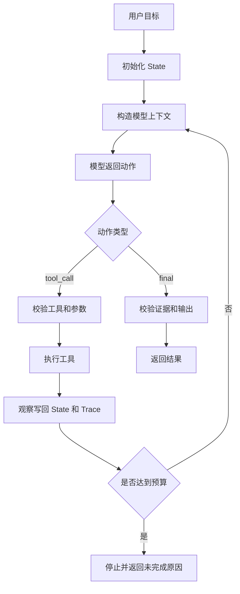

# 手写AgentRuntime

## 1. Runtime 的职责边界

### 1.1 背景

Agent 看起来像模型在自主行动，工程里真正驱动任务的是 Runtime。Runtime 接收用户目标，组织模型上下文，暴露工具，解析模型动作，执行工具，更新状态，判断终止，并记录可回放 trace。模型负责生成候选决策，Runtime 负责把候选决策变成受控执行。

手写 Runtime 的价值在于理解底层机制。即使后续使用 LangGraph、OpenAI Agents SDK、AutoGen 或自研框架，仍然绕不开状态、工具、循环、错误、预算和观测这些基础问题。

### 1.2 最小模块

| 模块 | 职责 | 最小实现 |
| --- | --- | --- |
| State | 保存目标、步骤、证据、错误、预算 | dict 或 dataclass |
| ModelAdapter | 调用模型并返回动作 | mock 或 SDK 封装 |
| ToolRegistry | 注册工具和 schema | name -> Tool |
| Executor | 校验并执行工具 | 参数校验、超时 |
| Stopper | 判断终止 | 最大轮次、final 动作 |
| Tracer | 记录轨迹 | JSONL 或内存列表 |

这些模块可以很小，但边界要清楚。否则后续加权限、评测和可观测性时会非常困难。

## 2. 最小 Runtime 循环

### 2.1 流程图



Runtime 的循环结构很简单，复杂性来自每个节点的边界处理。比如工具结果过长要截断，工具失败要分类，模型输出非法 JSON 要可恢复。

### 2.2 Python 示例

```python
from dataclasses import dataclass, field


@dataclass
class State:
    goal: str
    steps: list = field(default_factory=list)
    evidence: list = field(default_factory=list)
    errors: list = field(default_factory=list)
    turn: int = 0


class Tool:
    def __init__(self, name, schema, func):
        self.name = name
        self.schema = schema
        self.func = func

    def validate(self, args):
        # 示例只检查必填字段；生产系统应使用 JSON Schema。
        for key in self.schema.get("required", []):
            if key not in args:
                raise ValueError(f"missing arg: {key}")
        return args

    def run(self, args):
        return self.func(**args)


def run_agent(goal, model, tools, max_turns=6):
    state = State(goal=goal)

    while state.turn < max_turns:
        action = model.decide(state=state, tool_schemas=[t.schema for t in tools.values()])
        state.turn += 1

        if action["type"] == "final":
            return {"ok": True, "answer": action["answer"], "trace": state.steps}

        if action["type"] != "tool_call" or action["name"] not in tools:
            state.errors.append({"type": "invalid_action", "action": action})
            continue

        tool = tools[action["name"]]
        try:
            args = tool.validate(action["args"])
            observation = tool.run(args)
            state.steps.append({"action": action, "observation": observation})
        except Exception as exc:
            state.errors.append({"type": "tool_error", "message": str(exc), "action": action})

    return {"ok": False, "reason": "max_turns_reached", "trace": state.steps, "errors": state.errors}
```

这段代码保留 Runtime 的骨架：模型选择动作，Runtime 校验和执行，状态记录轨迹，最大轮次控制终止。生产系统会继续加入模型重试、工具超时、权限、沙箱、trace id、成本统计和人工确认。

## 3. 状态与错误处理

### 3.1 状态设计

| 字段 | 用途 |
| --- | --- |
| goal | 用户目标 |
| plan | 当前计划和步骤 |
| steps | 动作与观察轨迹 |
| evidence | 可引用证据 |
| errors | 工具错误、模型格式错误、权限拒绝 |
| budget | 轮次、token、工具调用和成本 |
| artifacts | 补丁、报告、文件等产物 |

状态应支持序列化。长任务中断后，可以从最近 checkpoint 恢复；评测时，也可以回放状态和工具结果。

### 3.2 错误分类

| 错误 | 处理方式 |
| --- | --- |
| 模型输出格式错误 | 返回格式错误观察，允许有限重试 |
| 工具参数错误 | 字段级错误回填 |
| 权限拒绝 | 停止该路径，必要时请求用户确认 |
| 工具超时 | 可重试但限制次数 |
| 证据不足 | 继续读取或返回限制说明 |
| 预算耗尽 | 停止并输出已完成部分 |

不要把所有异常都变成一段字符串。结构化错误能帮助模型选择下一步，也能帮助评测系统归因。

## 4. 走向生产

### 4.1 必补能力

| 能力 | 说明 |
| --- | --- |
| 权限 | 工具按用户、租户、任务阶段限制 |
| 沙箱 | 写入和命令执行在隔离环境中运行 |
| 可观测性 | 模型调用、工具调用、状态变化都有 trace |
| 评测 | 对 final outcome 和 tool trajectory 评分 |
| 人工接管 | 高风险动作和连续失败转人工 |
| 配置化 | 模型、工具、预算和策略可按环境调整 |

手写 Runtime 的最小版本适合理解机制和做原型。进入生产后，需要把这些控制能力系统化，否则 Agent 很快会在权限、调试和成本上失控。

## 参考资料

- [Anthropic: Building effective agents](https://www.anthropic.com/research/building-effective-agents)
- [OpenAI Agents SDK](https://openai.github.io/openai-agents-python/)
- [LangGraph Concepts](https://langchain-ai.github.io/langgraph/concepts/)
- [Model Context Protocol](https://modelcontextprotocol.io/docs/getting-started/intro)
