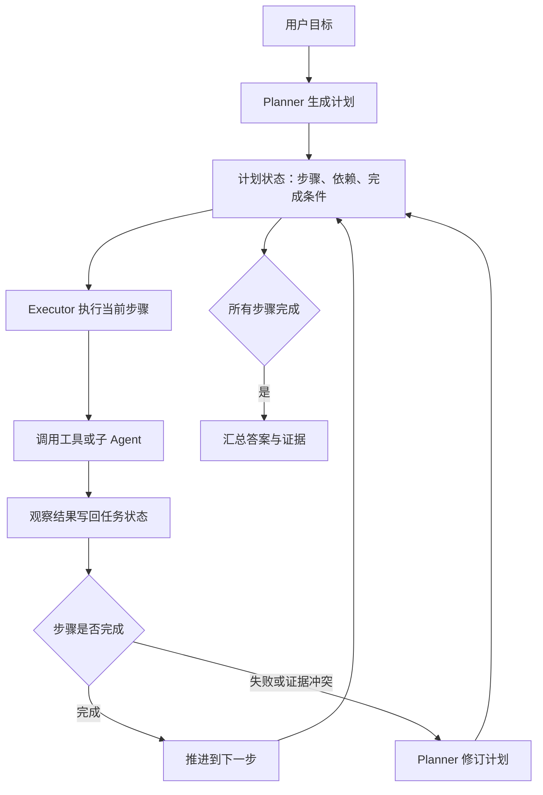
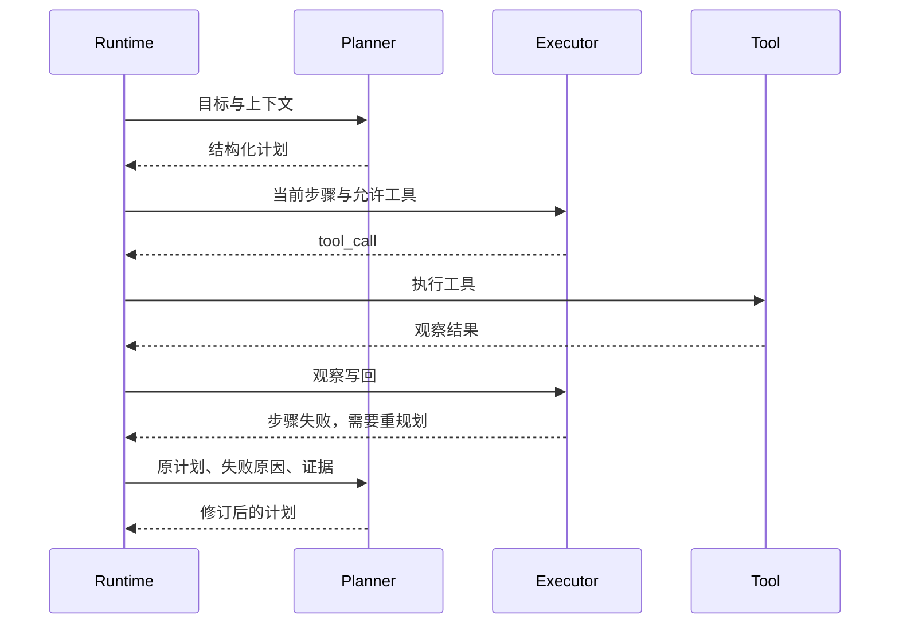

# Plan-and-Execute范式

## 1. 长任务中的计划问题

### 1.1 背景

ReAct 让模型根据每一轮观察选择下一步动作，但它在长任务里容易出现局部最优。代码迁移、专题调研、复杂数据分析这类任务往往跨越十几步甚至几十步。如果模型每轮只看下一步，可能反复搜索同类资料，遗漏阶段目标，也可能在没有完成前置准备时进入写作或修改阶段。

Plan-and-Execute 把任务拆成两个层次：Planner 先生成可执行计划，Executor 按步骤执行并把结果写回状态。计划可以被修订，但系统始终有一个全局路线。LangChain 早期的 Plan-and-Execute Agent、Anthropic 对 workflow 与 agent 的区分、以及许多代码 Agent 的任务列表机制，都体现了这种分层思想。

### 1.2 适用边界

| 任务特征 | 使用计划的收益 | 潜在代价 |
| --- | --- | --- |
| 多阶段依赖 | 明确先后顺序，降低遗漏 | 初始计划可能过粗 |
| 多文件修改 | 控制修改范围和验证顺序 | 计划维护需要额外状态 |
| 调研写作 | 先定主题结构，再收集证据 | 新证据可能推翻原结构 |
| 企业流程 | 便于审计每个阶段 | 动态异常需要重规划 |

计划适合处理“任务太长导致局部动作失焦”的问题。若任务只有两三步，直接 ReAct 循环更轻；若流程完全固定，普通工作流更稳定。

## 2. Planner 与 Executor 的运行机制

### 2.1 双层状态

Plan-and-Execute 的状态一般分为任务状态和计划状态。任务状态记录目标、上下文、工具结果、证据和错误；计划状态记录步骤、依赖、当前进度、完成条件和重规划原因。



Planner 不应输出空泛目标，例如“分析代码”“修复问题”。更好的计划要包含产出物和完成判断，例如“读取认证路由文件，确认跳转参数来源”“修改 redirectAfterLogin 的默认逻辑，并运行 auth 测试”。

### 2.2 计划结构

计划可以用 JSON 表示，便于 Runtime 跟踪和校验。

```json
{
  "goal": "修复登录后跳转错误",
  "steps": [
    {
      "id": "s1",
      "task": "定位登录跳转相关代码",
      "allowed_tools": ["search_text", "read_file"],
      "done_when": "找到负责 redirect 的函数和测试文件"
    },
    {
      "id": "s2",
      "task": "修改跳转逻辑并补充测试",
      "allowed_tools": ["read_file", "apply_patch"],
      "done_when": "代码改动只影响认证路由和对应测试"
    },
    {
      "id": "s3",
      "task": "运行认证测试并整理结果",
      "allowed_tools": ["run_tests"],
      "done_when": "测试通过或失败原因被定位"
    }
  ]
}
```

这里的 `allowed_tools` 可以降低工具误用概率。执行搜索阶段时，Runtime 不暴露写入工具；进入修改阶段后，才允许 `apply_patch`。计划既影响模型上下文，也影响工具权限。

### 2.3 执行循环伪代码

```python
def execute_plan(goal, planner, executor, tools, max_replans=2):
    state = {"goal": goal, "evidence": [], "errors": [], "step_results": {}}
    plan = planner.create(goal)
    replan_count = 0

    while not plan.done():
        step = plan.current_step()
        action = executor.decide(step=step, state=state, tools=step["allowed_tools"])

        # Runtime 只允许当前步骤声明过的工具。
        if action["tool"] not in step["allowed_tools"]:
            state["errors"].append({"type": "tool_not_allowed", "step": step["id"]})
            continue

        result = tools.run(action["tool"], action["args"])
        state["step_results"].setdefault(step["id"], []).append(result)

        if executor.step_done(step, state):
            plan.mark_done(step["id"])
        elif executor.need_replan(step, state) and replan_count < max_replans:
            plan = planner.revise(plan, state)
            replan_count += 1
        elif executor.need_replan(step, state):
            return {"ok": False, "reason": "replan budget exhausted", "state": state}

    return {"ok": True, "answer": executor.finalize(plan, state), "state": state}
```

这段伪代码的关键在于把计划做成 Runtime 可读取的执行结构。它决定当前步骤、可用工具、完成判断和重规划预算。

## 3. 重规划与验证

### 3.1 重规划触发

重规划不应频繁发生，否则系统会变成没有方向的循环。常见触发条件包括：核心文件不存在，测试结果与假设冲突，外部系统权限不足，用户补充了新约束，当前步骤连续失败。



重规划必须带上失败原因和证据。若只让模型“重新计划”，它可能重复原路径。Runtime 应记录计划版本，最终回答里保留关键计划变更，方便复盘。

### 3.2 与 ReAct 的取舍

| 维度 | ReAct | Plan-and-Execute |
| --- | --- | --- |
| 控制粒度 | 每轮一个动作 | 先阶段计划，再执行动作 |
| 上下文压力 | 长任务中轨迹增长快 | 计划摘要可压缩上下文 |
| 灵活性 | 每步都可根据观察调整 | 调整通过重规划发生 |
| 测试难度 | 重点测工具调用轨迹 | 还要测计划质量和步骤完成 |
| 适合任务 | 信息查找、调试、网页操作 | 迁移、调研、跨系统流程 |

实践中两者经常组合使用。Planner 负责全局阶段，Executor 在单个步骤内使用 ReAct。这样既保留全局结构，又能利用环境反馈。

## 4. 工程落地要点

### 4.1 计划质量控制

| 问题 | 表现 | 控制方式 |
| --- | --- | --- |
| 计划过粗 | 每步仍然像一个大任务 | 要求每步有产出物和完成条件 |
| 计划过细 | 调用成本和上下文膨胀 | 合并纯机械步骤，保留关键分支 |
| 步骤依赖不清 | 后续步骤使用不存在的结果 | 在计划结构里记录输入和依赖 |
| 重规划失控 | 每次失败都推翻全部计划 | 限制重规划次数和影响范围 |
| 验收模糊 | Executor 自称完成 | Runtime 结合工具结果校验 |

计划越长，越需要状态压缩。可以只把当前步骤、已完成摘要、关键证据和失败原因交给模型，完整 trace 留在外部存储。

## 参考资料

- [Anthropic: Building effective agents](https://www.anthropic.com/research/building-effective-agents)
- [LangChain: Plan-and-execute agents](https://blog.langchain.com/plan-and-execute-agents/)
- [ReAct: Synergizing Reasoning and Acting in Language Models](https://arxiv.org/abs/2210.03629)
- [Tree of Thoughts](https://arxiv.org/abs/2305.10601)
