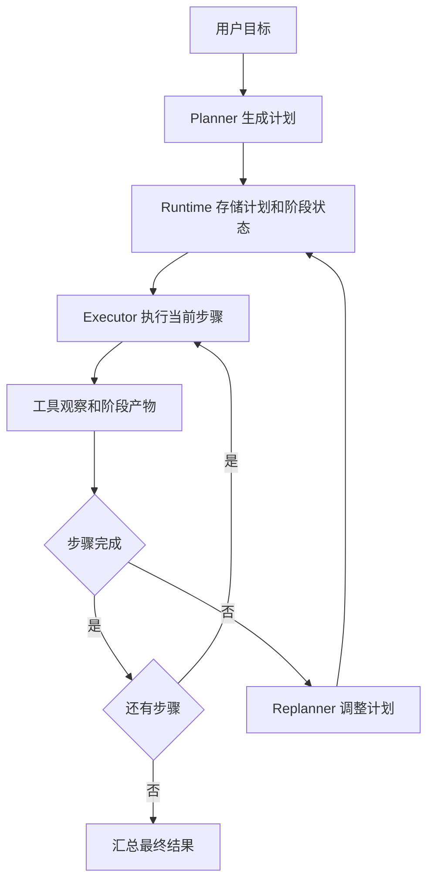

# Plan-and-Execute范式

## 1. 先规划再执行

### 1.1 背景

ReAct 每轮只看当前状态并决定下一步。面对长任务时，这种局部决策容易反复试探，甚至遗漏关键阶段。Plan-and-Execute 把任务分成两个角色：Planner 先给出可执行步骤，Executor 按步骤执行工具和模型调用，必要时由 Replanner 调整后续计划。

这个范式适合代码迁移、竞品调研、长文档整理、复杂客服流程等任务。它让 Agent 在开始行动前形成全局路线，Runtime 可以把计划转成状态机、任务图或工作流节点。

### 1.2 基本结构



计划应包含目标、步骤、依赖、完成条件和风险动作。Executor 不应自由改写全局目标，它只执行当前步骤，并把结果写回状态。Replanner 只在证据变化、工具失败、用户目标变化或步骤不可行时触发。

## 2. 工程实现

### 2.1 计划结构

一个计划可以用 JSON 保存，便于 Runtime 追踪进度。

```json
{
  "goal": "把旧请求库迁移到新请求库",
  "steps": [
    {"id": "s1", "task": "定位旧请求库引用", "status": "pending"},
    {"id": "s2", "task": "修改调用代码", "status": "pending", "depends_on": ["s1"]},
    {"id": "s3", "task": "运行测试并修复失败", "status": "pending", "depends_on": ["s2"]}
  ],
  "constraints": ["不修改无关模块", "测试失败时保留错误摘要"]
}
```

这个结构让 Runtime 可以做三件事：控制当前步骤可用工具，检查依赖是否完成，记录每一步产物。计划不需要一次完美，但要足够具体，能让执行阶段落地。

### 2.2 Python 伪代码

```python
def run_plan_execute(goal, planner, executor, replanner):
    plan = planner.create(goal)
    state = {"goal": goal, "plan": plan, "artifacts": []}

    while True:
        step = next_pending_step(state["plan"])
        if step is None:
            return summarize(state)

        # 执行器只处理当前步骤，降低上下文负担
        result = executor.run(step, state)
        state["artifacts"].append(result)

        if result["ok"]:
            step["status"] = "done"
            continue

        if result["retryable"]:
            state["plan"] = replanner.update(state["plan"], result)
            continue

        step["status"] = "failed"
        return summarize_failure(state, result)
```

这段代码展示了三个边界：Planner 产出计划，Executor 产出步骤结果，Replanner 修改尚未完成的计划。状态保存的是任务进展，而非完整聊天记录。

## 3. 任务图与 Replan

### 3.1 计划粒度

| 粒度 | 好处 | 风险 |
| --- | --- | --- |
| 粗粒度 | 上下文短，步骤少 | Executor 内部仍然混乱 |
| 细粒度 | 易验证，易并行 | 调度成本上升 |
| 动态粒度 | 可根据失败继续拆 | 需要 Replan 规则 |

合适粒度通常由完成条件决定。若一个步骤无法用工具结果或业务状态判断完成，它还需要继续拆分。

### 3.2 Replan 触发

Replan 不应每轮都发生。常见触发条件包括：工具返回不可用、发现计划依赖缺失、用户补充新约束、测试失败指向新模块、资料来源冲突。Runtime 需要限制 Replan 次数，并保存旧计划和修改原因，方便复盘。

### 3.3 选型取舍

Plan-and-Execute 相比 ReAct 更适合长任务，但它引入了计划维护成本。若任务只有两三步，普通 ReAct 更轻。若任务包含多个阶段、多个工具权限或多个产物，显式计划能提升可控性。

## 参考资料

- [LangChain Planning Agents](https://blog.langchain.com/planning-agents/)
- [OpenAI: A practical guide to building agents](https://openai.com/business/guides-and-resources/a-practical-guide-to-building-ai-agents/)
- [Anthropic: Building effective agents](https://www.anthropic.com/engineering/building-effective-agents)
