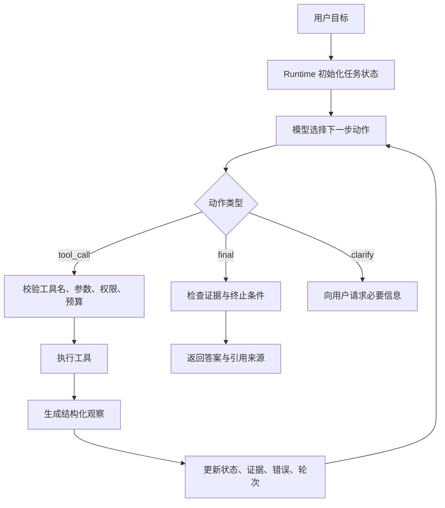

# ReAct范式

## 1. 从推理文本到环境交互

### 1.1 历史背景

ReAct 来自论文 *Synergizing Reasoning and Acting in Language Models*。论文把 reasoning 与 acting 放在同一条轨迹中：模型先根据目标和历史观察决定下一步行动，外部环境返回观察结果，模型再继续修正后续动作。早期 Chain-of-Thought 主要提升模型在文本空间里的分步推理能力，ReAct 进一步把外部搜索、知识库、API、网页环境和任务状态接入循环，使模型能够边查、边做、边修正。

这个思想适合解释很多 Agent 产品的基础形态。用户要求“修复项目里的登录错误”时，系统不能只生成一段建议；它要搜索报错、读取文件、定位调用链、修改代码、运行测试，再根据测试结果继续调整。ReAct 提供的核心价值在于把一次回答拆成多轮“动作与观察”，让模型的下一步建立在真实环境反馈上。

### 1.2 问题边界

ReAct 解决的是路径依赖中间结果的任务。若输入已经包含所有信息，普通问答足够；若步骤完全固定，工作流更容易测试；若每一步都要根据搜索结果、测试结果或外部 API 返回继续选择，ReAct 循环就有空间。

| 任务形态 | 典型行为 | ReAct 的收益 | 主要风险 |
| --- | --- | --- | --- |
| 文档调研 | 搜索、读取、归纳、补查 | 根据证据缺口调整查询 | 循环搜索、证据过长 |
| 代码修复 | 搜索报错、读文件、改代码、跑测试 | 用测试观察驱动下一步 | 工具误用、修改范围扩大 |
| 网页操作 | 观察页面、点击、填写、校验结果 | 页面状态可持续反馈 | 页面变化导致动作失效 |
| 数据分析 | 查询数据、运行代码、解释结果 | 中间计算影响后续分析 | 结果未校验就下结论 |

重点在于控制权分配。模型提出候选动作，Runtime 执行校验、调用工具、写入状态、判断终止。模型不能直接拥有系统权限，工具调用必须经过 Runtime。

## 2. ReAct 循环的底层结构

### 2.1 状态机视角

工程实现中，ReAct 更像一个受限状态机。每一轮只允许模型输出一种结构化动作：调用工具、请求澄清、给出最终答案或停止。Runtime 把动作解析为可执行请求，执行后把观察结果压缩回状态。



这里的状态至少包含目标、可用工具、已执行动作、观察结果、证据、错误、预算、终止条件。状态不能只保存聊天记录，因为聊天记录很难判断“是否读过这个文件”“这个搜索词是否已经失败”“证据是否足够覆盖结论”。

### 2.2 结构化动作

论文和很多教程会用 `Thought -> Action -> Observation` 展示轨迹。生产系统通常不把内部推理逐字暴露给用户，也不依赖自由文本解析动作。更稳妥的做法是让模型返回 JSON 或 Function Calling 结构。

```json
{
  "type": "tool_call",
  "name": "search_text",
  "args": {
    "query": "login redirect error",
    "path": "src"
  },
  "intent": "定位登录跳转错误的实现位置"
}
```

Runtime 对这个动作做四层处理：确认工具存在，按 schema 校验参数，检查路径与权限，记录这次调用的 trace id。工具返回后，Runtime 生成面向下一轮模型的观察，而非把原始输出全部塞回上下文。

```json
{
  "ok": true,
  "tool": "search_text",
  "items": [
    {"path": "src/auth/router.ts", "line": 42, "snippet": "redirectAfterLogin"}
  ],
  "truncated": false,
  "elapsed_ms": 31
}
```

### 2.3 最小代码示例

下面的 Python 示例用内存数据模拟代码修复 Agent。它省略真实模型 SDK，把重点放在循环、工具执行、状态更新和停止条件。

```python
files = {
    "src/auth/router.ts": "function redirectAfterLogin(next) { return next || '/home' }",
    "tests/auth.test.ts": "expect(redirectAfterLogin('/dashboard')).toBe('/dashboard')",
}


def search_text(query):
    # 工具：返回命中的文件和片段，避免把完整文件塞入上下文。
    return [
        {"path": path, "snippet": text}
        for path, text in files.items()
        if query in text
    ]


def read_file(path):
    # 工具：真实系统还要校验路径是否在工作区内。
    return files.get(path, "")


def fake_model(state):
    if not state["matches"]:
        return {"type": "tool_call", "name": "search_text", "args": {"query": "redirectAfterLogin"}}
    if not state["read"]:
        return {"type": "tool_call", "name": "read_file", "args": {"path": state["matches"][0]["path"]}}
    return {"type": "final", "answer": "登录跳转逻辑位于 src/auth/router.ts，需要结合测试继续确认。"}


def run_react(goal, max_steps=4):
    state = {"goal": goal, "matches": [], "read": {}, "steps": []}
    tools = {"search_text": search_text, "read_file": read_file}

    for _ in range(max_steps):
        action = fake_model(state)
        if action["type"] == "final":
            return {"answer": action["answer"], "trace": state["steps"]}

        tool = tools[action["name"]]
        observation = tool(**action["args"])
        state["steps"].append({"action": action, "observation": observation})

        if action["name"] == "search_text":
            state["matches"] = observation
        if action["name"] == "read_file":
            state["read"][action["args"]["path"]] = observation

    return {"answer": "达到最大轮次，任务停止。", "trace": state["steps"]}
```

这段代码刻意保留了三个关键点：动作由模型选择，执行由 Runtime 完成，终止由 Runtime 控制。真实系统会继续加入 schema 校验、沙箱、工具超时、错误分类、证据评分和人工确认。

## 3. 工程落地中的边界

### 3.1 失败模式

| 失败类型 | 表现 | 处理方式 |
| --- | --- | --- |
| 循环搜索 | 多轮更换关键词却没有新增证据 | 记录已搜索查询，连续无增量后停止 |
| 工具跳跃 | 还没有读文件就尝试修改 | 分阶段暴露工具，先读后写 |
| 观察污染 | 工具返回内容包含诱导模型越权的文本 | 把工具输出标记为不可信数据，只提取结构字段 |
| 证据不足 | 早早给出结论 | Runtime 检查引用来源和覆盖范围 |
| 成本失控 | 小任务调用过多模型和工具 | 设置轮次、token、工具调用预算 |

ReAct 的可控性来自状态和工具治理。提示词可以影响模型策略，但不能替代路径限制、权限校验、预算控制和 trace 审计。

### 3.2 与其他范式的关系

| 范式 | 核心结构 | 适用场景 | 与 ReAct 的关系 |
| --- | --- | --- | --- |
| Plan-and-Execute | 先生成计划，再逐步执行 | 长任务、步骤较多 | 可把每个执行步骤内部做成 ReAct |
| Reflection | 执行后评估与修正 | 输出质量要求高 | 可在 ReAct 结束或阶段结束后加入反思 |
| Supervisor-Worker | 上级分派、下级执行 | 多能力团队协作 | Worker 内部常使用 ReAct |
| Workflow | 固定路径执行 | 稳定业务流程 | 可把少量不确定节点交给 ReAct |

在工程选型里，ReAct 适合作为最小可运行 Agent 的第一种结构。任务跨度扩大后，再引入计划、反思、协作和评估机制。

## 参考资料

- [ReAct: Synergizing Reasoning and Acting in Language Models](https://arxiv.org/abs/2210.03629)
- [Google Research: ReAct](https://research.google/blog/react-synergizing-reasoning-and-acting-in-language-models/)
- [Anthropic: Building effective agents](https://www.anthropic.com/research/building-effective-agents)
- [OpenAI Function Calling](https://platform.openai.com/docs/guides/function-calling)
